# DSA Concepts, Pattern Finding & Brute → Optimal

A thinking guide for interviews (C3 AI and general).  
This file teaches **with words + diagrams** (diagrams illustrate; they do not replace the explanation).

1. Core DSA building blocks  
2. How to **recognize patterns** in a prompt  
3. Which algorithm/data structure to reach for  
4. How to **upgrade brute force → optimal** systematically  

Companion: `text.md` (worked problems), `system_design.md` (design).

> Diagrams use larger fonts via Mermaid `init`. If preview still looks small, zoom the editor or open GitHub preview.

---

## 0. The interview algorithm (meta-pattern)

Every coding round follows the same loop. Say it out loud every time:

1. Restate + constraints + 2 edge cases  
2. Brute force (correct, slow) + Big-O  
3. Name the bottleneck (“I recompute X” / “I scan Y twice”)  
4. Match a pattern (tables below)  
5. Apply that pattern’s standard upgrade  
6. Code optimal + dry-run + Big-O  

**Rule:** Never jump to “clever” code without saying what was wrong with brute force. Interviewers grade the *upgrade path*.

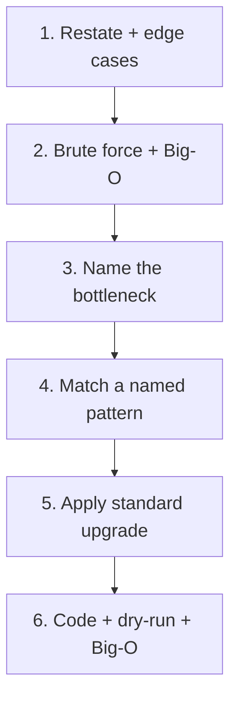

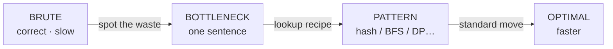

---

## 1. Core DSA concepts (what each tool is for)

### Big picture

Each tool below exists for a **job**. Pattern-finding = matching the job in the prompt to a tool.

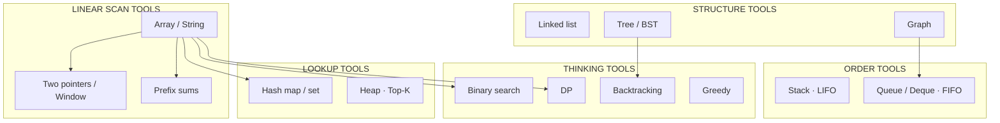

---

### 1.1 Arrays / Strings

- Contiguous memory; index access **O(1)**.
- Common jobs: scan, two pointers, sliding window, prefix sums.
- Think: “Can I avoid nested loops by remembering something as I scan?”

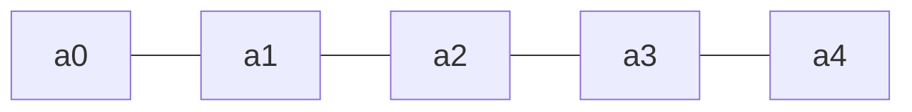

---

### 1.2 Hash map / Hash set (dict / set)

- Average **O(1)** lookup / insert / delete.
- Jobs: frequency count, “have I seen X?”, first index, grouping by key.
- Think: “Am I searching for a partner value / duplicate / remainder?”

**Brute waste it removes:** the inner loop that searches for a partner.

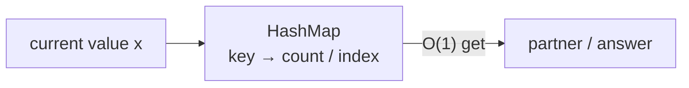

---

### 1.3 Stack (LIFO)

- Last in, first out.
- Jobs: matching nesting, previous smaller/greater, undo, path parsing (`..`).
- Think: “Does the next item resolve the *most recent unmatched* item?”

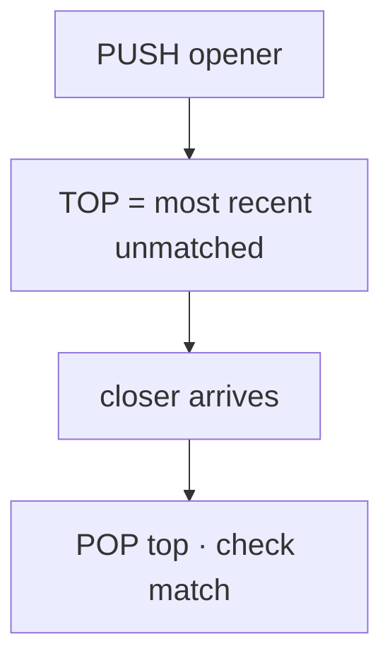

---

### 1.4 Queue / Deque (FIFO)

- First in, first out (deque also pops both ends).
- Jobs: BFS layers, sliding-window max, multi-source spread.
- Think: “Do I process things in waves / levels / time steps?”
- **Always** `collections.deque` — never `list.pop(0)` (that is O(N)).

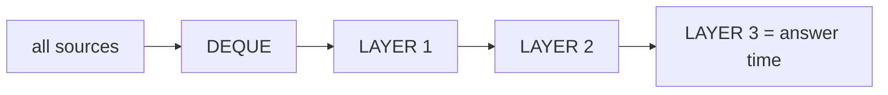

---

### 1.5 Heap (priority queue)

- Get current min or max in **O(log N)** repeatedly.
- Jobs: Top-K, merge K lists, “always process largest next.”
- Think: “Do I repeatedly need the extreme element?”

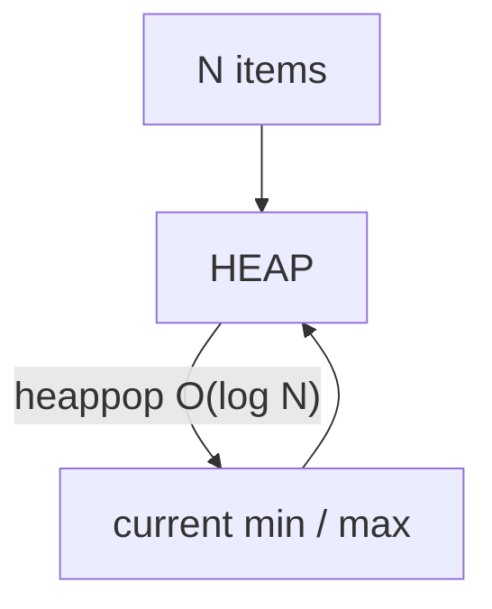

---

### 1.6 Linked list

- Node + `.next` (sometimes `.prev`).
- Jobs: reverse, cycle, merge, remove Nth — usually **2–3 pointers**.
- Think: “Can I rewire pointers in one pass without an extra array?”

### 1.7 Tree / BST

- Hierarchical; BST gives ordered search / prune.
- Jobs: DFS/BFS, LCA, range sum, BST iterator.
- Think: “Parent/child? Can BST order skip a whole subtree?”

### 1.8 Graph

- Nodes + edges (adjacency list).
- Jobs: connectivity, shortest path (unweighted → BFS), components, topo sort.
- Think: “Entities with relationships? Build graph, then traverse.”

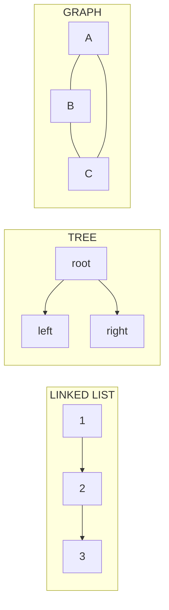

---

### 1.9 Sorting + custom comparator

- Puts structure into chaos so one pass works.
- Jobs: merge intervals, sweep line, order-by-rule then greedy.
- Think: “If I sort first, does the rest become linear?”

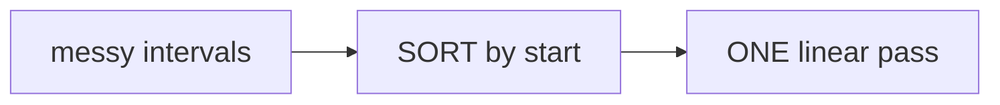

---

### 1.10 Binary search

Two different jobs — do not confuse them:

| Kind | What you search | Example |
|------|-----------------|---------|
| Classic | A **value** in a sorted array | Search Rotated / 2D Matrix |
| On answer | A **number X** where `check(X)` flips False→True | Koko speed, ship capacity |

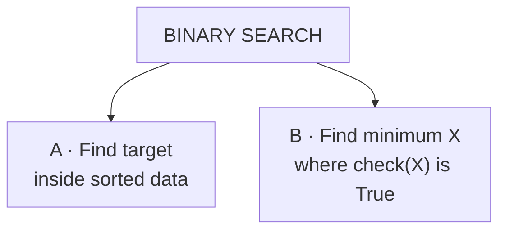

Think: “If mid works, do all larger (or all smaller) also work?”

---

### 1.11 Recursion / Backtracking

- Explore decisions; **undo** when returning.
- Jobs: permutations, combinations, parentheses, word search.
- Think: “Am I building candidates under constraints?”

### 1.12 Dynamic programming (DP)

- Overlapping subproblems + optimal substructure.
- Jobs: coin change, unique paths, LIS, knapsack-style.
- Think: “Have I solved this exact state before?”

### 1.13 Greedy

- Locally best choice that is globally safe (when you can justify it).
- Jobs: gas station, jump game, interval selection.
- Think: “Is there a choice I can commit to without reconsidering?”

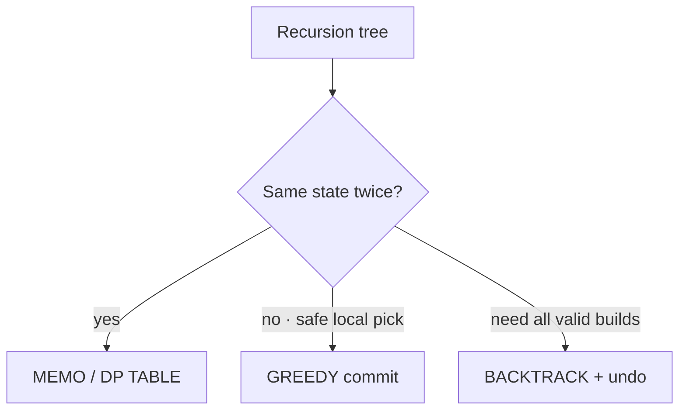

---

### 1.14 Two pointers / Sliding window

- Move indices inward **or** expand/shrink a window.
- Jobs: container water, trap rain, longest substring with constraint.
- Think: “Can left/right discard work that nested loops redo?”

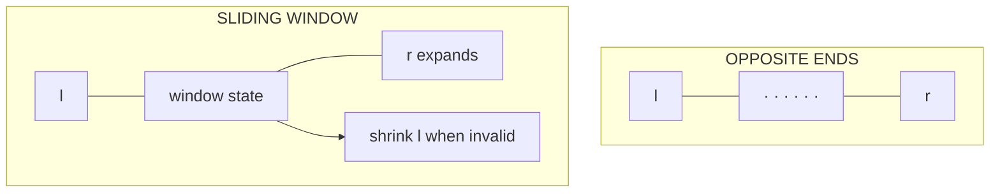

---

### 1.15 Prefix sums / Difference arrays

- Precompute running totals or range updates.
- Jobs: subarray sum = k, range add queries, coverage checks.
- Think: “Is the answer a contiguous segment sum / coverage count?”

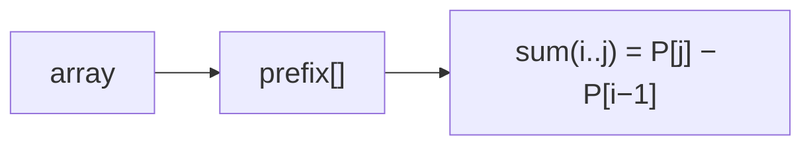

---

## 2. Pattern-finding: how to read a problem

Ask these in order. The **first yes** usually names the pattern.

| # | Question | If yes → pattern |
|---|----------|------------------|
| 1 | Contiguous subarray / substring with a sum or constraint? | Sliding window **or** prefix+hash |
| 2 | Array has **negatives** and you need subarray sum = k? | Prefix + hash (**not** window) |
| 3 | Find pair / complement / frequency / “seen before”? | Hash map |
| 4 | Nesting / matching / undo / path with `..`? | Stack |
| 5 | Next greater / warmer / previous smaller? | Monotonic stack |
| 6 | Shortest steps / spread by minute / levels? | BFS |
| 7 | All configurations under rules? | Backtracking |
| 8 | Min/max over overlapping subproblems? | DP |
| 9 | Min value of X such that condition holds, and condition is monotonic? | Binary search on answer |
| 10 | Intervals overlap / merge / meeting rooms? | Sort + sweep |
| 11 | Top K / always grab largest? | Heap |
| 12 | Tree/graph connectivity or path? | DFS/BFS / Union-Find |
| 13 | In-place linked list? | Fast/slow or reverse pointers |
| 14 | Design O(1) get + eviction order? | HashMap + DLL |

### Master chooser (big diagram)

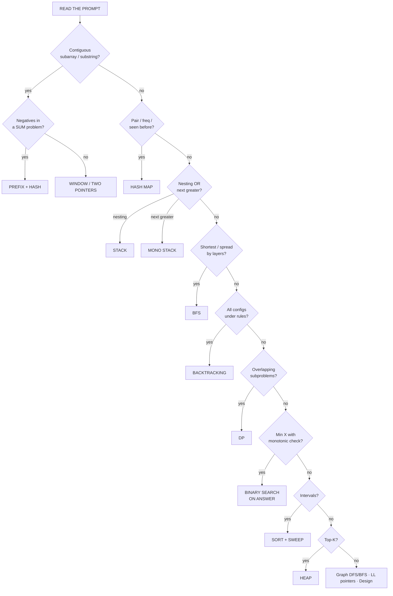

### Goal type

- **Count ways / configurations** → DP or backtracking  
- **Find any valid** → often greedy or BFS  
- **Minimize/maximize a number** with monotonic check → binary search on answer  

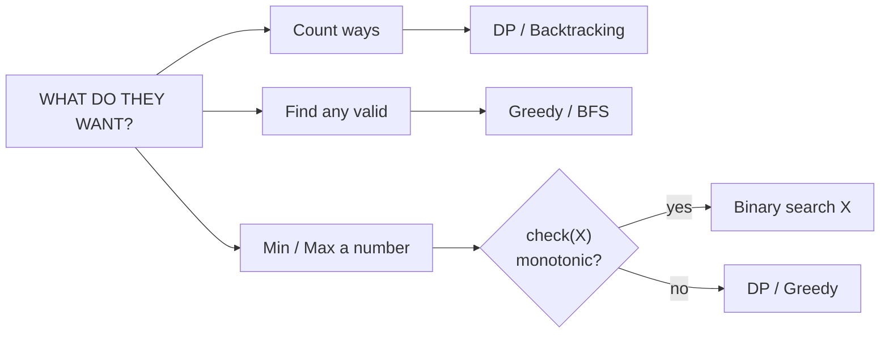

### Negatives vs window (critical)

- All **non-negative** + window constraint → sliding window often OK.  
- **Negatives allowed** + subarray sum = k → **prefix + hashmap only**.

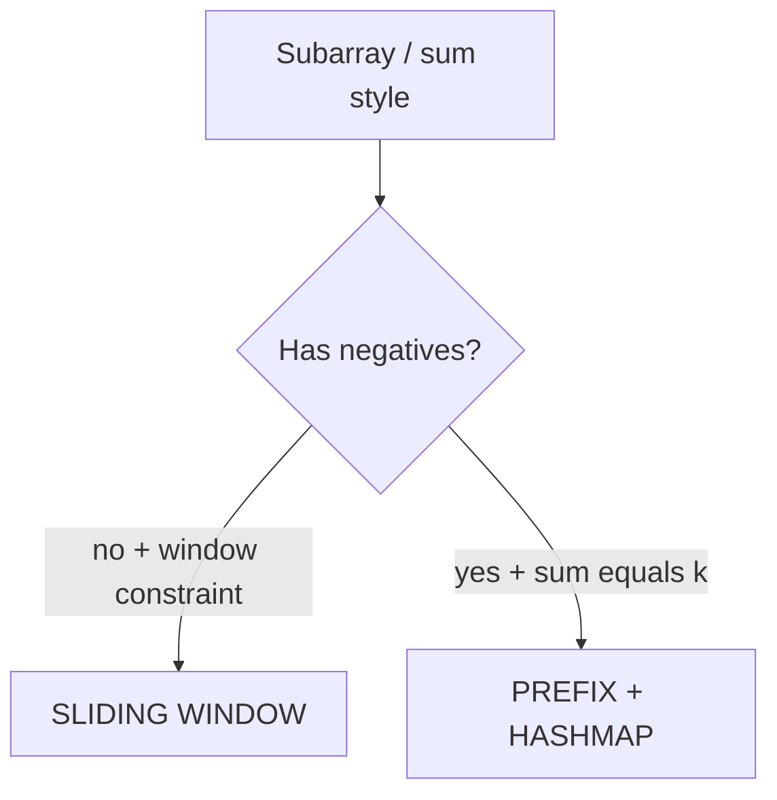

---

## 3. Pattern catalog: brute → optimal (text + diagrams)

For each pattern: what it looks like, brute, insight, optimal move, recipe, examples, diagram.

---

### Pattern A — Hash map / frequency

**Looks like:** pairs with difference/sum, anagrams, first unique, group by key, remainder cycles.

| Stage | Approach | Complexity |
|-------|----------|------------|
| Brute | Nested loops / scan for each query | O(N²) |
| Insight | Partner value can be looked up if stored | |
| Optimal | One pass build map / Counter; query in O(1) | O(N) |

**Upgrade recipe:**
1. Write nested loop that finds partners.  
2. Ask: “What am I searching for inside the inner loop?”  
3. Pre-store that in a dict → remove the inner loop.  

**Examples:** Two Sum, K-diff pairs, Group the People, Fraction→Decimal (remainder map), Subarray Sum Equals K.

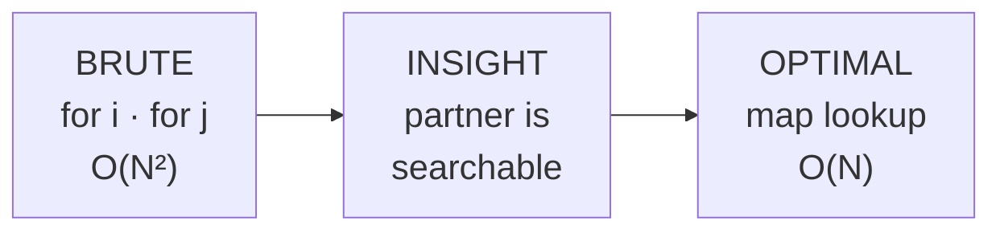

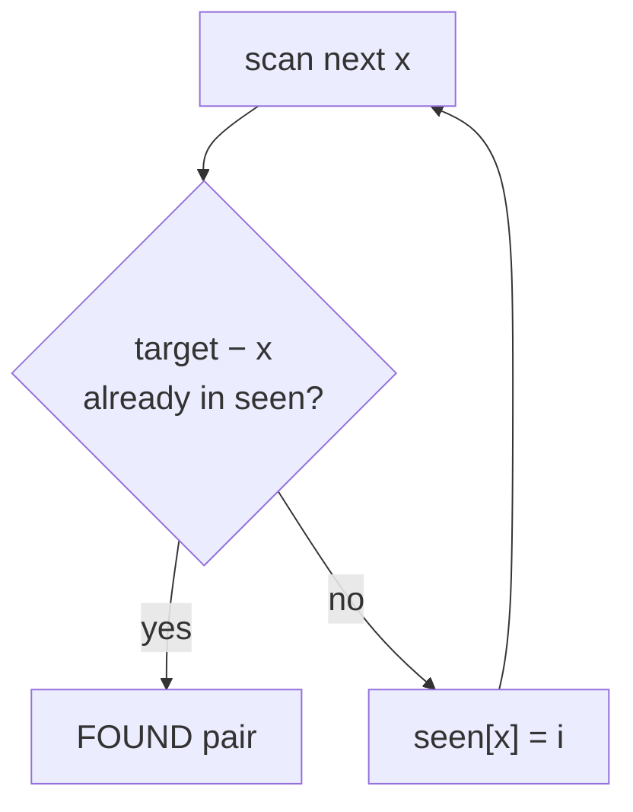

---

### Pattern B — Two pointers (opposite ends)

**Looks like:** sorted array pairs, container with most water, trap rain water, palindromes.

| Stage | Approach | Complexity |
|-------|----------|------------|
| Brute | Try all pairs (i,j) | O(N²) |
| Insight | Moving the worse end discards hopeless pairs | |
| Optimal | l=0, r=n−1; move by rule | O(N) |

**Upgrade recipe:**
1. Brute all pairs; note which side limits the answer.  
2. Start at ends (widest); move the pointer that can improve the limit.  

**Examples:** Container With Most Water, Trapping Rain Water, Two Sum II (sorted).

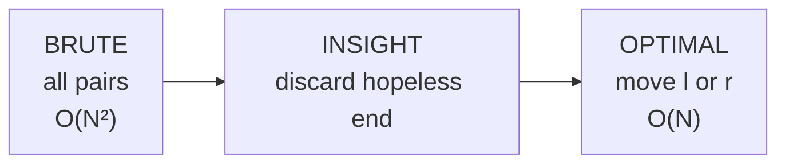

```mermaid
%%{init: {"themeVariables": {"fontSize": "22px"}, "flowchart": {"nodeSpacing": 45, "rankSpacing": 50}}}%%
flowchart TD
  LR["l at start · r at end"] --> CMP{"Which side<br/>limits the answer?"}
  CMP -->|left worse| ML["move l inward"]
  CMP -->|right worse| MR["move r inward"]
  ML --> UPD["update best"]
  MR --> UPD
  UPD --> LR
```

---

### Pattern C — Sliding window

**Looks like:** longest substring with ≤ K distinct, min window covering chars, max sum of fixed size K.

| Stage | Approach | Complexity |
|-------|----------|------------|
| Brute | For every L,R check subarray/substring | O(N²) or worse |
| Insight | Expand right; shrink left when invalid; update state in O(1) | |
| Optimal | Two pointers + counter/sum | O(N) |

**Upgrade recipe:**
1. Define window validity (sum, counts, set size).  
2. Expand `r`; while invalid, advance `l`.  
3. Track best length/sum while valid.  

**When it fails:** negatives in sum problems → switch to prefix+hash.

```mermaid
%%{init: {"themeVariables": {"fontSize": "22px"}, "flowchart": {"nodeSpacing": 50, "rankSpacing": 55}}}%%
flowchart LR
  B["BRUTE<br/>all L,R<br/>O(N²)"] --> I["INSIGHT<br/>reuse window state"]
  I --> O["OPTIMAL<br/>expand / shrink<br/>O(N)"]
```

```mermaid
%%{init: {"themeVariables": {"fontSize": "22px"}, "flowchart": {"nodeSpacing": 45, "rankSpacing": 50}}}%%
flowchart TD
  R["expand r · add into state"] --> V{"window valid?"}
  V -->|no| L["shrink l · remove from state"]
  L --> V
  V -->|yes| A["update answer"]
  A --> R
```

---

### Pattern D — Prefix sum + hash

**Looks like:** subarray sum = k, continuous subarray sum (multiple of k), count subarrays by sum property.

| Stage | Approach | Complexity |
|-------|----------|------------|
| Brute | All subarrays sum | O(N²) |
| Insight | `prefix[j] − prefix[i] = target` ⇒ look up `prefix[j] − target` | |
| Optimal | Running sum + map of prior prefixes | O(N) |

**Upgrade recipe:**
1. Write double loop summing i..j.  
2. Replace inner with: `ans += map[s − k]; map[s]++`.  
3. Init `map[0] = 1` for subarrays starting at index 0.  

**Examples:** Subarray Sum Equals K, Continuous Subarray Sum.

```mermaid
%%{init: {"themeVariables": {"fontSize": "22px"}, "flowchart": {"nodeSpacing": 50, "rankSpacing": 55}}}%%
flowchart LR
  B["BRUTE<br/>sum every i..j<br/>O(N²)"] --> I["INSIGHT<br/>P[j]−P[i]=k"]
  I --> O["OPTIMAL<br/>map prior prefixes<br/>O(N)"]
```

```mermaid
%%{init: {"themeVariables": {"fontSize": "22px"}, "flowchart": {"nodeSpacing": 45, "rankSpacing": 50}}}%%
flowchart TD
  X["read next x"] --> S["s += x"]
  S --> A["ans += map[s − k]"]
  A --> M["map[s] += 1"]
  M --> X
```

---

### Pattern E — Binary search on answer

**Looks like:** minimize speed / capacity / wall height subject to a **monotonic** check.

| Stage | Approach | Complexity |
|-------|----------|------------|
| Brute | Try answer = 1,2,3,… | O(MAX · cost(check)) |
| Insight | If mid works, all larger (or all smaller) work | |
| Optimal | Binary search mid; run `check(mid)` | O(log MAX · cost(check)) |

**Upgrade recipe:**
1. Write `check(x) -> bool`.  
2. Verify monotonicity on a tiny table (False…False True True…).  
3. Binary search the first True (or last False).  

**Examples:** Koko Eating Bananas, Ship Packages, wall height for volume V.

**Not the same as:** binary search for a value inside a sorted array.

```mermaid
%%{init: {"themeVariables": {"fontSize": "22px"}, "flowchart": {"nodeSpacing": 50, "rankSpacing": 55}}}%%
flowchart LR
  B["BRUTE<br/>try 1..MAX<br/>O(MAX·N)"] --> I["INSIGHT<br/>ok(x) stays True"]
  I --> O["OPTIMAL<br/>BS first True<br/>O(N log MAX)"]
```

```mermaid
%%{init: {"themeVariables": {"fontSize": "22px"}, "flowchart": {"nodeSpacing": 45, "rankSpacing": 50}}}%%
flowchart TD
  R["lo · hi on answer X"] --> M["mid = candidate"]
  M --> C{"check(mid) OK?"}
  C -->|yes| H["hi = mid<br/>try smaller X"]
  C -->|no| L["lo = mid+1<br/>need larger X"]
  H --> R
  L --> R
```

```mermaid
%%{init: {"themeVariables": {"fontSize": "20px"}}}%%
flowchart LR
  F1["False"] --> F2["False"] --> T1["True"] --> T2["True"] --> T3["True"]
  T1 -.->|"answer = first True"| ANS["min feasible X"]
```

---

### Pattern F — Sorting + one pass (greedy / sweep)

**Looks like:** merge intervals, meeting rooms, custom order, process-by-deadline.

| Stage | Approach | Complexity |
|-------|----------|------------|
| Brute | Compare all pairs / permutations | O(N²) or O(N!) |
| Insight | Right order makes local decisions safe | |
| Optimal | Sort by key; linear sweep | O(N log N) |

**Upgrade recipe:**
1. Brute without sorting; notice messy overlap checks.  
2. Sort by start (or differential, etc.).  
3. One pass keeping “last interval” / running state.  

**Examples:** Merge Intervals, Two City Scheduling, Largest Number.

```mermaid
%%{init: {"themeVariables": {"fontSize": "22px"}, "flowchart": {"nodeSpacing": 50, "rankSpacing": 55}}}%%
flowchart LR
  B["BRUTE<br/>all-pairs overlap<br/>O(N²)"] --> S["SORT by start"]
  S --> P["ONE PASS<br/>vs last interval"]
```

```mermaid
%%{init: {"themeVariables": {"fontSize": "22px"}, "flowchart": {"nodeSpacing": 45, "rankSpacing": 50}}}%%
flowchart TD
  I["next interval"] --> Q{"overlaps last<br/>in output?"}
  Q -->|yes| E["extend end"]
  Q -->|no| A["append as new"]
  E --> N["next"]
  A --> N
```

---

### Pattern G — Stack (matching / monotonic)

**G1 Matching stack**
- Looks like: parentheses, simplify path, remove adjacent duplicates.  
- Brute: repeated replace → O(N²).  
- Optimal: each char push/pop once → O(N).  

**G2 Monotonic stack**
- Looks like: next warmer day, next greater element.  
- Brute: for each i scan j>i → O(N²).  
- Optimal: stack of waiting indices → O(N).  

**Upgrade recipe:**
1. Brute “for each, look right.”  
2. Realize later elements resolve earlier waiting ones.  
3. Keep candidates in a stack until a resolver appears.  

```mermaid
%%{init: {"themeVariables": {"fontSize": "22px"}, "flowchart": {"nodeSpacing": 45, "rankSpacing": 50}}}%%
flowchart TD
  subgraph MATCH["MATCHING STACK"]
    C1["char"] --> O1{"opener?"}
    O1 -->|yes| P1["push"]
    O1 -->|no| M1{"top matches?"}
    M1 -->|yes| OK["continue"]
    M1 -->|no| BAD["invalid"]
  end
```

```mermaid
%%{init: {"themeVariables": {"fontSize": "22px"}, "flowchart": {"nodeSpacing": 45, "rankSpacing": 50}}}%%
flowchart TD
  subgraph MONO["MONOTONIC STACK"]
    I["i · value x"] --> W{"stack top<br/>colder / smaller?"}
    W -->|yes| RES["pop j · ans[j] = i−j"]
    RES --> W
    W -->|no| PUSH["push i"]
  end
```

---

### Pattern H — BFS vs DFS

| Need | Use |
|------|-----|
| Shortest path in unweighted graph/grid | **BFS** |
| Spread by time layers (rotting oranges) | **Multi-source BFS** |
| Explore all paths / components / flood fill | **DFS** |
| Connectivity merges | Union-Find |

**Upgrade recipe (oranges-style):**
1. Wrong: DFS depth from one source.  
2. Insight: events happen in parallel → levels.  
3. Queue **all** sources at t=0; each queue layer = 1 minute.  

```mermaid
%%{init: {"themeVariables": {"fontSize": "22px"}, "flowchart": {"nodeSpacing": 45, "rankSpacing": 50}}}%%
flowchart TD
  NEED["What do you need?"] --> SP{"Shortest /<br/>simultaneous layers?"}
  SP -->|yes| BFS["BFS + deque"]
  SP -->|no| ALL{"All paths /<br/>components?"}
  ALL -->|yes| DFS["DFS"]
  ALL -->|merge sets| UF["Union-Find"]
```

```mermaid
%%{init: {"themeVariables": {"fontSize": "22px"}, "flowchart": {"nodeSpacing": 45, "rankSpacing": 50}}}%%
flowchart TD
  S["Enqueue ALL rotten at t = 0"] --> L["Process one layer = 1 minute"]
  L --> N["Infect neighbors · enqueue"]
  N --> L
  L --> D{"fresh left?"}
  D -->|no| ANS["return minutes"]
  D -->|"yes + empty queue"| FAIL["return -1"]
```

```mermaid
%%{init: {"themeVariables": {"fontSize": "22px"}}}%%
flowchart LR
  WRONG["DFS from one orange"] --> BAD["WRONG times"]
  RIGHT["BFS all sources"] --> GOOD["parallel minutes"]
```

---

### Pattern I — Backtracking

**Looks like:** generate parentheses, combination sum, permutations, word search.

| Stage | Approach |
|-------|----------|
| Brute | Generate everything, filter valid |
| Insight | Prune illegal partial builds early |
| Optimal | Recurse with constraints; undo choice |

**Upgrade recipe:**
1. State the choice at each step.  
2. Only recurse into choices that keep the partial answer valid.  
3. After recurse, undo mutation (pop / unmark).  

```mermaid
%%{init: {"themeVariables": {"fontSize": "22px"}, "flowchart": {"nodeSpacing": 45, "rankSpacing": 50}}}%%
flowchart TD
  P["partial path"] --> C["legal choices only"]
  C --> A["apply choice"]
  A --> R["recurse"]
  R --> U["UNDO choice"]
  U --> C
  R --> D{"done?"}
  D -->|yes| REC["record answer"]
```

---

### Pattern J — Dynamic programming

**Looks like:** min coins, unique paths, LIS length, stock with K transactions.

| Stage | Approach |
|-------|----------|
| Brute | Recurse all decisions |
| Insight | Same state recomputed; define `dp[state]` |
| Optimal | Memo or bottom-up fill |

**Upgrade recipe:**
1. Write recursive function with clear parameters (the **state**).  
2. Add memo **or** make a table and fill smaller → larger.  
3. Write the transition in words: “dp[a] = min over coins of dp[a−c]+1”.  

**Say brute complexity correctly:** Unique Paths ≈ O(2^(m+n)), **not** O(2^(m×n)).

```mermaid
%%{init: {"themeVariables": {"fontSize": "22px"}, "flowchart": {"nodeSpacing": 50, "rankSpacing": 55}}}%%
flowchart TD
  BR["Recursive decisions"] --> OV{"Same state<br/>recomputed?"}
  OV -->|yes| ME["MEMO / TABLE"]
  ME --> FI["Fill smaller → larger"]
  FI --> AN["dp[final]"]
```

```mermaid
%%{init: {"themeVariables": {"fontSize": "22px"}}}%%
flowchart LR
  S["dp[smaller]"] --> T["transition"] --> I["dp[i]"]
```

---

### Pattern K — Greedy

**Looks like:** gas station, jump game, assign cookies, interval scheduling.

| Stage | Approach |
|-------|----------|
| Brute | Try all starts / all subsets |
| Insight | A local rule never needs reconsideration |
| Optimal | One pass committing to that rule |

**Upgrade recipe:**
1. Brute simulate all options.  
2. Find the rule (“start after worst deficit”, “jump farthest”).  
3. Briefly say why earlier options are dominated.  

```mermaid
%%{init: {"themeVariables": {"fontSize": "22px"}, "flowchart": {"nodeSpacing": 45, "rankSpacing": 50}}}%%
flowchart TD
  B["Try all options"] --> RULE["Find dominating local rule"]
  RULE --> ONE["One pass commit"]
  ONE --> PROOF["Why earlier options die"]
```

Gas station sketch:

```mermaid
%%{init: {"themeVariables": {"fontSize": "20px"}}}%%
flowchart LR
  T["tank < 0 at i"] --> R["start = i+1"]
  R --> C["continue"]
  C --> G{"total gas ≥ cost?"}
  G -->|yes| S["return start"]
  G -->|no| N["-1"]
```

---

### Pattern L — Linked list pointers

**Looks like:** reverse, middle, cycle, remove Nth from end, merge lists.

| Stage | Approach | Space |
|-------|----------|-------|
| Brute | Copy to array | O(N) |
| Optimal | 2–3 pointers, maybe dummy head | O(1) |

**Upgrade recipe:**
1. Array solution for correctness.  
2. Identify what you need (prev, gap of n, slow/fast).  
3. Rewire with saved `next` before overwriting.  

```mermaid
%%{init: {"themeVariables": {"fontSize": "22px"}}}%%
flowchart LR
  B["Copy to array<br/>O(N) space"] --> O["Rewire pointers<br/>O(1) space"]
```

```mermaid
%%{init: {"themeVariables": {"fontSize": "20px"}}}%%
flowchart LR
  P["prev"] -.-> C["curr"] --> N["nxt"]
  C -->|"flip .next"| P
```

---

### Pattern M — Design / O(1) structures

**Looks like:** LRU, hit counter, hashmap, tic-tac-toe O(1) win check.

| Stage | Approach |
|-------|----------|
| Brute | List scan O(N) |
| Optimal | Combine structures (map+DLL, circular buffer, score arrays) |

**Upgrade recipe:**
1. List what must be O(1): lookup? order? eviction? win check?  
2. Assign each need a structure.  
3. Keep them in sync on every operation.  

```mermaid
%%{init: {"themeVariables": {"fontSize": "20px"}, "flowchart": {"nodeSpacing": 40, "rankSpacing": 45}}}%%
flowchart TB
  NEED["O(1) requirements"] --> L["Lookup → HashMap"]
  NEED --> O["Order / eviction → DLL"]
  NEED --> W["Win check → score arrays"]
  L --> SYNC["Keep in sync on every op"]
  O --> SYNC
  W --> SYNC
```

```mermaid
%%{init: {"themeVariables": {"fontSize": "22px"}}}%%
flowchart LR
  OP["get / put"] --> MAP["map key→node"]
  OP --> MOV["move to MRU end"]
  FULL["over capacity"] --> EV["evict LRU end"]
```

---

## 4. Brute → optimal: reusable playbook

### Steps (always)

1. **Dumb correct solution** — nested loops, raw recursion, try all starts. State Big-O honestly.  
2. **Point at the waste** — one sentence.  
3. **Name the pattern** — Section 2 table / diagram.  
4. **Apply the recipe** — Section 3 for that pattern.  
5. **Dry-run** a tiny example before full code.  
6. **Complexity** — time after upgrade + space tradeoff.  

```mermaid
%%{init: {"themeVariables": {"fontSize": "22px"}, "flowchart": {"nodeSpacing": 40, "rankSpacing": 45}}}%%
flowchart TD
  S1["1 · Dumb correct"] --> S2["2 · Name the waste"]
  S2 --> S3["3 · Name the pattern"]
  S3 --> S4["4 · Apply recipe"]
  S4 --> S5["5 · Dry-run example"]
  S5 --> S6["6 · State Big-O"]
```

### Waste → pattern

Say one of these waste lines, then pick the pattern:

| Waste you say | Pattern |
|---------------|---------|
| “Inner loop searches for something I could remember.” | Hash map |
| “I recompute the same subproblem.” | DP / memo |
| “I try all answers though feasibility is sorted.” | Binary search on answer |
| “I generate invalid states I could prune.” | Backtracking |
| “I process sequentially what happens in parallel.” | BFS layers |

```mermaid
%%{init: {"themeVariables": {"fontSize": "20px"}, "flowchart": {"nodeSpacing": 40, "rankSpacing": 45}}}%%
flowchart LR
  W1["Inner search"] --> P1["Hash"]
  W2["Recompute state"] --> P2["DP"]
  W3["Try all answers"] --> P3["BS answer"]
  W4["Generate invalid"] --> P4["Backtrack prune"]
  W5["Fake sequential"] --> P5["BFS"]
```

---

## 5. More decision trees

### Array / string

```mermaid
%%{init: {"themeVariables": {"fontSize": "20px"}, "flowchart": {"nodeSpacing": 35, "rankSpacing": 40}}}%%
flowchart TD
  A["Array / String"] --> C{"Contiguous?"}
  C -->|yes| N{"Negatives + sum?"}
  N -->|yes| PH["Prefix+Hash"]
  N -->|no| SW["Window / Two pointers"]
  C -->|no| P{"Pairs / freq?"}
  P -->|yes| H["Hash"]
  P -->|no| I{"Intervals / sort key?"}
  I -->|yes| SS["Sort+Sweep / BS"]
  I -->|no| D["DP / Greedy / Stack"]
```

### Graph / grid

```mermaid
%%{init: {"themeVariables": {"fontSize": "22px"}, "flowchart": {"nodeSpacing": 45, "rankSpacing": 50}}}%%
flowchart TD
  G["Graph / Grid"] --> Q{"Shortest or time layers?"}
  Q -->|yes| BFS["BFS"]
  Q -->|no| Q2{"Components / all paths?"}
  Q2 -->|yes| DFS["DFS"]
  Q2 -->|merges| UF["Union-Find"]
```

### Minimize capacity / speed / height

```mermaid
%%{init: {"themeVariables": {"fontSize": "22px"}, "flowchart": {"nodeSpacing": 45, "rankSpacing": 50}}}%%
flowchart TD
  M["Minimize X"] --> C{"Can write check(X)?"}
  C -->|no| OTHER["DP / Greedy"]
  C -->|yes| MON{"Monotonic?"}
  MON -->|yes| BS["Binary search X"]
  MON -->|no| OTHER
```

---

## 6. Complexity intuition

| Brute | Typical optimal | How you got there |
|------:|----------------:|-------------------|
| O(N²) nested loops | O(N) | hash / two pointers / window |
| O(N²) next greater | O(N) | monotonic stack |
| O(MAX·N) try answers | O(N log MAX) | binary search on answer |
| O(2^N) subsets | pruned 2^N or DP O(N·W) | backtracking / DP |
| O(N!) permutations | O(N log N) or pruned | sort+greedy / backtrack |
| O(N) space list rebuild | O(1) pointers | linked list rewiring |

Space for time is normal: maps, DP tables, queues.

```mermaid
%%{init: {"themeVariables": {"fontSize": "20px"}, "flowchart": {"nodeSpacing": 40, "rankSpacing": 45}}}%%
flowchart LR
  N2["O(N²)"] -->|"hash / window / mono stack"| N1["O(N)"]
  MAXN["O(MAX·N)"] -->|"BS on answer"| NLOG["O(N log MAX)"]
  EXP["O(2^N)"] -->|"DP"| POLY["O(N·W)"]
  SP["O(N) copy"] -->|"pointers"| O1["O(1)"]
```

---

## 7. How to talk while upgrading

Use this script out loud:

1. “Brute force is ____. Time ____ because ____.”  
2. “The waste is ____.”  
3. “This matches the ____ pattern.”  
4. “So I’ll ____ (map / window / binary search mid / BFS layers).”  
5. “That brings us to time ____, space ____.”  

**Example (Koko):**  
> “Brute tries every speed from 1 to max pile — O(max·N). The waste is scanning speeds that are monotonic: if speed 4 works, 5 also works. That’s binary search on answer. check(mid) is O(N), total O(N log max).”

**Example (Two Sum):**  
> “Brute checks all pairs O(N²). The inner loop searches for target−x. If I store seen values in a hash map while scanning, each lookup is O(1), total O(N).”

```mermaid
%%{init: {"themeVariables": {"fontSize": "20px"}}}%%
sequenceDiagram
  participant You
  participant Interviewer
  You->>Interviewer: Brute is X, O(...)
  You->>Interviewer: Waste is Y
  You->>Interviewer: Pattern is Z
  You->>Interviewer: Upgrade move is ...
  You->>Interviewer: Now O(time), O(space)
```

---

## 8. Pattern → starter code shapes

### Hash partner
```text
seen = {}
for x in arr:
    if need(x) in seen: found
    seen[x] = i
```

### Sliding window
```text
l = 0
for r in range(n):
    add arr[r] to state
    while state invalid:
        remove arr[l]; l += 1
    update answer
```

### Binary search on answer
```text
lo, hi = min_ans, max_ans
while lo < hi:
    mid = (lo + hi) // 2
    if check(mid): hi = mid
    else: lo = mid + 1
return lo
```

### Monotonic stack
```text
stack = []  # indices
for i, x in enumerate(arr):
    while stack and arr[stack[-1]] < x:
        j = stack.pop()
        ans[j] = ...
    stack.append(i)
```

### Multi-source BFS
```text
q = deque(all_sources)
while q:
    for _ in range(len(q)):  # one layer
        pop; push neighbors
    minutes += 1
```

### 1D DP
```text
dp = [base] + [inf] * n
for i in range(1, n + 1):
    for choice in choices:
        dp[i] = min/max(dp[i], dp[i - choice] + cost)
```

### Backtracking
```text
def bt(path, state):
    if done: record; return
    for choice in legal(state):
        apply choice
        bt(...)
        undo choice
```

---

## 9. Practice plan (pattern literacy)

Do **2 problems per pattern**, always writing:

1. Brute  
2. Bottleneck sentence  
3. Optimal  

Suggested order:
1. Hash map (Two Sum, Group People)  
2. Sliding window (Longest substring without repeat)  
3. Prefix+hash (Subarray Sum K)  
4. Binary search on answer (Koko)  
5. Stack matching + monotonic (Valid Parens, Daily Temps)  
6. BFS (Rotting Oranges)  
7. DP (Coin Change, Unique Paths)  
8. Sort+sweep (Merge Intervals)  
9. Backtracking (Generate Parentheses)  
10. Linked list pointers (Reverse, Remove Nth)  

Then open `text.md` and compare your upgrade path to the walkthroughs.

```mermaid
%%{init: {"themeVariables": {"fontSize": "18px"}}}%%
flowchart LR
  P1["Hash"] --> P2["Window"] --> P3["Prefix"] --> P4["BS answer"]
  P4 --> P5["Stack"] --> P6["BFS"] --> P7["DP"]
  P7 --> P8["Sort"] --> P9["Backtrack"] --> P10["LL"]
```

---

## 10. One-page cheat sheet

| You notice… | Apply… | Brute → Optimal |
|-------------|--------|-----------------|
| Partner / frequency / seen | Hash map | N² → N |
| Contiguous + non-neg constraint | Sliding window | N² → N |
| Contiguous sum + negatives | Prefix + hash | N² → N |
| Monotonic feasible answer | Binary search on answer | MAX·N → N log MAX |
| Nesting / match | Stack | N² → N |
| Next greater | Monotonic stack | N² → N |
| Parallel minutes / shortest | BFS | wrong DFS → BFS |
| Overlapping subproblems | DP | exp → poly |
| Intervals | Sort + sweep | N² → N log N |
| Top K / always max | Heap | N log N → N log K |
| All valid builds | Backtracking | gen-all → prune |
| O(1) design + order | Map + DLL | list → O(1) |

```mermaid
%%{init: {"themeVariables": {"fontSize": "18px"}, "flowchart": {"nodeSpacing": 25, "rankSpacing": 30}}}%%
flowchart TB
  A["partner / freq"] --> AH["Hash"]
  B["contiguous non-neg"] --> BW["Window"]
  C["sum + negatives"] --> CP["Prefix+Hash"]
  D["monotonic X"] --> DBS["BS on answer"]
  E["nesting"] --> ES["Stack"]
  F["next greater"] --> FM["Mono stack"]
  G["parallel minutes"] --> GB["BFS"]
  H["overlap subproblems"] --> HDP["DP"]
  I["intervals"] --> IS["Sort+Sweep"]
  J["Top-K"] --> JH["Heap"]
```

---

## 11. Common misreads (avoid these)

- Using sliding window on subarray sum with **negatives**.  
- Binary searching the **array** when you should search the **answer** (Koko).  
- DFS for rotting oranges / shortest path in unweighted grid.  
- Global counter in Unique Paths (blocks memo).  
- Saying Unique Paths brute is O(2^(m×n)) — prefer O(2^(m+n)).  
- Sorting when a hash map already gives O(N) (frequency rebuild).  
- Claiming O(1) LRU while using a Python list for order.  

```mermaid
%%{init: {"themeVariables": {"fontSize": "20px"}, "flowchart": {"nodeSpacing": 40, "rankSpacing": 45}}}%%
flowchart TD
  M1["Window on sums with negatives"] --> X1["WRONG → prefix+hash"]
  M2["Binary search array for Koko"] --> X2["WRONG → search speed"]
  M3["DFS for rotting oranges"] --> X3["WRONG → multi-source BFS"]
  M4["Global count Unique Paths"] --> X4["WRONG → return + memo"]
```

---

*Words choose the weapon. Diagrams show how it flows. `text.md` shows it applied on real inputs.*
