# C3 AI System Design: Progressive Mock Interviews

This is a practice script, not a catalog of finished architectures. Read it aloud with a partner. If practicing alone, cover the interviewer lines, answer first, and reveal them afterward. The goal is to rehearse the conversation path: clarify one uncertainty, earn each box on the board, recover from weak ideas, and deepen only when invited.

Do not memorize the final diagrams. Practice reaching them from requirements.

---

## 0. The classic four-step interview framework

The four steps are the primary clock. The progressive dialogue in every later section is how you execute them: ask one question at a time, earn each box, pause for feedback, and deepen only after the interviewer buys into the direction.

Figures are numbered as **Figure N: Diagram N — title**. Under each figure, a details table lists the interview step, diagram type, and how to use it. Say “as in Figure 22 / Diagram 22” while practicing.

### Figure index (all diagrams)

Use this list to jump by number. Every figure also has a details table with its interview step.

| Figure | Diagram | Title | Interview step | Type |
|------:|--------:|-------|----------------|------|
| Figure 1 | Diagram 1 | Four-step interview timeline | Steps 1–4 | Flowchart |
| Figure 2 | Diagram 2 | Scope board and requirement boundary | Step 1 | Scope / requirements diagram |
| Figure 3 | Diagram 3 | Generic high-level design template | Step 2 | High-level design (HLD) box diagram |
| Figure 4 | Diagram 4 | Generic service component deep dive | Step 3 | Low-level / component diagram (LLD) |
| Figure 5 | Diagram 5 | Wrap-up checklist and next scale curve | Step 4 | Flowchart |
| Figure 6 | Diagram 6 | The actors and driver journey | Step 1 | Scope / requirements diagram |
| Figure 7 | Diagram 7 | The NFR board and consistency boundary | Step 1 | Scope / requirements diagram |
| Figure 8 | Diagram 8 | The first partial parking ERD | Step 3 | Entity-relationship diagram (ERD) |
| Figure 9 | Diagram 9 | The evolving ERD after adding the stay lifecycle | Step 3 | Entity-relationship diagram (ERD) |
| Figure 10 | Diagram 10 | The minimum parking model | Step 3 | Entity-relationship diagram (ERD) |
| Figure 11 | Diagram 11 | The compatibility ranking decision | Step 3 | Flowchart |
| Figure 12 | Diagram 12 | The entry API sequence | Step 3 | Sequence diagram |
| Figure 13 | Diagram 13 | The gate timeout and retry sequence | Step 3 | Sequence diagram |
| Figure 14 | Diagram 14 | The payment entities added to the parking model | Step 3 | Entity-relationship diagram (ERD) |
| Figure 15 | Diagram 15 | The last-spot sequence | Step 3 | Sequence diagram |
| Figure 16 | Diagram 16 | Payment crash recovery with an outbox | Step 3 | Sequence diagram |
| Figure 17 | Diagram 17 | Session and payment-aware transitions | Step 3 | State machine |
| Figure 18 | Diagram 18 | The expiry and reconciliation worker boundary | Step 3 | Flowchart |
| Figure 19 | Diagram 19 | Lot-based sharding at scale | Step 2 | Flowchart |
| Figure 20 | Diagram 20 | Parking Lot high-level architecture | Step 2 | High-level design (HLD) box diagram |
| Figure 21 | Diagram 21 | Spot-claim service internals | Step 3 | Low-level / component diagram (LLD) |
| Figure 22 | Diagram 22 | Parking Lot final earned HLD architecture | Step 2 | Flowchart |
| Figure 23 | Diagram 23 | The customer journey and promise boundary | Step 1 | Scope / requirements diagram |
| Figure 24 | Diagram 24 | The car-rental NFR split | Step 1 | Scope / requirements diagram |
| Figure 25 | Diagram 25 | The inventory-model correction | Step 3 | Flowchart |
| Figure 26 | Diagram 26 | Reservation promise versus physical allocation | Step 3 | Entity-relationship diagram (ERD) |
| Figure 27 | Diagram 27 | The booking API decision path | Step 3 | Sequence diagram |
| Figure 28 | Diagram 28 | Draw booking sequence | Step 3 | Sequence diagram |
| Figure 29 | Diagram 29 | Pickup payment crash recovery | Step 3 | State machine |
| Figure 30 | Diagram 30 | Regional search scaling without weakening booking | Step 3 | Flowchart |
| Figure 31 | Diagram 31 | Draw earned architecture | Step 2 | High-level design (HLD) box diagram |
| Figure 32 | Diagram 32 | Car Rental high-level architecture | Step 2 | High-level design (HLD) box diagram |
| Figure 33 | Diagram 33 | Reservation allocation internals | Step 3 | Low-level / component diagram (LLD) |
| Figure 34 | Diagram 34 | The metrics actors and data journey | Step 1 | Scope / requirements diagram |
| Figure 35 | Diagram 35 | The metrics NFR lanes | Step 1 | Scope / requirements diagram |
| Figure 36 | Diagram 36 | The ingest API acknowledgment sequence | Step 3 | Sequence diagram |
| Figure 37 | Diagram 37 | Synchronous acknowledgment and asynchronous processing | Step 3 | Flowchart |
| Figure 38 | Diagram 38 | Late-data window correction | Step 3 | Flowchart |
| Figure 39 | Diagram 39 | Query fan-out | Step 3 | Sequence diagram |
| Figure 40 | Diagram 40 | The corrected storage tiers | Step 2 | Flowchart |
| Figure 41 | Diagram 41 | Metrics high-level architecture | Step 2 | High-level design (HLD) box diagram |
| Figure 42 | Diagram 42 | Ingest and query engine internals | Step 3 | Low-level / component diagram (LLD) |
| Figure 43 | Diagram 43 | The initial paste lifecycle | Step 3 | Flowchart |
| Figure 44 | Diagram 44 | The Pastebin NFR board | Step 1 | Scope / requirements diagram |
| Figure 45 | Diagram 45 | The partial metadata and body model | Step 3 | Entity-relationship diagram (ERD) |
| Figure 46 | Diagram 46 | The corrected publish states | Step 3 | State machine |
| Figure 47 | Diagram 47 | Draw the write path | Step 3 | Sequence diagram |
| Figure 48 | Diagram 48 | Earn read architecture | Step 2 | High-level design (HLD) box diagram |
| Figure 49 | Diagram 49 | Draw stampede control | Step 3 | Sequence diagram |
| Figure 50 | Diagram 50 | Logical expiry and physical cleanup | Step 3 | Sequence diagram |
| Figure 51 | Diagram 51 | Pastebin high-level architecture | Step 2 | High-level design (HLD) box diagram |
| Figure 52 | Diagram 52 | Paste publish internals | Step 3 | Low-level / component diagram (LLD) |
| Figure 53 | Diagram 53 | The elevator actors and control boundary | Step 1 | Flowchart |
| Figure 54 | Diagram 54 | The elevator NFR trade-off board | Step 1 | Scope / requirements diagram |
| Figure 55 | Diagram 55 | Draw the class model | Step 3 | Flowchart |
| Figure 56 | Diagram 56 | The ownership correction | Step 3 | Sequence diagram |
| Figure 57 | Diagram 57 | State machine | Step 3 | State machine |
| Figure 58 | Diagram 58 | Draw runtime interaction | Step 3 | Sequence diagram |
| Figure 59 | Diagram 59 | Car-failure recovery | Step 3 | Flowchart |
| Figure 60 | Diagram 60 | Elevator high-level architecture | Step 2 | High-level design (HLD) box diagram |
| Figure 61 | Diagram 61 | Car-controller modules and state | Step 3 | Low-level / component diagram (LLD) |
| Figure 62 | Diagram 62 | Ticketing discovery versus allocation | Step 3 | Flowchart |
| Figure 63 | Diagram 63 | Draw lifecycle | Step 3 | State machine |
| Figure 64 | Diagram 64 | Ticket payment crash recovery | Step 3 | Sequence diagram |
| Figure 65 | Diagram 65 | Draw earned architecture | Step 2 | High-level design (HLD) box diagram |
| Figure 66 | Diagram 66 | Tickets high-level architecture | Step 2 | High-level design (HLD) box diagram |
| Figure 67 | Diagram 67 | Seat-hold allocation internals | Step 3 | Low-level / component diagram (LLD) |
| Figure 68 | Diagram 68 | Ride-sharing state separation | Step 3 | Flowchart |
| Figure 69 | Diagram 69 | Draw match sequence | Step 3 | Sequence diagram |
| Figure 70 | Diagram 70 | Architecture | Step 2 | High-level design (HLD) box diagram |
| Figure 71 | Diagram 71 | Assignment loss and recovery | Step 3 | State machine |
| Figure 72 | Diagram 72 | Rides high-level architecture | Step 2 | High-level design (HLD) box diagram |
| Figure 73 | Diagram 73 | Matching and assignment internals | Step 3 | Low-level / component diagram (LLD) |
| Figure 74 | Diagram 74 | Dropbox metadata and content ownership | Step 3 | Flowchart |
| Figure 75 | Diagram 75 | Draw upload | Step 3 | Sequence diagram |
| Figure 76 | Diagram 76 | Architecture | Step 2 | High-level design (HLD) box diagram |
| Figure 77 | Diagram 77 | Sharing revocation propagation | Step 3 | Sequence diagram |
| Figure 78 | Diagram 78 | Dropbox high-level architecture | Step 2 | High-level design (HLD) box diagram |
| Figure 79 | Diagram 79 | Revision commit and sync internals | Step 3 | Low-level / component diagram (LLD) |
| Figure 80 | Diagram 80 | URL-shortener latency lanes | Step 3 | Flowchart |
| Figure 81 | Diagram 81 | Draw redirect path | Step 3 | Sequence diagram |
| Figure 82 | Diagram 82 | Architecture | Step 2 | High-level design (HLD) box diagram |
| Figure 83 | Diagram 83 | Viral-link disable propagation | Step 3 | Sequence diagram |
| Figure 84 | Diagram 84 | URL Shortener high-level architecture | Step 2 | High-level design (HLD) box diagram |
| Figure 85 | Diagram 85 | Hash and ID generation internals | Step 3 | Low-level / component diagram (LLD) |
| Figure 86 | Diagram 86 | The rate-limiter decision budget | Step 3 | Flowchart |
| Figure 87 | Diagram 87 | Draw local/global path | Step 3 | Flowchart |
| Figure 88 | Diagram 88 | Lease failure and epoch recovery | Step 3 | State machine |
| Figure 89 | Diagram 89 | Rate Limiter high-level architecture | Step 2 | High-level design (HLD) box diagram |
| Figure 90 | Diagram 90 | Quota decision and lease internals | Step 3 | Low-level / component diagram (LLD) |
| Figure 91 | Diagram 91 | The RAG trust boundary | Step 3 | Flowchart |
| Figure 92 | Diagram 92 | Draw ingestion | Step 3 | Flowchart |
| Figure 93 | Diagram 93 | Draw grounded answer | Step 3 | Sequence diagram |
| Figure 94 | Diagram 94 | Prompt-injection control flow | Step 3 | Flowchart |
| Figure 95 | Diagram 95 | RAG high-level architecture | Step 2 | High-level design (HLD) box diagram |
| Figure 96 | Diagram 96 | Retrieval and grounding internals | Step 3 | Low-level / component diagram (LLD) |
| Figure 97 | Diagram 97 | The device retry and ordering path | Step 3 | Sequence diagram |
| Figure 98 | Diagram 98 | Architecture | Step 2 | High-level design (HLD) box diagram |
| Figure 99 | Diagram 99 | IoT high-level architecture | Step 2 | High-level design (HLD) box diagram |
| Figure 100 | Diagram 100 | Telemetry validation internals | Step 3 | Low-level / component diagram (LLD) |
| Figure 101 | Diagram 101 | Notification intent and delivery entities | Step 3 | Entity-relationship diagram (ERD) |
| Figure 102 | Diagram 102 | Architecture | Step 2 | High-level design (HLD) box diagram |
| Figure 103 | Diagram 103 | Notifications high-level architecture | Step 2 | High-level design (HLD) box diagram |
| Figure 104 | Diagram 104 | Delivery orchestration internals | Step 3 | Low-level / component diagram (LLD) |
| Figure 105 | Diagram 105 | Per-conversation ordering | Step 3 | Sequence diagram |
| Figure 106 | Diagram 106 | Architecture | Step 2 | High-level design (HLD) box diagram |
| Figure 107 | Diagram 107 | Chat high-level architecture | Step 2 | High-level design (HLD) box diagram |
| Figure 108 | Diagram 108 | Online and offline fanout internals | Step 3 | Low-level / component diagram (LLD) |
| Figure 109 | Diagram 109 | The workflow task lifecycle | Step 3 | State machine |
| Figure 110 | Diagram 110 | Architecture | Step 2 | High-level design (HLD) box diagram |
| Figure 111 | Diagram 111 | Workflow high-level architecture | Step 2 | High-level design (HLD) box diagram |
| Figure 112 | Diagram 112 | Task lease and retry internals | Step 3 | Low-level / component diagram (LLD) |
| Figure 113 | Diagram 113 | Training and serving consistency | Step 3 | Flowchart |
| Figure 114 | Diagram 114 | Architecture | Step 2 | High-level design (HLD) box diagram |
| Figure 115 | Diagram 115 | Feature Store high-level architecture | Step 2 | High-level design (HLD) box diagram |
| Figure 116 | Diagram 116 | Versioned feature-serving internals | Step 3 | Low-level / component diagram (LLD) |


**Figure 1: Diagram 1 — Four-step interview timeline**

| | |
|:---|:---|
| **Interview step** | Steps 1–4 — full interview clock |
| **Diagram type** | Flowchart |
| **Details** | Visual board update for: Four-step interview timeline. Draw this when the conversation reaches this beat; narrate each box/arrow before adding the next. |
| **How to use** | Say the figure number out loud (“as in Figure N / Diagram N”), then explain the corresponding Step 1–4 goal. |

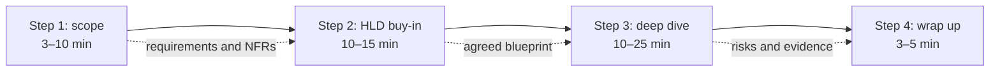

While drawing say: “I’ll first agree on scope, then propose a blueprint, deepen the most important component, and reserve time to close.”


### How to present a numbered figure in the interview

1. **Name it:** “I’ll draw Figure N / Diagram N next.”
2. **State the step:** “This is a Step 2 high-level buy-in diagram” or “This is a Step 3 deep dive.”
3. **Narrate before polishing:** say the responsibility of each box and what travels on each arrow.
4. **Ask for buy-in:** “Does this match the scope so far, or should we change a box?”
5. **Only then deepen:** move to the next figure only after the interviewer agrees or redirects.

### Mapping beats to the four steps

| Interview phase | What you produce | Typical figures |
|-----------------|------------------|-----------------|
| Step 1 Scope | Actors, journeys, NFRs, out-of-scope | Journey boards, NFR boards |
| Step 2 HLD | End-to-end box diagram + use case | `… HLD …`, architecture plates |
| Step 3 Deep dive | One critical component | ERD, sequence, state, LLD internals |
| Step 4 Wrap | Bottlenecks, failures, 10× scale | Scale, failure, wrap checklist |

### Step 1 — Understand the problem and establish design scope (3–10 min)

Ask clarifying questions; do not silently assume. Establish functional requirements, constraints, success metrics, and what is explicitly out of scope. Pick questions that change the next design decision rather than reading a checklist.

#### Clarifying question bank

- **Users and actors:** Who acts—customer, operator, admin, device, or partner? Who reads, writes, and administers?
- **Core journey:** What is the smallest complete v1 journey? Which use cases are must-have versus nice-to-have?
- **Object and lifecycle:** What is created, read, updated, deleted, reserved, or streamed? What states matter?
- **Scale:** What are DAU/MAU, peak QPS, read/write ratio, object size, fanout, retention, and growth?
- **Traffic shape:** Is traffic smooth, viral, bursty, event-driven, regional, or reconnect-heavy?
- **Correctness:** Which action cannot be stale? Can discovery lag if the final command revalidates?
- **Reliability:** Are retries expected? What loss, duplication, RPO, RTO, and degraded behavior are acceptable?
- **Geography and tenancy:** Single region, multi-region, tenant-isolated, edge-heavy, or data-residency constrained?
- **Security and compliance:** What auth, audit, privacy, encryption, moderation, legal hold, or deletion duties matter?
- **Boundaries:** What integrations exist? What is explicitly out of scope for this interview?

#### NFR template

State measurable targets and invite correction:

> “I propose peak ___ reads/s and ___ writes/s; p95 ___ ms for ___; ___% availability; data durable after ___; consistency is ___ for ___ and eventual within ___ for ___; retain ___ for ___; support ___ regions/tenants; and enforce ___ security/compliance controls. Which target should we revise?”

Capture assumptions, not fake precision. A useful board has six lanes: scale, latency, availability, durability, consistency/freshness, and security/compliance.

**Draw now:** turn the prompt into a shared scope board.

**Figure 2: Diagram 2 — Scope board and requirement boundary**

| | |
|:---|:---|
| **Interview step** | Step 1 — Understand the problem and establish design scope |
| **Diagram type** | Scope / requirements diagram |
| **Details** | Visual board update for: Scope board and requirement boundary. Draw this when the conversation reaches this beat; narrate each box/arrow before adding the next. |
| **How to use** | Say the figure number out loud (“as in Figure N / Diagram N”), then explain the corresponding Step 1 goal. |

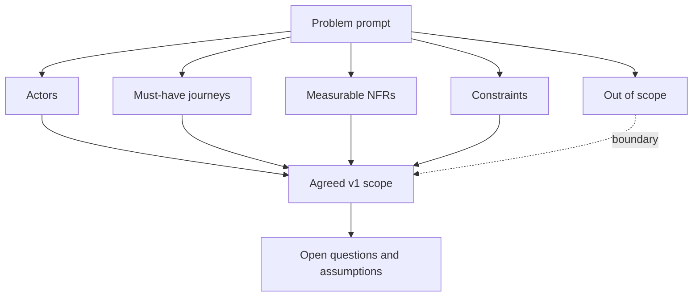

Getting buy-in sounds like: “I’ll design for these two journeys and these targets, defer these items, and call out assumptions as we go. Does this scope match what you want?”

### Step 2 — Propose a high-level design and get buy-in (10–15 min)

Offer an initial blueprint, not a finished answer. Treat the interviewer as a teammate: explain why each box exists, ask for feedback, and show multiple credible approaches when the trade-off is material.

- Draw clients, edge/CDN, load balancer or API gateway, web/application services, cache, authoritative stores, message queues, workers, and external dependencies.
- Separate synchronous user paths from asynchronous work and identify the source of truth.
- Do back-of-the-envelope calculations when they affect partitioning, bandwidth, storage, cache size, or queue capacity; ask whether the interviewer wants the arithmetic.
- Walk one concrete happy-path use case end to end, then one edge case such as a retry, duplicate, hot key, or dependency timeout.
- State alternatives briefly: “Option A favors ___; option B favors ___. Given our requirements I recommend A.”
- Pause before deepening: “Is this the right high-level shape, and which component would you like me to explore?”

**Figure 3: Diagram 3 — Generic high-level design template**

| | |
|:---|:---|
| **Interview step** | Step 2 — Propose high-level design and get buy-in |
| **Diagram type** | High-level design (HLD) box diagram |
| **Details** | Visual board update for: Generic high-level design template. Draw this when the conversation reaches this beat; narrate each box/arrow before adding the next. |
| **How to use** | Say the figure number out loud (“as in Figure N / Diagram N”), then explain the corresponding Step 2 goal. |

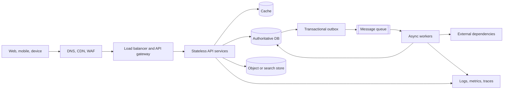

Getting buy-in is an explicit checkpoint, not a courtesy: summarize the main trade-off, ask whether the interviewer agrees, and use their feedback to choose the Step-3 target.

### Step 3 — Design deep dive (10–25 min)

The goals and HLD are already agreed. Use feedback to prioritize one or two critical components: the scarce-resource write, fanout path, scheduler, storage layout, authorization boundary, or hottest read.

- Trace data and control flow inside the chosen service.
- Define API contracts, idempotency, errors, state transitions, keys, indexes, and transactional boundaries.
- Quantify bottlenecks or resource estimates when they change the design.
- For a URL shortener, compare random codes, hashing, and ID-to-base62 generation; for chat, cover online/offline delivery and fanout; for booking, prove exclusive allocation.
- Discuss concurrency, retries, partial failure, backpressure, recovery, observability, and tests around the invariant.
- Keep time: do not disappear into classes, schema columns, or protocol trivia that does not defend a requirement.

**Figure 4: Diagram 4 — Generic service component deep dive**

| | |
|:---|:---|
| **Interview step** | Step 3 — Design deep dive |
| **Diagram type** | Low-level / component diagram (LLD) |
| **Details** | Visual board update for: Generic service component deep dive. Draw this when the conversation reaches this beat; narrate each box/arrow before adding the next. |
| **How to use** | Say the figure number out loud (“as in Figure N / Diagram N”), then explain the corresponding Step 3 goal. |

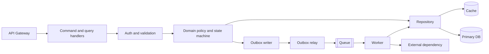

Time-box the dive by announcing the target: “I’ll spend the next ten minutes proving allocation correctness and retry behavior, then leave time for failure and scale.”

### Step 4 — Wrap up (3–5 min)

Never say the design is perfect. Name bottlenecks and improvements, recap the design and source of truth, cover errors and operations, and explain the next scale curve—often what changes from 1 million to 10 million users.

- Recap requirements, core path, authoritative state, asynchronous projections, and the key trade-off.
- Call out top bottlenecks, failure modes, and how you would measure them.
- Cover error handling, dashboards, alerts, tracing, capacity signals, backup/restore, rollout, rollback, and migration.
- Explain the next scale step: partitioning, regionalization, caching, load shedding, or isolation—and what complexity it buys.
- Offer refinements if more time: deeper threat model, cost model, schema, test plan, disaster recovery, or alternative design.

**Figure 5: Diagram 5 — Wrap-up checklist and next scale curve**

| | |
|:---|:---|
| **Interview step** | Step 4 — Wrap up |
| **Diagram type** | Flowchart |
| **Details** | Visual board update for: Wrap-up checklist and next scale curve. Draw this when the conversation reaches this beat; narrate each box/arrow before adding the next. |
| **How to use** | Say the figure number out loud (“as in Figure N / Diagram N”), then explain the corresponding Step 4 goal. |

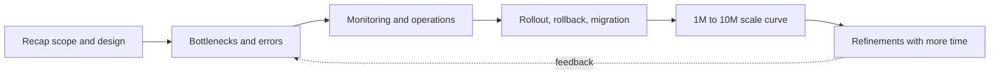

#### Dos

- Do drive the conversation and state the current step.
- Do ask clarifying questions before drawing architecture.
- Do make assumptions explicit and measurable.
- Do distinguish functional requirements from NFRs and out-of-scope items.
- Do calculate scale when it changes a decision.
- Do start simple and add boxes only when a requirement earns them.
- Do identify the source of truth, correctness boundary, and acceptable staleness.
- Do walk concrete use cases, retries, edge cases, and failure cuts.
- Do discuss trade-offs and, when useful, present more than one approach.
- Do collaborate: pause, ask for feedback, and adapt to interviewer hints.
- Do communicate while drawing; explain each component and arrow.
- Do prioritize the critical path and manage time aloud.
- Do reserve three to five minutes for recap, bottlenecks, operations, and scale.
- Do admit and correct weak assumptions cleanly.

#### Don'ts

- Don’t jump into databases, microservices, or classes before agreeing on scope.
- Don’t assume scale, consistency, geography, or product behavior without saying so.
- Don’t interrogate with every possible question; ask what changes the design.
- Don’t draw a giant architecture in silence.
- Don’t list technologies without connecting them to requirements.
- Don’t over-engineer v1 or add distributed complexity without a reason.
- Don’t claim exactly-once delivery, zero downtime, or perfect consistency casually.
- Don’t confuse cache, index, replica, or analytics projections with authoritative truth.
- Don’t ignore idempotency, races, partial failures, hot keys, or backpressure.
- Don’t spend the whole interview on one minute implementation detail.
- Don’t dismiss interviewer feedback or defend a broken approach.
- Don’t end without a summary, bottlenecks, monitoring, rollout, and next scale step.
- Don’t say “the design is perfect.”

#### 45-minute allocation

| Time | Step | Outcome |
|---|---|---|
| 0–7 min | Step 1 — Scope | Requirements, NFRs, estimates, exclusions, agreement |
| 7–19 min | Step 2 — HLD | Blueprint, core use case, alternatives, interviewer buy-in |
| 19–39 min | Step 3 — Deep dive | Critical component, data model/API, invariant, failure behavior |
| 39–45 min | Step 4 — Wrap | Recap, bottlenecks, operations, rollout, 10× scale |

### Progressive-interview recovery phrases

- **[If you blank]** “I’m stuck. What is the next user action after this?”
- **[If you overdraw]** “Let me erase derived pieces and re-anchor on the source of truth.”
- **[If challenged]** “That assumption is weak. I’ll revise it and state what changes.”
- **[If time is short]** “I’ll prioritize the critical write, its invariant, and its failure recovery.”

---

## 1. Parking Lot — full progressive interview

### Beat 1 — Restate without designing

*(Step 1 — Scope)*

**Interviewer:** Design a parking lot.

**You (ask / say / draw):** “I’ll design software that admits a vehicle, assigns capacity, records a stay, and charges at exit. Should I optimize for object modeling or a distributed garage network?”

**Interviewer:** Start with one garage, but show clean objects and discuss scale later.

**You:** “Great. I’ll stay correctness-first and avoid infrastructure until we know the workflow.”

**Board now:**
- Scope: one garage first
- Depth: model, APIs, races, then scale

### Beat 2 — Clarify actors

**Interviewer:** What do you need to know?

**You (ask / say / draw):** “Are drivers the only users, or do attendants and operators need workflows too?”

**Interviewer:** Drivers enter and exit; operators configure spots and pricing.

**You:** “I’ll include driver and operator, but keep operator configuration off the critical path.”

**Board now:**
- Actors: driver, operator
- Critical path: entry → park → exit

**Draw now:** the actors and driver journey.

**Figure 6: Diagram 6 — The actors and driver journey**

| | |
|:---|:---|
| **Interview step** | Step 1 — Understand the problem and establish design scope |
| **Diagram type** | Scope / requirements diagram |
| **Details** | Visual board update for: The actors and driver journey. Draw this when the conversation reaches this beat; narrate each box/arrow before adding the next. |
| **How to use** | Say the figure number out loud (“as in Figure N / Diagram N”), then explain the corresponding Step 1 goal. |

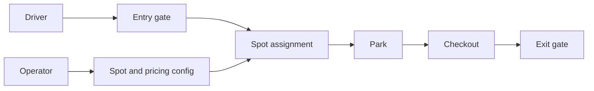

While drawing say: “The driver owns the critical journey; operator configuration stays off that synchronous path.”

### Beat 3 — Clarify assignment

**You (ask / say / draw):** “Does the system assign an exact spot at entry, or only admit by zone and let the driver choose?”

**Interviewer:** Assign an exact spot.

**You:** “Then spot ownership is the scarce-resource invariant; admission cannot rely only on a counter.”

**Board now:**
- Exact spot assignment
- No two active sessions own one spot

### Beat 4 — Clarify vehicle fit

**You (ask / say / draw):** “Which vehicle and spot types matter in v1?”

**Interviewer:** Motorcycle, compact, large, and EV; compatible larger spots may accept smaller vehicles.

**You:** “I’ll model compatibility explicitly rather than bury it in conditionals.”

**Board now:**
- Vehicle types: motorcycle, compact, large, EV
- Spot compatibility policy

### Beat 5 — Clarify reservations

**You (ask / say / draw):** “Are advance reservations required, or only drive-up parking?”

**Interviewer:** Drive-up only.

**You:** “Good. A session starts at entry; no time-range booking model yet.”

**Board now:**
- v1: drive-up only
- Out: advance reservations

### Beat 6 — Clarify payment

**You (ask / say / draw):** “Do we charge at exit, and should gates open if the payment provider is unavailable?”

**Interviewer:** Charge at exit. Do not trap drivers indefinitely.

**You:** “I’ll separate parking truth from payment truth and include a controlled offline-exit policy.”

**Board now:**
- Payment at exit
- Availability policy: safe manual/offline override

### Beat 7 — Propose NFRs

**Interviewer:** Give me nonfunctional requirements.

**You (ask / say / draw):** “I propose p95 under 300 ms for entry assignment, under 500 ms excluding payment at exit, 99.9% availability, and strong consistency for spot ownership. Signage may lag five seconds.”

**Interviewer:** Entry must work in under 150 ms at rush hour.

**You:** “I’ll revise entry to p95 150 ms and precompute candidate spots, but the final claim still hits authoritative storage.”

**Board now:**
- Entry p95 < 150 ms
- Strong assignment; ≤5 s stale signage

**Draw now:** the NFR board and consistency boundary.

**Figure 7: Diagram 7 — The NFR board and consistency boundary**

| | |
|:---|:---|
| **Interview step** | Step 1 — Understand the problem and establish design scope |
| **Diagram type** | Scope / requirements diagram |
| **Details** | Visual board update for: The NFR board and consistency boundary. Draw this when the conversation reaches this beat; narrate each box/arrow before adding the next. |
| **How to use** | Say the figure number out loud (“as in Figure N / Diagram N”), then explain the corresponding Step 1 goal. |

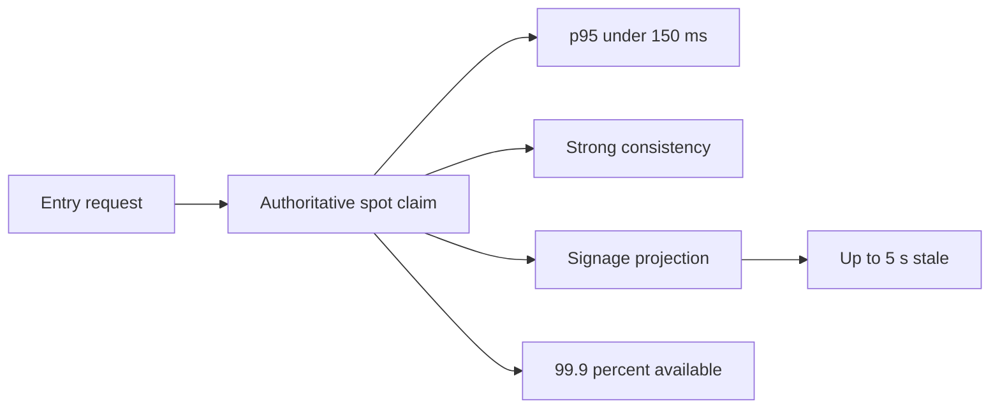

While drawing say: “Latency cannot weaken the one-spot claim; only the derived signage is allowed to lag.”

### Beat 8 — Estimate modest scale

**You (ask / say / draw):** “For one garage, may I assume 10,000 spots and 20 entry or exit requests per second at peak?”

**Interviewer:** Yes, but later imagine 1,000 garages.

**You:** “At one garage this is not a throughput problem; correctness and device reliability dominate.”

**Board now:**
- 10k spots, 20 gate commands/s
- Later: 1,000 garages

### Beat 9 — Start with two entities

*(Step 3 — Deep dive)*

**Interviewer:** Model it.

**You (ask / say / draw):** “I’d start with `Lot` and `Spot`. `Spot(spot_id, lot_id, level, type, status, version)` belongs to one lot.”

**Interviewer:** Why put status on Spot?

**You:** “It gives a direct lockable claim point. I’ll distinguish operational status from occupancy as the model grows.”

**Board now:**
- Lot 1→N Spot
- Spot has type, location, status, version

**Draw now:** the first partial parking ERD.

**Figure 8: Diagram 8 — The first partial parking ERD**

| | |
|:---|:---|
| **Interview step** | Step 3 — Design deep dive |
| **Diagram type** | Entity-relationship diagram (ERD) |
| **Details** | Visual board update for: The first partial parking ERD. Draw this when the conversation reaches this beat; narrate each box/arrow before adding the next. |
| **How to use** | Say the figure number out loud (“as in Figure N / Diagram N”), then explain the corresponding Step 3 goal. |

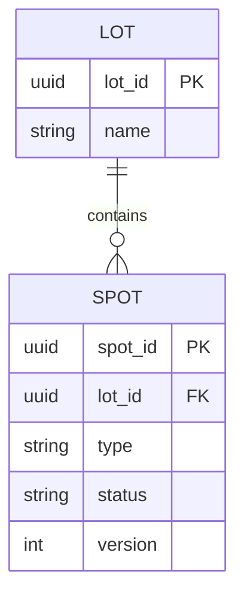

While drawing say: “This is intentionally incomplete: Spot is already the lockable scarcity boundary.”

### Beat 10 — Add vehicle

**Interviewer:** What arrives?

**You (ask / say / draw):** “A `Vehicle(vehicle_id, plate, jurisdiction, type)`; plate plus jurisdiction is unique where legally usable.”

**Interviewer:** Do you need a permanent vehicle row?

**You:** “Not necessarily. For privacy, it could be session-scoped or tokenized after retention expires.”

**Board now:**
- Vehicle identity and type
- Retention/tokenization decision

### Beat 11 — Add the lifecycle row

**Interviewer:** What about the stay?

**You (ask / say / draw):** “I’ll add `ParkingSession(session_id, lot_id, spot_id, vehicle_id, entered_at, exited_at, status)`.”

**Interviewer:** Which row is historical truth?

**You:** “The session records the stay; Spot is the current claim point. Their transition must be atomic.”

**Board now:**
- Session states: ACTIVE, PAYMENT_PENDING, CLOSED, VOID
- Spot and active session change together

**Draw now:** the evolving ERD after adding the stay lifecycle.

**Figure 9: Diagram 9 — The evolving ERD after adding the stay lifecycle**

| | |
|:---|:---|
| **Interview step** | Step 3 — Design deep dive |
| **Diagram type** | Entity-relationship diagram (ERD) |
| **Details** | Visual board update for: The evolving ERD after adding the stay lifecycle. Draw this when the conversation reaches this beat; narrate each box/arrow before adding the next. |
| **How to use** | Say the figure number out loud (“as in Figure N / Diagram N”), then explain the corresponding Step 3 goal. |

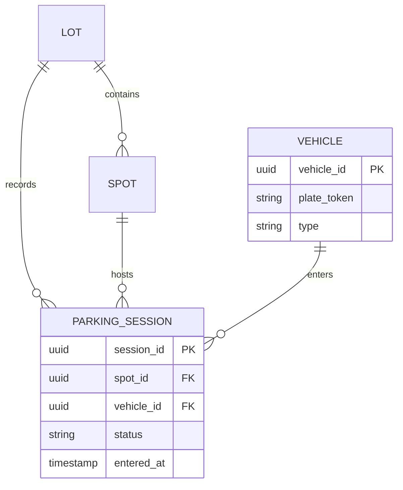

While drawing say: “Session is historical truth, while Spot remains the current claim point.”

### Beat 12 — Correct a weak model

**You (ask / say / draw):** “We could infer availability by counting active sessions.”

**Interviewer:** That requires a scan and races with assignment. Is that your plan?

**You:** “No, that is weak. I’ll keep current spot state for lockable decisions, with the session as audit history and a constraint preventing multiple active claims.”

**Board now:**
- Corrected: explicit current spot state
- Constraint backs up application logic

### Beat 13 — Draw the earned ERD

**Interviewer:** Show the relationships.

**You (ask / say / draw):** “Now we have enough nouns to draw the core, but not payment yet.”

**Draw now:** the minimum parking model.

**Figure 10: Diagram 10 — The minimum parking model**

| | |
|:---|:---|
| **Interview step** | Step 3 — Design deep dive |
| **Diagram type** | Entity-relationship diagram (ERD) |
| **Details** | Visual board update for: The minimum parking model. Draw this when the conversation reaches this beat; narrate each box/arrow before adding the next. |
| **How to use** | Say the figure number out loud (“as in Figure N / Diagram N”), then explain the corresponding Step 3 goal. |

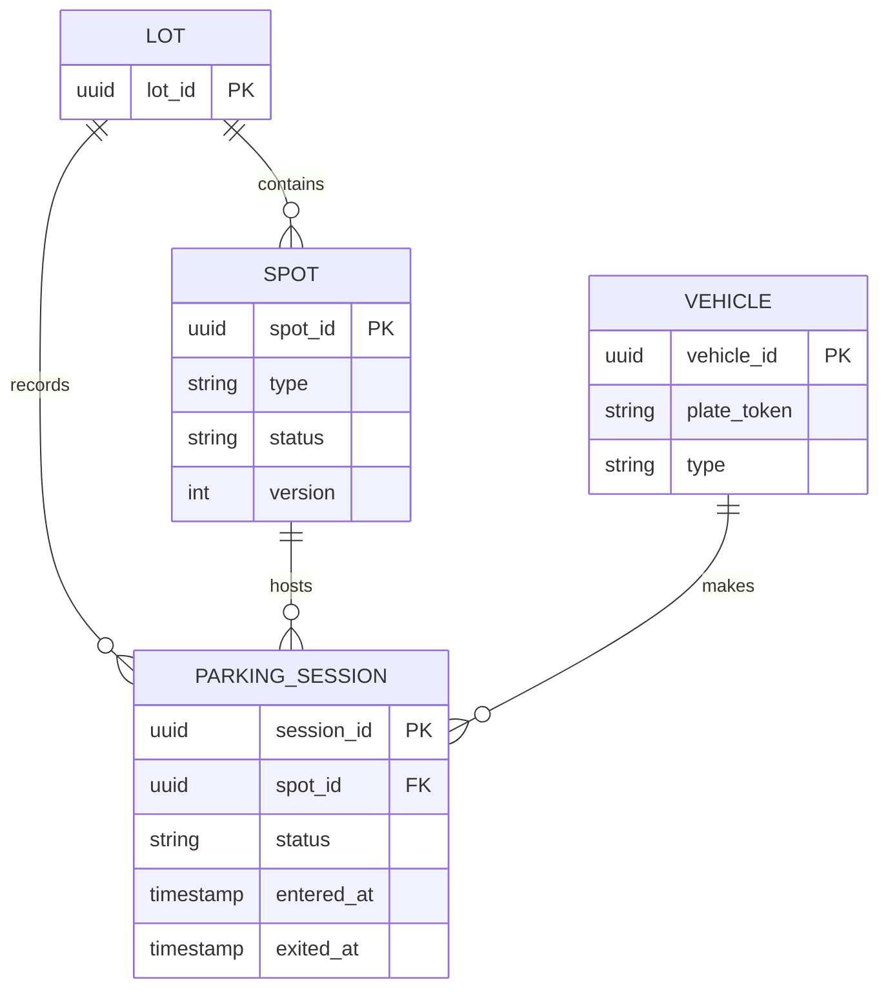

While drawing say: “The mutable scarcity boundary is one Spot; Session preserves the lifecycle.”

**Board now:**
- Core ERD
- Payment deliberately deferred

### Beat 14 — Define compatibility

**Interviewer:** How do you choose a spot?

**You (ask / say / draw):** “I’ll define a ranked compatibility table, for example compact prefers compact then large; EV requires charger capability.”

**Interviewer:** Why ranking?

**You:** “It prevents wasting flexible spots and makes operator policy data-driven.”

**Board now:**
- Compatibility(vehicle_type, spot_type, rank)
- Candidate query ordered by rank and walking distance

**Draw now:** the compatibility ranking decision.

**Figure 11: Diagram 11 — The compatibility ranking decision**

| | |
|:---|:---|
| **Interview step** | Step 3 — Design deep dive |
| **Diagram type** | Flowchart |
| **Details** | Visual board update for: The compatibility ranking decision. Draw this when the conversation reaches this beat; narrate each box/arrow before adding the next. |
| **How to use** | Say the figure number out loud (“as in Figure N / Diagram N”), then explain the corresponding Step 3 goal. |

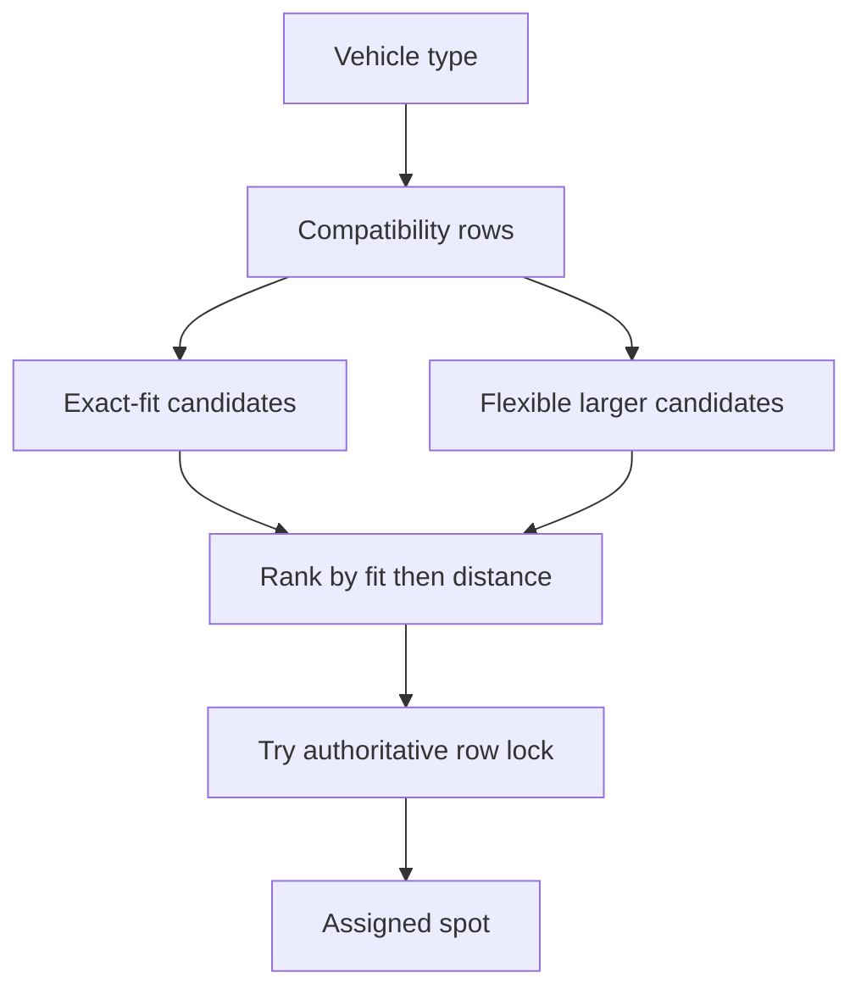

While drawing say: “Ranking preserves flexible inventory, but the final row lock—not the ranking result—owns the assignment.”

### Beat 15 — First API only

**Interviewer:** Give me the entry API.

**You (ask / say / draw):** “First endpoint: `POST /lots/{lotId}/sessions` with plate token, vehicle type, gate ID, and `Idempotency-Key`.”

**Interviewer:** Response?

**You:** “`201 {sessionId, spotId, level, directions}`; `409 LOT_FULL`; a replay returns the original result.”

```json
{"plateToken":"tok_7f","vehicleType":"COMPACT","gateId":"north-2"}
```

**Board now:**
- Create-session command
- 201, 409, idempotent replay

**Draw now:** the entry API sequence.

**Figure 12: Diagram 12 — The entry API sequence**

| | |
|:---|:---|
| **Interview step** | Step 3 — Design deep dive |
| **Diagram type** | Sequence diagram |
| **Details** | Visual board update for: The entry API sequence. Draw this when the conversation reaches this beat; narrate each box/arrow before adding the next. |
| **How to use** | Say the figure number out loud (“as in Figure N / Diagram N”), then explain the corresponding Step 3 goal. |

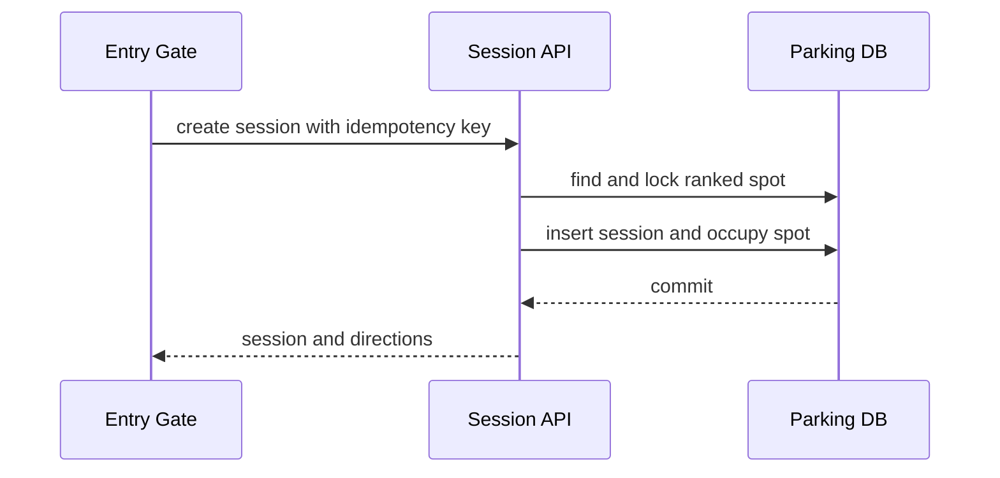

While drawing say: “The response is produced by the same transaction that spends the spot.”

### Beat 16 — Retry challenge

**Interviewer:** The gate times out and retries. What happens?

**You (ask / say / draw):** “The key is unique per lot and operation. In the same transaction as assignment, I persist `RequestDedup(key, response_ref)`.”

**Interviewer:** What if the first request is still running?

**You:** “The duplicate waits briefly or receives `202 IN_PROGRESS` with a status URL; it never allocates another spot.”

**Board now:**
- Unique `(lot_id, idempotency_key)`
- Replay or 202 while in progress

**Draw now:** the gate timeout and retry sequence.

**Figure 13: Diagram 13 — The gate timeout and retry sequence**

| | |
|:---|:---|
| **Interview step** | Step 3 — Design deep dive |
| **Diagram type** | Sequence diagram |
| **Details** | Visual board update for: The gate timeout and retry sequence. Draw this when the conversation reaches this beat; narrate each box/arrow before adding the next. |
| **How to use** | Say the figure number out loud (“as in Figure N / Diagram N”), then explain the corresponding Step 3 goal. |

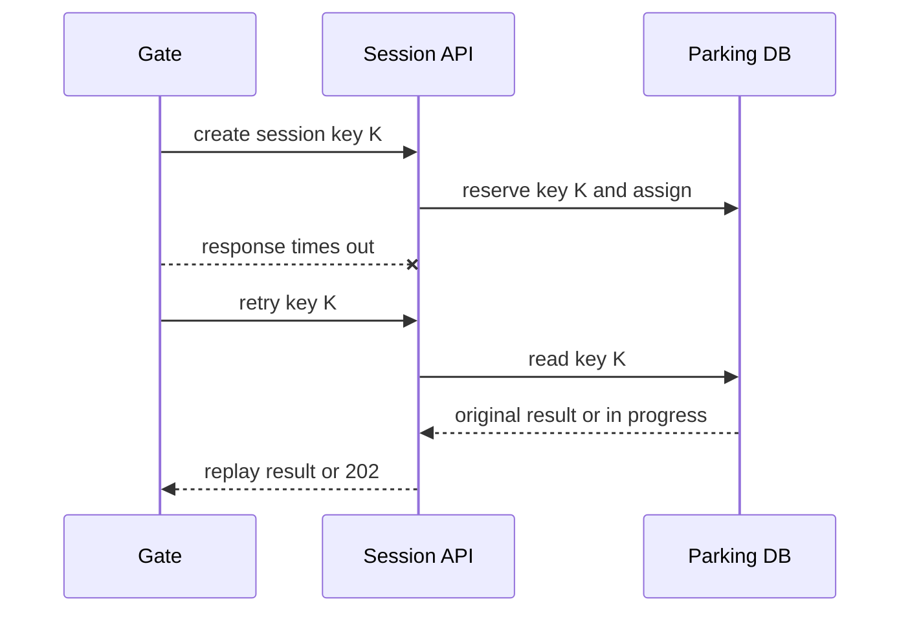

While drawing say: “A retry observes the first operation; it never starts a second allocation.”

### Beat 17 — Exit API

**Interviewer:** Add exit.

**You (ask / say / draw):** “`POST /sessions/{id}/checkout` starts pricing and payment; `POST /sessions/{id}/close` is internal after payment or override.”

**Interviewer:** Why not one endpoint?

**You:** “The provider can be slow or ambiguous. Separating intent from final closure exposes the lifecycle.”

**Board now:**
- Checkout command
- Internal close after settled payment/override

### Beat 18 — Add pricing and payment entities

**Interviewer:** Model money now.

**You (ask / say / draw):** “Add immutable `RatePlan` versions and `PaymentAttempt(payment_id, session_id, amount, provider_ref, status)`.”

**Interviewer:** Why version rates?

**You:** “A closed session must reproduce the price applied at entry or checkout even after operator edits.”

**Board now:**
- Versioned RatePlan
- PaymentAttempt states and provider reference

**Draw now:** the payment entities added to the parking model.

**Figure 14: Diagram 14 — The payment entities added to the parking model**

| | |
|:---|:---|
| **Interview step** | Step 3 — Design deep dive |
| **Diagram type** | Entity-relationship diagram (ERD) |
| **Details** | Visual board update for: The payment entities added to the parking model. Draw this when the conversation reaches this beat; narrate each box/arrow before adding the next. |
| **How to use** | Say the figure number out loud (“as in Figure N / Diagram N”), then explain the corresponding Step 3 goal. |

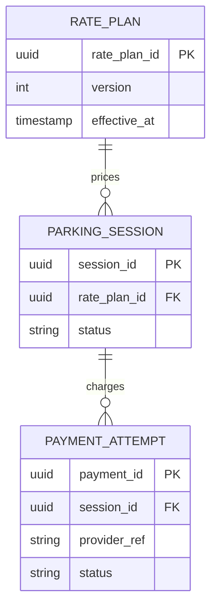

While drawing say: “Immutable rate versions reproduce the quote, and each provider interaction gets its own durable attempt.”

### Beat 19 — Two users claim the last EV spot

**Interviewer:** Two gates assign the last EV spot simultaneously. Walk me through it.

**You (ask / say / draw):** “Candidate lookup may race. Each request then tries to lock or conditionally update that exact Spot from AVAILABLE to OCCUPIED.”

**Interviewer:** Which approach do you choose?

**You:** “At this scale, `SELECT … FOR UPDATE SKIP LOCKED`, recheck compatibility, insert Session, update Spot, commit.”

**Board now:**
- Candidate search is advisory
- Locked Spot row is authoritative

### Beat 20 — Draw the transaction

**Interviewer:** Show the race.

**Draw now:** the last-spot sequence.

**Figure 15: Diagram 15 — The last-spot sequence**

| | |
|:---|:---|
| **Interview step** | Step 3 — Design deep dive |
| **Diagram type** | Sequence diagram |
| **Details** | Visual board update for: The last-spot sequence. Draw this when the conversation reaches this beat; narrate each box/arrow before adding the next. |
| **How to use** | Say the figure number out loud (“as in Figure N / Diagram N”), then explain the corresponding Step 3 goal. |

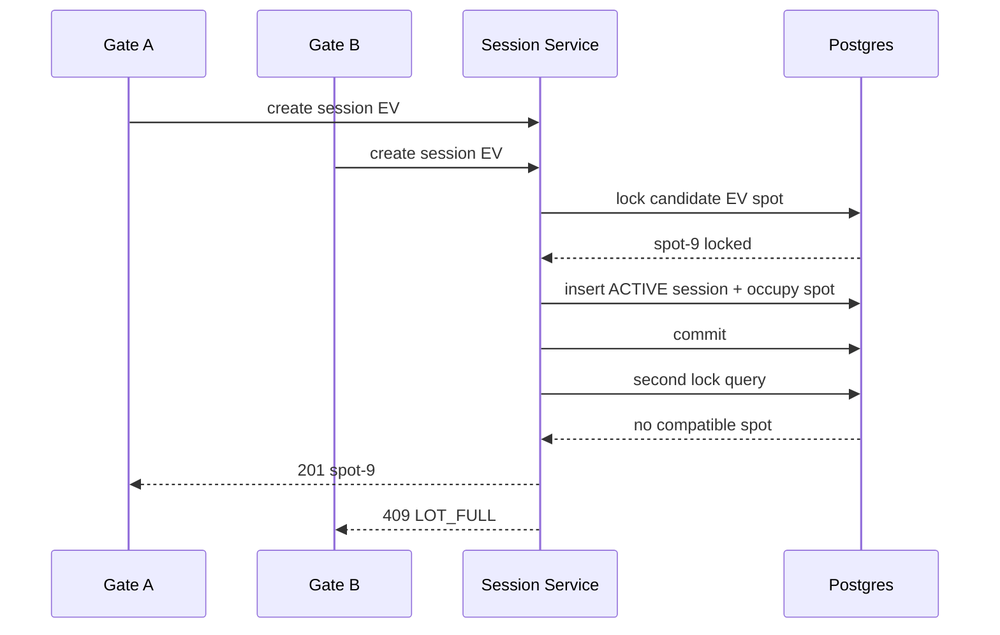

While drawing say: “The loser does not trust its old read; it performs a fresh authoritative claim.”

**Board now:**
- One transaction owns assignment
- Deterministic loser response

### Beat 21 — Database backstop

**Interviewer:** What if application code forgets the lock?

**You (ask / say / draw):** “I want a database backstop: one active session per spot, implemented with a partial unique index on `spot_id WHERE status IN ('ACTIVE','PAYMENT_PENDING')`.”

**Interviewer:** Is the Spot status then redundant?

**You:** “Derived but useful for a direct claim; a reconciler detects disagreement and the constraint protects history.”

**Board now:**
- Partial unique active-session index
- Reconciliation invariant check

### Beat 22 — Payment crash point

**Interviewer:** Payment succeeds, then your service crashes before closing the session.

**You (ask / say / draw):** “A provider webhook keyed by provider reference updates PaymentAttempt idempotently. A reconciler finds settled payments with unclosed sessions.”

**Interviewer:** Could it charge twice?

**You:** “Provider requests also use an idempotency key derived from session plus checkout attempt.”

**Board now:**
- Webhook + reconciliation
- Provider-side idempotency

**Draw now:** payment crash recovery with an outbox.

**Figure 16: Diagram 16 — Payment crash recovery with an outbox**

| | |
|:---|:---|
| **Interview step** | Step 3 — Design deep dive |
| **Diagram type** | Sequence diagram |
| **Details** | Visual board update for: Payment crash recovery with an outbox. Draw this when the conversation reaches this beat; narrate each box/arrow before adding the next. |
| **How to use** | Say the figure number out loud (“as in Figure N / Diagram N”), then explain the corresponding Step 3 goal. |

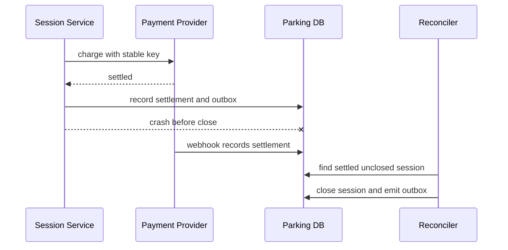

While drawing say: “Provider idempotency prevents double charge, while webhook and reconciliation complete our interrupted transition.”

### Beat 23 — Draw the state machine

**Draw now:** session and payment-aware transitions.

**Figure 17: Diagram 17 — Session and payment-aware transitions**

| | |
|:---|:---|
| **Interview step** | Step 3 — Design deep dive |
| **Diagram type** | State machine |
| **Details** | Visual board update for: Session and payment-aware transitions. Draw this when the conversation reaches this beat; narrate each box/arrow before adding the next. |
| **How to use** | Say the figure number out loud (“as in Figure N / Diagram N”), then explain the corresponding Step 3 goal. |

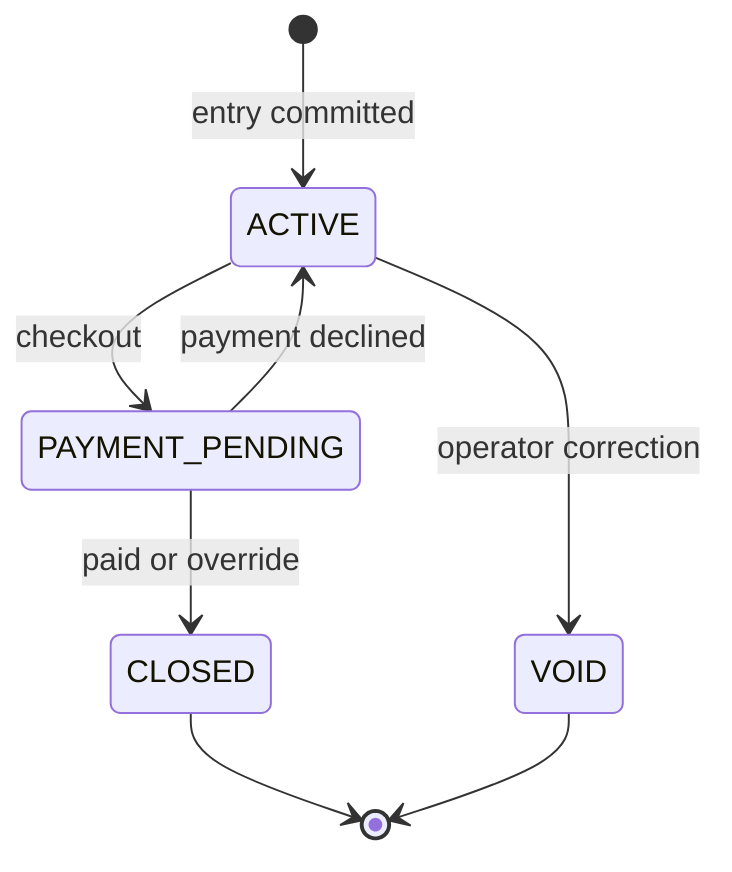

While drawing say: “Only conditional transitions are legal; stale commands receive 409.”

**Interviewer:** What expires?

**You:** “Nothing in drive-up parking. A physical sensor mismatch creates an alert, not automatic ownership changes.”

**Board now:**
- Explicit legal transitions
- Sensors do not silently rewrite truth

**Draw now:** the expiry and reconciliation worker boundary.

**Figure 18: Diagram 18 — The expiry and reconciliation worker boundary**

| | |
|:---|:---|
| **Interview step** | Step 3 — Design deep dive |
| **Diagram type** | Flowchart |
| **Details** | Visual board update for: The expiry and reconciliation worker boundary. Draw this when the conversation reaches this beat; narrate each box/arrow before adding the next. |
| **How to use** | Say the figure number out loud (“as in Figure N / Diagram N”), then explain the corresponding Step 3 goal. |

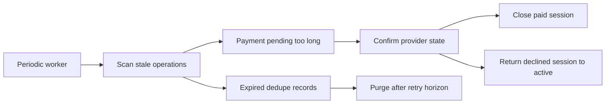

While drawing say: “Drive-up sessions do not expire; only stale operations and bounded idempotency records do.”

### Beat 24 — Ten-times traffic

**Interviewer:** Now 1,000 garages and ten times traffic.

**You (ask / say / draw):** “I partition ownership by `lot_id`; each garage’s writes route to one home shard. Read-only discovery and signage can use replicas or Redis.”

**Interviewer:** Why not global active-active writes?

**You:** “There is no need for cross-garage assignment transactions. Local ownership avoids conflict complexity.”

**Board now:**
- Partition key: lot_id
- Local writes; derived global reporting

**Draw now:** lot-based sharding at scale.

**Figure 19: Diagram 19 — Lot-based sharding at scale**

| | |
|:---|:---|
| **Interview step** | Step 2 — Propose high-level design and get buy-in |
| **Diagram type** | Flowchart |
| **Details** | Visual board update for: Lot-based sharding at scale. Draw this when the conversation reaches this beat; narrate each box/arrow before adding the next. |
| **How to use** | Say the figure number out loud (“as in Figure N / Diagram N”), then explain the corresponding Step 2 goal. |

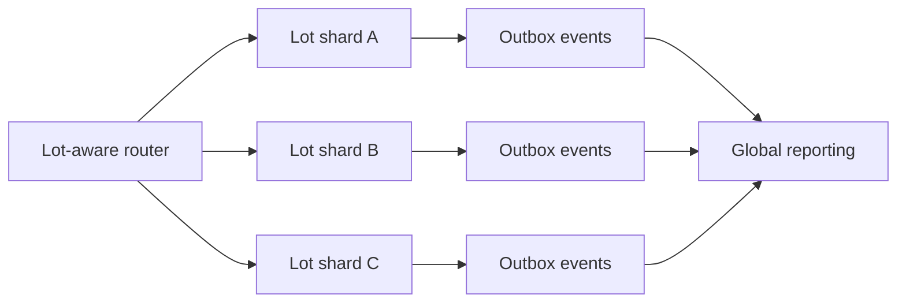

While drawing say: “Every garage has one write home, while global views are derived from shard events.”

### Practice plate — Step 2 HLD buy-in

**You:** “Here is the complete high-level shape. The synchronous path stays short, durable events drive secondary work, and I’ll pause for feedback before going deeper.”

**Figure 20: Diagram 20 — Parking Lot high-level architecture**

| | |
|:---|:---|
| **Interview step** | Step 2 — Propose high-level design and get buy-in |
| **Diagram type** | High-level design (HLD) box diagram |
| **Details** | Visual board update for: Parking Lot high-level architecture. Draw this when the conversation reaches this beat; narrate each box/arrow before adding the next. |
| **How to use** | Say the figure number out loud (“as in Figure N / Diagram N”), then explain the corresponding Step 2 goal. |

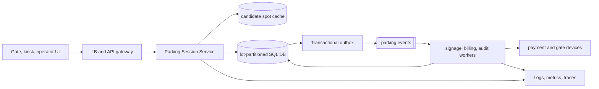

While drawing say: “Does this separation of synchronous truth and asynchronous work match the scope, and which box should we deepen?”

### Practice plate — Step 3 component deep dive

**You:** “I’ll open the critical service and trace its correctness, retry, and failure boundaries without getting lost in incidental implementation details.”

**Figure 21: Diagram 21 — Spot-claim service internals**

| | |
|:---|:---|
| **Interview step** | Step 3 — Design deep dive |
| **Diagram type** | Low-level / component diagram (LLD) |
| **Details** | Visual board update for: Spot-claim service internals. Draw this when the conversation reaches this beat; narrate each box/arrow before adding the next. |
| **How to use** | Say the figure number out loud (“as in Figure N / Diagram N”), then explain the corresponding Step 3 goal. |

```mermaid
flowchart LR
  Handler["entry command handler"] --> DomainA["compatibility ranker"]
  DomainA --> DomainB["atomic spot claim policy"]
  DomainB --> Repo["spot and session repository"]
  Repo --> Cache[("candidate spot cache")]
  Repo --> DB[("lot-partitioned SQL DB")]
  DomainB --> Outbox["Outbox writer"]
  Outbox --> Relay["Outbox relay"]
  Relay --> Queue[["parking events"]]
  Queue --> Worker["signage, billing, audit workers"]
  Worker --> External["payment and gate devices"]
  Worker --> Repo
```

While drawing say: “This is the component boundary I would test under concurrency, retries, and dependency failure.”

### Beat 25 — Earn the final architecture and close

*(Step 4 — Wrap up)*

**Interviewer:** Draw the scaled system and summarize.

**Draw now:** only boxes justified by prior beats.

**Figure 22: Diagram 22 — Parking Lot final earned HLD architecture**

| | |
|:---|:---|
| **Interview step** | Step 2 — Propose high-level design and get buy-in (earned after deep dive; used again in Step 4 recap) |
| **Diagram type** | High-level design (HLD) box diagram |
| **Details** | End-to-end Parking Lot blueprint: clients → gateway → parking service → Redis/Postgres → workers → payments. Only includes boxes justified by earlier beats (assignment, holds, expiry, analytics). |
| **How to use** | Say “as in Figure 22 / Diagram 22.” Recap the synchronous claim path vs async occupancy/payment work, then ask which box to deepen or improve. |

```mermaid
flowchart LR
  Gate[Gate / Kiosk] --> GW[API Gateway]
  GW --> SS[Session Service]
  SS --> DB[(Lot-partitioned Postgres)]
  SS --> Pay[Payment Provider]
  DB --> Outbox[Outbox Relay]
  Outbox --> Bus[Event Bus]
  Bus --> Sign[Signage Projection]
  Bus --> Audit[Audit / Analytics]
  Sensor[Spot Sensors] --> Bus
  Bus --> Recon[Reconciler]
  Recon --> DB
```

While drawing say: “Postgres owns spot and session state; projections may lag; outbox makes committed changes publishable.”

**You:** “The key invariant is one active session per spot. Assignment is a short transaction on one spot, retries are idempotent, payment ambiguity is reconciled, and scaling follows lot ownership.”

**Board now:**
- Source of truth and derived projections
- Invariant, failure recovery, scale path

**[Interviewer tip]** Parking is testing whether you can resist starting with classes or Kafka and instead discover the scarce-resource boundary.

---

## 2. Car Rental — full progressive interview

### Beat 1 — Frame the product

*(Step 1 — Scope)*

**Interviewer:** Design an enterprise car-rental system.

**You (ask / say / draw):** “I’ll begin with search, reserve, pickup, and return. Is this exact-vehicle booking or vehicle-class booking?”

**Interviewer:** Customers reserve a class; a vehicle is assigned near pickup.

**You:** “That separates inventory promise from physical allocation.”

**Board now:**
- Journey: search → reserve → pickup → return
- Reservation targets class, not VIN

**Draw now:** the customer journey and promise boundary.

**Figure 23: Diagram 23 — The customer journey and promise boundary**

| | |
|:---|:---|
| **Interview step** | Step 1 — Understand the problem and establish design scope |
| **Diagram type** | Scope / requirements diagram |
| **Details** | Visual board update for: The customer journey and promise boundary. Draw this when the conversation reaches this beat; narrate each box/arrow before adding the next. |
| **How to use** | Say the figure number out loud (“as in Figure N / Diagram N”), then explain the corresponding Step 1 goal. |

```mermaid
flowchart LR
  Customer --> Search
  Search --> Reserve[Reserve class]
  Reserve --> Assign[Assign vehicle]
  Assign --> Pickup
  Pickup --> Return
  BranchOps[Branch operations] --> Assign
```

While drawing say: “The reservation promises a class first; a VIN enters only near pickup.”

### Beat 2 — Clarify geography

**You (ask / say / draw):** “Can pickup and return locations differ?”

**Interviewer:** Yes.

**You:** “Then location availability and fleet movement are first-class; one-way fees can be pricing policy.”

**Board now:**
- Pickup and return branches
- One-way rental supported

### Beat 3 — Clarify time and cancellation

**You (ask / say / draw):** “Are reservations time ranges, and can customers cancel?”

**Interviewer:** Yes; free cancellation until 24 hours before pickup.

**You:** “We need overlap correctness and versioned policy evaluation.”

**Board now:**
- Half-open interval `[start,end)`
- Cancellation policy

### Beat 4 — Clarify overbooking

**You (ask / say / draw):** “May the business overbook a class based on expected no-shows?”

**Interviewer:** Not in v1.

**You:** “Then confirmed demand cannot exceed allocatable class inventory for the interval.”

**Board now:**
- v1: no intentional overbooking
- Hard inventory promise

### Beat 5 — NFRs and challenge

**You (ask / say / draw):** “Search p95 300 ms, booking p95 700 ms excluding payment, 99.95% booking availability, and strong booking consistency. Search may lag 10 seconds.”

**Interviewer:** Search traffic is 1,000 times booking traffic.

**You:** “I’ll derive a search index, but booking always revalidates against authoritative inventory.”

**Board now:**
- Search: fast, stale ≤10 s
- Booking: strong and revalidated

**Draw now:** the car-rental NFR split.

**Figure 24: Diagram 24 — The car-rental NFR split**

| | |
|:---|:---|
| **Interview step** | Step 1 — Understand the problem and establish design scope |
| **Diagram type** | Scope / requirements diagram |
| **Details** | Visual board update for: The car-rental NFR split. Draw this when the conversation reaches this beat; narrate each box/arrow before adding the next. |
| **How to use** | Say the figure number out loud (“as in Figure N / Diagram N”), then explain the corresponding Step 1 goal. |

```mermaid
flowchart LR
  Client --> Search[Search path]
  Client --> Booking[Booking path]
  Search --> Index["Derived index, up to 10 s stale"]
  Booking --> Inventory[Authoritative inventory]
  Index -. advisory result .-> Booking
  Booking --> Strong[Strong revalidation]
```

While drawing say: “Search optimizes discovery, but only booking can spend inventory.”

### Beat 6 — Capacity

**You (ask / say / draw):** “Assume 5 million vehicles, 20,000 branches, 50k peak search QPS, and 50 booking QPS?”

**Interviewer:** Reasonable.

**You:** “Search needs horizontal read scale; transactional booking volume is modest but contested by branch, class, and day.”

**Board now:**
- 50k search QPS
- 50 booking QPS

### Beat 7 — Begin entities

*(Step 3 — Deep dive)*

**Interviewer:** Model the fleet.

**You (ask / say / draw):** “Start with `Branch`, `VehicleClass`, and `Vehicle(VIN, class_id, current_branch, status)`.”

**Interviewer:** What statuses?

**You:** “AVAILABLE, ASSIGNED, RENTED, MAINTENANCE, TRANSIT, RETIRED.”

**Board now:**
- Branch, VehicleClass, Vehicle
- Physical fleet lifecycle

### Beat 8 — Add reservation

**You (ask / say / draw):** “Add `Reservation(id, customer, pickup_branch, return_branch, class_id, start, end, status, quoted_price)`.”

**Interviewer:** Does it point to a vehicle?

**You:** “Optional `assigned_vehicle_id`, populated near pickup.”

**Board now:**
- Reservation promises a class
- Vehicle assignment is later

### Beat 9 — Wrong turn on inventory

**You (ask / say / draw):** “We can count vehicles and subtract overlapping reservations on every booking.”

**Interviewer:** Across long ranges and high contention?

**You:** “That is expensive and lock-heavy. I’ll introduce daily inventory buckets per branch and class for the booking horizon.”

**Board now:**
- Corrected: InventoryDay(branch, class, date)
- Capacity and reserved_count

**Draw now:** the inventory-model correction.

**Figure 25: Diagram 25 — The inventory-model correction**

| | |
|:---|:---|
| **Interview step** | Step 3 — Design deep dive |
| **Diagram type** | Flowchart |
| **Details** | Visual board update for: The inventory-model correction. Draw this when the conversation reaches this beat; narrate each box/arrow before adding the next. |
| **How to use** | Say the figure number out loud (“as in Figure N / Diagram N”), then explain the corresponding Step 3 goal. |

```mermaid
flowchart LR
  Request[Date-range request] --> Old[Count fleet minus overlaps]
  Old --> Problem[Wide scans and lock contention]
  Problem --> Buckets[InventoryDay buckets]
  Buckets --> Ordered[Lock dates in order]
  Ordered --> Atomic[Atomic range promise]
```

While drawing say: “Daily buckets turn an expensive overlap calculation into finite, ordered claims.”

### Beat 10 — Draw the model

**Draw now:** reservation promise versus physical allocation.

**Figure 26: Diagram 26 — Reservation promise versus physical allocation**

| | |
|:---|:---|
| **Interview step** | Step 3 — Design deep dive |
| **Diagram type** | Entity-relationship diagram (ERD) |
| **Details** | Visual board update for: Reservation promise versus physical allocation. Draw this when the conversation reaches this beat; narrate each box/arrow before adding the next. |
| **How to use** | Say the figure number out loud (“as in Figure N / Diagram N”), then explain the corresponding Step 3 goal. |

```mermaid
erDiagram
  BRANCH ||--o{ VEHICLE : holds
  VEHICLE_CLASS ||--o{ VEHICLE : classifies
  VEHICLE_CLASS ||--o{ INVENTORY_DAY : budgets
  BRANCH ||--o{ INVENTORY_DAY : owns
  VEHICLE_CLASS ||--o{ RESERVATION : requested
  RESERVATION o|--o| VEHICLE : assigned
  RESERVATION { uuid reservation_id PK
                date start_date
                date end_date
                string status }
  INVENTORY_DAY { uuid branch_id PK
                  uuid class_id PK
                  date day PK
                  int capacity
                  int reserved_count }
```

While drawing say: “InventoryDay protects promises; Vehicle represents operational reality.”

**Board now:**
- Booking ledger and fleet model
- Half-open date semantics

### Beat 11 — Search API

**Interviewer:** Give me search.

**You (ask / say / draw):** “`GET /availability?pickup=...&return=...&start=...&end=...` returns classes, estimate, and an opaque quote token.”

**Interviewer:** Is the token a reservation?

**You:** “No. It freezes pricing inputs briefly, not inventory.”

**Board now:**
- Search response + quote token
- No inventory hold yet

### Beat 12 — Booking API

**Interviewer:** Reserve one.

**You (ask / say / draw):** “`POST /reservations` with class, dates, branches, quote token, and Idempotency-Key.”

**Interviewer:** Response?

**You:** “`201` confirmed, `409 SOLD_OUT`, or `422` for expired/invalid quote.”

**Board now:**
- Create reservation command
- Idempotency and explicit errors

**Draw now:** the booking API decision path.

**Figure 27: Diagram 27 — The booking API decision path**

| | |
|:---|:---|
| **Interview step** | Step 3 — Design deep dive |
| **Diagram type** | Sequence diagram |
| **Details** | Visual board update for: The booking API decision path. Draw this when the conversation reaches this beat; narrate each box/arrow before adding the next. |
| **How to use** | Say the figure number out loud (“as in Figure N / Diagram N”), then explain the corresponding Step 3 goal. |

```mermaid
sequenceDiagram
  participant C as Customer
  participant R as Reservation API
  participant Q as Quote Service
  participant D as Inventory DB
  C->>R: create reservation with quote token
  R->>Q: validate frozen pricing inputs
  R->>D: lock and spend date buckets
  D-->>R: committed or sold out
  R-->>C: confirmed or conflict
```

While drawing say: “A valid quote freezes price inputs, not availability; inventory is rechecked at commit.”

### Beat 13 — Range concurrency

**Interviewer:** Two customers take the last compact over overlapping dates.

**You (ask / say / draw):** “In sorted date order, lock each InventoryDay row, verify `reserved_count < capacity`, increment all, and insert Reservation in one transaction.”

**Interviewer:** Why sorted order?

**You:** “Every transaction acquires locks consistently, reducing deadlocks.”

**Board now:**
- Lock all covered days in date order
- All-or-nothing increment

### Beat 14 — Draw booking sequence

**Figure 28: Diagram 28 — Draw booking sequence**

| | |
|:---|:---|
| **Interview step** | Step 3 — Design deep dive |
| **Diagram type** | Sequence diagram |
| **Details** | Visual board update for: Draw booking sequence. Draw this when the conversation reaches this beat; narrate each box/arrow before adding the next. |
| **How to use** | Say the figure number out loud (“as in Figure N / Diagram N”), then explain the corresponding Step 3 goal. |

```mermaid
sequenceDiagram
  participant C as Client
  participant R as Reservation Service
  participant DB as Inventory DB
  C->>R: POST /reservations + key
  R->>DB: lock InventoryDay range
  DB-->>R: rows + capacities
  R->>DB: increment days + insert reservation
  R->>DB: insert outbox event
  DB-->>R: commit
  R-->>C: 201 confirmed
```

While drawing say: “Search is advisory; only this transaction spends inventory.”

**Interviewer:** What if one day is sold out?

**You:** “Rollback all increments and return 409 with alternative classes if available.”

**Board now:**
- Atomic range booking
- Outbox after commit

### Beat 15 — Assignment and pickup

**Interviewer:** How do you choose a VIN?

**You (ask / say / draw):** “A pre-pickup worker proposes candidates by class, branch, maintenance status, and mileage balancing; an agent confirms assignment with a version check.”

**Interviewer:** Could the worker be stale?

**You:** “Yes, so assignment conditionally transitions one Vehicle from AVAILABLE to ASSIGNED.”

**Board now:**
- Candidate assignment is derived
- Vehicle transition is authoritative

### Beat 16 — Maintenance conflict

**Interviewer:** A vehicle breaks down after assignment.

**You (ask / say / draw):** “Mark it MAINTENANCE, clear assignment, and create a reassignment task. The class promise remains; operations sees a shortage risk.”

**Interviewer:** Automatically downgrade?

**You:** “No silent downgrade. Offer equal-or-better or request customer consent.”

**Board now:**
- Reassignment workflow
- Customer-visible policy

### Beat 17 — Payment ambiguity

**Interviewer:** The deposit succeeds but pickup crashes.

**You (ask / say / draw):** “Persist a pickup operation and payment attempt with idempotency. Provider webhooks and a reconciler resume the state transition or refund.”

**Interviewer:** Source of truth?

**You:** “Reservation and rental state are ours; settlement state is confirmed against the provider.”

**Board now:**
- Durable pickup operation
- Reconcile external settlement

**Draw now:** pickup payment crash recovery.

**Figure 29: Diagram 29 — Pickup payment crash recovery**

| | |
|:---|:---|
| **Interview step** | Step 3 — Design deep dive |
| **Diagram type** | State machine |
| **Details** | Visual board update for: Pickup payment crash recovery. Draw this when the conversation reaches this beat; narrate each box/arrow before adding the next. |
| **How to use** | Say the figure number out loud (“as in Figure N / Diagram N”), then explain the corresponding Step 3 goal. |

```mermaid
stateDiagram-v2
  [*] --> RESERVED
  RESERVED --> PICKUP_PENDING: agent starts pickup
  PICKUP_PENDING --> PAID: provider confirms
  PAID --> RENTED: vehicle handoff committed
  PICKUP_PENDING --> RESERVED: payment declined
  PAID --> REFUND_PENDING: handoff cannot complete
  REFUND_PENDING --> RESERVED: refund confirmed
```

While drawing say: “The durable pickup operation makes ambiguous payment a resumable state, not an improvised retry.”

### Beat 18 — Scale search

**Interviewer:** Search is now 10x.

**You (ask / say / draw):** “Stream inventory and pricing changes into a denormalized index partitioned by region and date bucket; cache popular searches briefly.”

**Interviewer:** Oversell risk?

**You:** “None from search because create revalidates the InventoryDay rows.”

**Board now:**
- Regional search projection
- Strong write path unchanged

**Draw now:** regional search scaling without weakening booking.

**Figure 30: Diagram 30 — Regional search scaling without weakening booking**

| | |
|:---|:---|
| **Interview step** | Step 3 — Design deep dive |
| **Diagram type** | Flowchart |
| **Details** | Visual board update for: Regional search scaling without weakening booking. Draw this when the conversation reaches this beat; narrate each box/arrow before adding the next. |
| **How to use** | Say the figure number out loud (“as in Figure N / Diagram N”), then explain the corresponding Step 3 goal. |

```mermaid
flowchart LR
  Events[Inventory events] --> R1[Region A index]
  Events --> R2[Region B index]
  UsersA[Region A users] --> R1
  UsersB[Region B users] --> R2
  R1 --> Book[Booking service]
  R2 --> Book
  Book --> Home[Inventory home shard]
```

While drawing say: “Indexes scale independently by region, while every confirmation returns to the inventory home shard.”

### Beat 19 — Draw earned architecture

*(Step 2 — HLD buy-in)*

**Figure 31: Diagram 31 — Draw earned architecture**

| | |
|:---|:---|
| **Interview step** | Step 2 — Propose high-level design and get buy-in |
| **Diagram type** | High-level design (HLD) box diagram |
| **Details** | Visual board update for: Draw earned architecture. Draw this when the conversation reaches this beat; narrate each box/arrow before adding the next. |
| **How to use** | Say the figure number out loud (“as in Figure N / Diagram N”), then explain the corresponding Step 2 goal. |

```mermaid
flowchart LR
  Web[Web / Agent UI] --> GW[Gateway]
  GW --> Search[Search Service]
  GW --> Reserve[Reservation Service]
  GW --> Fleet[Fleet Service]
  Search --> IDX[(Search Index)]
  Reserve --> DB[(Inventory + Reservation DB)]
  Fleet --> DB
  DB --> O[Outbox]
  O --> Bus[Event Bus]
  Bus --> IDX
  Bus --> Ops[Operations Tasks]
```

While drawing say: “The index answers discovery; InventoryDay spends promises; Vehicle transitions control fleet operations.”

**Board now:**
- Read and write paths separated
- Shared event-driven projections

### Practice plate — Step 2 HLD buy-in

**You:** “Here is the complete high-level shape. The synchronous path stays short, durable events drive secondary work, and I’ll pause for feedback before going deeper.”

**Figure 32: Diagram 32 — Car Rental high-level architecture**

| | |
|:---|:---|
| **Interview step** | Step 2 — Propose high-level design and get buy-in |
| **Diagram type** | High-level design (HLD) box diagram |
| **Details** | Visual board update for: Car Rental high-level architecture. Draw this when the conversation reaches this beat; narrate each box/arrow before adding the next. |
| **How to use** | Say the figure number out loud (“as in Figure N / Diagram N”), then explain the corresponding Step 2 goal. |

```mermaid
flowchart LR
  Client["Web, mobile, agent UI"] --> Edge["LB and API gateway"]
  Edge --> Service["Reservation and Fleet Services"]
  Service --> Cache[("availability cache")]
  Service --> DB[("inventory and reservation DB")]
  DB --> Outbox["Transactional outbox"]
  Outbox --> Queue[["fleet events"]]
  Queue --> Worker["index and operations workers"]
  Worker --> DB
  Worker --> External["payment and identity providers"]
  Service --> Observe["Logs, metrics, traces"]
  Worker --> Observe
```

While drawing say: “Does this separation of synchronous truth and asynchronous work match the scope, and which box should we deepen?”

### Practice plate — Step 3 component deep dive

**You:** “I’ll open the critical service and trace its correctness, retry, and failure boundaries without getting lost in incidental implementation details.”

**Figure 33: Diagram 33 — Reservation allocation internals**

| | |
|:---|:---|
| **Interview step** | Step 3 — Design deep dive |
| **Diagram type** | Low-level / component diagram (LLD) |
| **Details** | Visual board update for: Reservation allocation internals. Draw this when the conversation reaches this beat; narrate each box/arrow before adding the next. |
| **How to use** | Say the figure number out loud (“as in Figure N / Diagram N”), then explain the corresponding Step 3 goal. |

```mermaid
flowchart LR
  Handler["reserve command handler"] --> DomainA["rate and policy engine"]
  DomainA --> DomainB["inventory-day locker"]
  DomainB --> Repo["reservation repository"]
  Repo --> Cache[("availability cache")]
  Repo --> DB[("inventory and reservation DB")]
  DomainB --> Outbox["Outbox writer"]
  Outbox --> Relay["Outbox relay"]
  Relay --> Queue[["fleet events"]]
  Queue --> Worker["index and operations workers"]
  Worker --> External["payment and identity providers"]
  Worker --> Repo
```

While drawing say: “This is the component boundary I would test under concurrency, retries, and dependency failure.”

### Beat 20 — Close

*(Step 4 — Wrap up)*

**Interviewer:** Summarize your trade-off.

**You:** “I traded exact-VIN booking for class-level flexibility. Daily buckets make finite-horizon overlap locking simple, while search can be stale because confirmation revalidates. At larger horizons I would evaluate interval ledgers or coarser buckets.”

**[If you blank]** “Which fact would cause a customer to arrive without a car?” Then trace that invariant.

**Board now:**
- Promise invariant
- Horizon/bucket trade-off

---

## 3. Metrics Logging and Aggregation — full progressive interview

### Beat 1 — Clarify the product

*(Step 1 — Scope)*

**Interviewer:** Design a metrics platform.

**You (ask / say / draw):** “Is the primary use case real-time dashboards, alerting, long-term analytics, or all three?”

**Interviewer:** Dashboards and alerts first; keep 13 months of aggregates.

**You:** “Then ingest durability, bounded freshness, and efficient time-window queries lead.”

**Board now:**
- v1: dashboards + alerts
- 13-month aggregate retention

**Draw now:** the metrics actors and data journey.

**Figure 34: Diagram 34 — The metrics actors and data journey**

| | |
|:---|:---|
| **Interview step** | Step 1 — Understand the problem and establish design scope |
| **Diagram type** | Scope / requirements diagram |
| **Details** | Visual board update for: The metrics actors and data journey. Draw this when the conversation reaches this beat; narrate each box/arrow before adding the next. |
| **How to use** | Say the figure number out loud (“as in Figure N / Diagram N”), then explain the corresponding Step 1 goal. |

```mermaid
flowchart LR
  Agent[Metric agents] --> Ingest
  Ingest --> Store[Raw and rollup storage]
  Store --> Dashboard
  Ingest --> Alert[Alert evaluation]
  Alert --> OnCall[On-call user]
  Admin[Tenant admin] --> Quota[Series quotas]
  Quota --> Ingest
```

While drawing say: “Agents produce, dashboards query, and alerting consumes the same durable stream under tenant controls.”

### Beat 2 — Clarify input

**You (ask / say / draw):** “Are inputs counters, gauges, and histograms with labels?”

**Interviewer:** Yes.

**You:** “I’ll normalize all points to tenant, metric, timestamp, value, type, and bounded labels.”

**Board now:**
- Counter, gauge, histogram
- Tenant and labels

### Beat 3 — Clarify delivery

**You (ask / say / draw):** “Can agents batch and retry, and are duplicate points acceptable?”

**Interviewer:** Agents batch every ten seconds and may retry.

**You:** “We need idempotent batches or dedupe semantics; exactly-once transport is unnecessary.”

**Board now:**
- Batched ingest
- At-least-once with dedupe

### Beat 4 — Clarify cardinality

**You (ask / say / draw):** “What label cardinality should we tolerate?”

**Interviewer:** Customers sometimes send user IDs as labels.

**You:** “I’ll enforce per-tenant series quotas and reject or quarantine explosive labels.”

**Board now:**
- Cardinality budget
- Quarantine invalid series

### Beat 5 — NFRs

**You (ask / say / draw):** “Target 2 million points/s, p99 ingest acknowledgment under 250 ms, dashboard freshness under 15 s, query p95 under 2 s, and no acknowledged-batch loss.”

**Interviewer:** Alerts need five-second freshness.

**You:** “I’ll add a streaming alert path; dashboards may retain the 15-second target.”

**Board now:**
- 2M points/s
- Alerts <5 s; dashboards <15 s

**Draw now:** the metrics NFR lanes.

**Figure 35: Diagram 35 — The metrics NFR lanes**

| | |
|:---|:---|
| **Interview step** | Step 1 — Understand the problem and establish design scope |
| **Diagram type** | Scope / requirements diagram |
| **Details** | Visual board update for: The metrics NFR lanes. Draw this when the conversation reaches this beat; narrate each box/arrow before adding the next. |
| **How to use** | Say the figure number out loud (“as in Figure N / Diagram N”), then explain the corresponding Step 1 goal. |

```mermaid
flowchart LR
  Batch[Accepted batch] --> Durable["ACK under 250 ms"]
  Durable --> Alert["Alert freshness under 5 s"]
  Durable --> Dash["Dashboard freshness under 15 s"]
  Durable --> Retain["13-month aggregates"]
  Durable --> NoLoss[No acknowledged loss]
```

While drawing say: “The durable append is shared, but alerting and dashboard freshness have different deadlines.”

### Beat 6 — Capacity arithmetic

**You (ask / say / draw):** “At 2M points/s and roughly 30 compressed bytes, raw flow is about 60 MB/s or 5 TB/day before replication.”

**Interviewer:** Does that change the design?

**You:** “Yes: partitioned durable log, compression, tiered retention, and downsampling are required.”

**Board now:**
- ~5 TB/day raw estimate
- Tier and downsample

### Beat 7 — Start the data contract

**Interviewer:** Model a point.

**You (ask / say / draw):** “`Point(tenant, metric_id, timestamp, value, labels)`; canonicalized labels determine `series_id`.”

**Interviewer:** Why metric ID?

**You:** “A dictionary avoids repeating long names and supports metadata and quotas.”

**Board now:**
- Metric dictionary
- Stable series ID

### Beat 8 — First endpoint

**Interviewer:** Give me ingest.

**You (ask / say / draw):** “`POST /v1/metrics:write` accepts a compressed batch with `batchId`, agent ID, and points.”

**Interviewer:** When do you return 202?

**You:** “After validation and durable log append, not after final aggregation.”

**Board now:**
- Batch write API
- ACK boundary: durable append

**Draw now:** the ingest API acknowledgment sequence.

**Figure 36: Diagram 36 — The ingest API acknowledgment sequence**

| | |
|:---|:---|
| **Interview step** | Step 3 — Design deep dive |
| **Diagram type** | Sequence diagram |
| **Details** | Visual board update for: The ingest API acknowledgment sequence. Draw this when the conversation reaches this beat; narrate each box/arrow before adding the next. |
| **How to use** | Say the figure number out loud (“as in Figure N / Diagram N”), then explain the corresponding Step 3 goal. |

```mermaid
sequenceDiagram
  participant A as Agent
  participant E as Ingest Edge
  participant Q as Quota and Schema
  participant L as Durable Log
  A->>E: compressed batch and batch ID
  E->>Q: validate tenant and series
  Q-->>E: accepted
  E->>L: append partition record
  L-->>E: durable offset
  E-->>A: 202 accepted
```

While drawing say: “The client hears success only after a replayable record exists.”

### Beat 9 — Retry semantics

**Interviewer:** The client retries after a timeout.

**You (ask / say / draw):** “Partition-local dedupe stores `(tenant, agent, batchId)` for the retry horizon. Aggregators also use idempotent window updates.”

**Interviewer:** Forever?

**You:** “No. Batch IDs expire after, say, 24 hours; older duplicates are documented as possible.”

**Board now:**
- Bounded dedupe
- Explicit duplicate contract

### Beat 10 — Earn the ingest path

*(Step 2 — HLD buy-in)*

**Draw now:** synchronous acknowledgment and asynchronous processing.

**Figure 37: Diagram 37 — Synchronous acknowledgment and asynchronous processing**

| | |
|:---|:---|
| **Interview step** | Step 3 — Design deep dive |
| **Diagram type** | Flowchart |
| **Details** | Visual board update for: Synchronous acknowledgment and asynchronous processing. Draw this when the conversation reaches this beat; narrate each box/arrow before adding the next. |
| **How to use** | Say the figure number out loud (“as in Figure N / Diagram N”), then explain the corresponding Step 3 goal. |

```mermaid
flowchart LR
  Agent[Metric Agent] --> Edge[Ingest Edge]
  Edge --> Validate[Validate + Quota]
  Validate --> Log[Durable Partitioned Log]
  Log --> Raw[Raw Writer]
  Log --> Agg[Window Aggregator]
  Log --> Alert[Alert Evaluator]
  Raw --> TS[(Time-series Store)]
  Agg --> TS
  Alert --> Notify[Notification Sink]
```

While drawing say: “The log is the replay boundary; consumers can fail independently.”

**Board now:**
- Durable fan-out
- Raw, aggregate, and alert consumers

### Beat 11 — Partitioning

**Interviewer:** What is the partition key?

**You (ask / say / draw):** “Hash `(tenant, series_id)` so one series is ordered while tenants distribute.”

**Interviewer:** One huge tenant?

**You:** “Use many virtual shards per tenant and rate limits; a single hot series still has an intentional owner.”

**Board now:**
- Ordered per series
- Virtual tenant shards

### Beat 12 — Late and out-of-order data

**Interviewer:** Points arrive two minutes late.

**You (ask / say / draw):** “Aggregators use event-time windows with a watermark, update recent windows, and emit correction versions.”

**Interviewer:** How late is too late?

**You:** “A tenant policy, perhaps one hour; later points enter raw storage but not alerts.”

**Board now:**
- Event time + watermark
- Correction version

**Draw now:** late-data window correction.

**Figure 38: Diagram 38 — Late-data window correction**

| | |
|:---|:---|
| **Interview step** | Step 3 — Design deep dive |
| **Diagram type** | Flowchart |
| **Details** | Visual board update for: Late-data window correction. Draw this when the conversation reaches this beat; narrate each box/arrow before adding the next. |
| **How to use** | Say the figure number out loud (“as in Figure N / Diagram N”), then explain the corresponding Step 3 goal. |

```mermaid
flowchart LR
  Point[Late point] --> Window{"Within lateness policy"}
  Window -->|yes| Reopen[Update recent window]
  Reopen --> Version[Emit correction version]
  Version --> Query[Queries read latest version]
  Window -->|no| Raw[Store raw only]
  Raw --> Audit[Late-data metric]
```

While drawing say: “Event-time correctness is bounded explicitly; very late points remain auditable without rewriting alerts.”

### Beat 13 — Aggregation model

*(Step 3 — Deep dive)*

**Interviewer:** What do you store?

**You (ask / say / draw):** “Raw samples for seven days, then 1-minute, 1-hour, and 1-day rollups. Histograms merge sketches rather than averaging percentiles.”

**Interviewer:** Good. Why not average p95?

**You:** “Percentiles are not composable; mergeable histograms preserve distributions.”

**Board now:**
- Multi-resolution retention
- Mergeable histogram sketches

### Beat 14 — Query API

**Interviewer:** Query it.

**You (ask / say / draw):** “`GET /v1/query_range?expr=...&start=...&end=...&step=...` returns timestamp-value series and partial-data warnings.”

**Interviewer:** How select a rollup?

**You:** “Planner chooses the coarsest resolution no larger than requested step.”

**Board now:**
- Range query API
- Resolution-aware planner

### Beat 15 — Query execution

**Draw now:** query fan-out.

**Figure 39: Diagram 39 — Query fan-out**

| | |
|:---|:---|
| **Interview step** | Step 3 — Design deep dive |
| **Diagram type** | Sequence diagram |
| **Details** | Visual board update for: Query fan-out. Draw this when the conversation reaches this beat; narrate each box/arrow before adding the next. |
| **How to use** | Say the figure number out loud (“as in Figure N / Diagram N”), then explain the corresponding Step 3 goal. |

```mermaid
sequenceDiagram
  participant U as Dashboard
  participant Q as Query Frontend
  participant M as Metadata
  participant W as Query Workers
  participant T as TS Store
  U->>Q: range query
  Q->>M: resolve labels to series
  Q->>W: shard subqueries
  W->>T: read chosen rollups
  T-->>W: chunks
  W-->>Q: partial aggregates
  Q-->>U: merged series + warnings
```

While drawing say: “Metadata expansion is bounded; workers enforce time and sample budgets.”

**Board now:**
- Distributed query plan
- Partial response policy

### Beat 16 — Wrong turn on storage

**You (ask / say / draw):** “We can put all samples in Postgres partitions.”

**Interviewer:** At five terabytes per day?

**You:** “That is not credible for this workload. I’ll use a columnar/time-series store with object storage for cold chunks; relational storage keeps metadata.”

**Board now:**
- Corrected: specialized sample store
- Relational metadata only

**Draw now:** the corrected storage tiers.

**Figure 40: Diagram 40 — The corrected storage tiers**

| | |
|:---|:---|
| **Interview step** | Step 2 — Propose high-level design and get buy-in |
| **Diagram type** | Flowchart |
| **Details** | Visual board update for: The corrected storage tiers. Draw this when the conversation reaches this beat; narrate each box/arrow before adding the next. |
| **How to use** | Say the figure number out loud (“as in Figure N / Diagram N”), then explain the corresponding Step 2 goal. |

```mermaid
flowchart LR
  Log[Durable log] --> Hot[Hot time-series chunks]
  Hot --> Rollup[Minute and hour rollups]
  Hot --> Cold[Cold object storage]
  Catalog[(Relational metadata)] --> Hot
  Catalog --> Cold
  Query[Query planner] --> Hot
  Query --> Cold
```

While drawing say: “Relational storage catalogs series; compressed columnar chunks carry the sample volume.”

### Beat 17 — Backpressure

**Interviewer:** Aggregators fall behind.

**You (ask / say / draw):** “The durable log absorbs a bounded backlog. We monitor lag, autoscale consumers, and shed low-priority tenants before exhausting retention.”

**Interviewer:** Drop acknowledged data?

**You:** “Not silently. If durability capacity is threatened, ingest returns 429/503 before acknowledgment.”

**Board now:**
- Lag-based autoscaling
- Admission control before loss

### Beat 18 — Multi-tenancy

**Interviewer:** How do you isolate enterprise tenants?

**You (ask / say / draw):** “Tenant-scoped auth, per-tenant quotas, encryption keys where required, query budgets, and audit logs. Large tenants can receive dedicated shards.”

**Interviewer:** Noisy neighbor in queries?

**You:** “Weighted queues and per-tenant concurrency limits.”

**Board now:**
- Tenant isolation controls
- Weighted query scheduling

### Beat 19 — Regional failure

**Interviewer:** A region fails.

**You (ask / say / draw):** “Agents buffer locally and fail over to a paired ingest region. The batch ID makes replay safe; cross-region replicated log/object chunks set the RPO.”

**Interviewer:** Active-active queries?

**You:** “Yes for replicated data, with freshness markers when one region lags.”

**Board now:**
- Agent buffering and regional failover
- Explicit freshness/RPO

### Practice plate — Step 2 HLD buy-in

**You:** “Here is the complete high-level shape. The synchronous path stays short, durable events drive secondary work, and I’ll pause for feedback before going deeper.”

**Figure 41: Diagram 41 — Metrics high-level architecture**

| | |
|:---|:---|
| **Interview step** | Step 2 — Propose high-level design and get buy-in |
| **Diagram type** | High-level design (HLD) box diagram |
| **Details** | Visual board update for: Metrics high-level architecture. Draw this when the conversation reaches this beat; narrate each box/arrow before adding the next. |
| **How to use** | Say the figure number out loud (“as in Figure N / Diagram N”), then explain the corresponding Step 2 goal. |

```mermaid
flowchart LR
  Agent["SDKs and agents"] --> Ingress["Regional ingest LB"]
  Ingress --> Ingest["Ingest Service"]
  Ingest --> Log[["Durable partitioned log"]]
  Log --> Agg["Aggregation workers"]
  Agg --> Hot[("Hot time-series store")]
  Agg --> Cold[("Object archive")]
  Dashboard["Dashboards and alerts"] --> QGW["Query gateway"]
  QGW --> Query["Query Service"]
  Query --> Cache[("Query cache")]
  Query --> Hot
  Query --> Cold
  Hot --> Alert["Alert evaluator"]
  Alert --> Provider["Notification provider"]
```

While drawing say: “Does this separation of synchronous truth and asynchronous work match the scope, and which box should we deepen?”

### Practice plate — Step 3 component deep dive

**You:** “I’ll open the critical service and trace its correctness, retry, and failure boundaries without getting lost in incidental implementation details.”

**Figure 42: Diagram 42 — Ingest and query engine internals**

| | |
|:---|:---|
| **Interview step** | Step 3 — Design deep dive |
| **Diagram type** | Low-level / component diagram (LLD) |
| **Details** | Visual board update for: Ingest and query engine internals. Draw this when the conversation reaches this beat; narrate each box/arrow before adding the next. |
| **How to use** | Say the figure number out loud (“as in Figure N / Diagram N”), then explain the corresponding Step 3 goal. |

```mermaid
flowchart LR
  Handler["batch and query handlers"] --> DomainA["tenant quota and query planner"]
  DomainA --> DomainB["watermark aggregation engine"]
  DomainB --> Repo["sample and rollup repositories"]
  Repo --> Cache[("query cache")]
  Repo --> DB[("time-series and metadata stores")]
  DomainB --> Outbox["Outbox writer"]
  Outbox --> Relay["Outbox relay"]
  Relay --> Queue[["metric partitions"]]
  Queue --> Worker["aggregation and alert workers"]
  Worker --> External["notification providers"]
  Worker --> Repo
```

While drawing say: “This is the component boundary I would test under concurrency, retries, and dependency failure.”

### Beat 20 — Close

*(Step 4 — Wrap up)*

**You:** “The critical promise is no loss after durable acknowledgment, not exactly-once transport. Series-keyed partitions preserve useful order; watermark corrections handle lateness; cardinality and query budgets protect the platform.”

**[Interviewer tip]** They are testing whether capacity, semantics, and backpressure change your architecture.

**Board now:**
- ACK invariant
- Cardinality and lag as operational risks

---

## 4. Pastebin / Viral Text — full progressive interview

### Beat 1 — Clarify the object

*(Step 1 — Scope)*

**Interviewer:** Design Pastebin.

**You (ask / say / draw):** “Is v1 create-and-read immutable text, or do users edit documents?”

**Interviewer:** Immutable pastes, optional expiry.

**You:** “That simplifies consistency: one write, many reads.”

**Board now:**
- Immutable text
- Optional expiry

**Draw now:** the initial paste lifecycle.

**Figure 43: Diagram 43 — The initial paste lifecycle**

| | |
|:---|:---|
| **Interview step** | Step 3 — Design deep dive |
| **Diagram type** | Flowchart |
| **Details** | Visual board update for: The initial paste lifecycle. Draw this when the conversation reaches this beat; narrate each box/arrow before adding the next. |
| **How to use** | Say the figure number out loud (“as in Figure N / Diagram N”), then explain the corresponding Step 3 goal. |

```mermaid
flowchart LR
  Creator --> Create
  Create --> Live[Immutable live paste]
  Reader --> Live
  Live --> Expired[Expired]
  Owner --> Deleted[Deleted]
  Live --> Deleted
```

While drawing say: “The object is immutable after publication; only lifecycle metadata changes.”

### Beat 2 — Clarify access

**You (ask / say / draw):** “Public, unlisted, and private?”

**Interviewer:** All three.

**You:** “Unlisted means possession of an ID, not strong secrecy; private requires authorization.”

**Board now:**
- Visibility modes
- Auth required for private

### Beat 3 — Clarify size

**You (ask / say / draw):** “Maximum body size and retention?”

**Interviewer:** One megabyte; default one year.

**You:** “Bodies fit object storage well; metadata remains small.”

**Board now:**
- Body ≤1 MB
- Default retention: one year

### Beat 4 — Clarify virality

**You (ask / say / draw):** “Should one paste suddenly receive millions of reads?”

**Interviewer:** Yes; that is the main challenge.

**You:** “Then edge caching and origin protection matter more than write throughput.”

**Board now:**
- Viral read spikes
- Protect origin

### Beat 5 — NFRs

**You (ask / say / draw):** “Create p95 under 500 ms, cached reads under 100 ms, 99.99% read availability, durable acknowledged writes, and deletion propagation under one minute.”

**Interviewer:** Why one minute for deletion?

**You:** “It is a policy target balancing CDN invalidation; legal deletion may require stricter purge workflows.”

**Board now:**
- Read-heavy SLOs
- Bounded delete propagation

**Draw now:** the Pastebin NFR board.

**Figure 44: Diagram 44 — The Pastebin NFR board**

| | |
|:---|:---|
| **Interview step** | Step 1 — Understand the problem and establish design scope |
| **Diagram type** | Scope / requirements diagram |
| **Details** | Visual board update for: The Pastebin NFR board. Draw this when the conversation reaches this beat; narrate each box/arrow before adding the next. |
| **How to use** | Say the figure number out loud (“as in Figure N / Diagram N”), then explain the corresponding Step 1 goal. |

```mermaid
flowchart LR
  Create --> Durable[Durable acknowledged write]
  Read --> Cached["Cached read under 100 ms"]
  Read --> Available["99.99 percent available"]
  Delete --> Purge["Propagation under 1 min"]
  Durable --> Publish[Publish only complete content]
```

While drawing say: “Read availability is aggressive, while deletion has an explicit propagation bound.”

### Beat 6 — Capacity

**You (ask / say / draw):** “Assume 10 million creates/day at 10 KB average: about 100 GB/day, while reads are 100:1 and bursty.”

**Interviewer:** Fine.

**You:** “IDs and metadata are easy; bandwidth and cache hit rate dominate.”

**Board now:**
- ~100 GB/day bodies
- Read:write ≈100:1

### Beat 7 — Begin model

*(Step 3 — Deep dive)*

**Interviewer:** What entities?

**You (ask / say / draw):** “Start with `Paste(id, owner_id?, object_key, visibility, created_at, expires_at, status, content_hash)`.”

**Interviewer:** Body inline?

**You:** “Not at this scale; object storage holds bodies and metadata DB holds lifecycle.”

**Board now:**
- Paste metadata
- Body object separated

**Draw now:** the partial metadata and body model.

**Figure 45: Diagram 45 — The partial metadata and body model**

| | |
|:---|:---|
| **Interview step** | Step 3 — Design deep dive |
| **Diagram type** | Entity-relationship diagram (ERD) |
| **Details** | Visual board update for: The partial metadata and body model. Draw this when the conversation reaches this beat; narrate each box/arrow before adding the next. |
| **How to use** | Say the figure number out loud (“as in Figure N / Diagram N”), then explain the corresponding Step 3 goal. |

```mermaid
erDiagram
  USER o|--o{ PASTE : owns
  PASTE ||--|| BODY_OBJECT : references
  PASTE {
    string id PK
    uuid owner_id FK
    string visibility
    timestamp expires_at
    string status
  }
  BODY_OBJECT {
    string object_key PK
    string content_hash
    int size_bytes
  }
```

While drawing say: “Metadata decides visibility and lifecycle; object storage carries immutable bytes.”

### Beat 8 — ID generation

**Interviewer:** Generate short IDs.

**You (ask / say / draw):** “Random 96-bit IDs encoded base62 avoid a central counter and resist enumeration.”

**Interviewer:** They are longer than six characters.

**You:** “Correct; six characters is too collision-prone and enumerable at this scale. We can display a shorter custom alias separately.”

**Board now:**
- Random nonsequential IDs
- Optional unique alias

### Beat 9 — Create API

**You (ask / say / draw):** “`POST /pastes` accepts text, visibility, expiry, and Idempotency-Key; returns `201 {id,url,expiresAt}`.”

**Interviewer:** When is it visible?

**You:** “Only after body upload and metadata commit; partial uploads are garbage-collected.”

**Board now:**
- Create endpoint
- Publish after durable body

### Beat 10 — Wrong ordering and correction

**You (ask / say / draw):** “I could insert metadata first, then upload the object.”

**Interviewer:** A reader can find missing content.

**You:** “Right. Upload to a temporary key, verify hash, then commit LIVE metadata pointing to the final object or atomically promote.”

**Board now:**
- Corrected publish protocol
- No LIVE pointer to missing body

**Draw now:** the corrected publish states.

**Figure 46: Diagram 46 — The corrected publish states**

| | |
|:---|:---|
| **Interview step** | Step 3 — Design deep dive |
| **Diagram type** | State machine |
| **Details** | Visual board update for: The corrected publish states. Draw this when the conversation reaches this beat; narrate each box/arrow before adding the next. |
| **How to use** | Say the figure number out loud (“as in Figure N / Diagram N”), then explain the corresponding Step 3 goal. |

```mermaid
stateDiagram-v2
  [*] --> UPLOADING
  UPLOADING --> VERIFIED: checksum matches
  VERIFIED --> LIVE: metadata commits
  UPLOADING --> ORPHANED: request abandoned
  ORPHANED --> DELETED: sweeper
  LIVE --> DELETED: owner or policy
```

While drawing say: “LIVE is reached only after durable bytes are verified, so readers never follow a broken pointer.”

### Beat 11 — Draw the write path

**Figure 47: Diagram 47 — Draw the write path**

| | |
|:---|:---|
| **Interview step** | Step 3 — Design deep dive |
| **Diagram type** | Sequence diagram |
| **Details** | Visual board update for: Draw the write path. Draw this when the conversation reaches this beat; narrate each box/arrow before adding the next. |
| **How to use** | Say the figure number out loud (“as in Figure N / Diagram N”), then explain the corresponding Step 3 goal. |

```mermaid
sequenceDiagram
  participant C as Client
  participant P as Paste Service
  participant O as Object Store
  participant D as Metadata DB
  C->>P: POST paste + key
  P->>O: write temporary object
  O-->>P: checksum + version
  P->>D: insert LIVE metadata + dedupe
  D-->>P: commit
  P-->>C: 201 URL
```

While drawing say: “A sweeper removes temporary objects that never gained committed metadata.”

**Board now:**
- Durable write sequence
- Orphan cleanup

### Beat 12 — Read API

**Interviewer:** Read it.

**You (ask / say / draw):** “`GET /p/{id}` checks visibility and expiry, then returns the body with ETag and immutable cache headers where safe.”

**Interviewer:** Public and private same cache?

**You:** “No. Public may be CDN-cached; private responses are authorization-bound and generally not shared.”

**Board now:**
- GET semantics
- Visibility-aware caching

### Beat 13 — Earn read architecture

*(Step 2 — HLD buy-in)*

**Figure 48: Diagram 48 — Earn read architecture**

| | |
|:---|:---|
| **Interview step** | Step 2 — Propose high-level design and get buy-in |
| **Diagram type** | High-level design (HLD) box diagram |
| **Details** | Visual board update for: Earn read architecture. Draw this when the conversation reaches this beat; narrate each box/arrow before adding the next. |
| **How to use** | Say the figure number out loud (“as in Figure N / Diagram N”), then explain the corresponding Step 2 goal. |

```mermaid
flowchart LR
  Reader[Reader] --> CDN[CDN]
  CDN --> Edge[Read Edge]
  Edge --> Meta[(Metadata Cache/DB)]
  Edge --> Obj[(Object Store)]
  Creator[Creator] --> Write[Paste Service]
  Write --> Obj
  Write --> DB[(Metadata DB)]
  DB --> Events[Outbox Events]
  Events --> CDN
```

While drawing say: “Metadata decides authorization and liveness; the CDN serves only eligible immutable bodies.”

**Board now:**
- Read and write paths
- Invalidation event path

### Beat 14 — Viral cache miss

**Interviewer:** A celebrity link goes viral before the cache is warm.

**You (ask / say / draw):** “Use request coalescing per key at the edge, origin shield caching, and stale-if-error.”

**Interviewer:** What about many regions missing together?

**You:** “A shield tier collapses regional misses into one object-store fetch.”

**Board now:**
- Single-flight per key
- Origin shield

### Beat 15 — Draw stampede control

**Figure 49: Diagram 49 — Draw stampede control**

| | |
|:---|:---|
| **Interview step** | Step 3 — Design deep dive |
| **Diagram type** | Sequence diagram |
| **Details** | Visual board update for: Draw stampede control. Draw this when the conversation reaches this beat; narrate each box/arrow before adding the next. |
| **How to use** | Say the figure number out loud (“as in Figure N / Diagram N”), then explain the corresponding Step 3 goal. |

```mermaid
sequenceDiagram
  participant R as Many Readers
  participant E as CDN Edge
  participant S as Origin Shield
  participant O as Object Store
  R->>E: GET same ID
  E->>S: one coalesced miss
  S->>O: one body fetch
  O-->>S: immutable body
  S-->>E: cached response
  E-->>R: fan-out
```

While drawing say: “The lock is short and local to a cache miss; it never becomes content truth.”

**Board now:**
- Collapsed forwarding
- Stale-if-error policy

### Beat 16 — Expiry

**Interviewer:** How does expiry work?

**You (ask / say / draw):** “Reads enforce `expires_at` immediately from metadata. A delayed queue or bucketed sweeper deletes bodies later.”

**Interviewer:** Why both?

**You:** “Correctness does not depend on timely cleanup; cleanup controls cost.”

**Board now:**
- Logical expiry on read
- Async physical deletion

**Draw now:** logical expiry and physical cleanup.

**Figure 50: Diagram 50 — Logical expiry and physical cleanup**

| | |
|:---|:---|
| **Interview step** | Step 3 — Design deep dive |
| **Diagram type** | Sequence diagram |
| **Details** | Visual board update for: Logical expiry and physical cleanup. Draw this when the conversation reaches this beat; narrate each box/arrow before adding the next. |
| **How to use** | Say the figure number out loud (“as in Figure N / Diagram N”), then explain the corresponding Step 3 goal. |

```mermaid
sequenceDiagram
  participant R as Reader
  participant M as Metadata
  participant W as Expiry Worker
  participant O as Object Store
  R->>M: read paste
  M-->>R: expired response
  W->>M: scan expiry bucket
  W->>O: delete body
  W->>M: mark body removed
```

While drawing say: “Read-time expiry provides correctness; the worker controls storage cost and may lag.”

### Beat 17 — Abuse

**Interviewer:** What about malware or secrets?

**You (ask / say / draw):** “Rate limits, content-size checks, async scanning, report workflows, and quarantine. Private content scanning follows policy and legal constraints.”

**Interviewer:** Serve before scan?

**You:** “For public content, perhaps `PENDING_SCAN` until fast checks pass.”

**Board now:**
- Moderation lifecycle
- Quarantine/takedown

### Beat 18 — Multi-region

**Interviewer:** Ten-times global traffic.

**You (ask / say / draw):** “Create in a home region selected by ID; asynchronously replicate immutable bodies and metadata. Reads route to nearest available copy.”

**Interviewer:** Immediate read after write abroad?

**You:** “The create response can pin to home origin until replication, or the reader falls back there.”

**Board now:**
- Home-region writes
- Global replicated reads

### Beat 19 — Deletion race

**Interviewer:** A delete races with a cached read.

**You (ask / say / draw):** “Metadata status becomes DELETED first, then purge events invalidate CDN keys. Short metadata TTL and signed cache tags bound stale exposure.”

**Interviewer:** Can you promise instant purge?

**You:** “Not honestly across all caches; I state and monitor the propagation SLO.”

**Board now:**
- Tombstone first
- Measured purge propagation

### Practice plate — Step 2 HLD buy-in

**You:** “Here is the complete high-level shape. The synchronous path stays short, durable events drive secondary work, and I’ll pause for feedback before going deeper.”

**Figure 51: Diagram 51 — Pastebin high-level architecture**

| | |
|:---|:---|
| **Interview step** | Step 2 — Propose high-level design and get buy-in |
| **Diagram type** | High-level design (HLD) box diagram |
| **Details** | Visual board update for: Pastebin high-level architecture. Draw this when the conversation reaches this beat; narrate each box/arrow before adding the next. |
| **How to use** | Say the figure number out loud (“as in Figure N / Diagram N”), then explain the corresponding Step 2 goal. |

```mermaid
flowchart LR
  Client["Browser and API clients"] --> Edge["LB and API gateway"]
  Edge --> Service["Paste API Service"]
  Service --> Cache[("paste and body cache")]
  Service --> DB[("metadata DB and object store")]
  DB --> Outbox["Transactional outbox"]
  Outbox --> Queue[["paste events"]]
  Queue --> Worker["expiry and abuse workers"]
  Worker --> DB
  Worker --> External["moderation provider"]
  Service --> Observe["Logs, metrics, traces"]
  Worker --> Observe
```

While drawing say: “Does this separation of synchronous truth and asynchronous work match the scope, and which box should we deepen?”

### Practice plate — Step 3 component deep dive

**You:** “I’ll open the critical service and trace its correctness, retry, and failure boundaries without getting lost in incidental implementation details.”

**Figure 52: Diagram 52 — Paste publish internals**

| | |
|:---|:---|
| **Interview step** | Step 3 — Design deep dive |
| **Diagram type** | Low-level / component diagram (LLD) |
| **Details** | Visual board update for: Paste publish internals. Draw this when the conversation reaches this beat; narrate each box/arrow before adding the next. |
| **How to use** | Say the figure number out loud (“as in Figure N / Diagram N”), then explain the corresponding Step 3 goal. |

```mermaid
flowchart LR
  Handler["create and read handlers"] --> DomainA["ID and publish state machine"]
  DomainA --> DomainB["expiry and tombstone policy"]
  DomainB --> Repo["metadata and object repositories"]
  Repo --> Cache[("paste and body cache")]
  Repo --> DB[("metadata DB and object store")]
  DomainB --> Outbox["Outbox writer"]
  Outbox --> Relay["Outbox relay"]
  Relay --> Queue[["paste events"]]
  Queue --> Worker["expiry and abuse workers"]
  Worker --> External["moderation provider"]
  Worker --> Repo
```

While drawing say: “This is the component boundary I would test under concurrency, retries, and dependency failure.”

### Beat 20 — Close

*(Step 4 — Wrap up)*

**You:** “Immutable bodies make aggressive caching safe. Metadata is authoritative for visibility and lifecycle; publish ordering avoids broken reads; coalescing and shields absorb virality; deletion uses tombstones plus bounded invalidation.”

**[If you blank]** Ask: “What happens if this one key becomes a million times hotter?”

**Board now:**
- Authority: metadata
- Dominant risk: hot-key bandwidth

---

## 5. Elevator OOD — full progressive interview

### Beat 1 — Clarify the boundary

*(Step 1 — Scope)*

**Interviewer:** Design an elevator system.

**You (ask / say / draw):** “Should I model dispatch software and car state, while treating motor and safety PLCs as hardware interfaces?”

**Interviewer:** Yes. Do not design braking electronics.

**You:** “I’ll make safety interlocks external hard constraints.”

**Board now:**
- Scope: dispatch + car controller
- Out: physical safety implementation

**Draw now:** the elevator actors and control boundary.

**Figure 53: Diagram 53 — The elevator actors and control boundary**

| | |
|:---|:---|
| **Interview step** | Step 1 — Understand the problem and establish design scope |
| **Diagram type** | Flowchart |
| **Details** | Visual board update for: The elevator actors and control boundary. Draw this when the conversation reaches this beat; narrate each box/arrow before adding the next. |
| **How to use** | Say the figure number out loud (“as in Figure N / Diagram N”), then explain the corresponding Step 1 goal. |

```mermaid
flowchart LR
  Rider --> HallButton[Hall button]
  Rider --> CarPanel[Car panel]
  HallButton --> Dispatcher
  Dispatcher --> Controller[Car controller]
  CarPanel --> Controller
  Controller --> Ports[Hardware ports]
  Interlock[Safety interlock] --> Ports
  Operator --> Mode[Operational mode]
  Mode --> Dispatcher
```

While drawing say: “Software chooses assignments and commands, but hardware interlocks remain authoritative.”

### Beat 2 — Clarify topology

**You (ask / say / draw):** “One building with multiple cars and floor call buttons?”

**Interviewer:** Twenty floors, four cars.

**You:** “We need hall-call assignment and per-car stop scheduling.”

**Board now:**
- 20 floors, 4 cars
- Hall calls and car requests

### Beat 3 — Clarify request semantics

**You (ask / say / draw):** “Hall calls specify direction, while inside requests specify destination?”

**Interviewer:** Correct.

**You:** “Those are distinct request types with different completion conditions.”

**Board now:**
- HallCall(floor, direction)
- CarRequest(car, destination)

### Beat 4 — Clarify operational modes

**You (ask / say / draw):** “Should v1 include maintenance, fire service, and overload?”

**Interviewer:** Include their effect, not every regulatory detail.

**You:** “They become modes that override normal dispatch.”

**Board now:**
- NORMAL, MAINTENANCE, FIRE, OUT_OF_SERVICE
- Overload blocks movement

### Beat 5 — NFRs

**You (ask / say / draw):** “Safety state must never be bypassed; commands should react under 100 ms; dispatch aims to minimize wait and avoid starvation.”

**Interviewer:** Is average wait enough?

**You:** “No. I’ll monitor p95 wait and cap starvation even if average increases slightly.”

**Board now:**
- Command reaction <100 ms
- p95 wait + starvation bound

**Draw now:** the elevator NFR trade-off board.

**Figure 54: Diagram 54 — The elevator NFR trade-off board**

| | |
|:---|:---|
| **Interview step** | Step 1 — Understand the problem and establish design scope |
| **Diagram type** | Scope / requirements diagram |
| **Details** | Visual board update for: The elevator NFR trade-off board. Draw this when the conversation reaches this beat; narrate each box/arrow before adding the next. |
| **How to use** | Say the figure number out loud (“as in Figure N / Diagram N”), then explain the corresponding Step 1 goal. |

```mermaid
flowchart LR
  Request --> React["Command reaction under 100 ms"]
  Request --> Wait[p95 wait]
  Wait --> Fair[Starvation bound]
  Safety[Safety interlock] --> Guard[Never bypass]
  Guard --> Move[Movement command]
  Fair --> Dispatch[Dispatch policy]
```

While drawing say: “Safety is a hard guard; dispatch balances tail wait against average efficiency.”

### Beat 6 — Begin classes

**Interviewer:** Model it.

**You (ask / say / draw):** “Start with `ElevatorSystem`, `ElevatorCar`, and `Dispatcher`. System owns cars; dispatcher assigns hall calls.”

**Interviewer:** Does Dispatcher move cars?

**You:** “No. It chooses assignments; each CarController owns movement state.”

**Board now:**
- Dispatcher: assignment
- CarController: execution

### Beat 7 — Add requests

**You (ask / say / draw):** “Add immutable `HallCall` and `CarRequest`, each with ID, timestamp, status, and requested floor/direction.”

**Interviewer:** Why IDs?

**You:** “Button retries and sensor duplicates should not create duplicate work.”

**Board now:**
- Identified request commands
- PENDING, ASSIGNED, SERVED, CANCELLED

### Beat 8 — Add hardware ports

**Interviewer:** How does code touch hardware?

**You (ask / say / draw):** “Through interfaces: `MotorPort`, `DoorPort`, `FloorSensor`, `LoadSensor`, and `SafetyInterlock`.”

**Interviewer:** Why interfaces?

**You:** “Deterministic simulation and testing, plus strict separation from vendor drivers.”

**Board now:**
- Hardware adapter interfaces
- Simulation-friendly core

### Beat 9 — Draw the class model

*(Step 3 — Deep dive)*

**Figure 55: Diagram 55 — Draw the class model**

| | |
|:---|:---|
| **Interview step** | Step 3 — Design deep dive |
| **Diagram type** | Flowchart |
| **Details** | Visual board update for: Draw the class model. Draw this when the conversation reaches this beat; narrate each box/arrow before adding the next. |
| **How to use** | Say the figure number out loud (“as in Figure N / Diagram N”), then explain the corresponding Step 3 goal. |

```mermaid
classDiagram
  class ElevatorSystem
  class Dispatcher {
    +assign(HallCall)
    +reassign(callId)
  }
  class ElevatorCar {
    +id
    +currentFloor
    +direction
    +mode
  }
  class CarController {
    +acceptStop(floor)
    +tick(snapshot)
  }
  class StopPlan {
    +upStops
    +downStops
  }
  class HardwarePort
  ElevatorSystem *-- Dispatcher
  ElevatorSystem *-- ElevatorCar
  ElevatorCar *-- CarController
  CarController *-- StopPlan
  CarController --> HardwarePort
```

While drawing say: “Assignment and execution are separate ownership boundaries.”

**Board now:**
- Core classes
- Dependency direction toward hardware ports

### Beat 10 — Scheduling choice

**Interviewer:** How does one car order stops?

**You (ask / say / draw):** “Use LOOK: while moving up, serve ascending compatible stops, then reverse when none remain.”

**Interviewer:** Why not nearest floor every time?

**You:** “Nearest can oscillate and starve directional riders; LOOK gives stable progress.”

**Board now:**
- Two ordered stop sets
- Directional sweep

### Beat 11 — Wrong turn

**You (ask / say / draw):** “Dispatcher can mutate every car’s stop list directly.”

**Interviewer:** Then who owns synchronization?

**You:** “That is weak. Dispatcher sends `AssignStop` commands; each CarController serializes its own state.”

**Board now:**
- Corrected single-writer per car
- Commands, not shared mutation

**Draw now:** the ownership correction.

**Figure 56: Diagram 56 — The ownership correction**

| | |
|:---|:---|
| **Interview step** | Step 3 — Design deep dive |
| **Diagram type** | Sequence diagram |
| **Details** | Visual board update for: The ownership correction. Draw this when the conversation reaches this beat; narrate each box/arrow before adding the next. |
| **How to use** | Say the figure number out loud (“as in Figure N / Diagram N”), then explain the corresponding Step 3 goal. |

```mermaid
sequenceDiagram
  participant D as Dispatcher
  participant C as Car Controller
  participant P as Stop Plan
  D->>C: assign stop command
  C->>C: serialize in mailbox
  C->>P: mutate owned stop plan
  P-->>C: accepted order
  C-->>D: assignment accepted
```

While drawing say: “Dispatcher proposes work, while each car is the single writer of its stop plan.”

### Beat 12 — Dispatch score

**Interviewer:** Pick a car for a hall call.

**You (ask / say / draw):** “Filter cars by mode and capacity, then score direction compatibility, estimated travel time, current load, and starvation age.”

**Interviewer:** Is the score perfect?

**You:** “No; it is replaceable policy behind `DispatchStrategy` and measured in simulation.”

**Board now:**
- Eligible filter
- Pluggable score policy

### Beat 13 — Method API

**Interviewer:** Show methods.

**You (ask / say / draw):** “`requestHall(floor, direction, requestId)` and `requestCar(carId, floor, requestId)` return accepted assignment/state.”

**Interviewer:** What if the same button repeats?

**You:** “Deduplicate by request ID or active `(floor,direction)` hall call.”

**Board now:**
- Public command methods
- Idempotent button events

### Beat 14 — State machine

**Figure 57: Diagram 57 — State machine**

| | |
|:---|:---|
| **Interview step** | Step 3 — Design deep dive |
| **Diagram type** | State machine |
| **Details** | Visual board update for: State machine. Draw this when the conversation reaches this beat; narrate each box/arrow before adding the next. |
| **How to use** | Say the figure number out loud (“as in Figure N / Diagram N”), then explain the corresponding Step 3 goal. |

```mermaid
stateDiagram-v2
  [*] --> IDLE
  IDLE --> MOVING: safe and stop assigned
  MOVING --> LEVELING: target sensor reached
  LEVELING --> DOOR_OPEN: aligned and stopped
  DOOR_OPEN --> DOOR_CLOSING: dwell elapsed
  DOOR_CLOSING --> DOOR_OPEN: obstruction
  DOOR_CLOSING --> IDLE: closed, no stops
  DOOR_CLOSING --> MOVING: closed, more stops
  IDLE --> OUT_OF_SERVICE: fault
  MOVING --> EMERGENCY_STOP: safety trip
```

While drawing say: “Movement requires closed doors and a positive safety interlock.”

**Interviewer:** Can software command around a failed interlock?

**You:** “Never.”

**Board now:**
- Legal car states
- Non-bypassable guard

### Beat 15 — Tick behavior

**Interviewer:** What happens each tick?

**You (ask / say / draw):** “Read one immutable sensor snapshot, validate invariants, choose one transition, emit hardware commands, and append an event.”

**Interviewer:** Multiple sensor events arrive together.

**You:** “The car actor mailbox serializes them; snapshot sequence numbers reject stale inputs.”

**Board now:**
- Deterministic transition loop
- Sequence-numbered snapshots

### Beat 16 — Draw runtime interaction

**Figure 58: Diagram 58 — Draw runtime interaction**

| | |
|:---|:---|
| **Interview step** | Step 3 — Design deep dive |
| **Diagram type** | Sequence diagram |
| **Details** | Visual board update for: Draw runtime interaction. Draw this when the conversation reaches this beat; narrate each box/arrow before adding the next. |
| **How to use** | Say the figure number out loud (“as in Figure N / Diagram N”), then explain the corresponding Step 3 goal. |

```mermaid
sequenceDiagram
  participant B as Hall Button
  participant D as Dispatcher
  participant C as Car Actor
  participant H as Hardware Adapter
  B->>D: hall call + requestId
  D->>C: AssignStop
  C-->>D: accepted
  H->>C: sensor snapshot
  C->>H: move/door command
  H->>C: command result
  C->>D: served event
```

While drawing say: “Each car processes commands sequentially; hardware reports facts, not business decisions.”

**Board now:**
- Actor interaction
- Acknowledged assignment

### Beat 17 — Failure recovery

**Interviewer:** Car 2 stops reporting.

**You (ask / say / draw):** “After a heartbeat threshold, mark it OUT_OF_SERVICE, requeue unserved hall calls, and alert operators. Inside-car requests require human safety procedures.”

**Interviewer:** Reassign immediately?

**You:** “Only hall calls; never pretend trapped passengers were served.”

**Board now:**
- Heartbeat fault handling
- Safe request reassignment

**Draw now:** car-failure recovery.

**Figure 59: Diagram 59 — Car-failure recovery**

| | |
|:---|:---|
| **Interview step** | Step 3 — Design deep dive |
| **Diagram type** | Flowchart |
| **Details** | Visual board update for: Car-failure recovery. Draw this when the conversation reaches this beat; narrate each box/arrow before adding the next. |
| **How to use** | Say the figure number out loud (“as in Figure N / Diagram N”), then explain the corresponding Step 3 goal. |

```mermaid
flowchart TD
  Heartbeat[Heartbeat missing] --> Fault[Mark car out of service]
  Fault --> Hall[Unserved hall calls]
  Fault --> Inside[Inside-car requests]
  Hall --> Requeue[Requeue safely]
  Inside --> Human[Human safety procedure]
  Requeue --> Other[Assign another eligible car]
  Fault --> Alert[Alert operator]
```

While drawing say: “Only hall calls are automatically reassigned; passenger safety work is never hidden by software state.”

### Beat 18 — Fairness

**Interviewer:** The top floor keeps waiting.

**You (ask / say / draw):** “Increase age weight and enforce a maximum wait override that assigns the best eligible car.”

**Interviewer:** Trade-off?

**You:** “Slightly worse average efficiency for bounded tail latency.”

**Board now:**
- Aging priority
- Tail versus average trade-off

### Beat 19 — Testing

**Interviewer:** How do you test it?

**You (ask / say / draw):** “A virtual clock and fake hardware run deterministic scenarios: obstruction, overload, simultaneous calls, failed sensor, fire mode, and starvation.”

**Interviewer:** Property tests?

**You:** “Doors closed before movement, floor bounds, no skipped safety state, and every accepted request eventually served or faulted.”

**Board now:**
- Deterministic simulator
- Safety/liveness properties

### Practice plate — Step 2 HLD buy-in

**You:** “Here is the complete high-level shape. The synchronous path stays short, durable events drive secondary work, and I’ll pause for feedback before going deeper.”

**Figure 60: Diagram 60 — Elevator high-level architecture**

| | |
|:---|:---|
| **Interview step** | Step 2 — Propose high-level design and get buy-in |
| **Diagram type** | High-level design (HLD) box diagram |
| **Details** | Visual board update for: Elevator high-level architecture. Draw this when the conversation reaches this beat; narrate each box/arrow before adding the next. |
| **How to use** | Say the figure number out loud (“as in Figure N / Diagram N”), then explain the corresponding Step 2 goal. |

```mermaid
flowchart LR
  Client["Hall panels, car panels, operator"] --> Edge["LB and API gateway"]
  Edge --> Service["Dispatcher Control Plane"]
  Service --> Cache[("live car-state cache")]
  Service --> DB[("request and car-state store")]
  DB --> Outbox["Transactional outbox"]
  Outbox --> Queue[["per-car commands"]]
  Queue --> Worker["safety and replay workers"]
  Worker --> DB
  Worker --> External["motor, brake, door ports"]
  Service --> Observe["Logs, metrics, traces"]
  Worker --> Observe
```

While drawing say: “Does this separation of synchronous truth and asynchronous work match the scope, and which box should we deepen?”

### Practice plate — Step 3 component deep dive

**You:** “I’ll open the critical service and trace its correctness, retry, and failure boundaries without getting lost in incidental implementation details.”

**Figure 61: Diagram 61 — Car-controller modules and state**

| | |
|:---|:---|
| **Interview step** | Step 3 — Design deep dive |
| **Diagram type** | Low-level / component diagram (LLD) |
| **Details** | Visual board update for: Car-controller modules and state. Draw this when the conversation reaches this beat; narrate each box/arrow before adding the next. |
| **How to use** | Say the figure number out loud (“as in Figure N / Diagram N”), then explain the corresponding Step 3 goal. |

```mermaid
flowchart LR
  Handler["command inbox and sensor adapter"] --> DomainA["mode and safety arbiter"]
  DomainA --> DomainB["car state machine and stop planner"]
  DomainB --> Repo["hardware command ports"]
  Repo --> Cache[("live car-state cache")]
  Repo --> DB[("request and car-state store")]
  DomainB --> Outbox["Outbox writer"]
  Outbox --> Relay["Outbox relay"]
  Relay --> Queue[["per-car commands"]]
  Queue --> Worker["safety and replay workers"]
  Worker --> External["motor, brake, door ports"]
  Worker --> Repo
```

While drawing say: “This is the component boundary I would test under concurrency, retries, and dependency failure.”

### Beat 20 — Close

*(Step 4 — Wrap up)*

**You:** “Dispatcher owns hall-call assignment; each car actor owns its state and stop plan. LOOK provides stable movement, modes override normal policy, and hardware interlocks remain authoritative for safety.”

**[Interviewer tip]** OOD depth is ownership, state transitions, interfaces, and testability—not merely naming classes.

**Board now:**
- Ownership summary
- Safety and scheduling trade-off

---

## 6. Ticket / Event Booking — condensed progressive interview

### Beat 1 — Clarify inventory

*(Step 1 — Scope)*

**Interviewer:** Design ticket booking.

**You (ask / say / draw):** “Are seats assigned, general admission, or both?”

**Interviewer:** Assigned seats first.

**You:** “Then each seat-event pair is scarce inventory.”

**Board now:**
- Assigned seating
- One owner per event seat

### Beat 2 — Clarify holds

**You (ask / say / draw):** “Should checkout hold seats temporarily?”

**Interviewer:** Yes, for five minutes.

**You:** “We need expiring holds before purchase.”

**Board now:**
- Five-minute hold
- Expiry lifecycle

### Beat 3 — NFRs

**You (ask / say / draw):** “Browse p95 250 ms; hold p95 500 ms; no double sale; event launches may spike to 100k requests/s.”

**Interviewer:** Correct.

**You:** “Discovery can be stale; hold creation cannot.”

**Board now:**
- Viral launch traffic
- Strong hold path

**Draw now:** ticketing discovery versus allocation.

**Figure 62: Diagram 62 — Ticketing discovery versus allocation**

| | |
|:---|:---|
| **Interview step** | Step 3 — Design deep dive |
| **Diagram type** | Flowchart |
| **Details** | Visual board update for: Ticketing discovery versus allocation. Draw this when the conversation reaches this beat; narrate each box/arrow before adding the next. |
| **How to use** | Say the figure number out loud (“as in Figure N / Diagram N”), then explain the corresponding Step 3 goal. |

```mermaid
flowchart LR
  Fan --> Browse[Cached seat map]
  Browse --> Hold[Create hold]
  Hold --> DB[Authoritative EventSeat]
  DB --> Timer[Five-minute expiry]
  Hold --> Checkout
```

While drawing say: “Seat maps may lag, but hold creation always claims authoritative event-scoped inventory.”

### Beat 4 — Model gradually

*(Step 3 — Deep dive)*

**You (ask / say / draw):** “Start Event and Seat, then `EventSeat(event_id, seat_id, status, hold_id, hold_expires, version)`.”

**Interviewer:** Why EventSeat?

**You:** “Price and availability vary by event even in one venue.”

**Board now:**
- Event, Seat, EventSeat
- Event-scoped state

### Beat 5 — Hold API

**Interviewer:** Give one endpoint.

**You (ask / say / draw):** “`POST /events/{id}/holds` with seat IDs and Idempotency-Key returns hold ID and expiry.”

**Interviewer:** Retry?

**You:** “Unique key returns the same hold; conflicting seats return 409.”

**Board now:**
- Create hold
- Replay-safe response

### Beat 6 — Last-seat race

**Interviewer:** Two users hold the last seat.

**You (ask / say / draw):** “Conditional update AVAILABLE→HELD with version, all requested seats in one transaction.”

**Interviewer:** One of ten seats fails?

**You:** “Rollback the set, unless product explicitly supports partial holds.”

**Board now:**
- Atomic seat-set hold
- CAS/locked rows

### Beat 7 — Draw lifecycle

**Figure 63: Diagram 63 — Draw lifecycle**

| | |
|:---|:---|
| **Interview step** | Step 3 — Design deep dive |
| **Diagram type** | State machine |
| **Details** | Visual board update for: Draw lifecycle. Draw this when the conversation reaches this beat; narrate each box/arrow before adding the next. |
| **How to use** | Say the figure number out loud (“as in Figure N / Diagram N”), then explain the corresponding Step 3 goal. |

```mermaid
stateDiagram-v2
  [*] --> AVAILABLE
  AVAILABLE --> HELD: atomic hold
  HELD --> AVAILABLE: expiry
  HELD --> SOLD: payment confirmed
  SOLD --> REFUNDED: policy allows
```

While drawing say: “Expiry is a legal transition guarded by hold ID and version.”

**Board now:**
- Seat state machine
- Conditional transitions

### Beat 8 — Payment failure

**Interviewer:** Charge succeeds, confirmation crashes.

**You (ask / say / draw):** “Use provider idempotency, webhook reconciliation, and a durable purchase attempt.”

**Interviewer:** Hold expires during payment?

**You:** “Transition HELD→PAYMENT_PENDING before charging, with a bounded grace period.”

**Board now:**
- Payment-pending state
- Reconciled settlement

**Draw now:** ticket payment crash recovery.

**Figure 64: Diagram 64 — Ticket payment crash recovery**

| | |
|:---|:---|
| **Interview step** | Step 3 — Design deep dive |
| **Diagram type** | Sequence diagram |
| **Details** | Visual board update for: Ticket payment crash recovery. Draw this when the conversation reaches this beat; narrate each box/arrow before adding the next. |
| **How to use** | Say the figure number out loud (“as in Figure N / Diagram N”), then explain the corresponding Step 3 goal. |

```mermaid
sequenceDiagram
  participant B as Booking Service
  participant P as Payment Provider
  participant D as Event DB
  participant R as Reconciler
  B->>D: move hold to payment pending
  B->>P: charge with stable key
  P-->>B: ambiguous response
  P->>R: settlement webhook
  R->>D: confirm sale or release
```

While drawing say: “Payment pending protects the seat while settlement truth is reconciled.”

### Beat 9 — Hot event

**Interviewer:** Ten times launch traffic.

**You (ask / say / draw):** “Virtual waiting room, per-event admission tokens, cached seat maps, and partition writes by event.”

**Interviewer:** Redis as truth?

**You:** “No; it meters admission. EventSeat remains authoritative.”

**Board now:**
- Waiting room
- Per-event write ownership

### Beat 10 — Draw earned architecture

*(Step 2 — HLD buy-in)*

**Figure 65: Diagram 65 — Draw earned architecture**

| | |
|:---|:---|
| **Interview step** | Step 2 — Propose high-level design and get buy-in |
| **Diagram type** | High-level design (HLD) box diagram |
| **Details** | Visual board update for: Draw earned architecture. Draw this when the conversation reaches this beat; narrate each box/arrow before adding the next. |
| **How to use** | Say the figure number out loud (“as in Figure N / Diagram N”), then explain the corresponding Step 2 goal. |

```mermaid
flowchart LR
  Fan[Fans] --> Wait[Waiting Room]
  Wait --> API[Booking API]
  API --> Cache[(Seat Map Cache)]
  API --> DB[(Event-partitioned DB)]
  API --> Pay[Payment]
  DB --> O[Outbox]
  O --> Cache
```

While drawing say: “The waiting room shapes load; it does not allocate seats.”

**Board now:**
- Admission versus allocation
- Projection invalidation

### Beat 11 — Wrong turn

**You (ask / say / draw):** “A distributed lock per seat could solve it.”

**Interviewer:** What if the lock service and DB disagree?

**You:** “Better: make the database state transition atomic; external locks add another failure boundary.”

**Board now:**
- Corrected DB-native claim
- Fewer split-brain states

### Practice plate — Step 2 HLD buy-in

**You:** “Here is the complete high-level shape. The synchronous path stays short, durable events drive secondary work, and I’ll pause for feedback before going deeper.”

**Figure 66: Diagram 66 — Tickets high-level architecture**

| | |
|:---|:---|
| **Interview step** | Step 2 — Propose high-level design and get buy-in |
| **Diagram type** | High-level design (HLD) box diagram |
| **Details** | Visual board update for: Tickets high-level architecture. Draw this when the conversation reaches this beat; narrate each box/arrow before adding the next. |
| **How to use** | Say the figure number out loud (“as in Figure N / Diagram N”), then explain the corresponding Step 2 goal. |

```mermaid
flowchart LR
  Client["Web and mobile clients"] --> Edge["LB and API gateway"]
  Edge --> Service["Catalog and Hold Services"]
  Service --> Cache[("event cache")]
  Service --> DB[("seat inventory and order DB")]
  DB --> Outbox["Transactional outbox"]
  Outbox --> Queue[["order events"]]
  Queue --> Worker["expiry and fulfillment workers"]
  Worker --> DB
  Worker --> External["payment and ticket providers"]
  Service --> Observe["Logs, metrics, traces"]
  Worker --> Observe
```

While drawing say: “Does this separation of synchronous truth and asynchronous work match the scope, and which box should we deepen?”

### Practice plate — Step 3 component deep dive

**You:** “I’ll open the critical service and trace its correctness, retry, and failure boundaries without getting lost in incidental implementation details.”

**Figure 67: Diagram 67 — Seat-hold allocation internals**

| | |
|:---|:---|
| **Interview step** | Step 3 — Design deep dive |
| **Diagram type** | Low-level / component diagram (LLD) |
| **Details** | Visual board update for: Seat-hold allocation internals. Draw this when the conversation reaches this beat; narrate each box/arrow before adding the next. |
| **How to use** | Say the figure number out loud (“as in Figure N / Diagram N”), then explain the corresponding Step 3 goal. |

```mermaid
flowchart LR
  Handler["create hold handler"] --> DomainA["eligibility and limit policy"]
  DomainA --> DomainB["atomic seat allocator"]
  DomainB --> Repo["hold and order repository"]
  Repo --> Cache[("event cache")]
  Repo --> DB[("seat inventory and order DB")]
  DomainB --> Outbox["Outbox writer"]
  Outbox --> Relay["Outbox relay"]
  Relay --> Queue[["order events"]]
  Queue --> Worker["expiry and fulfillment workers"]
  Worker --> External["payment and ticket providers"]
  Worker --> Repo
```

While drawing say: “This is the component boundary I would test under concurrency, retries, and dependency failure.”

### Beat 12 — Close

*(Step 4 — Wrap up)*

**You:** “The invariant is one terminal sale per EventSeat. Holds are short, idempotent claims; payment ambiguity is reconciled; a waiting room protects hot events without becoming inventory truth.”

**Board now:**
- Invariant
- Spike-control trade-off

---

## 7. Ride-Sharing — condensed progressive interview

### Beat 1 — Scope

*(Step 1 — Scope)*

**Interviewer:** Design ride-sharing.

**You (ask / say / draw):** “Should v1 cover request, match, trip, and payment in one city?”

**Interviewer:** Yes.

**You:** “I’ll defer pooling and scheduled rides.”

**Board now:**
- One-city on-demand rides
- No pooling

### Beat 2 — Location freshness

**You (ask / say / draw):** “How often do drivers publish location?”

**Interviewer:** Every three seconds.

**You:** “Location is high-volume ephemeral state; trip state is durable.”

**Board now:**
- 3 s driver updates
- Separate ephemeral and durable data

### Beat 3 — NFRs

**You (ask / say / draw):** “Match p95 under five seconds, location freshness under ten seconds, no driver assigned to two active trips.”

**Interviewer:** Good.

**You:** “The driver claim is the hard invariant.”

**Board now:**
- Match SLO
- Exclusive active driver

**Draw now:** ride-sharing state separation.

**Figure 68: Diagram 68 — Ride-sharing state separation**

| | |
|:---|:---|
| **Interview step** | Step 3 — Design deep dive |
| **Diagram type** | Flowchart |
| **Details** | Visual board update for: Ride-sharing state separation. Draw this when the conversation reaches this beat; narrate each box/arrow before adding the next. |
| **How to use** | Say the figure number out loud (“as in Figure N / Diagram N”), then explain the corresponding Step 3 goal. |

```mermaid
flowchart LR
  DriverApp --> Location[Ephemeral location]
  Location --> Geo[Geo index]
  RiderApp --> Trip[Durable trip]
  Geo --> Matcher
  Trip --> Matcher
  Matcher --> DriverState[Durable driver claim]
```

While drawing say: “Location proposes candidates; durable driver state enforces exclusivity.”

### Beat 4 — Entities

*(Step 3 — Deep dive)*

**You (ask / say / draw):** “Start Rider, Driver, Vehicle, and Trip with REQUESTED, MATCHING, ASSIGNED, IN_PROGRESS, COMPLETED, CANCELLED.”

**Interviewer:** Location table?

**You:** “Latest location in geo index; durable samples stream to analytics separately.”

**Board now:**
- Core durable entities
- Geo projection

### Beat 5 — Request API

**You (ask / say / draw):** “`POST /rides` with pickup, destination, product, and Idempotency-Key returns trip ID in MATCHING.”

**Interviewer:** Synchronous match?

**You:** “Asynchronous; client subscribes or polls.”

**Board now:**
- Async ride command
- Status channel

### Beat 6 — Candidate matching

**Interviewer:** Find drivers.

**You (ask / say / draw):** “Query nearby available drivers by geohash rings, rank ETA and acceptance history, then offer to a small batch.”

**Interviewer:** Closest location may be stale.

**You:** “Filter by last-update time and expand radius.”

**Board now:**
- Geo candidate search
- Freshness filter

### Beat 7 — Two trips claim one driver

**Interviewer:** Race?

**You (ask / say / draw):** “Conditional transition Driver AVAILABLE→OFFERED/ASSIGNED with trip ID and version.”

**Interviewer:** Driver declines?

**You:** “Expire offer and conditionally release only if it still belongs to that trip.”

**Board now:**
- Versioned driver claim
- Ownership-safe release

### Beat 8 — Draw match sequence

**Figure 69: Diagram 69 — Draw match sequence**

| | |
|:---|:---|
| **Interview step** | Step 3 — Design deep dive |
| **Diagram type** | Sequence diagram |
| **Details** | Visual board update for: Draw match sequence. Draw this when the conversation reaches this beat; narrate each box/arrow before adding the next. |
| **How to use** | Say the figure number out loud (“as in Figure N / Diagram N”), then explain the corresponding Step 3 goal. |

```mermaid
sequenceDiagram
  participant R as Rider
  participant M as Matcher
  participant G as Geo Index
  participant D as Driver State DB
  R->>M: ride requested
  M->>G: nearby fresh drivers
  G-->>M: ranked candidates
  M->>D: conditional claim driver
  D-->>M: claimed or conflict
  M-->>R: assignment event
```

While drawing say: “Geo search proposes; durable driver state disposes.”

**Board now:**
- Advisory candidate index
- Authoritative claim

### Beat 9 — Architecture

*(Step 2 — HLD buy-in)*

**Figure 70: Diagram 70 — Architecture**

| | |
|:---|:---|
| **Interview step** | Step 2 — Propose high-level design and get buy-in |
| **Diagram type** | High-level design (HLD) box diagram |
| **Details** | Visual board update for: Architecture. Draw this when the conversation reaches this beat; narrate each box/arrow before adding the next. |
| **How to use** | Say the figure number out loud (“as in Figure N / Diagram N”), then explain the corresponding Step 2 goal. |

```mermaid
flowchart LR
  Apps[Rider / Driver Apps] --> GW[Realtime Gateway]
  GW --> Trip[Trip Service]
  GW --> Loc[Location Ingest]
  Loc --> Geo[(Geo Index)]
  Trip --> DB[(Trip + Driver State)]
  Trip --> Match[Matcher]
  Match --> Geo
  Match --> DB
  DB --> Bus[Events]
  Bus --> GW
```

While drawing say: “Realtime delivery may retry; trip transitions are idempotent.”

**Board now:**
- Realtime and durable paths
- Event-driven updates

### Beat 10 — Failure

**Interviewer:** Driver loses network after accepting.

**You (ask / say / draw):** “Keep assignment during a grace window, show degraded tracking, and recontact. Do not instantly rematch and create two drivers.”

**Interviewer:** After timeout?

**You:** “A conditional reassignment workflow with rider notification.”

**Board now:**
- Connectivity grace
- Controlled reassignment

**Draw now:** assignment loss and recovery.

**Figure 71: Diagram 71 — Assignment loss and recovery**

| | |
|:---|:---|
| **Interview step** | Step 3 — Design deep dive |
| **Diagram type** | State machine |
| **Details** | Visual board update for: Assignment loss and recovery. Draw this when the conversation reaches this beat; narrate each box/arrow before adding the next. |
| **How to use** | Say the figure number out loud (“as in Figure N / Diagram N”), then explain the corresponding Step 3 goal. |

```mermaid
stateDiagram-v2
  [*] --> ASSIGNED
  ASSIGNED --> DEGRADED: driver heartbeat lost
  DEGRADED --> ASSIGNED: driver reconnects
  DEGRADED --> REASSIGNING: grace expires
  REASSIGNING --> ASSIGNED: new driver claimed
  ASSIGNED --> IN_PROGRESS: pickup begins
```

While drawing say: “A grace state avoids creating two drivers for one rider during a brief network loss.”

### Beat 11 — Ten-times scale

**Interviewer:** Ten cities, ten times traffic.

**You (ask / say / draw):** “Partition by city and geo cell; one trip’s state has a home region. Autoscale stateless match workers.”

**Interviewer:** Airport hotspot?

**You:** “Split hot cells and use queue-specific matching policy.”

**Board now:**
- City/region ownership
- Hot-cell splitting

### Practice plate — Step 2 HLD buy-in

**You:** “Here is the complete high-level shape. The synchronous path stays short, durable events drive secondary work, and I’ll pause for feedback before going deeper.”

**Figure 72: Diagram 72 — Rides high-level architecture**

| | |
|:---|:---|
| **Interview step** | Step 2 — Propose high-level design and get buy-in |
| **Diagram type** | High-level design (HLD) box diagram |
| **Details** | Visual board update for: Rides high-level architecture. Draw this when the conversation reaches this beat; narrate each box/arrow before adding the next. |
| **How to use** | Say the figure number out loud (“as in Figure N / Diagram N”), then explain the corresponding Step 2 goal. |

```mermaid
flowchart LR
  Client["Rider and driver apps"] --> Edge["LB and API gateway"]
  Edge --> Service["Trip and Location Services"]
  Service --> Cache[("nearby-driver geo cache")]
  Service --> DB[("trip and driver-state DB")]
  DB --> Outbox["Transactional outbox"]
  Outbox --> Queue[["trip events"]]
  Queue --> Worker["matching and notification workers"]
  Worker --> DB
  Worker --> External["maps and pricing providers"]
  Service --> Observe["Logs, metrics, traces"]
  Worker --> Observe
```

While drawing say: “Does this separation of synchronous truth and asynchronous work match the scope, and which box should we deepen?”

### Practice plate — Step 3 component deep dive

**You:** “I’ll open the critical service and trace its correctness, retry, and failure boundaries without getting lost in incidental implementation details.”

**Figure 73: Diagram 73 — Matching and assignment internals**

| | |
|:---|:---|
| **Interview step** | Step 3 — Design deep dive |
| **Diagram type** | Low-level / component diagram (LLD) |
| **Details** | Visual board update for: Matching and assignment internals. Draw this when the conversation reaches this beat; narrate each box/arrow before adding the next. |
| **How to use** | Say the figure number out loud (“as in Figure N / Diagram N”), then explain the corresponding Step 3 goal. |

```mermaid
flowchart LR
  Handler["ride request handler"] --> DomainA["geo candidate and ETA scorer"]
  DomainA --> DomainB["offer and lease coordinator"]
  DomainB --> Repo["exclusive assignment repository"]
  Repo --> Cache[("nearby-driver geo cache")]
  Repo --> DB[("trip and driver-state DB")]
  DomainB --> Outbox["Outbox writer"]
  Outbox --> Relay["Outbox relay"]
  Relay --> Queue[["trip events"]]
  Queue --> Worker["matching and notification workers"]
  Worker --> External["maps and pricing providers"]
  Worker --> Repo
```

While drawing say: “This is the component boundary I would test under concurrency, retries, and dependency failure.”

### Beat 12 — Close

*(Step 4 — Wrap up)*

**You:** “Location is a stale candidate projection; Driver and Trip state enforce exclusivity. Matching is asynchronous and retryable, with conditional claims and ownership-safe expiry.”

**Board now:**
- Driver invariant
- Freshness trade-off

---

## 8. Dropbox-like File Storage — condensed progressive interview

### Beat 1 — Scope

*(Step 1 — Scope)*

**Interviewer:** Design Dropbox.

**You (ask / say / draw):** “Files, folders, sync, sharing, and version history for v1?”

**Interviewer:** Yes; no collaborative editing.

**You:** “We synchronize immutable versions, not live document operations.”

**Board now:**
- Sync + sharing + versions
- No real-time coediting

### Beat 2 — File size

**You (ask / say / draw):** “Maximum file size and offline behavior?”

**Interviewer:** 100 GB; clients may be offline for days.

**You:** “Chunked resumable upload and conflict versions are required.”

**Board now:**
- 100 GB files
- Offline multi-device clients

### Beat 3 — NFRs

**You (ask / say / draw):** “No acknowledged version loss, metadata p95 300 ms, resumable upload, and sync notification within five seconds.”

**Interviewer:** Fine.

**You:** “Content durability and metadata consistency are separate.”

**Board now:**
- Durable chunks
- Strong namespace mutation

**Draw now:** Dropbox metadata and content ownership.

**Figure 74: Diagram 74 — Dropbox metadata and content ownership**

| | |
|:---|:---|
| **Interview step** | Step 3 — Design deep dive |
| **Diagram type** | Flowchart |
| **Details** | Visual board update for: Dropbox metadata and content ownership. Draw this when the conversation reaches this beat; narrate each box/arrow before adding the next. |
| **How to use** | Say the figure number out loud (“as in Figure N / Diagram N”), then explain the corresponding Step 3 goal. |

```mermaid
flowchart LR
  Namespace[Namespace entry] --> Version[Current file version]
  Version --> Manifest[Chunk manifest]
  Manifest --> C1[Chunk A]
  Manifest --> C2[Chunk B]
  Rename[Folder rename] --> Namespace
  Upload[New upload] --> Version
```

While drawing say: “Namespace mutations move pointers; immutable file versions and chunks preserve content history.”

### Beat 4 — Entities

*(Step 3 — Deep dive)*

**You (ask / say / draw):** “Start User, NamespaceEntry, FileVersion, and Chunk; an entry points to current version.”

**Interviewer:** Folder rename?

**You:** “Mutate namespace metadata, not file bytes.”

**Board now:**
- Namespace versus content
- Immutable FileVersion

### Beat 5 — Upload API

**You (ask / say / draw):** “`POST /uploads`, then parallel `PUT /uploads/{id}/chunks/{n}`, then `POST /uploads/{id}/commit` with base version.”

**Interviewer:** Retry?

**You:** “Chunk hash and index make puts idempotent; commit has an idempotency key.”

**Board now:**
- Three-step resumable upload
- Hash-verified chunks

### Beat 6 — Conflict

**Interviewer:** Two offline devices edit the same file.

**You (ask / say / draw):** “Commit conditionally on `baseVersionId`. One wins; the loser creates a conflict copy or asks the user to merge.”

**Interviewer:** Last-write-wins?

**You:** “That silently loses work, so not for file content.”

**Board now:**
- Optimistic base-version check
- Explicit conflict artifact

### Beat 7 — Draw upload

**Figure 75: Diagram 75 — Draw upload**

| | |
|:---|:---|
| **Interview step** | Step 3 — Design deep dive |
| **Diagram type** | Sequence diagram |
| **Details** | Visual board update for: Draw upload. Draw this when the conversation reaches this beat; narrate each box/arrow before adding the next. |
| **How to use** | Say the figure number out loud (“as in Figure N / Diagram N”), then explain the corresponding Step 3 goal. |

```mermaid
sequenceDiagram
  participant C as Sync Client
  participant M as Metadata Service
  participant O as Object Store
  C->>M: create upload
  C->>O: put hashed chunks
  C->>M: commit manifest + baseVersion
  M->>O: verify chunks
  M->>M: CAS current version
  M-->>C: new version or conflict
```

While drawing say: “Uploaded chunks are not visible until metadata commit.”

**Board now:**
- Atomic publication
- Orphan chunk cleanup

### Beat 8 — Dedup privacy

**Interviewer:** Deduplicate chunks globally?

**You (ask / say / draw):** “Tenant-scoped dedupe is safer; global convergent encryption leaks content equality.”

**Interviewer:** Cost trade-off?

**You:** “Accept lower dedupe or use server-side encrypted domains with explicit risk review.”

**Board now:**
- Tenant dedupe boundary
- Privacy versus storage cost

### Beat 9 — Architecture

*(Step 2 — HLD buy-in)*

**Figure 76: Diagram 76 — Architecture**

| | |
|:---|:---|
| **Interview step** | Step 2 — Propose high-level design and get buy-in |
| **Diagram type** | High-level design (HLD) box diagram |
| **Details** | Visual board update for: Architecture. Draw this when the conversation reaches this beat; narrate each box/arrow before adding the next. |
| **How to use** | Say the figure number out loud (“as in Figure N / Diagram N”), then explain the corresponding Step 2 goal. |

```mermaid
flowchart LR
  Client[Sync Client] --> API[Metadata API]
  Client --> Obj[(Object Storage)]
  API --> DB[(Namespace + Versions DB)]
  DB --> Out[Outbox]
  Out --> Notify[Change Notification]
  Notify --> Client
  DB --> GC[Garbage Collector]
  GC --> Obj
```

While drawing say: “Object storage owns bytes; metadata owns reachability and visibility.”

**Board now:**
- Direct data path
- Metadata change stream

### Beat 10 — Sharing

**Interviewer:** Share a folder.

**You (ask / say / draw):** “Add ACL entries on namespace roots and evaluate inherited access with cached policy versions.”

**Interviewer:** Revocation?

**You:** “Update authoritative ACL, invalidate tokens/caches, and audit access.”

**Board now:**
- ACL inheritance
- Revocation propagation

**Draw now:** sharing revocation propagation.

**Figure 77: Diagram 77 — Sharing revocation propagation**

| | |
|:---|:---|
| **Interview step** | Step 3 — Design deep dive |
| **Diagram type** | Sequence diagram |
| **Details** | Visual board update for: Sharing revocation propagation. Draw this when the conversation reaches this beat; narrate each box/arrow before adding the next. |
| **How to use** | Say the figure number out loud (“as in Figure N / Diagram N”), then explain the corresponding Step 3 goal. |

```mermaid
sequenceDiagram
  participant O as Owner
  participant M as Metadata Service
  participant C as Policy Cache
  participant R as Reader
  O->>M: revoke folder access
  M->>C: invalidate policy version
  R->>M: request shared file
  M-->>R: denied by new ACL
```

While drawing say: “Authoritative ACL changes first; cache invalidation then bounds stale authorization.”

### Beat 11 — Scale

**Interviewer:** Ten-times files.

**You (ask / say / draw):** “Shard metadata by namespace owner, partition object keys by hash, and move large directory listing to paginated indexes.”

**Interviewer:** Shared folder crosses owners?

**You:** “Keep one namespace home shard; sharing changes permissions, not ownership.”

**Board now:**
- Namespace home shard
- Hash-distributed chunks

### Practice plate — Step 2 HLD buy-in

**You:** “Here is the complete high-level shape. The synchronous path stays short, durable events drive secondary work, and I’ll pause for feedback before going deeper.”

**Figure 78: Diagram 78 — Dropbox high-level architecture**

| | |
|:---|:---|
| **Interview step** | Step 2 — Propose high-level design and get buy-in |
| **Diagram type** | High-level design (HLD) box diagram |
| **Details** | Visual board update for: Dropbox high-level architecture. Draw this when the conversation reaches this beat; narrate each box/arrow before adding the next. |
| **How to use** | Say the figure number out loud (“as in Figure N / Diagram N”), then explain the corresponding Step 2 goal. |

```mermaid
flowchart LR
  Client["Desktop, mobile, web clients"] --> Edge["LB and API gateway"]
  Edge --> Service["Namespace and Upload Services"]
  Service --> Cache[("upload session cache")]
  Service --> DB[("namespace DB and chunk store")]
  DB --> Outbox["Transactional outbox"]
  Outbox --> Queue[["file events"]]
  Queue --> Worker["sync, scan, garbage-collection workers"]
  Worker --> DB
  Worker --> External["push notification gateway"]
  Service --> Observe["Logs, metrics, traces"]
  Worker --> Observe
```

While drawing say: “Does this separation of synchronous truth and asynchronous work match the scope, and which box should we deepen?”

### Practice plate — Step 3 component deep dive

**You:** “I’ll open the critical service and trace its correctness, retry, and failure boundaries without getting lost in incidental implementation details.”

**Figure 79: Diagram 79 — Revision commit and sync internals**

| | |
|:---|:---|
| **Interview step** | Step 3 — Design deep dive |
| **Diagram type** | Low-level / component diagram (LLD) |
| **Details** | Visual board update for: Revision commit and sync internals. Draw this when the conversation reaches this beat; narrate each box/arrow before adding the next. |
| **How to use** | Say the figure number out loud (“as in Figure N / Diagram N”), then explain the corresponding Step 3 goal. |

```mermaid
flowchart LR
  Handler["commit revision handler"] --> DomainA["ACL and parent-version checks"]
  DomainA --> DomainB["chunk manifest validator"]
  DomainB --> Repo["namespace and revision repository"]
  Repo --> Cache[("upload session cache")]
  Repo --> DB[("namespace DB and chunk store")]
  DomainB --> Outbox["Outbox writer"]
  Outbox --> Relay["Outbox relay"]
  Relay --> Queue[["file events"]]
  Queue --> Worker["sync, scan, garbage-collection workers"]
  Worker --> External["push notification gateway"]
  Worker --> Repo
```

While drawing say: “This is the component boundary I would test under concurrency, retries, and dependency failure.”

### Beat 12 — Close

*(Step 4 — Wrap up)*

**You:** “Immutable chunks and versions make retries and sync tractable. A conditional metadata commit controls visibility, and base-version checks surface conflicts instead of losing work.”

**Board now:**
- Publication invariant
- Conflict policy

---

## 9. URL Shortener — condensed progressive interview

### Beat 1 — Requirements

*(Step 1 — Scope)*

**Interviewer:** Design a URL shortener.

**You (ask / say / draw):** “Do links expire, support custom aliases, and record analytics?”

**Interviewer:** Yes to all.

**You:** “Redirect remains the critical path; analytics can be asynchronous.”

**Board now:**
- Create, redirect, expiry, aliases
- Async analytics

### Beat 2 — Abuse and privacy

**You (ask / say / draw):** “Are links public, and should we scan malicious destinations?”

**Interviewer:** Public; block known abuse.

**You:** “Creation includes validation and asynchronous reputation updates.”

**Board now:**
- Public links
- Abuse lifecycle

### Beat 3 — NFRs

**You (ask / say / draw):** “Redirect p99 under 100 ms and 99.99% available; creates p95 under 500 ms; analytics may lag one minute.”

**Interviewer:** Reads are 100:1.

**You:** “Edge caching drives the design.”

**Board now:**
- Read-heavy SLO
- Analytics eventual

**Draw now:** URL-shortener latency lanes.

**Figure 80: Diagram 80 — URL-shortener latency lanes**

| | |
|:---|:---|
| **Interview step** | Step 3 — Design deep dive |
| **Diagram type** | Flowchart |
| **Details** | Visual board update for: URL-shortener latency lanes. Draw this when the conversation reaches this beat; narrate each box/arrow before adding the next. |
| **How to use** | Say the figure number out loud (“as in Figure N / Diagram N”), then explain the corresponding Step 3 goal. |

```mermaid
flowchart LR
  Browser --> Redirect["Redirect p99 under 100 ms"]
  Redirect --> Cache[Edge cache]
  Creator --> Create["Create p95 under 500 ms"]
  Redirect --> Clicks[Async click log]
  Clicks --> Analytics["Up to 1 min lag"]
```

While drawing say: “Redirect latency and availability are isolated from analytics durability.”

### Beat 4 — Model

*(Step 3 — Deep dive)*

**You (ask / say / draw):** “`Link(code, destination, owner, created, expires, status, version)` plus Alias uniqueness.”

**Interviewer:** Separate code and alias?

**You:** “Both resolve through one unique namespace to prevent ambiguity.”

**Board now:**
- Link metadata
- Unique code namespace

### Beat 5 — Code generation

**Interviewer:** Generate codes.

**You (ask / say / draw):** “Preallocate random base62 codes or encode sharded IDs with permutation.”

**Interviewer:** Which?

**You:** “Random codes reduce enumeration; collision retry is cheap with a unique index.”

**Board now:**
- Random base62
- Unique constraint

### Beat 6 — APIs

**You (ask / say / draw):** “`POST /links` returns code; `GET /{code}` returns 302 or 301 by product policy.”

**Interviewer:** Retry create?

**You:** “Idempotency-Key returns the same code.”

**Board now:**
- Create and redirect
- Idempotent create

### Beat 7 — Draw redirect path

**Figure 81: Diagram 81 — Draw redirect path**

| | |
|:---|:---|
| **Interview step** | Step 3 — Design deep dive |
| **Diagram type** | Sequence diagram |
| **Details** | Visual board update for: Draw redirect path. Draw this when the conversation reaches this beat; narrate each box/arrow before adding the next. |
| **How to use** | Say the figure number out loud (“as in Figure N / Diagram N”), then explain the corresponding Step 3 goal. |

```mermaid
sequenceDiagram
  participant B as Browser
  participant E as Edge Cache
  participant R as Redirect Service
  participant D as Link DB
  B->>E: GET /abc
  E->>R: cache miss
  R->>D: lookup live link
  D-->>R: destination + policy
  R-->>E: redirect + TTL
  E-->>B: 302 Location
```

While drawing say: “Negative cache entries are short so new aliases become visible.”

**Board now:**
- Cached redirect
- Short negative TTL

### Beat 8 — Hot key

**Interviewer:** One code gets a billion clicks.

**You (ask / say / draw):** “CDN serves it; origin shield and request coalescing protect misses. Click events sample or batch asynchronously.”

**Interviewer:** Exact analytics?

**You:** “Billing-grade counts need durable edge logs; dashboards may be approximate.”

**Board now:**
- Hot-key edge handling
- Analytics accuracy tiers

### Beat 9 — Architecture

*(Step 2 — HLD buy-in)*

**Figure 82: Diagram 82 — Architecture**

| | |
|:---|:---|
| **Interview step** | Step 2 — Propose high-level design and get buy-in |
| **Diagram type** | High-level design (HLD) box diagram |
| **Details** | Visual board update for: Architecture. Draw this when the conversation reaches this beat; narrate each box/arrow before adding the next. |
| **How to use** | Say the figure number out loud (“as in Figure N / Diagram N”), then explain the corresponding Step 2 goal. |

```mermaid
flowchart LR
  Browser --> CDN
  CDN --> Redirect
  Redirect --> Cache[(Regional Cache)]
  Cache --> DB[(Link DB)]
  Redirect --> Events[Click Log]
  Events --> Analytics
  Creator --> Create[Create Service]
  Create --> DB
```

While drawing say: “Redirect does not wait for analytics.”

**Board now:**
- Independent analytics
- Database fallback

### Beat 10 — Deletion

**Interviewer:** Owner disables a viral link.

**You (ask / say / draw):** “Set DISABLED in DB, publish purge by cache tag, and use bounded TTL as fallback.”

**Interviewer:** Instant?

**You:** “Best effort immediately, with a stated purge SLO.”

**Board now:**
- Tombstone and purge
- Bounded stale redirect

**Draw now:** viral-link disable propagation.

**Figure 83: Diagram 83 — Viral-link disable propagation**

| | |
|:---|:---|
| **Interview step** | Step 3 — Design deep dive |
| **Diagram type** | Sequence diagram |
| **Details** | Visual board update for: Viral-link disable propagation. Draw this when the conversation reaches this beat; narrate each box/arrow before adding the next. |
| **How to use** | Say the figure number out loud (“as in Figure N / Diagram N”), then explain the corresponding Step 3 goal. |

```mermaid
sequenceDiagram
  participant O as Owner
  participant D as Link DB
  participant C as CDN
  participant B as Browser
  O->>D: set link disabled
  D->>C: purge cache tag
  B->>C: request code
  C->>D: revalidate after purge
  D-->>B: disabled response
```

While drawing say: “The tombstone is immediate truth; purge plus TTL bounds stale redirects.”

### Beat 11 — Multi-region

**Interviewer:** Global traffic?

**You (ask / say / draw):** “Replicate small link metadata globally; route creates to a home region; random codes avoid coordination except uniqueness.”

**Interviewer:** Alias collision across regions?

**You:** “Custom aliases use a single namespace owner or consensus-backed reservation.”

**Board now:**
- Global read replicas
- Alias ownership

### Practice plate — Step 2 HLD buy-in

**You:** “Here is the complete high-level shape. The synchronous path stays short, durable events drive secondary work, and I’ll pause for feedback before going deeper.”

**Figure 84: Diagram 84 — URL Shortener high-level architecture**

| | |
|:---|:---|
| **Interview step** | Step 2 — Propose high-level design and get buy-in |
| **Diagram type** | High-level design (HLD) box diagram |
| **Details** | Visual board update for: URL Shortener high-level architecture. Draw this when the conversation reaches this beat; narrate each box/arrow before adding the next. |
| **How to use** | Say the figure number out loud (“as in Figure N / Diagram N”), then explain the corresponding Step 2 goal. |

```mermaid
flowchart LR
  Client["Browser and API clients"] --> Edge["LB and API gateway"]
  Edge --> Service["Redirect and Link Services"]
  Service --> Cache[("code-to-URL cache")]
  Service --> DB[("link mapping store")]
  DB --> Outbox["Transactional outbox"]
  Outbox --> Queue[["link events"]]
  Queue --> Worker["analytics, abuse, purge workers"]
  Worker --> DB
  Worker --> External["threat intelligence provider"]
  Service --> Observe["Logs, metrics, traces"]
  Worker --> Observe
```

While drawing say: “Does this separation of synchronous truth and asynchronous work match the scope, and which box should we deepen?”

### Practice plate — Step 3 component deep dive

**You:** “I’ll open the critical service and trace its correctness, retry, and failure boundaries without getting lost in incidental implementation details.”

**Figure 85: Diagram 85 — Hash and ID generation internals**

| | |
|:---|:---|
| **Interview step** | Step 3 — Design deep dive |
| **Diagram type** | Low-level / component diagram (LLD) |
| **Details** | Visual board update for: Hash and ID generation internals. Draw this when the conversation reaches this beat; narrate each box/arrow before adding the next. |
| **How to use** | Say the figure number out loud (“as in Figure N / Diagram N”), then explain the corresponding Step 3 goal. |

```mermaid
flowchart TB
  Create["Create link handler"] --> Strategy{"Code strategy"}
  Strategy --> Random["CSPRNG random code"]
  Strategy --> Hash["URL hash plus collision probe"]
  Strategy --> ID["Distributed numeric ID"]
  ID --> Base62["Base62 encoder"]
  Random --> Reserve["Conditional code reservation"]
  Hash --> Reserve
  Base62 --> Reserve
  Reserve --> DB[("Unique code mapping")]
  Reserve --> Collision{"Collision"}
  Collision -->|Yes| Strategy
  Collision -->|No| Publish["Publish mapping and outbox"]
  Publish --> Cache[("Redirect cache")]
  Publish --> Queue[["Analytics and abuse events"]]
```

While drawing say: “This is the component boundary I would test under concurrency, retries, and dependency failure.”

### Beat 12 — Close

*(Step 4 — Wrap up)*

**You:** “The redirect path is cache-first and independent of analytics. Link metadata controls liveness, random codes scale creation, and invalidation plus TTL bounds disable latency.”

**Board now:**
- Read-path summary
- Consistency boundary

---

## 10. Rate Limiter / Hit Counter — condensed progressive interview

### Beat 1 — Clarify policy

*(Step 1 — Scope)*

**Interviewer:** Design a rate limiter.

**You (ask / say / draw):** “Are limits per user, API key, IP, tenant, or combinations?”

**Interviewer:** Per tenant and endpoint, with bursts.

**You:** “The key is `(tenant, route, policy_version)`.”

**Board now:**
- Composite limit key
- Burst support

### Beat 2 — Placement

**You (ask / say / draw):** “Is enforcement at one gateway fleet or across regions?”

**Interviewer:** Global product, multiple regions.

**You:** “We must choose between strict global limits and low-latency regional budgets.”

**Board now:**
- Multi-region enforcement
- Accuracy/latency trade-off

### Beat 3 — NFRs

**You (ask / say / draw):** “Decision p99 under 5 ms, 99.99% available, bounded over-admission, and dynamic policy propagation under 30 seconds.”

**Interviewer:** Fail open or closed?

**You:** “Per policy: security-sensitive routes fail closed; low-risk reads use local emergency budgets.”

**Board now:**
- 5 ms decision
- Route-specific failure mode

**Draw now:** the rate-limiter decision budget.

**Figure 86: Diagram 86 — The rate-limiter decision budget**

| | |
|:---|:---|
| **Interview step** | Step 3 — Design deep dive |
| **Diagram type** | Flowchart |
| **Details** | Visual board update for: The rate-limiter decision budget. Draw this when the conversation reaches this beat; narrate each box/arrow before adding the next. |
| **How to use** | Say the figure number out loud (“as in Figure N / Diagram N”), then explain the corresponding Step 3 goal. |

```mermaid
flowchart LR
  Request --> Policy[Resolve policy]
  Policy --> Local[Local token bucket]
  Local --> Allow[Allow]
  Local --> Reject[Reject with retry-after]
  StoreDown[Regional store down] --> Mode[Route failure mode]
  Mode --> Local
```

While drawing say: “The common decision stays local and under five milliseconds; failure behavior comes from policy.”

### Beat 4 — Algorithm

*(Step 3 — Deep dive)*

**Interviewer:** Pick an algorithm.

**You (ask / say / draw):** “Token bucket supports a sustained rate plus burst capacity with constant state.”

**Interviewer:** Sliding window?

**You:** “More exact but more storage. Token bucket fits this stated burst policy.”

**Board now:**
- Token bucket
- Capacity and refill rate

### Beat 5 — API

**You (ask / say / draw):** “Internal `checkAndConsume(key, cost, now)` returns allowed, remaining, and retry-after.”

**Interviewer:** Retry same business request?

**You:** “Rate limiting counts attempts by policy; business idempotency is separate.”

**Board now:**
- Atomic consume API
- Clear semantic boundary

### Beat 6 — Race

**Interviewer:** Many gateway nodes consume one bucket.

**You (ask / say / draw):** “Use one atomic Redis script per key to refill and consume.”

**Interviewer:** Read then write?

**You:** “That races; calculation and mutation must be one server-side operation.”

**Board now:**
- Atomic bucket mutation
- Server time or bounded skew

### Beat 7 — Draw local/global path

**Figure 87: Diagram 87 — Draw local/global path**

| | |
|:---|:---|
| **Interview step** | Step 3 — Design deep dive |
| **Diagram type** | Flowchart |
| **Details** | Visual board update for: Draw local/global path. Draw this when the conversation reaches this beat; narrate each box/arrow before adding the next. |
| **How to use** | Say the figure number out loud (“as in Figure N / Diagram N”), then explain the corresponding Step 3 goal. |

```mermaid
flowchart LR
  Request --> Gateway
  Gateway --> Local[Local Micro-bucket]
  Local -->|lease refill| Regional[(Regional Counter Store)]
  Regional --> Alloc[Global Budget Allocator]
  Policy[Policy Service] --> Gateway
  Policy --> Alloc
```

While drawing say: “Leases bound overshoot while removing a network hop from most requests.”

**Board now:**
- Hierarchical budgets
- Policy distribution

### Beat 8 — Wrong turn

**You (ask / say / draw):** “Every request could call one global Redis cluster.”

**Interviewer:** Cross-region latency and outage blast radius?

**You:** “That is weak. Allocate regional quotas and small gateway leases; overshoot is bounded by outstanding leases.”

**Board now:**
- Corrected decentralized enforcement
- Explicit overshoot bound

### Beat 9 — Failure

**Interviewer:** Regional counter store fails.

**You (ask / say / draw):** “Gateways spend remaining leases, then follow fail policy. Emit degraded-mode metrics and cap emergency allowance.”

**Interviewer:** Recovery?

**You:** “Discard expired leases and reacquire against a new epoch.”

**Board now:**
- Degraded operation
- Epoch-based lease recovery

**Draw now:** lease failure and epoch recovery.

**Figure 88: Diagram 88 — Lease failure and epoch recovery**

| | |
|:---|:---|
| **Interview step** | Step 3 — Design deep dive |
| **Diagram type** | State machine |
| **Details** | Visual board update for: Lease failure and epoch recovery. Draw this when the conversation reaches this beat; narrate each box/arrow before adding the next. |
| **How to use** | Say the figure number out loud (“as in Figure N / Diagram N”), then explain the corresponding Step 3 goal. |

```mermaid
stateDiagram-v2
  [*] --> LEASED
  LEASED --> DEGRADED: regional store fails
  DEGRADED --> EXHAUSTED: local lease spent
  DEGRADED --> LEASED: store recovers
  EXHAUSTED --> REACQUIRE: new epoch observed
  REACQUIRE --> LEASED: fresh budget granted
```

While drawing say: “Epochs prevent old regional leases from becoming valid again after recovery.”

### Beat 10 — Hit counter

**Interviewer:** Also return analytics counts.

**You (ask / say / draw):** “Do not overload enforcement state. Emit accepted/rejected events to a streaming counter.”

**Interviewer:** Why separate?

**You:** “Analytics can lag and retry; enforcement must be fast and bounded.”

**Board now:**
- Async hit-count stream
- Separate correctness needs

### Beat 11 — Scale

**Interviewer:** One tenant is extremely hot.

**You (ask / say / draw):** “Local leases absorb most load; shard refill keys if policy tolerates bounded overshoot, or dedicate a counter partition.”

**Interviewer:** Strict one-per-second endpoint?

**You:** “Route that key to one owner; strictness costs availability.”

**Board now:**
- Hot-key options
- Strictness trade-off

### Practice plate — Step 2 HLD buy-in

**You:** “Here is the complete high-level shape. The synchronous path stays short, durable events drive secondary work, and I’ll pause for feedback before going deeper.”

**Figure 89: Diagram 89 — Rate Limiter high-level architecture**

| | |
|:---|:---|
| **Interview step** | Step 2 — Propose high-level design and get buy-in |
| **Diagram type** | High-level design (HLD) box diagram |
| **Details** | Visual board update for: Rate Limiter high-level architecture. Draw this when the conversation reaches this beat; narrate each box/arrow before adding the next. |
| **How to use** | Say the figure number out loud (“as in Figure N / Diagram N”), then explain the corresponding Step 2 goal. |

```mermaid
flowchart LR
  Client["API clients"] --> Edge["LB and API gateway"]
  Edge --> Service["Edge Limiter and Quota Service"]
  Service --> Cache[("local token cache")]
  Service --> DB[("partitioned counter and policy stores")]
  DB --> Outbox["Transactional outbox"]
  Outbox --> Queue[["usage events"]]
  Queue --> Worker["policy and rollup workers"]
  Worker --> DB
  Worker --> External["protected application services"]
  Service --> Observe["Logs, metrics, traces"]
  Worker --> Observe
```

While drawing say: “Does this separation of synchronous truth and asynchronous work match the scope, and which box should we deepen?”

### Practice plate — Step 3 component deep dive

**You:** “I’ll open the critical service and trace its correctness, retry, and failure boundaries without getting lost in incidental implementation details.”

**Figure 90: Diagram 90 — Quota decision and lease internals**

| | |
|:---|:---|
| **Interview step** | Step 3 — Design deep dive |
| **Diagram type** | Low-level / component diagram (LLD) |
| **Details** | Visual board update for: Quota decision and lease internals. Draw this when the conversation reaches this beat; narrate each box/arrow before adding the next. |
| **How to use** | Say the figure number out loud (“as in Figure N / Diagram N”), then explain the corresponding Step 3 goal. |

```mermaid
flowchart LR
  Handler["policy key extractor"] --> DomainA["local token bucket"]
  DomainA --> DomainB["epoch-fenced lease client"]
  DomainB --> Repo["atomic counter repository"]
  Repo --> Cache[("local token cache")]
  Repo --> DB[("partitioned counter and policy stores")]
  DomainB --> Outbox["Outbox writer"]
  Outbox --> Relay["Outbox relay"]
  Relay --> Queue[["usage events"]]
  Queue --> Worker["policy and rollup workers"]
  Worker --> External["protected application services"]
  Worker --> Repo
```

While drawing say: “This is the component boundary I would test under concurrency, retries, and dependency failure.”

### Beat 12 — Close

*(Step 4 — Wrap up)*

**You:** “Token buckets model bursts; atomic mutation handles node races; hierarchical leases keep decisions local and quantify over-admission. Failure mode is a product policy, not a hidden default.”

**Board now:**
- Algorithm and hierarchy
- Failure contract

---

## 11. Enterprise RAG / Agent Platform — condensed progressive interview

### Beat 1 — Product scope

*(Step 1 — Scope)*

**Interviewer:** Design enterprise RAG.

**You (ask / say / draw):** “Is v1 question answering over tenant documents with citations, or autonomous tool execution too?”

**Interviewer:** Answers with citations first.

**You:** “I’ll defer side-effecting agents.”

**Board now:**
- Grounded Q&A
- No tool mutations

### Beat 2 — Sources

**You (ask / say / draw):** “Which sources and update rate?”

**Interviewer:** SharePoint, S3, and databases; changes hourly.

**You:** “Connectors need checkpoints, deletion handling, and incremental indexing.”

**Board now:**
- Heterogeneous connectors
- Incremental sync

### Beat 3 — Authorization

**You (ask / say / draw):** “Must source ACLs be enforced per chunk at query time?”

**Interviewer:** Absolutely.

**You:** “Authorization filtering is a hard invariant, not a post-filter.”

**Board now:**
- Tenant and document ACLs
- No unauthorized retrieval

**Draw now:** the RAG trust boundary.

**Figure 91: Diagram 91 — The RAG trust boundary**

| | |
|:---|:---|
| **Interview step** | Step 3 — Design deep dive |
| **Diagram type** | Flowchart |
| **Details** | Visual board update for: The RAG trust boundary. Draw this when the conversation reaches this beat; narrate each box/arrow before adding the next. |
| **How to use** | Say the figure number out loud (“as in Figure N / Diagram N”), then explain the corresponding Step 3 goal. |

```mermaid
flowchart LR
  Identity --> Policy[ACL policy]
  Query --> Retrieve[Hybrid retrieval]
  Policy --> Retrieve
  Corpus[Versioned corpus] --> Retrieve
  Retrieve --> Authorized[Authorized chunks only]
  Authorized --> Model
  Model --> Cited[Answer with citations]
```

While drawing say: “Authorization filters retrieval itself, so forbidden text never reaches the model context.”

### Beat 4 — NFRs

**You (ask / say / draw):** “Answer p95 under eight seconds, retrieval under 500 ms, index freshness under two hours, and every factual answer cited.”

**Interviewer:** Eight seconds is acceptable if streaming starts in two.

**You:** “I’ll optimize time-to-first-token separately.”

**Board now:**
- TTFT <2 s
- Complete p95 <8 s

### Beat 5 — Entities

*(Step 3 — Deep dive)*

**You (ask / say / draw):** “Start Source, Document, DocumentVersion, Chunk, ACL, and IngestionRun.”

**Interviewer:** Why version documents?

**You:** “Index publication and deletion can switch versions atomically.”

**Board now:**
- Versioned corpus
- Ingestion lineage

### Beat 6 — Ingestion API

**You (ask / say / draw):** “Connector emits upsert/delete records with source version and checkpoint; workers parse, chunk, embed, then publish an index manifest.”

**Interviewer:** Retry?

**You:** “Document version plus stage makes processing idempotent.”

**Board now:**
- Staged ingestion
- Checkpointed replay

### Beat 7 — Draw ingestion

**Figure 92: Diagram 92 — Draw ingestion**

| | |
|:---|:---|
| **Interview step** | Step 3 — Design deep dive |
| **Diagram type** | Flowchart |
| **Details** | Visual board update for: Draw ingestion. Draw this when the conversation reaches this beat; narrate each box/arrow before adding the next. |
| **How to use** | Say the figure number out loud (“as in Figure N / Diagram N”), then explain the corresponding Step 3 goal. |

```mermaid
flowchart LR
  Sources[Enterprise Sources] --> Connect[Connectors]
  Connect --> Q[Durable Work Queue]
  Q --> Parse[Parse + Normalize]
  Parse --> Chunk[Chunk + ACL]
  Chunk --> Embed[Embedding Workers]
  Embed --> Vec[(Vector Index)]
  Parse --> Obj[(Versioned Document Store)]
  Embed --> Catalog[(Metadata Catalog)]
```

While drawing say: “A version is searchable only after all required artifacts are published.”

**Board now:**
- Ingestion stages
- Atomic version publication

### Beat 8 — Query API

**Interviewer:** Answer a question.

**You (ask / say / draw):** “`POST /query` with conversation ID and question streams answer tokens, citations, and a trace ID.”

**Interviewer:** Where is identity?

**You:** “Gateway resolves user and groups; retrieval receives an authorization context.”

**Board now:**
- Streaming query
- Auth context propagated

### Beat 9 — Retrieval path

**Interviewer:** Walk it.

**You (ask / say / draw):** “Rewrite cautiously, run hybrid lexical/vector retrieval with ACL predicates, rerank, build a bounded prompt, generate, then verify citations.”

**Interviewer:** Why hybrid?

**You:** “Exact identifiers favor lexical; semantic questions favor vectors.”

**Board now:**
- Hybrid retrieval
- Rerank and context budget

### Beat 10 — Draw grounded answer

**Figure 93: Diagram 93 — Draw grounded answer**

| | |
|:---|:---|
| **Interview step** | Step 3 — Design deep dive |
| **Diagram type** | Sequence diagram |
| **Details** | Visual board update for: Draw grounded answer. Draw this when the conversation reaches this beat; narrate each box/arrow before adding the next. |
| **How to use** | Say the figure number out loud (“as in Figure N / Diagram N”), then explain the corresponding Step 3 goal. |

```mermaid
sequenceDiagram
  participant U as User
  participant O as Orchestrator
  participant R as Retriever
  participant P as Policy
  participant L as LLM
  U->>O: question + identity
  O->>P: resolve ACL filter
  O->>R: hybrid search + filter
  R-->>O: authorized chunks
  O->>L: prompt + citations
  L-->>O: streamed draft
  O-->>U: answer + source spans
```

While drawing say: “Unauthorized chunks never enter the prompt.”

**Board now:**
- Policy before generation
- Citation-bearing stream

### Beat 11 — Wrong turn and injection

**You (ask / say / draw):** “The model can decide whether a retrieved instruction is safe.”

**Interviewer:** That trusts untrusted content.

**You:** “Correct. Documents are data, not control instructions; system policy is isolated, content is delimited, and tool use is disabled in v1.”

**Board now:**
- Corrected trust boundary
- Prompt-injection defenses

**Draw now:** prompt-injection control flow.

**Figure 94: Diagram 94 — Prompt-injection control flow**

| | |
|:---|:---|
| **Interview step** | Step 3 — Design deep dive |
| **Diagram type** | Flowchart |
| **Details** | Visual board update for: Prompt-injection control flow. Draw this when the conversation reaches this beat; narrate each box/arrow before adding the next. |
| **How to use** | Say the figure number out loud (“as in Figure N / Diagram N”), then explain the corresponding Step 3 goal. |

```mermaid
flowchart LR
  System[System policy] --> Builder[Prompt builder]
  Docs[Retrieved documents] --> Delimit[Delimited untrusted data]
  Delimit --> Builder
  Builder --> Model
  Model --> Verify[Citation verification]
  Tools[Side-effecting tools disabled] --> Model
  Verify --> Answer
```

While drawing say: “Retrieved text is evidence, never control policy, and v1 exposes no mutation tools.”

### Practice plate — Step 2 HLD buy-in

**You:** “Here is the complete high-level shape. The synchronous path stays short, durable events drive secondary work, and I’ll pause for feedback before going deeper.”

**Figure 95: Diagram 95 — RAG high-level architecture**

| | |
|:---|:---|
| **Interview step** | Step 2 — Propose high-level design and get buy-in |
| **Diagram type** | High-level design (HLD) box diagram |
| **Details** | Visual board update for: RAG high-level architecture. Draw this when the conversation reaches this beat; narrate each box/arrow before adding the next. |
| **How to use** | Say the figure number out loud (“as in Figure N / Diagram N”), then explain the corresponding Step 2 goal. |

```mermaid
flowchart LR
  Client["Enterprise users and connectors"] --> Edge["LB and API gateway"]
  Edge --> Service["Grounded Query and Ingest Services"]
  Service --> Cache[("policy-aware query cache")]
  Service --> DB[("document, vector, ACL stores")]
  DB --> Outbox["Transactional outbox"]
  Outbox --> Queue[["ingestion and audit queues"]]
  Queue --> Worker["parse, embed, evaluation workers"]
  Worker --> DB
  Worker --> External["embedding and LLM providers"]
  Service --> Observe["Logs, metrics, traces"]
  Worker --> Observe
```

While drawing say: “Does this separation of synchronous truth and asynchronous work match the scope, and which box should we deepen?”

### Practice plate — Step 3 component deep dive

**You:** “I’ll open the critical service and trace its correctness, retry, and failure boundaries without getting lost in incidental implementation details.”

**Figure 96: Diagram 96 — Retrieval and grounding internals**

| | |
|:---|:---|
| **Interview step** | Step 3 — Design deep dive |
| **Diagram type** | Low-level / component diagram (LLD) |
| **Details** | Visual board update for: Retrieval and grounding internals. Draw this when the conversation reaches this beat; narrate each box/arrow before adding the next. |
| **How to use** | Say the figure number out loud (“as in Figure N / Diagram N”), then explain the corresponding Step 3 goal. |

```mermaid
flowchart LR
  Handler["identity-aware query handler"] --> DomainA["hybrid retrieval and ACL filter"]
  DomainA --> DomainB["reranker and injection guard"]
  DomainB --> Repo["citation and audit repository"]
  Repo --> Cache[("policy-aware query cache")]
  Repo --> DB[("document, vector, ACL stores")]
  DomainB --> Outbox["Outbox writer"]
  Outbox --> Relay["Outbox relay"]
  Relay --> Queue[["ingestion and audit queues"]]
  Queue --> Worker["parse, embed, evaluation workers"]
  Worker --> External["embedding and LLM providers"]
  Worker --> Repo
```

While drawing say: “This is the component boundary I would test under concurrency, retries, and dependency failure.”

### Beat 12 — Scale and close

*(Step 4 — Wrap up)*

**Interviewer:** Ten-times corpus and QPS.

**You (ask / say / draw):** “Shard indexes by tenant and corpus, cache embeddings for repeated queries, batch ingestion, and route large tenants to dedicated capacity.”

**Interviewer:** Close.

**You:** “Versioned ingestion gives reproducibility; authorization is enforced during retrieval; hybrid search and citation verification improve grounding. Quality, freshness, latency, and cost are measured per tenant.”

**Board now:**
- Tenant-scaled indexes
- Security and quality invariants

---

## 12. IoT / Telemetry Ingestion — shorter progressive sketch

### Beat 1 — Clarify devices

*(Step 1 — Scope)*

**Interviewer:** Design IoT ingestion.

**You (ask / say / draw):** “How many devices, message rate, and offline duration?”

**Interviewer:** Ten million devices, one message/minute, offline for a day.

**You:** “Reconnect bursts and replay are key.”

**Board now:**
- 10M devices
- Buffered reconnect

### Beat 2 — NFRs

**You (ask / say / draw):** “Acknowledge under 300 ms after durable receipt, accept duplicates, preserve order per device where possible.”

**Interviewer:** No acknowledged loss.

**You:** “The broker append becomes the ACK boundary.”

**Board now:**
- Durable ACK
- Per-device order

### Beat 3 — Contract

**You (ask / say / draw):** “Message carries tenant, device ID, sequence, device time, schema version, and payload.”

**Interviewer:** Clock skew?

**You:** “Store device time and ingest time; validate but do not overwrite.”

**Board now:**
- Sequence and schema version
- Dual timestamps

### Beat 4 — Device API

*(Step 3 — Deep dive)*

**You (ask / say / draw):** “MQTT publish or HTTPS batch with device credentials; response includes highest contiguous sequence.”

**Interviewer:** Retry?

**You:** “Deduplicate by device and sequence within retention.”

**Board now:**
- MQTT/HTTPS ingress
- Sequence dedupe

**Draw now:** the device retry and ordering path.

**Figure 97: Diagram 97 — The device retry and ordering path**

| | |
|:---|:---|
| **Interview step** | Step 3 — Design deep dive |
| **Diagram type** | Sequence diagram |
| **Details** | Visual board update for: The device retry and ordering path. Draw this when the conversation reaches this beat; narrate each box/arrow before adding the next. |
| **How to use** | Say the figure number out loud (“as in Figure N / Diagram N”), then explain the corresponding Step 3 goal. |

```mermaid
sequenceDiagram
  participant D as Device
  participant E as IoT Edge
  participant B as Durable Broker
  D->>E: batch with sequence range
  E->>B: append by device key
  B-->>E: durable offset
  E-->>D: highest contiguous sequence
  D->>E: retry missing suffix
```

While drawing say: “The sequence acknowledgment lets an offline device replay only what the platform has not durably accepted.”

### Beat 5 — Architecture

*(Step 2 — HLD buy-in)*

**Figure 98: Diagram 98 — Architecture**

| | |
|:---|:---|
| **Interview step** | Step 2 — Propose high-level design and get buy-in |
| **Diagram type** | High-level design (HLD) box diagram |
| **Details** | Visual board update for: Architecture. Draw this when the conversation reaches this beat; narrate each box/arrow before adding the next. |
| **How to use** | Say the figure number out loud (“as in Figure N / Diagram N”), then explain the corresponding Step 2 goal. |

```mermaid
flowchart LR
  Device --> Edge[Regional IoT Edge]
  Edge --> Auth[Device Auth]
  Auth --> Broker[Durable Broker]
  Broker --> Validate[Schema Validator]
  Validate --> TS[(Time-series Store)]
  Validate --> Twin[(Device Twin)]
  Validate --> Lake[(Object Lake)]
  Broker --> DLQ[Quarantine]
```

While drawing say: “Broker partitions by device ID; malformed data is quarantined without blocking the partition forever.”

**Board now:**
- Durable fan-out
- Quarantine path

### Beat 6 — Wrong turn

**You (ask / say / draw):** “We can reject any out-of-order reading.”

**Interviewer:** Offline devices replay older readings.

**You:** “Correct. Store them by event time; only twin updates require monotonic sequence guards.”

**Board now:**
- Corrected late-data policy
- Twin monotonicity

### Beat 7 — Failure and scale

**Interviewer:** A million devices reconnect.

**You (ask / say / draw):** “Randomized client backoff, regional admission control, durable broker buffering, and per-tenant quotas.”

**Interviewer:** Consumer lag?

**You:** “Autoscale by lag; reject before ACK only if broker safety is threatened.”

**Board now:**
- Reconnect smoothing
- Lag-based protection

### Practice plate — Step 2 HLD buy-in

**You:** “Here is the complete high-level shape. The synchronous path stays short, durable events drive secondary work, and I’ll pause for feedback before going deeper.”

**Figure 99: Diagram 99 — IoT high-level architecture**

| | |
|:---|:---|
| **Interview step** | Step 2 — Propose high-level design and get buy-in |
| **Diagram type** | High-level design (HLD) box diagram |
| **Details** | Visual board update for: IoT high-level architecture. Draw this when the conversation reaches this beat; narrate each box/arrow before adding the next. |
| **How to use** | Say the figure number out loud (“as in Figure N / Diagram N”), then explain the corresponding Step 2 goal. |

```mermaid
flowchart LR
  Client["Devices and gateways"] --> Edge["LB and API gateway"]
  Edge --> Service["Telemetry Ingest Service"]
  Service --> Cache[("sequence dedupe cache")]
  Service --> DB[("time-series and object stores")]
  DB --> Outbox["Transactional outbox"]
  Outbox --> Queue[["telemetry partitions"]]
  Queue --> Worker["normalize, route, alert workers"]
  Worker --> DB
  Worker --> External["device command adapters"]
  Service --> Observe["Logs, metrics, traces"]
  Worker --> Observe
```

While drawing say: “Does this separation of synchronous truth and asynchronous work match the scope, and which box should we deepen?”

### Practice plate — Step 3 component deep dive

**You:** “I’ll open the critical service and trace its correctness, retry, and failure boundaries without getting lost in incidental implementation details.”

**Figure 100: Diagram 100 — Telemetry validation internals**

| | |
|:---|:---|
| **Interview step** | Step 3 — Design deep dive |
| **Diagram type** | Low-level / component diagram (LLD) |
| **Details** | Visual board update for: Telemetry validation internals. Draw this when the conversation reaches this beat; narrate each box/arrow before adding the next. |
| **How to use** | Say the figure number out loud (“as in Figure N / Diagram N”), then explain the corresponding Step 3 goal. |

```mermaid
flowchart LR
  Handler["telemetry batch handler"] --> DomainA["identity and schema validator"]
  DomainA --> DomainB["sequence and partition router"]
  DomainB --> Repo["device-state repository"]
  Repo --> Cache[("sequence dedupe cache")]
  Repo --> DB[("time-series and object stores")]
  DomainB --> Outbox["Outbox writer"]
  Outbox --> Relay["Outbox relay"]
  Relay --> Queue[["telemetry partitions"]]
  Queue --> Worker["normalize, route, alert workers"]
  Worker --> External["device command adapters"]
  Worker --> Repo
```

While drawing say: “This is the component boundary I would test under concurrency, retries, and dependency failure.”

### Beat 8 — Close

*(Step 4 — Wrap up)*

**You:** “Device sequence makes replay idempotent; durable append defines acknowledgment; event time preserves late telemetry while guarded sequence updates protect the twin.”

**Board now:**
- ACK invariant
- Late-data distinction

---

## 13. Notification System — shorter progressive sketch

### Beat 1 — Channels

*(Step 1 — Scope)*

**Interviewer:** Design notifications.

**You (ask / say / draw):** “Email, SMS, push, and in-app? Transactional and marketing?”

**Interviewer:** All, with user preferences.

**You:** “Policy and channel delivery must be separate.”

**Board now:**
- Four channels
- Transactional versus marketing

### Beat 2 — NFRs

**You (ask / say / draw):** “Transactional p95 enqueue under 200 ms and delivery attempt under 30 seconds; marketing can lag.”

**Interviewer:** Never send duplicate password resets.

**You:** “We need semantic dedupe and provider idempotency where available.”

**Board now:**
- Priority classes
- Bounded duplicate prevention

### Beat 3 — Entities

*(Step 3 — Deep dive)*

**You (ask / say / draw):** “Notification, TemplateVersion, Preference, DeliveryAttempt, and Suppression.”

**Interviewer:** Why template version?

**You:** “Audit exactly what content was rendered.”

**Board now:**
- Versioned templates
- Attempt history

**Draw now:** notification intent and delivery entities.

**Figure 101: Diagram 101 — Notification intent and delivery entities**

| | |
|:---|:---|
| **Interview step** | Step 3 — Design deep dive |
| **Diagram type** | Entity-relationship diagram (ERD) |
| **Details** | Visual board update for: Notification intent and delivery entities. Draw this when the conversation reaches this beat; narrate each box/arrow before adding the next. |
| **How to use** | Say the figure number out loud (“as in Figure N / Diagram N”), then explain the corresponding Step 3 goal. |

```mermaid
erDiagram
  NOTIFICATION ||--o{ DELIVERY_ATTEMPT : produces
  TEMPLATE_VERSION ||--o{ NOTIFICATION : renders
  PREFERENCE ||--o{ NOTIFICATION : governs
  NOTIFICATION {
    uuid notification_id PK
    string event_key
    string priority
  }
  DELIVERY_ATTEMPT {
    uuid attempt_id PK
    string channel
    string status
  }
```

While drawing say: “One durable intent can create independent, auditable attempts across eligible channels.”

### Beat 4 — API

**You (ask / say / draw):** “`POST /notifications` with event key, recipient, template, variables, priority, and Idempotency-Key returns 202.”

**Interviewer:** Retry?

**You:** “Unique tenant plus key returns the original notification.”

**Board now:**
- Async create
- Idempotent acceptance

### Beat 5 — Architecture

*(Step 2 — HLD buy-in)*

**Figure 102: Diagram 102 — Architecture**

| | |
|:---|:---|
| **Interview step** | Step 2 — Propose high-level design and get buy-in |
| **Diagram type** | High-level design (HLD) box diagram |
| **Details** | Visual board update for: Architecture. Draw this when the conversation reaches this beat; narrate each box/arrow before adding the next. |
| **How to use** | Say the figure number out loud (“as in Figure N / Diagram N”), then explain the corresponding Step 2 goal. |

```mermaid
flowchart LR
  App --> API[Notification API]
  API --> DB[(Notification DB)]
  DB --> Out[Outbox]
  Out --> Router[Preference + Policy Router]
  Router --> EQ[Email Queue]
  Router --> SQ[SMS Queue]
  Router --> PQ[Push Queue]
  EQ --> Providers[Providers]
  SQ --> Providers
  PQ --> Providers
```

While drawing say: “Each channel has independent retries, rate limits, and circuit breakers.”

**Board now:**
- Durable routing
- Channel isolation

### Beat 6 — Preferences race

**Interviewer:** User unsubscribes while a campaign is queued.

**You (ask / say / draw):** “Recheck preference and suppression immediately before provider send.”

**Interviewer:** Transactional messages?

**You:** “Policy class decides which preferences apply.”

**Board now:**
- Send-time policy check
- Message classification

### Beat 7 — Provider failure

**Interviewer:** SMS provider is down.

**You (ask / say / draw):** “Retry with jitter, circuit-break, optionally fail over, and dead-letter terminal failures.”

**Interviewer:** Could failover duplicate?

**You:** “Track provider attempt IDs and reconcile ambiguous responses before switching.”

**Board now:**
- Ambiguous-send handling
- DLQ and failover

### Practice plate — Step 2 HLD buy-in

**You:** “Here is the complete high-level shape. The synchronous path stays short, durable events drive secondary work, and I’ll pause for feedback before going deeper.”

**Figure 103: Diagram 103 — Notifications high-level architecture**

| | |
|:---|:---|
| **Interview step** | Step 2 — Propose high-level design and get buy-in |
| **Diagram type** | High-level design (HLD) box diagram |
| **Details** | Visual board update for: Notifications high-level architecture. Draw this when the conversation reaches this beat; narrate each box/arrow before adding the next. |
| **How to use** | Say the figure number out loud (“as in Figure N / Diagram N”), then explain the corresponding Step 2 goal. |

```mermaid
flowchart LR
  Client["Product services"] --> Edge["LB and API gateway"]
  Edge --> Service["Notification Intent Service"]
  Service --> Cache[("preference cache")]
  Service --> DB[("intent and template DB")]
  DB --> Outbox["Transactional outbox"]
  Outbox --> Queue[["channel work queues"]]
  Queue --> Worker["email, SMS, push workers"]
  Worker --> DB
  Worker --> External["channel providers"]
  Service --> Observe["Logs, metrics, traces"]
  Worker --> Observe
```

While drawing say: “Does this separation of synchronous truth and asynchronous work match the scope, and which box should we deepen?”

### Practice plate — Step 3 component deep dive

**You:** “I’ll open the critical service and trace its correctness, retry, and failure boundaries without getting lost in incidental implementation details.”

**Figure 104: Diagram 104 — Delivery orchestration internals**

| | |
|:---|:---|
| **Interview step** | Step 3 — Design deep dive |
| **Diagram type** | Low-level / component diagram (LLD) |
| **Details** | Visual board update for: Delivery orchestration internals. Draw this when the conversation reaches this beat; narrate each box/arrow before adding the next. |
| **How to use** | Say the figure number out loud (“as in Figure N / Diagram N”), then explain the corresponding Step 3 goal. |

```mermaid
flowchart LR
  Handler["create intent handler"] --> DomainA["consent and preference resolver"]
  DomainA --> DomainB["template and channel planner"]
  DomainB --> Repo["intent and attempt repository"]
  Repo --> Cache[("preference cache")]
  Repo --> DB[("intent and template DB")]
  DomainB --> Outbox["Outbox writer"]
  Outbox --> Relay["Outbox relay"]
  Relay --> Queue[["channel work queues"]]
  Queue --> Worker["email, SMS, push workers"]
  Worker --> External["channel providers"]
  Worker --> Repo
```

While drawing say: “This is the component boundary I would test under concurrency, retries, and dependency failure.”

### Beat 8 — Close

*(Step 4 — Wrap up)*

**You:** “Durable acceptance is separate from delivery. Idempotency controls requests, send-time preference checks control policy, and per-channel workers contain provider failures.”

**Board now:**
- Acceptance/delivery boundary
- Policy invariant

---

## 14. Chat / Messaging — shorter progressive sketch

### Beat 1 — Scope

*(Step 1 — Scope)*

**Interviewer:** Design chat.

**You (ask / say / draw):** “One-to-one and groups, multi-device sync, read receipts, and attachments?”

**Interviewer:** Yes, groups up to 1,000.

**You:** “Conversation ordering and fan-out are central.”

**Board now:**
- 1:1 and groups
- Multi-device sync

### Beat 2 — Semantics

**You (ask / say / draw):** “Do we require global order or order within a conversation?”

**Interviewer:** Within a conversation.

**You:** “Assign a monotonically increasing conversation sequence.”

**Board now:**
- Per-conversation order
- No global order

### Beat 3 — NFRs

**You (ask / say / draw):** “Send ACK under 300 ms after durable commit; online delivery under one second; at-least-once delivery with client dedupe.”

**Interviewer:** Good.

**You:** “Server message ID and client message ID support both sides.”

**Board now:**
- Durable send ACK
- Dedupe IDs

### Beat 4 — Model and API

*(Step 3 — Deep dive)*

**You (ask / say / draw):** “Conversation, Membership, Message, DeviceCursor. `POST /conversations/{id}/messages` includes clientMessageId.”

**Interviewer:** Retry?

**You:** “Unique sender plus clientMessageId returns the existing message.”

**Board now:**
- Core entities
- Idempotent send

**Draw now:** per-conversation ordering.

**Figure 105: Diagram 105 — Per-conversation ordering**

| | |
|:---|:---|
| **Interview step** | Step 3 — Design deep dive |
| **Diagram type** | Sequence diagram |
| **Details** | Visual board update for: Per-conversation ordering. Draw this when the conversation reaches this beat; narrate each box/arrow before adding the next. |
| **How to use** | Say the figure number out loud (“as in Figure N / Diagram N”), then explain the corresponding Step 3 goal. |

```mermaid
sequenceDiagram
  participant A as Sender A
  participant B as Sender B
  participant H as Conversation Home
  participant L as Conversation Log
  A->>H: send client message A
  B->>H: send client message B
  H->>L: append sequence 41
  H->>L: append sequence 42
  L-->>A: committed message 41
  L-->>B: committed message 42
```

While drawing say: “Concurrent sends become a single durable order at the conversation home shard.”

### Beat 5 — Architecture

*(Step 2 — HLD buy-in)*

**Figure 106: Diagram 106 — Architecture**

| | |
|:---|:---|
| **Interview step** | Step 2 — Propose high-level design and get buy-in |
| **Diagram type** | High-level design (HLD) box diagram |
| **Details** | Visual board update for: Architecture. Draw this when the conversation reaches this beat; narrate each box/arrow before adding the next. |
| **How to use** | Say the figure number out loud (“as in Figure N / Diagram N”), then explain the corresponding Step 2 goal. |

```mermaid
flowchart LR
  Clients --> Realtime[Realtime Gateways]
  Realtime --> Msg[Message Service]
  Msg --> DB[(Conversation Log)]
  DB --> Out[Commit Stream]
  Out --> Fan[Fan-out Workers]
  Fan --> Realtime
  Fan --> Inbox[(Offline Inbox/Cursors)]
  Msg --> Obj[(Attachment Store)]
```

While drawing say: “The conversation log is durable truth; sockets are delivery channels.”

**Board now:**
- Durable log
- Online/offline fan-out

### Beat 6 — Race and order

**Interviewer:** Two members send simultaneously.

**You (ask / say / draw):** “The conversation’s home shard allocates sequence numbers atomically.”

**Interviewer:** Hot group?

**You:** “One sequencer remains a limit; batch allocation or logical subthreads are later trade-offs.”

**Board now:**
- Home-shard sequence
- Hot-conversation limit

### Beat 7 — Failure

**Interviewer:** Gateway disconnects after delivery.

**You (ask / say / draw):** “Client ACK cursor may be lost, so reconnect fetches after last durable cursor and deduplicates message IDs.”

**Interviewer:** Exactly once?

**You:** “No; at-least-once delivery plus idempotent rendering.”

**Board now:**
- Cursor-based catch-up
- Honest delivery semantics

### Practice plate — Step 2 HLD buy-in

**You:** “Here is the complete high-level shape. The synchronous path stays short, durable events drive secondary work, and I’ll pause for feedback before going deeper.”

**Figure 107: Diagram 107 — Chat high-level architecture**

| | |
|:---|:---|
| **Interview step** | Step 2 — Propose high-level design and get buy-in |
| **Diagram type** | High-level design (HLD) box diagram |
| **Details** | Visual board update for: Chat high-level architecture. Draw this when the conversation reaches this beat; narrate each box/arrow before adding the next. |
| **How to use** | Say the figure number out loud (“as in Figure N / Diagram N”), then explain the corresponding Step 2 goal. |

```mermaid
flowchart LR
  Client["Mobile and web clients"] --> Edge["LB and API gateway"]
  Edge --> Service["Session and Message Services"]
  Service --> Cache[("presence cache")]
  Service --> DB[("conversation and inbox stores")]
  DB --> Outbox["Transactional outbox"]
  Outbox --> Queue[["conversation event stream"]]
  Queue --> Worker["online and offline fanout workers"]
  Worker --> DB
  Worker --> External["push and media providers"]
  Service --> Observe["Logs, metrics, traces"]
  Worker --> Observe
```

While drawing say: “Does this separation of synchronous truth and asynchronous work match the scope, and which box should we deepen?”

### Practice plate — Step 3 component deep dive

**You:** “I’ll open the critical service and trace its correctness, retry, and failure boundaries without getting lost in incidental implementation details.”

**Figure 108: Diagram 108 — Online and offline fanout internals**

| | |
|:---|:---|
| **Interview step** | Step 3 — Design deep dive |
| **Diagram type** | Low-level / component diagram (LLD) |
| **Details** | Visual board update for: Online and offline fanout internals. Draw this when the conversation reaches this beat; narrate each box/arrow before adding the next. |
| **How to use** | Say the figure number out loud (“as in Figure N / Diagram N”), then explain the corresponding Step 3 goal. |

```mermaid
flowchart LR
  Send["Send-message handler"] --> Auth["Membership and dedupe checks"]
  Auth --> Seq["Conversation sequence allocator"]
  Seq --> DB[("Message store")]
  DB --> Outbox["Message event outbox"]
  Outbox --> Queue[["Conversation event stream"]]
  Queue --> Online{"Recipient online"}
  Online -->|Yes| Socket["Realtime socket delivery"]
  Online -->|No| Inbox[("Durable offline inbox")]
  Socket --> Ack["Delivery acknowledgment"]
  Inbox --> Sync["Reconnect cursor sync"]
  Ack --> DB
  Sync --> DB
```

While drawing say: “This is the component boundary I would test under concurrency, retries, and dependency failure.”

### Beat 8 — Close

*(Step 4 — Wrap up)*

**You:** “A home shard gives per-conversation sequence; durable commit precedes ACK; gateways and fan-out may duplicate, so devices resume by cursor and dedupe.”

**Board now:**
- Ordering invariant
- Reconnect behavior

---

## 15. Distributed Job / Workflow System — shorter progressive sketch

### Beat 1 — Scope

*(Step 1 — Scope)*

**Interviewer:** Design a job system.

**You (ask / say / draw):** “Independent tasks only, or DAG workflows with retries and schedules?”

**Interviewer:** DAGs, retries, and schedules.

**You:** “We need workflow state plus leased task execution.”

**Board now:**
- DAG workflows
- Scheduled and retryable tasks

### Beat 2 — Semantics

**You (ask / say / draw):** “Can handlers be idempotent?”

**Interviewer:** Usually, but not always.

**You:** “The platform offers at-least-once; non-idempotent effects need an external idempotency contract.”

**Board now:**
- At-least-once execution
- Handler responsibility

### Beat 3 — NFRs

**You (ask / say / draw):** “No accepted workflow loss, schedule drift under five seconds, and fair tenant scheduling.”

**Interviewer:** One tenant may submit millions.

**You:** “Admission quotas and weighted queues prevent starvation.”

**Board now:**
- Durable acceptance
- Tenant fairness

### Beat 4 — Model and API

*(Step 3 — Deep dive)*

**You (ask / say / draw):** “WorkflowRun, TaskRun, Dependency, Attempt, and Lease. `POST /workflows/{type}/runs` uses an idempotency key.”

**Interviewer:** Status?

**You:** “PENDING, RUNNING, SUCCEEDED, FAILED, CANCELLED.”

**Board now:**
- Run and attempt entities
- Idempotent submission

**Draw now:** the workflow task lifecycle.

**Figure 109: Diagram 109 — The workflow task lifecycle**

| | |
|:---|:---|
| **Interview step** | Step 3 — Design deep dive |
| **Diagram type** | State machine |
| **Details** | Visual board update for: The workflow task lifecycle. Draw this when the conversation reaches this beat; narrate each box/arrow before adding the next. |
| **How to use** | Say the figure number out loud (“as in Figure N / Diagram N”), then explain the corresponding Step 3 goal. |

```mermaid
stateDiagram-v2
  [*] --> BLOCKED
  BLOCKED --> READY: dependencies succeed
  READY --> LEASED: worker claims
  LEASED --> SUCCEEDED: fenced commit
  LEASED --> READY: lease expires and retry allowed
  LEASED --> FAILED: terminal error
  FAILED --> [*]
  SUCCEEDED --> [*]
```

While drawing say: “Database state advances the DAG, and a lease only grants temporary execution authority.”

### Beat 5 — Architecture

*(Step 2 — HLD buy-in)*

**Figure 110: Diagram 110 — Architecture**

| | |
|:---|:---|
| **Interview step** | Step 2 — Propose high-level design and get buy-in |
| **Diagram type** | High-level design (HLD) box diagram |
| **Details** | Visual board update for: Architecture. Draw this when the conversation reaches this beat; narrate each box/arrow before adding the next. |
| **How to use** | Say the figure number out loud (“as in Figure N / Diagram N”), then explain the corresponding Step 2 goal. |

```mermaid
flowchart LR
  Client --> API[Workflow API]
  API --> DB[(Run State DB)]
  DB --> Out[Outbox]
  Out --> Ready[Ready Queues]
  Ready --> Workers
  Workers --> Lease[Lease / Heartbeat]
  Lease --> DB
  DB --> Scheduler
  Scheduler --> Ready
```

While drawing say: “The queue announces readiness; database state decides whether a lease is valid.”

**Board now:**
- Durable run state
- Leased execution

### Beat 6 — Worker crash

**Interviewer:** Worker dies mid-task.

**You (ask / say / draw):** “Lease expires; scheduler creates a new Attempt if retry policy allows.”

**Interviewer:** Old worker returns late.

**You:** “Fencing token prevents it from committing after lease ownership changed.”

**Board now:**
- Lease expiry
- Fencing token

### Beat 7 — Wrong turn

**You (ask / say / draw):** “We can promise exactly-once jobs.”

**Interviewer:** Across arbitrary side effects?

**You:** “No. We promise durable state transitions and at-least-once attempts; handlers use idempotency or transactional outbox patterns.”

**Board now:**
- Corrected guarantee
- Side-effect contract

### Practice plate — Step 2 HLD buy-in

**You:** “Here is the complete high-level shape. The synchronous path stays short, durable events drive secondary work, and I’ll pause for feedback before going deeper.”

**Figure 111: Diagram 111 — Workflow high-level architecture**

| | |
|:---|:---|
| **Interview step** | Step 2 — Propose high-level design and get buy-in |
| **Diagram type** | High-level design (HLD) box diagram |
| **Details** | Visual board update for: Workflow high-level architecture. Draw this when the conversation reaches this beat; narrate each box/arrow before adding the next. |
| **How to use** | Say the figure number out loud (“as in Figure N / Diagram N”), then explain the corresponding Step 2 goal. |

```mermaid
flowchart LR
  Client["Users and services"] --> Edge["LB and API gateway"]
  Edge --> Service["Workflow Control Service"]
  Service --> Cache[("runnable-task cache")]
  Service --> DB[("run, task, attempt DB")]
  DB --> Outbox["Transactional outbox"]
  Outbox --> Queue[["partitioned task queues"]]
  Queue --> Worker["worker fleet and watchdogs"]
  Worker --> DB
  Worker --> External["external job systems"]
  Service --> Observe["Logs, metrics, traces"]
  Worker --> Observe
```

While drawing say: “Does this separation of synchronous truth and asynchronous work match the scope, and which box should we deepen?”

### Practice plate — Step 3 component deep dive

**You:** “I’ll open the critical service and trace its correctness, retry, and failure boundaries without getting lost in incidental implementation details.”

**Figure 112: Diagram 112 — Task lease and retry internals**

| | |
|:---|:---|
| **Interview step** | Step 3 — Design deep dive |
| **Diagram type** | Low-level / component diagram (LLD) |
| **Details** | Visual board update for: Task lease and retry internals. Draw this when the conversation reaches this beat; narrate each box/arrow before adding the next. |
| **How to use** | Say the figure number out loud (“as in Figure N / Diagram N”), then explain the corresponding Step 3 goal. |

```mermaid
flowchart LR
  Handler["run scheduler"] --> DomainA["dependency readiness evaluator"]
  DomainA --> DomainB["attempt lease and fencing policy"]
  DomainB --> Repo["task and attempt repository"]
  Repo --> Cache[("runnable-task cache")]
  Repo --> DB[("run, task, attempt DB")]
  DomainB --> Outbox["Outbox writer"]
  Outbox --> Relay["Outbox relay"]
  Relay --> Queue[["partitioned task queues"]]
  Queue --> Worker["worker fleet and watchdogs"]
  Worker --> External["external job systems"]
  Worker --> Repo
```

While drawing say: “This is the component boundary I would test under concurrency, retries, and dependency failure.”

### Beat 8 — Close

*(Step 4 — Wrap up)*

**You:** “Database state owns the DAG; queues are retryable signals. Leases and fencing handle crashes, while idempotent handlers make at-least-once execution safe.”

**Board now:**
- Ownership summary
- Crash invariant

---

## 16. Feature Store / Model Serving — shorter progressive sketch

### Beat 1 — Scope

*(Step 1 — Scope)*

**Interviewer:** Design a feature store.

**You (ask / say / draw):** “Offline training features, online serving, or both?”

**Interviewer:** Both, with point-in-time correctness.

**You:** “Training/serving consistency becomes the key theme.”

**Board now:**
- Offline + online
- Point-in-time joins

### Beat 2 — Freshness

**You (ask / say / draw):** “Batch and streaming features? Required online freshness?”

**Interviewer:** Both; some features within ten seconds.

**You:** “We need batch backfills and streaming materialization with versioned definitions.”

**Board now:**
- Batch and stream
- ≤10 s fresh online subset

### Beat 3 — NFRs

**You (ask / say / draw):** “Online reads p99 under 10 ms, 99.99% available, no cross-tenant leakage, and reproducible training snapshots.”

**Interviewer:** What if a feature is missing?

**You:** “Schema defines default or fail policy; responses include freshness.”

**Board now:**
- 10 ms serving
- Explicit missing policy

### Beat 4 — Entities and API

*(Step 3 — Deep dive)*

**You (ask / say / draw):** “FeatureDefinition, FeatureVersion, EntityKey, FeatureValue, MaterializationRun. `GetFeatures(entity, featureVersionSet)` returns values and timestamps.”

**Interviewer:** Why version set?

**You:** “Models must pin the exact feature semantics used in training.”

**Board now:**
- Versioned definitions
- Model-pinned feature set

**Draw now:** training and serving consistency.

**Figure 113: Diagram 113 — Training and serving consistency**

| | |
|:---|:---|
| **Interview step** | Step 3 — Design deep dive |
| **Diagram type** | Flowchart |
| **Details** | Visual board update for: Training and serving consistency. Draw this when the conversation reaches this beat; narrate each box/arrow before adding the next. |
| **How to use** | Say the figure number out loud (“as in Figure N / Diagram N”), then explain the corresponding Step 3 goal. |

```mermaid
flowchart LR
  Definition[Versioned feature definition] --> Batch
  Definition --> Stream
  Batch --> Offline[Offline values]
  Stream --> Online[Online values]
  Offline --> Training[Training snapshot]
  Training --> Model[Model pins version set]
  Model --> Serving
  Online --> Serving
```

While drawing say: “The model pins feature semantics, and both materialization paths trace back to those versions.”

### Beat 5 — Architecture

*(Step 2 — HLD buy-in)*

**Figure 114: Diagram 114 — Architecture**

| | |
|:---|:---|
| **Interview step** | Step 2 — Propose high-level design and get buy-in |
| **Diagram type** | High-level design (HLD) box diagram |
| **Details** | Visual board update for: Architecture. Draw this when the conversation reaches this beat; narrate each box/arrow before adding the next. |
| **How to use** | Say the figure number out loud (“as in Figure N / Diagram N”), then explain the corresponding Step 2 goal. |

```mermaid
flowchart LR
  Sources --> Batch[Batch Compute]
  Sources --> Stream[Stream Compute]
  Batch --> Offline[(Offline Store)]
  Stream --> Offline
  Batch --> Online[(Online KV)]
  Stream --> Online
  Registry[Feature Registry] --> Batch
  Registry --> Stream
  Serving[Model Serving] --> Online
  Training --> Offline
```

While drawing say: “The same versioned transformation definition drives both paths where feasible.”

**Board now:**
- Dual stores
- Shared registry

### Beat 6 — Leakage

**Interviewer:** How do you avoid training leakage?

**You (ask / say / draw):** “Point-in-time joins select the latest feature event at or before each label timestamp.”

**Interviewer:** Ingest time instead?

**You:** “Use event time plus correction policy; record lineage for reproducibility.”

**Board now:**
- As-of join
- Event-time lineage

### Beat 7 — Serving failure

**Interviewer:** Online store is down.

**You (ask / say / draw):** “Per model, use bounded-stale local cache, safe defaults, or fail closed. Never hide freshness.”

**Interviewer:** Wrong feature version?

**You:** “Serving requests pin versions and reject incompatible schemas.”

**Board now:**
- Model-specific fallback
- Version validation

### Practice plate — Step 2 HLD buy-in

**You:** “Here is the complete high-level shape. The synchronous path stays short, durable events drive secondary work, and I’ll pause for feedback before going deeper.”

**Figure 115: Diagram 115 — Feature Store high-level architecture**

| | |
|:---|:---|
| **Interview step** | Step 2 — Propose high-level design and get buy-in |
| **Diagram type** | High-level design (HLD) box diagram |
| **Details** | Visual board update for: Feature Store high-level architecture. Draw this when the conversation reaches this beat; narrate each box/arrow before adding the next. |
| **How to use** | Say the figure number out loud (“as in Figure N / Diagram N”), then explain the corresponding Step 2 goal. |

```mermaid
flowchart LR
  Client["Batch, stream, serving clients"] --> Edge["LB and API gateway"]
  Edge --> Service["Feature Ingest and Serving Services"]
  Service --> Cache[("version-aware feature cache")]
  Service --> DB[("offline, online, registry stores")]
  DB --> Outbox["Transactional outbox"]
  Outbox --> Queue[["materialization events"]]
  Queue --> Worker["validation and materialization workers"]
  Worker --> DB
  Worker --> External["model serving clients"]
  Service --> Observe["Logs, metrics, traces"]
  Worker --> Observe
```

While drawing say: “Does this separation of synchronous truth and asynchronous work match the scope, and which box should we deepen?”

### Practice plate — Step 3 component deep dive

**You:** “I’ll open the critical service and trace its correctness, retry, and failure boundaries without getting lost in incidental implementation details.”

**Figure 116: Diagram 116 — Versioned feature-serving internals**

| | |
|:---|:---|
| **Interview step** | Step 3 — Design deep dive |
| **Diagram type** | Low-level / component diagram (LLD) |
| **Details** | Visual board update for: Versioned feature-serving internals. Draw this when the conversation reaches this beat; narrate each box/arrow before adding the next. |
| **How to use** | Say the figure number out loud (“as in Figure N / Diagram N”), then explain the corresponding Step 3 goal. |

```mermaid
flowchart LR
  Handler["get-features handler"] --> DomainA["feature-set version resolver"]
  DomainA --> DomainB["fetch and point-in-time planner"]
  DomainB --> Repo["feature and lineage repository"]
  Repo --> Cache[("version-aware feature cache")]
  Repo --> DB[("offline, online, registry stores")]
  DomainB --> Outbox["Outbox writer"]
  Outbox --> Relay["Outbox relay"]
  Relay --> Queue[["materialization events"]]
  Queue --> Worker["validation and materialization workers"]
  Worker --> External["model serving clients"]
  Worker --> Repo
```

While drawing say: “This is the component boundary I would test under concurrency, retries, and dependency failure.”

### Beat 8 — Close

*(Step 4 — Wrap up)*

**You:** “Versioned definitions and point-in-time lineage protect training correctness; online KV serves low-latency values with explicit freshness and fallback. Drift checks compare offline and online samples.”

**Board now:**
- Training/serving invariant
- Drift observability

---

## Reference cheat sheet — not the interview script

Use this only after practicing the conversations. Do not recite it as an opening answer.

### Cross-cutting correctness patterns

- Scarce row: lock it or conditionally transition it.
- Time-range inventory: lock deterministic buckets or enforce non-overlap.
- Client retries: idempotency key plus unique constraint plus stored response.
- External payment: provider idempotency, webhook, reconciliation, and refund path.
- Cross-service publication: transactional outbox and idempotent consumers.
- Temporary ownership: explicit hold ID, expiry, guarded release.
- Worker ownership: lease plus fencing token.
- Derived read model: may be stale; final command revalidates.
- Deletion: tombstone first, invalidate projections, then physical cleanup.
- Multi-region writes: choose a home owner unless conflict resolution is a product feature.

### Quick consistency chooser

- “Only one may win” → conditional update or row lock.
- “Many rows must win together” → one transaction with deterministic lock order.
- “It may be discovered stale” → cache/index is acceptable.
- “It must not be committed stale” → authoritative revalidation.
- “The remote side may have succeeded” → durable operation + reconciliation.
- “The event may repeat” → consumer idempotency key or monotonic version.
- “A dead worker may return” → fencing token.

### Capacity prompts

Write only arithmetic that changes a decision:

```text
peak requests/s = daily requests × peak factor / 86,400
daily bytes = events/s × bytes/event × 86,400
concurrent sessions ≈ arrival rate × average duration
cache bandwidth = hot reads/s × average response bytes
partitions ≈ peak throughput / safe throughput per partition
```

Useful questions:

- Does one key become hot even when total QPS is modest?
- Does retention force object storage or downsampling?
- Does one tenant need dedicated capacity?
- Does the partition key preserve the order actually required?
- Does replication bandwidth exceed ingest bandwidth?

### Failure cuts to rehearse

For every arrow, cover it and ask:

1. Did the caller receive an acknowledgment?
2. What durable fact exists?
3. Is retry safe?
4. Can the old owner return later?
5. Who reconciles ambiguity?
6. What does the user see?

Common cuts:

- Process dies after DB commit but before response.
- Queue redelivers after consumer commit.
- Payment succeeds but local state does not.
- Cache serves after deletion.
- lease expires while old worker still runs.
- Search index lags behind inventory.
- Region fails during a write.
- Poison message blocks a partition.
- Clock skew makes a TTL appear early or late.

### Store selection reminders

- Relational DB: transactional entities, constraints, range ownership.
- Key-value store: low-latency point reads and ephemeral counters.
- Search index: text, facets, geo candidates; usually derived.
- Object store: large immutable bodies, chunks, cold data.
- Time-series/columnar store: compressed scans and rollups.
- Durable log: replayable fan-out and burst absorption.
- Vector index: approximate semantic candidates, always policy-filtered.

### API review

- Resource or command name is clear.
- Authentication and tenant context are explicit.
- Request has client/idempotency identity when retried.
- Response distinguishes accepted, completed, conflict, invalid, and unavailable.
- Pagination has a stable cursor.
- Version or ETag protects concurrent updates.
- Async operation exposes status or events.
- Delete behavior and retention are stated.

### Interview rubric

Score each area from 0–2:

- Requirements: focused questions and explicit v1.
- NFRs: numbers, challenge response, and consistency split.
- Model/API: keys, states, constraints, retries.
- Deep dive: exact invariant and credible race handling.
- Scale/failure: bottleneck, failure cut, recovery, trade-off.

Interpretation:

- 9–10: controlled, evidence-driven, and easy to redirect.
- 7–8: strong, with one thin deep dive or failure story.
- 5–6: plausible components but weak ownership or semantics.
- Below 5: solution dump, unexplained boxes, or missing correctness.

### Solo practice method

1. Cover everything after the next **Interviewer:** line.
2. Answer aloud in under 45 seconds.
3. Reveal the interviewer push.
4. Add only what that push earns.
5. Redraw the board from memory after the final beat.
6. Repeat once with a different assumption.

The test is not whether your final board matches this file. The test is whether every box has a spoken reason and every hard promise has an owner.
