# C3 AI System Design Interview Master Doc (Detailed)

C3 AI design rounds skew **LLD-heavy** (schemas, APIs, race conditions) with occasional **HLD** (Kafka, caching, scale). Confirmed asks: Parking Lot, Car Rental (Enterprise), Metrics Logging, Pastebin-style spikes, Elevator OOD.

**The diagrams are visual anchors, not the answer.** Interviewers grade the reasoning you speak while drawing: why each boundary exists, which store is authoritative, where races occur, what can be stale, and how the design fails safely. Every major diagram below now has a narration script. Practice drawing fewer boxes while explaining every arrow; a pretty diagram without a consistency story is a weak answer.

**Companion files:** `interview_stuff.md` · `text.md`

**How to use this doc**
1. Learn the **§0 framework** cold (first 8 minutes of every interview).
2. For each prompt: redraw the **architecture + ERD + one sequence** on the board while talking.
3. Always close with **concurrency + one failure mode + one scale lever**.

---

## Table of Contents

0. [Interview framework (deep)](#0-interview-framework-deep)
   - [0.7 What C3 interviewers actually score](#07-what-c3-interviewers-actually-score)
   - [0.8 How to narrate any diagram](#08-how-to-narrate-any-diagram-template)
   - [0.9 Anti-patterns that sink a design round](#09-anti-patterns-that-sink-a-design-round)
   - [0.10 LLD vs HLD talk tracks](#010-lld-vs-hld-talk-tracks-sample-transcripts)
   - [0.11 FDE angle](#011-fde-angle-enterprise-agents-telemetry--how-to-weave-your-story)
1. [Parking Lot](#1-parking-lot-c3-actual--full-playbook)
2. [Car Rental](#2-car-rental-enterprise-c3-actual--full-playbook)
3. [Metrics Platform](#3-metrics-logging--aggregation-c3-actual--full-playbook)
4. [Pastebin / Viral Text](#4-pastebin--viral-text-c3-actual--full-playbook)
5. [Elevator OOD](#5-elevator-system-c3-ood--full-playbook)
6. [Ticket Booking](#6-ticket--event-booking-ticketmaster-pattern)
7. [Ride-Sharing](#7-ride-sharing)
8. [Dropbox-like Storage](#8-dropbox-like-file-storage)
9. [URL Shortener](#9-url-shortener)
10. [Rate Limiter](#10-rate-limiter--hit-counter)
11. [Enterprise RAG / Agents](#11-enterprise-rag--agent-platform)
12. [IoT Telemetry](#12-iot--telemetry-ingestion)
13. [Notifications](#13-notification-system)
14. [Chat / Messaging](#14-chat--messaging)
15. [Job / Workflow Queue](#15-distributed-job--workflow-system)
16. [Feature Store / Model Serving](#16-feature-store--model-serving)
17. [Cross-cutting patterns](#17-cross-cutting-patterns)
18. [Capacity estimation](#18-capacity-estimation-workbook)
19. [Failure modes](#19-failure-modes-catalog)
20. [Practice rubric](#20-practice-rubric--mocks)

---

## 0. Interview Framework (Deep)

### 0.1 Minute-by-minute script (45 min)

| Clock | Goal | Concrete output on board |
|------:|------|--------------------------|
| 0:00–1:00 | Opening | “Clarify → NFRs → model → APIs → hardest consistency → scale.” |
| 1:00–5:00 | Clarify | Actors, scale numbers, consistency needs, v1 scope |
| 5:00–8:00 | NFRs | 4 bullets with rough SLOs (latency/availability/consistency) |
| 8:00–12:00 | Scope | In-scope list + explicit out-of-scope |
| 12:00–22:00 | Data model | 5–7 entities, PKs/FKs, 2–3 indexes, status enums |
| 22:00–28:00 | APIs | 5 endpoints with JSON request/response |
| 28:00–38:00 | Deep dive | Transaction/lock OR queue/cache path + sequence diagram |
| 38:00–43:00 | Scale & failures | One bottleneck + one failure + mitigation |
| 43:00–45:00 | Wrap | Trade-offs in 3 sentences |

### 0.2 Clarifying question bank (pick 6–8)

**Product**
- Who are the actors? (end user, operator, device, admin, partner system)
- Core user journeys for v1? What can wait for v2?
- Single tenant or multi-tenant / multi-region?

**Traffic & data**
- DAU / peak QPS? Read:write ratio?
- Object sizes? Retention? Growth per day?
- Spiky (viral, batch reconnect) or smooth?

**Consistency & UX**
- Which actions must be exactly-once / strongly consistent?
- Is stale search OK for 5–30s?
- Idempotent retries expected from mobile clients?

**Ops**
- Compliance (PII, SOC2, HIPAA)? Audit logs needed?
- SLO/SLA? RPO/RTO if they care about DR?

### 0.3 NFR template (fill on board)

```text
Latency:   p95 < ___ ms for ___ API
Throughput: ___ peak QPS
Consistency: strong on ___; eventual on ___
Availability: ___ % (e.g. 99.9)
Durability:  no loss for ___; best-effort for ___
Security:    authn ___; authz ___; encryption ___
```

### 0.4 Decision tree: LLD vs HLD

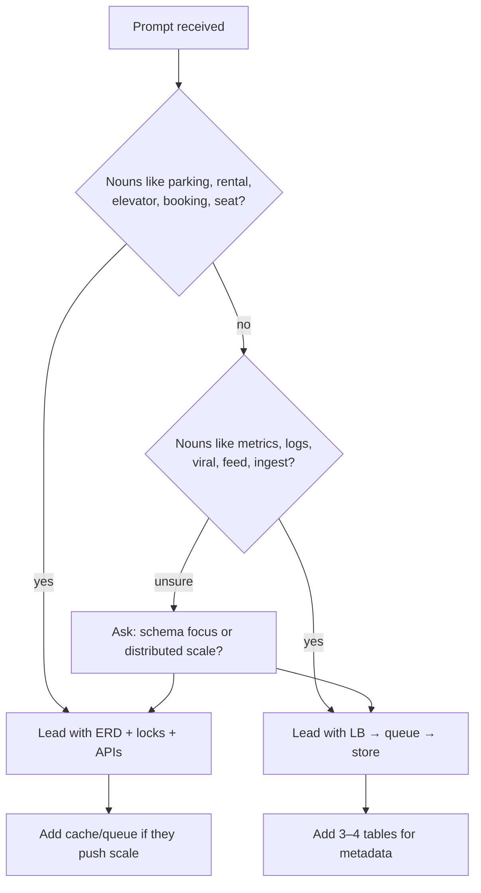
```mermaid
flowchart TD
  Q[Prompt received] --> A{Nouns like parking, rental,<br/>elevator, booking, seat?}
  A -->|yes| LLD[Lead with ERD + locks + APIs]
  A -->|no| B{Nouns like metrics, logs,<br/>viral, feed, ingest?}
  B -->|yes| HLD[Lead with LB → queue → store]
  B -->|unsure| Ask["Ask: schema focus or distributed scale?"]
  Ask --> LLD
  Ask --> HLD
  LLD --> Scale[Add cache/queue if they push scale]
  HLD --> Data[Add 3–4 tables for metadata]
```

### 0.5 Consistency cheat sheet

| Need | Tool | Say this |
|------|------|----------|
| One scarce row | `SELECT … FOR UPDATE` | “Serialize writers on the spot/vehicle/seat.” |
| High contention, fail-fast | Optimistic `version` CAS | “Loser gets 409 and retries.” |
| Time-range uniqueness | Exclusion / overlap check | “No two active bookings with overlapping ranges.” |
| Abandoned carts | Hold + TTL worker | “Soft reservation expires in 10 minutes.” |
| Client double-submit | Idempotency-Key | “Unique constraint on key; return first result.” |
| Cross-service | Outbox + webhook reconcile | “Payment and DB can diverge briefly; reconciler fixes.” |

### 0.6 Generic layered architecture (HLD backbone)

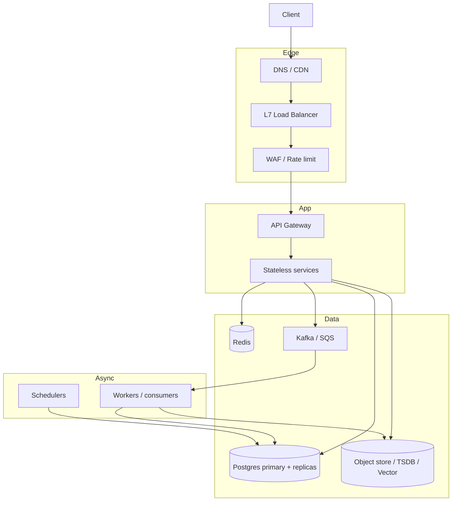
```mermaid
flowchart TB
  subgraph Edge
    DNS[DNS / CDN]
    LB[L7 Load Balancer]
    WAF[WAF / Rate limit]
  end
  subgraph App
    GW[API Gateway]
    Svc[Stateless services]
  end
  subgraph Data
    Cache[(Redis)]
    Q[Kafka / SQS]
    OLTP[(Postgres primary + replicas)]
    Obj[(Object store / TSDB / Vector)]
  end
  subgraph Async
    Workers[Workers / consumers]
    Cron[Schedulers]
  end
  Client --> DNS --> LB --> WAF --> GW --> Svc
  Svc --> Cache
  Svc --> OLTP
  Svc --> Q
  Svc --> Obj
  Q --> Workers
  Workers --> OLTP
  Workers --> Obj
  Cron --> OLTP
```

**Narrate the generic architecture — say this while pointing:**

- “The client crosses the edge in order: DNS/CDN finds and caches, the load balancer distributes, and the WAF rejects abusive traffic.”
- “The gateway is the application trust boundary; stateless services hold business logic and can scale horizontally.”
- “Redis is derived acceleration, Postgres is transactional truth, and the specialized object/series/vector store handles data that does not fit OLTP access patterns.”
- “Publishing to the queue means the caller does not wait for slow secondary work; workers retry idempotently and schedulers initiate time-based repair.”
- “The arrows back to stores are writes or reads with explicit timeout and retry policy. If a queue consumer dies, the durable message and idempotent sink let another consumer resume.”

### 0.7 What C3 interviewers actually score

A strong answer is not the one with the most infrastructure. It is the one in which each choice follows from a requirement and the correctness boundary is obvious.

- **Requirement control:** you turn an open prompt into actors, core journeys, scale, and explicit v1 exclusions.
- **Data modeling:** you name entities, keys, cardinalities, lifecycle states, and indexes that support the APIs.
- **Race-condition awareness:** you identify the exact contested row or logical resource and serialize only that boundary.
- **API semantics:** you cover retries, idempotency, pagination, status codes, and asynchronous completion.
- **NFR reasoning:** you attach numbers to latency, throughput, retention, freshness, and availability instead of saying “high scale.”
- **Trade-offs:** you say what is authoritative, what may be stale, and why the chosen compromise serves the user journey.
- **Failure behavior:** you explain crashes between steps, duplicate delivery, poison work, reconciliation, and observability.
- **Communication:** you narrate left-to-right, periodically summarize, and let the interviewer redirect the depth.

**What excellent sounds like:** “Search can lag five seconds because booking revalidates against the primary. The exclusion constraint, not the cache, prevents overlap. If payment succeeds and our process dies, the provider webhook reconciles the booking.” That sentence combines UX, consistency, schema, and failure recovery.

### 0.8 How to narrate any diagram (template)

**Say this before drawing:**

> “I’ll draw the synchronous user path first, then the source of truth, then asynchronous work. For every arrow I’ll state the payload and whether it is synchronous, durable, and retryable.”

Use this five-pass narration:

1. **Entry and trust boundary:** “The client enters through the gateway, which authenticates, authorizes, rate-limits, and attaches tenant context.”
2. **Synchronous path:** “The service validates the command and performs only the work needed before returning.” Trace one request all the way to its response.
3. **Source of truth:** point to one store and say, “This is authoritative for ___; caches and indexes can be rebuilt.”
4. **Async arrows:** identify the event key, delivery guarantee, consumer, retry policy, and DLQ or reconciliation path.
5. **Failure cut:** cover one arrow with your hand and ask, “If the process dies here, what durable fact lets us recover?”

**When you draw a box, say:** “Its single responsibility is ___. I split it because it scales/fails/changes independently.”  
**When you draw a database, say:** “It owns ___, is indexed by ___, and requires strong/eventual consistency because ___.”  
**When you draw a cache, say:** “It accelerates ___; it is not authoritative; TTL/invalidation/rebuild works like ___.”  
**When you draw a queue, say:** “It absorbs ___, partitions by ___, and provides at-least-once delivery, so the consumer is idempotent.”  
**When you draw an arrow, say:** “This carries ___; the caller waits/does not wait; timeout is ___; retry is safe because ___.”

For an **ERD**, narrate ownership first, then lifecycle rows, then constraints and indexes. For a **sequence diagram**, name the transaction boundary and the crash points. For a **state diagram**, state who is allowed to trigger each transition and how invalid transitions return `409` rather than silently mutating state.

### 0.9 Anti-patterns that sink a design round

- Starting with Kafka, Redis, or microservices before clarifying the product and scale.
- Drawing arrows without saying what data travels, whether the call blocks, or what happens on retry.
- Treating Redis, an index, or a replica as truth for a scarce-resource decision.
- Saying “exactly once” without an idempotency key, unique constraint, or atomic state transition.
- Listing tables without status lifecycles, foreign keys, uniqueness rules, or access-path indexes.
- Calling every operation eventually consistent; booking, authorization, and ownership changes usually need a stronger boundary.
- Splitting into many services that share one transaction, producing distributed failure without independent scaling value.
- Ignoring deletion, retention, tenant isolation, audit, and operational recovery in an enterprise prompt.
- Doing capacity arithmetic that never changes a design decision.
- Ending when the diagram is full instead of summarizing invariant, bottleneck, failure recovery, and next scale lever.

**Recovery phrase if you get lost:** “Let me re-anchor on the critical write. The authoritative row is ___, the invariant is ___, and the transaction is ___.”

### 0.10 LLD vs HLD talk tracks (sample transcripts)

**LLD sample (~150 words):**

> “I’ll treat this as a correctness-first booking problem. The actors are a customer and an operator; v1 supports search, a ten-minute hold, confirmation, cancellation, and fulfillment. Search may be stale, but two active bookings must never own the same resource. I’ll model Resource, Booking, Payment, and an optional Fulfillment row. Booking has a status enum, hold expiry, idempotency key, and version. The create endpoint accepts an idempotency key. In one transaction I lock the selected resource, verify its state or time-range availability, insert the held booking, and commit. A unique or exclusion constraint is the final backstop. Confirmation authorizes payment and changes held to confirmed with a conditional update. A worker expires abandoned holds. If payment succeeds but our process crashes, a webhook and reconciler complete or refund the operation. I would index resource plus status and the expiry scan. At larger scale I partition by location, while keeping each resource’s writes on one owner.”

**HLD sample (~150 words):**

> “I’ll treat this as a throughput and isolation problem. I first want peak events per second, event size, retention, query freshness, and tenant cardinality. Producers send compressed batches to an authenticated ingest gateway. The gateway validates quotas and writes to a durable log before returning `202`; Kafka absorbs reconnect storms and lets storage, alerting, and archival consumers move independently. I partition by tenant plus a spread key so a large customer cannot hot-spot one partition, while preserving only the ordering we actually need. Consumers bulk-write an idempotent time-series sink and object storage. Query traffic goes through a planner that selects raw or rollup data and caches repeated dashboard windows. At-least-once delivery means duplicates are expected, so event identity is part of the sink key. Backpressure appears as lag, which drives autoscaling and admission control. Per-tenant quotas, encryption, audit logs, regional residency, and replay tooling make this deployable in an enterprise environment.”

### 0.11 FDE angle (enterprise, agents, telemetry) — how to weave your story

An FDE answer connects software design to the customer’s operating environment. Add these points naturally; do not bolt on an “enterprise” box at the end.

- **Tenant and site boundaries:** put `tenant_id` on keys, partitioning, quotas, audit events, and cache keys. Mention regional residency when relevant.
- **Messy integration reality:** connectors are versioned, credentials rotate, schemas drift, and edge sites disconnect. Include validation, quarantine, replay, and backfill.
- **Operator workflow:** expose health, lag, last successful sync, dead letters, and a safe replay or override action—not only end-user APIs.
- **Telemetry:** define correlation IDs, structured events, SLOs, and dashboards for the hard invariant. Alert on business failure, not just CPU.
- **Agents:** tools are typed and allowlisted; reads respect ACLs; writes require policy checks, budgets, audit, and sometimes human approval.
- **Deployment:** start with a modular service and managed stores; justify every split with team, scale, security, or failure isolation.
- **Change management:** version schemas, prompts, models, rules, and APIs; canary or shadow risky changes; preserve rollback.

**Say this:** “Because this serves enterprise operations, I need to design the operator path too: tenant-scoped audit, connector health, replay, and a controlled override. That is what turns the happy-path diagram into a system a customer can run.”


---

## 1. Parking Lot (C3 actual) — Full Playbook

### 1.1 Problem restatement (say this)

> “Drivers find and reserve a spot (optionally by type), enter/exit a lot, and pay. The hard invariant is that one spot is never assigned to two active sessions.”

### 1.2 Clarify (ask out loud)

1. One lot or many lots / floors / gates?
2. Spot types: compact, large, EV, handicap?
3. Walk-in only, or advance reservation?
4. Pricing: flat, hourly, progressive? Payments in-app or at gate?
5. Scale: spots per lot (~500–5000)? Concurrent entries/min?
6. Need admin dashboards / occupancy analytics?

### 1.3 Assumptions for v1 (write them)

* Multi-floor lot, typed spots, advance hold + walk-in
* Strong consistency on assign; availability counts may lag ≤30s
* Card payment via Stripe-like provider
* Out of scope v2: dynamic pricing ML, ANPR cameras, valet

### 1.4 NFRs (with numbers)

| NFR | Target |
|-----|--------|
| Assign / check-in p95 | < 200 ms |
| Availability read p95 | < 100 ms (cached) |
| Consistency | Spot status strongly consistent |
| Availability | 99.9% for booking API |
| Hold TTL | 10 minutes |
| Peak | 50 assigns/sec per large lot (burst) |

### 1.5 High-level architecture

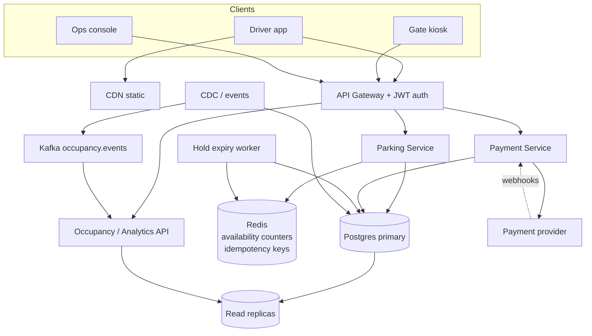
```mermaid
flowchart TB
  subgraph Clients
    Mobile[Driver app]
    Kiosk[Gate kiosk]
    Admin[Ops console]
  end

  Mobile --> CDN[CDN static]
  Mobile --> LB[API Gateway + JWT auth]
  Kiosk --> LB
  Admin --> LB

  LB --> PS[Parking Service]
  LB --> PayS[Payment Service]
  LB --> Occ[Occupancy / Analytics API]

  PS --> Redis[(Redis<br/>availability counters<br/>idempotency keys)]
  PS --> PG[(Postgres primary)]
  PG --> PGR[(Read replicas)]
  PayS --> Stripe[Payment provider]
  Stripe -.->|webhooks| PayS
  PayS --> PG

  Exp[Hold expiry worker] --> PG
  Exp --> Redis
  CDC[CDC / events] --> PG
  CDC --> Kafka[Kafka occupancy.events]
  Kafka --> Occ
  Occ --> PGR
```

**Architecture narration — say this while pointing:**

- Clients converge at the gateway so identity and rate limits are consistent.
- The Parking Service owns spot state; Payment is separate because provider callbacks and retries have a different lifecycle.
- Postgres is authoritative. Redis counters answer “roughly how many,” never “may I assign this exact spot?”
- CDC carries committed changes to Kafka; analytics consumes asynchronously, so reporting cannot block a gate.
- The expiry worker releases abandoned holds and repairs Redis from the committed transition.

### 1.6 Component responsibilities

| Component | Responsibility |
|-----------|----------------|
| Parking Service | Availability, holds, check-in/out, spot CAS |
| Payment Service | Intent/capture, webhook handling, refunds |
| Redis | Hot free-count by `(lot_id, type)`; idempotency |
| Postgres | Source of truth for spots & reservations |
| Expiry worker | `held → expired` when `hold_expires_at < now()` |
| Analytics | Near-real-time occupancy from events (eventual) |

### 1.7 ERD (detailed)

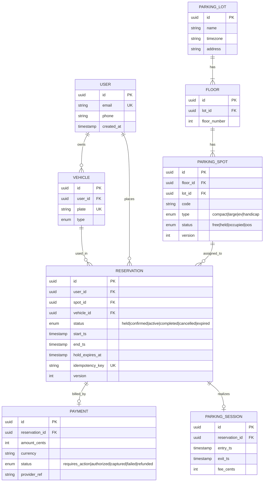
```mermaid
erDiagram
  USER ||--o{ VEHICLE : owns
  USER ||--o{ RESERVATION : places
  PARKING_LOT ||--|{ FLOOR : has
  FLOOR ||--|{ PARKING_SPOT : has
  PARKING_SPOT ||--o{ RESERVATION : assigned_to
  VEHICLE ||--o{ RESERVATION : used_in
  RESERVATION ||--o| PAYMENT : billed_by
  RESERVATION ||--o| PARKING_SESSION : realizes

  USER {
    uuid id PK
    string email UK
    string phone
    timestamp created_at
  }
  PARKING_LOT {
    uuid id PK
    string name
    string timezone
    string address
  }
  FLOOR {
    uuid id PK
    uuid lot_id FK
    int floor_number
  }
  PARKING_SPOT {
    uuid id PK
    uuid floor_id FK
    uuid lot_id FK
    string code
    enum type "compact|large|ev|handicap"
    enum status "free|held|occupied|oos"
    int version
  }
  VEHICLE {
    uuid id PK
    uuid user_id FK
    string plate UK
    enum type
  }
  RESERVATION {
    uuid id PK
    uuid user_id FK
    uuid spot_id FK
    uuid vehicle_id FK
    enum status "held|confirmed|active|completed|cancelled|expired"
    timestamp start_ts
    timestamp end_ts
    timestamp hold_expires_at
    string idempotency_key UK
    int version
  }
  PAYMENT {
    uuid id PK
    uuid reservation_id FK
    int amount_cents
    string currency
    enum status "requires_action|authorized|captured|failed|refunded"
    string provider_ref
  }
  PARKING_SESSION {
    uuid id PK
    uuid reservation_id FK
    timestamp entry_ts
    timestamp exit_ts
    int fee_cents
  }
```

**ERD narration — say this while pointing:**

- Lot and Floor describe physical containment; Spot is the scarce row.
- Reservation records intent and lifecycle; Session records actual entry and exit; Payment records money separately.
- The one-to-many arrows allow history, but active-state constraints prevent simultaneous ownership.
- Say the access paths aloud: search spots by lot/type/status, expire by status/hold_expires_at, and dedupe by idempotency_key.

### 1.8 Indexes

```sql
CREATE INDEX ON parking_spot (lot_id, type, status);
CREATE UNIQUE INDEX ON parking_spot (lot_id, code);
CREATE INDEX ON reservation (spot_id, status, start_ts);
CREATE UNIQUE INDEX ON reservation (idempotency_key);
CREATE INDEX ON reservation (status, hold_expires_at);  -- expiry worker
```

### 1.9 State machine

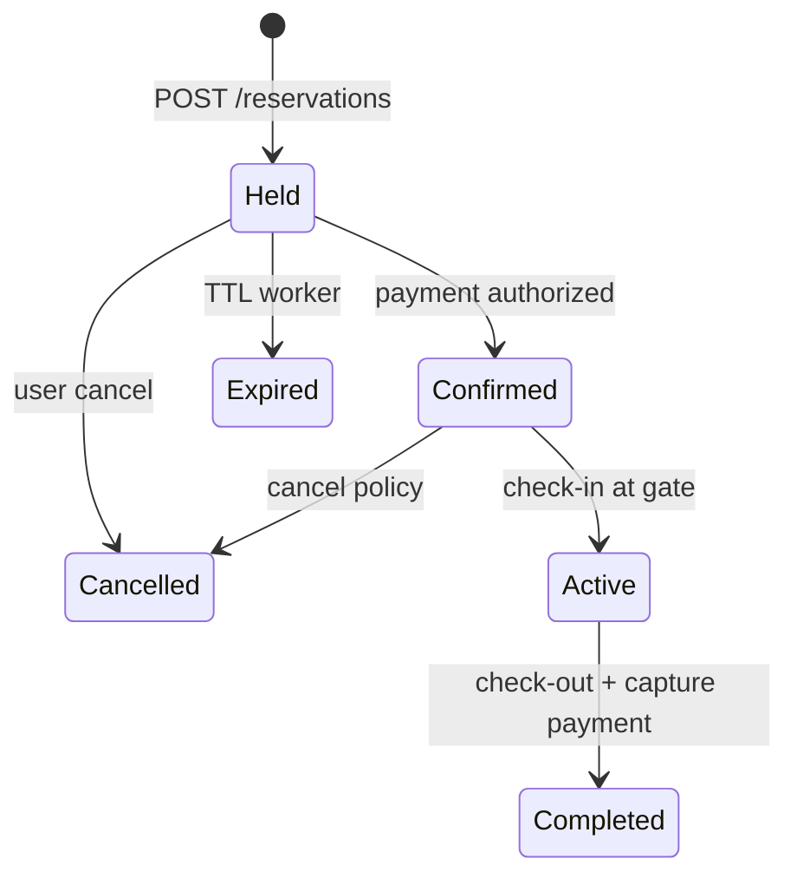
```mermaid
stateDiagram-v2
  [*] --> Held: POST /reservations
  Held --> Confirmed: payment authorized
  Held --> Expired: TTL worker
  Held --> Cancelled: user cancel
  Confirmed --> Active: check-in at gate
  Active --> Completed: check-out + capture payment
  Confirmed --> Cancelled: cancel policy
```

**State-diagram narration — say this while pointing:**

- Held is deliberately temporary and has three exits: payment, expiry, or cancellation.
- Only a confirmed reservation may check in; only an active session may complete.
- Each transition is a conditional update from the expected old state; invalid or repeated commands return the existing result or 409.

### 1.10 APIs (full JSON)

**Create hold**
```http
POST /v1/reservations
Idempotency-Key: 7f3c…
{ "lotId": "…", "vehicleId": "…", "spotType": "ev", "startTs": "…", "endTs": "…" }

201
{ "reservationId": "…", "spotId": "…", "spotCode": "B-214",
  "status": "held", "holdExpiresAt": "…", "pricingEstimateCents": 1200 }
```

**Check-in / out**
```http
POST /v1/reservations/{id}/check-in   → { "sessionId", "entryTs" }
POST /v1/reservations/{id}/check-out  → { "feeCents", "paymentStatus" }
```

**Availability**
```http
GET /v1/lots/{lotId}/availability?type=ev
→ { "free": 12, "held": 3, "occupied": 40, "asOf": "…", "cached": true }
```

### 1.11 Concurrency deep dive (draw this sequence)

```mermaid
sequenceDiagram
  autonumber
  participant A as Client A
  participant B as Client B
  participant API as Parking Service
  participant DB as Postgres

  A->>API: POST /reservations (EV)
  B->>API: POST /reservations (EV)
  API->>DB: BEGIN
  API->>DB: SELECT id,version FROM parking_spot<br/>WHERE lot=? AND type='ev' AND status='free'<br/>ORDER BY id FOR UPDATE SKIP LOCKED LIMIT 1
  Note over DB: A gets spot B-214
  API->>DB: UPDATE spot SET status='held', version=version+1
  API->>DB: INSERT reservation status=held
  API->>DB: COMMIT
  API-->>A: 201 B-214

  API->>DB: BEGIN
  API->>DB: SELECT … FOR UPDATE SKIP LOCKED
  alt another free EV exists
    API->>DB: hold that spot; COMMIT
    API-->>B: 201 other spot
  else none left
    API->>DB: ROLLBACK
    API-->>B: 409 NO_SPOTS
  end
```

**Concurrency-sequence narration — say this while pointing:**

- Both requests race, but the database lock chooses one owner of B-214.
- `SKIP LOCKED` lets the second request inspect another row instead of waiting behind the first.
- Spot update and reservation insert share one transaction, so no visible state has a spot held without its reservation.
- A rollback or 409 is a normal business outcome, not a server error.

**Why `SKIP LOCKED`:** under burst, waiters don’t pile up on the same row; they take the next free spot.

**Optimistic alternative (mention):**
```sql
UPDATE parking_spot SET status='held', version=version+1
WHERE id=$1 AND status='free' AND version=$2;
-- rowcount 0 → conflict → retry pick
```

### 1.12 Redis availability counters

```text
INCR lot:{id}:free:ev   on free←held/occupied reverse
GET  lot:{id}:free:ev   for availability API
```
Rebuild from SQL on mismatch; cache is an optimization, not source of truth.

### 1.13 Pricing & payment failure

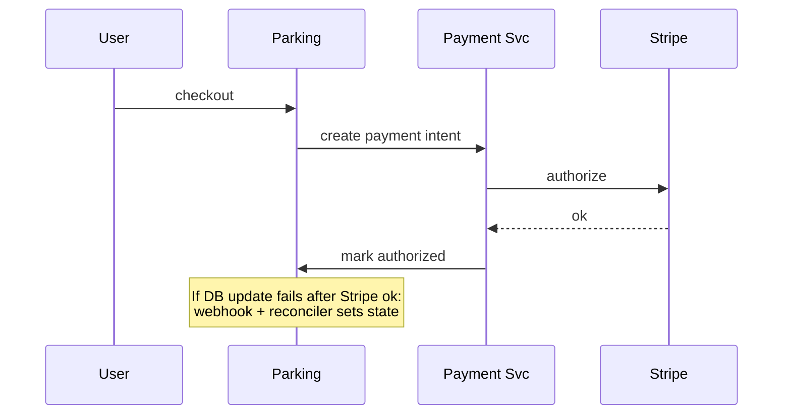
```mermaid
sequenceDiagram
  participant U as User
  participant P as Parking
  participant Pay as Payment Svc
  participant S as Stripe

  U->>P: checkout
  P->>Pay: create payment intent
  Pay->>S: authorize
  S-->>Pay: ok
  Pay->>P: mark authorized
  Note over P: If DB update fails after Stripe ok:<br/>webhook + reconciler sets state
```

**Payment-sequence narration — say this while pointing:**

- Authorization crosses a non-transactional provider boundary.
- The local state change can fail after provider success, so the webhook is a durable second path.
- A reconciler compares provider references with payment rows and either completes the state or issues compensation.

### 1.14 Scale roadmap

| Phase | Change |
|-------|--------|
| v1 | Single Postgres, Redis counters, one lot |
| v2 | Read replicas for analytics; partition reservations by month |
| v3 | Shard by `lot_id` (each mega-lot its own DB); gate kiosks offline queue |

### 1.15 Follow-up questions & answers

| Interviewer | You |
|-------------|-----|
| How do you prevent double assign? | Row lock / CAS on spot status in one transaction with insert. |
| Availability wrong? | Redis can drift; SQL is truth; periodic reconcile. |
| EV charger also scarce? | Model charger as second resource or spot subtype with own lock. |
| Overstay? | Session exit fee job; status stays occupied until paid. |

### 1.16 Closing script (30 sec)

> “Source of truth is Postgres with `FOR UPDATE SKIP LOCKED` on free spots. Holds expire via worker. Redis only accelerates availability reads. Payments are authorized on confirm and reconciled by webhook if we crash mid-flight.”


### 1.A What the interviewer is grading

- Frame Parking Lot around the user journey and explicitly name the authoritative state.
- Model the core resource—parking spot—with lifecycle, keys, and access-path indexes.
- State the hard invariant: a physical spot can belong to at most one non-terminal reservation or active session.
- Show retry-safe command APIs with idempotency keys and meaningful conflict responses.
- Choose NFRs that drive the design: assignment p95 under 200 ms; cached counts may lag 30 seconds.
- Explain the trade-off: serialize spot assignment while keeping occupancy analytics eventual.
- Walk through failure recovery for a gate retry or two drivers racing for the last EV spot.
- Add tenant isolation, auditability, metrics, and an operator repair path where enterprise use requires them.

### 1.B How to open (60 seconds)

**Say this:**

> “I’ll design Parking Lot by first fixing the v1 journey, scale, and consistency boundary. The critical resource is parking spot, and my non-negotiable invariant is that a physical spot can belong to at most one non-terminal reservation or active session. I’ll model the durable state and APIs first, then draw the synchronous path and asynchronous work. I’ll assume assignment p95 under 200 ms; cached counts may lag 30 seconds. The key trade-off is to serialize spot assignment while keeping occupancy analytics eventual. After the happy path I’ll test retries, concurrency, and a gate retry or two drivers racing for the last EV spot. If you prefer, I can go deeper on schema and races or on distributed scaling.”

### 1.C Deep explanation of the hard invariant

**Invariant:** A physical spot can belong to at most one non-terminal reservation or active session.

This exists because a gate retry or two drivers racing for the last EV spot can make two valid-looking requests overlap in time. A read-then-write check in application code is insufficient: both requests can observe the old state before either commits. If the invariant fails, downstream compensation is often impossible or expensive—two people own one scarce thing, unauthorized context leaks, a side effect runs twice, or historical data becomes untrustworthy.

Defend it at the narrowest authoritative boundary: Postgres spot and reservation rows. Use one atomic conditional update, row lock, uniqueness/exclusion constraint, sequence allocator, or lease according to the model. Treat a constraint conflict as an expected `409`, make retry identity durable, and keep cache/index state outside the proof. Then add an invariant monitor and repair workflow; the database guard prevents known races, while telemetry catches bugs and operational drift.

### 1.D Common mistakes that fail the round

- Drawing components before saying what is in scope and what must be correct.
- Using a cache lookup as proof that a contested resource is available.
- Checking state and updating it in separate, unprotected operations.
- Ignoring duplicate client requests, queue redelivery, and provider callbacks.
- Naming a database without giving keys, constraints, indexes, or retention.
- Scaling every component before estimating the actual bottleneck.

### 1.E Follow-up Q&A

**Q: Why not make the cache authoritative?**  
**A:** The cache optimizes latency but can be stale, evicted, or partitioned. Postgres spot and reservation rows owns the decision; cache state is derived and repairable.

**Q: What happens when the same request is retried?**  
**A:** The caller sends a stable idempotency key scoped to the actor and operation. A unique constraint stores the first outcome, so retries return that result instead of repeating the mutation.

**Q: Where is the transaction boundary?**  
**A:** It surrounds the minimum state needed to preserve a physical spot can belong to at most one non-terminal reservation or active session. External calls stay outside; their results are reconciled with an outbox, callback, or explicit compensation.

**Q: How do you scale this ten times?**  
**A:** Measure the hot access path first, then partition by the natural ownership key for parking spot. Add caches or projections for reads while keeping all writes for one invariant on one authoritative owner.

**Q: How do you know it is healthy?**  
**A:** Track latency and error SLOs plus a business-integrity metric for rejected conflicts, duplicate suppression, stale work, and reconciliation age. Correlation IDs connect API, event, worker, and external-provider traces.

**Q: What changes for enterprise multi-tenancy?**  
**A:** Put tenant identity in authorization, keys, partitions, quotas, encryption context, and audit logs. No cache, queue message, search filter, or operator tool may omit tenant scope.

### 1.F Close script (30–45 seconds)

**Say this:**

> “The design keeps Postgres spot and reservation rows authoritative for parking spot. The hard guarantee is that a physical spot can belong to at most one non-terminal reservation or active session, enforced atomically rather than inferred from cache. The main path meets assignment p95 under 200 ms; cached counts may lag 30 seconds, while asynchronous work absorbs retries and isolates dependencies. I would watch the invariant-conflict rate, end-to-end latency, backlog, and reconciliation age. The first scale lever is partitioning by the resource owner; the first enterprise additions are tenant-scoped authorization, audit, quotas, and operator replay.”


---

## 2. Car Rental (Enterprise) (C3 actual) — Full Playbook

### 2.1 Restatement

> “Customers search vehicles by location/class/dates, hold one, pay, pick up and return. Invariant: no overlapping confirmed rentals for the same vehicle.”

### 2.2 Clarify

* One-way returns? Cross-branch?
* Insurance / add-ons / young-driver fees?
* Instant book vs request-to-book?
* Fleet size (10k cars)? Booking lead time?
* Corporate accounts / multi-driver?

### 2.3 NFRs

| NFR | Target |
|-----|--------|
| Search p95 | < 300 ms |
| Create booking p95 | < 400 ms |
| Double-book risk | Zero for confirmed |
| Hold TTL | 15 min |
| Peak search | 2k QPS |
| Peak book | 100 QPS |

### 2.4 Architecture

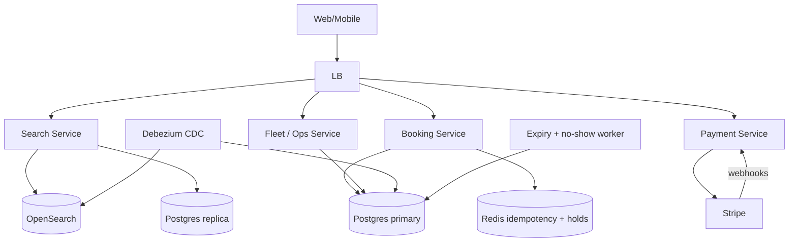
```mermaid
flowchart TB
  Web[Web/Mobile] --> LB
  LB --> Search[Search Service]
  LB --> Booking[Booking Service]
  LB --> Fleet[Fleet / Ops Service]
  LB --> Pay[Payment Service]

  Search --> OS[(OpenSearch)]
  Search --> Rep[(Postgres replica)]
  Booking --> Pri[(Postgres primary)]
  Booking --> Redis[(Redis idempotency + holds)]
  Fleet --> Pri
  Pay --> Stripe
  Stripe -->|webhooks| Pay

  CDC[Debezium CDC] --> Pri
  CDC --> OS
  Worker[Expiry + no-show worker] --> Pri
```

**Architecture narration — say this while pointing:**

- Web and mobile share a gateway, then reads and writes split.
- Search reads OpenSearch or a replica for filters and scale; Booking writes only the primary.
- CDC updates the search projection after commit, making staleness explicit and repairable.
- Payment webhooks and expiry workers are retryable asynchronous actors.

**Why split Search vs Booking?** Different scaling and consistency: search may be slightly stale; booking must be correct.

### 2.5 ERD

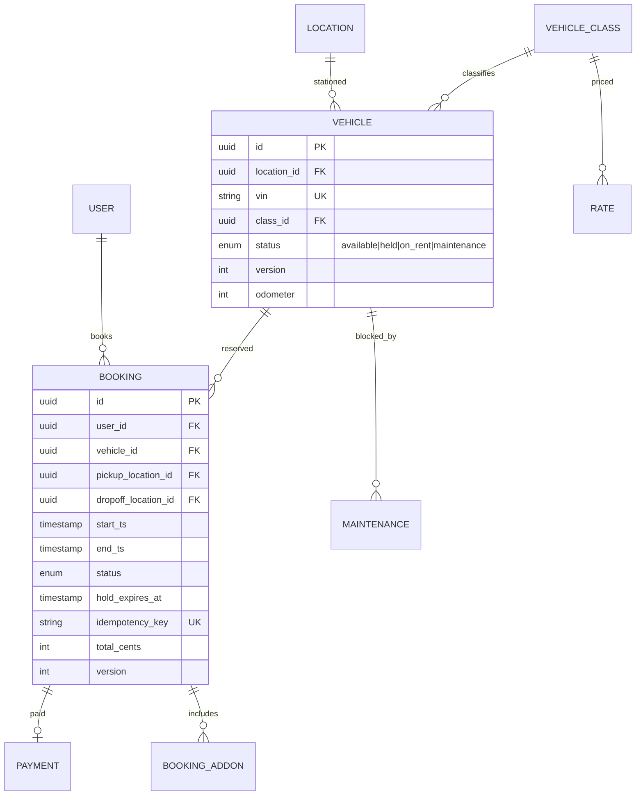
```mermaid
erDiagram
  USER ||--o{ BOOKING : books
  LOCATION ||--o{ VEHICLE : stationed
  VEHICLE_CLASS ||--o{ VEHICLE : classifies
  VEHICLE_CLASS ||--o{ RATE : priced
  VEHICLE ||--o{ BOOKING : reserved
  VEHICLE ||--o{ MAINTENANCE : blocked_by
  BOOKING ||--o| PAYMENT : paid
  BOOKING ||--o{ BOOKING_ADDON : includes

  VEHICLE {
    uuid id PK
    uuid location_id FK
    string vin UK
    uuid class_id FK
    enum status "available|held|on_rent|maintenance"
    int version
    int odometer
  }
  BOOKING {
    uuid id PK
    uuid user_id FK
    uuid vehicle_id FK
    uuid pickup_location_id FK
    uuid dropoff_location_id FK
    timestamp start_ts
    timestamp end_ts
    enum status
    timestamp hold_expires_at
    string idempotency_key UK
    int total_cents
    int version
  }
```

**ERD narration — say this while pointing:**

- Vehicle is the allocatable asset; VehicleClass and Rate describe what customers search and pay for.
- Booking snapshots vehicle, locations, interval, status, and price so later catalog changes do not rewrite history.
- Maintenance is another interval that blocks availability and must participate in conflict checks.

### 2.6 Overlap invariant (critical diagram)

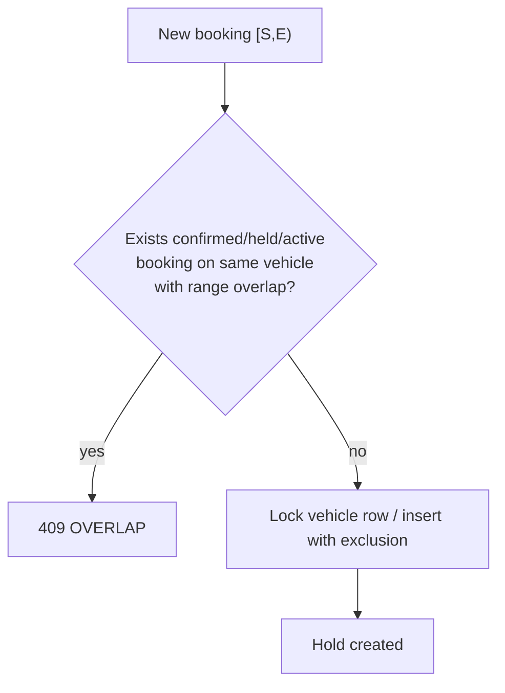
```mermaid
flowchart TD
  New["New booking [S,E)"] --> Q{Exists confirmed/held/active<br/>booking on same vehicle<br/>with range overlap?}
  Q -->|yes| Reject[409 OVERLAP]
  Q -->|no| Lock[Lock vehicle row / insert with exclusion]
  Lock --> OK[Hold created]
```

**Invariant-flow narration — say this while pointing:**

- The overlap predicate is `existing.start < new.end AND existing.end > new.start` for half-open intervals.
- The precheck improves error messages, but only the lock or exclusion constraint closes the race.
- A conflict becomes 409; callers may choose another vehicle.

**Postgres exclusion (strong answer):**
```sql
ALTER TABLE booking ADD CONSTRAINT booking_no_overlap
EXCLUDE USING gist (
  vehicle_id WITH =,
  tstzrange(start_ts, end_ts, '[)') WITH &&
) WHERE (status IN ('held','confirmed','active'));
```

### 2.7 Booking sequence

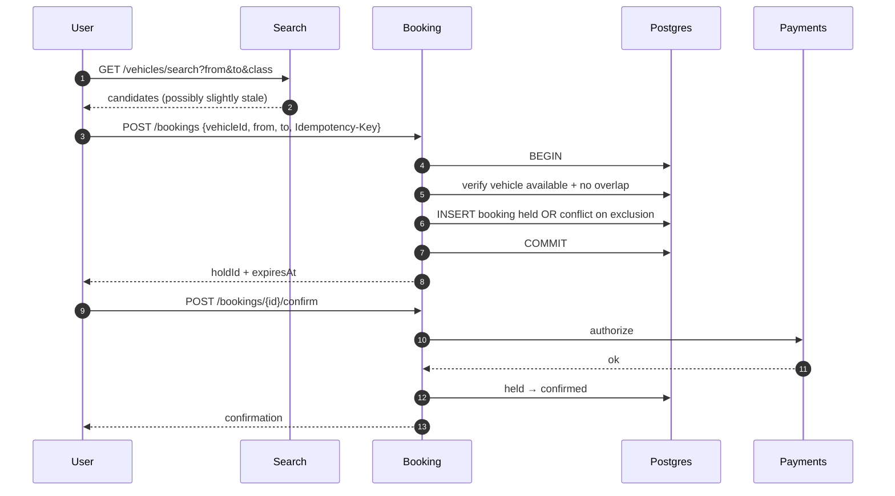
```mermaid
sequenceDiagram
  autonumber
  participant U as User
  participant S as Search
  participant B as Booking
  participant DB as Postgres
  participant P as Payments

  U->>S: GET /vehicles/search?from&to&class
  S-->>U: candidates (possibly slightly stale)
  U->>B: POST /bookings {vehicleId, from, to, Idempotency-Key}
  B->>DB: BEGIN
  B->>DB: verify vehicle available + no overlap
  B->>DB: INSERT booking held OR conflict on exclusion
  B->>DB: COMMIT
  B-->>U: holdId + expiresAt
  U->>B: POST /bookings/{id}/confirm
  B->>P: authorize
  P-->>B: ok
  B->>DB: held → confirmed
  B-->>U: confirmation
```

**Booking-sequence narration — say this while pointing:**

- Search returns candidates, not promises.
- Create hold enters a database transaction and lets the exclusion constraint arbitrate races.
- Payment happens after the short hold exists; confirmation is conditional on held and unexpired.
- Webhook reconciliation handles the crash after authorization.

### 2.8 APIs

```http
GET  /v1/vehicles/search?locationId&class&from&to&page
POST /v1/bookings
     { vehicleId, pickupLocationId, dropoffLocationId, from, to, addOns[], idempotencyKey }
POST /v1/bookings/{id}/confirm
POST /v1/bookings/{id}/cancel
POST /v1/bookings/{id}/extend { newEndTs }
POST /v1/bookings/{id}/pickup  | /return
GET  /v1/bookings/{id}
```

### 2.9 State machine

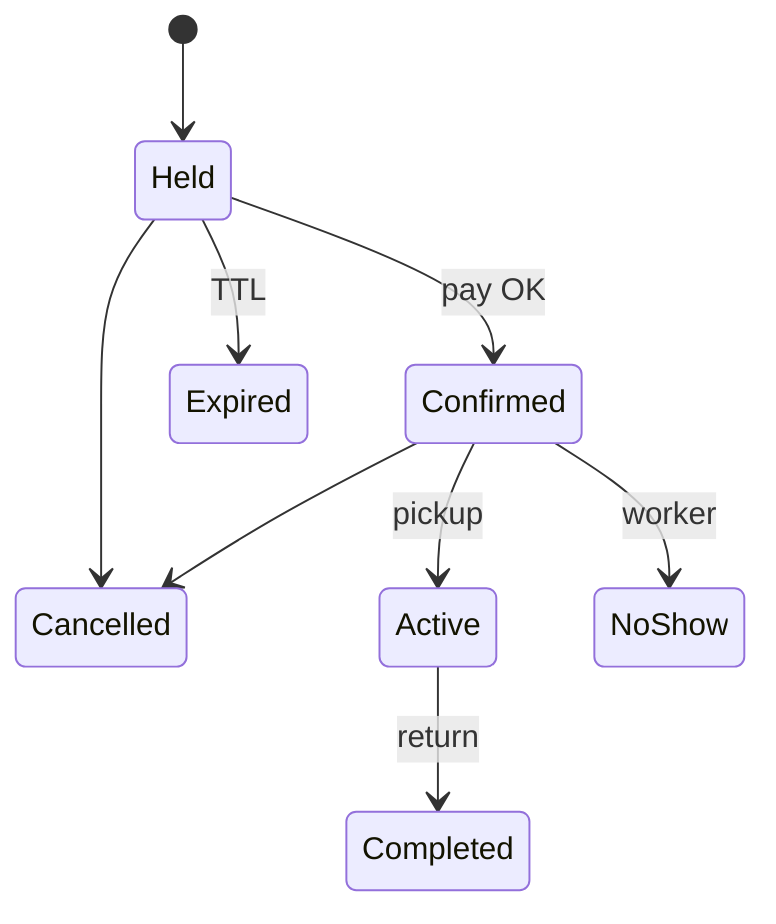
```mermaid
stateDiagram-v2
  [*] --> Held
  Held --> Confirmed: pay OK
  Held --> Expired: TTL
  Held --> Cancelled
  Confirmed --> Active: pickup
  Active --> Completed: return
  Confirmed --> NoShow: worker
  Confirmed --> Cancelled
```

**State-diagram narration — say this while pointing:**

- Held owns inventory temporarily; Confirmed owns it until pickup or cancellation.
- Active represents custody and Completed preserves history.
- No-show and expiry are worker-driven transitions with explicit policies.

### 2.10 Scale & search freshness

* Indexer lag 1–5s acceptable if booking always re-validates in SQL.
* On book success: publish `vehicle_blocked` event to remove from search quickly.
* Shard bookings by `pickup_location_id` at very large scale.

### 2.11 Follow-ups

| Q | A |
|---|---|
| Same car, different branches? | Track `location_id`; one-way creates relocation job. |
| Maintenance window? | `MAINTENANCE` table participates in overlap checks. |
| Price change after hold? | Freeze rate snapshot on hold row. |

### 2.12 Close

> “Search is optimized for read scale and can be briefly stale. Booking re-checks and enforces a GiST exclusion on vehicle + time range so double rental is impossible. Holds TTL out; payments reconcile via webhooks.”


### 2.A What the interviewer is grading

- Frame Car Rental around the user journey and explicitly name the authoritative state.
- Model the core resource—vehicle-time interval—with lifecycle, keys, and access-path indexes.
- State the hard invariant: one vehicle has no overlapping held, confirmed, or active rental intervals.
- Show retry-safe command APIs with idempotency keys and meaningful conflict responses.
- Choose NFRs that drive the design: search p95 under 300 ms; booking correctness is strict.
- Explain the trade-off: allow a stale search index but revalidate every booking on the primary.
- Walk through failure recovery for two customers selecting the same car or a payment callback arriving late.
- Add tenant isolation, auditability, metrics, and an operator repair path where enterprise use requires them.

### 2.B How to open (60 seconds)

**Say this:**

> “I’ll design Car Rental by first fixing the v1 journey, scale, and consistency boundary. The critical resource is vehicle-time interval, and my non-negotiable invariant is that one vehicle has no overlapping held, confirmed, or active rental intervals. I’ll model the durable state and APIs first, then draw the synchronous path and asynchronous work. I’ll assume search p95 under 300 ms; booking correctness is strict. The key trade-off is to allow a stale search index but revalidate every booking on the primary. After the happy path I’ll test retries, concurrency, and two customers selecting the same car or a payment callback arriving late. If you prefer, I can go deeper on schema and races or on distributed scaling.”

### 2.C Deep explanation of the hard invariant

**Invariant:** One vehicle has no overlapping held, confirmed, or active rental intervals.

This exists because two customers selecting the same car or a payment callback arriving late can make two valid-looking requests overlap in time. A read-then-write check in application code is insufficient: both requests can observe the old state before either commits. If the invariant fails, downstream compensation is often impossible or expensive—two people own one scarce thing, unauthorized context leaks, a side effect runs twice, or historical data becomes untrustworthy.

Defend it at the narrowest authoritative boundary: Postgres booking exclusion constraint. Use one atomic conditional update, row lock, uniqueness/exclusion constraint, sequence allocator, or lease according to the model. Treat a constraint conflict as an expected `409`, make retry identity durable, and keep cache/index state outside the proof. Then add an invariant monitor and repair workflow; the database guard prevents known races, while telemetry catches bugs and operational drift.

### 2.D Common mistakes that fail the round

- Drawing components before saying what is in scope and what must be correct.
- Using a cache lookup as proof that a contested resource is available.
- Checking state and updating it in separate, unprotected operations.
- Ignoring duplicate client requests, queue redelivery, and provider callbacks.
- Naming a database without giving keys, constraints, indexes, or retention.
- Scaling every component before estimating the actual bottleneck.

### 2.E Follow-up Q&A

**Q: Why not make the cache authoritative?**  
**A:** The cache optimizes latency but can be stale, evicted, or partitioned. Postgres booking exclusion constraint owns the decision; cache state is derived and repairable.

**Q: What happens when the same request is retried?**  
**A:** The caller sends a stable idempotency key scoped to the actor and operation. A unique constraint stores the first outcome, so retries return that result instead of repeating the mutation.

**Q: Where is the transaction boundary?**  
**A:** It surrounds the minimum state needed to preserve one vehicle has no overlapping held, confirmed, or active rental intervals. External calls stay outside; their results are reconciled with an outbox, callback, or explicit compensation.

**Q: How do you scale this ten times?**  
**A:** Measure the hot access path first, then partition by the natural ownership key for vehicle-time interval. Add caches or projections for reads while keeping all writes for one invariant on one authoritative owner.

**Q: How do you know it is healthy?**  
**A:** Track latency and error SLOs plus a business-integrity metric for rejected conflicts, duplicate suppression, stale work, and reconciliation age. Correlation IDs connect API, event, worker, and external-provider traces.

**Q: What changes for enterprise multi-tenancy?**  
**A:** Put tenant identity in authorization, keys, partitions, quotas, encryption context, and audit logs. No cache, queue message, search filter, or operator tool may omit tenant scope.

### 2.F Close script (30–45 seconds)

**Say this:**

> “The design keeps Postgres booking exclusion constraint authoritative for vehicle-time interval. The hard guarantee is that one vehicle has no overlapping held, confirmed, or active rental intervals, enforced atomically rather than inferred from cache. The main path meets search p95 under 300 ms; booking correctness is strict, while asynchronous work absorbs retries and isolates dependencies. I would watch the invariant-conflict rate, end-to-end latency, backlog, and reconciliation age. The first scale lever is partitioning by the resource owner; the first enterprise additions are tenant-scoped authorization, audit, quotas, and operator replay.”


---

## 3. Metrics Logging & Aggregation (C3 actual) — Full Playbook

### 3.1 Restatement

> “Services emit high-cardinality time series; we ingest reliably under spikes, store efficiently, and serve dashboard queries with rollups.”

### 3.2 Clarify

* Push agents vs pull Prometheus-style?
* Cardinality (unique series)? Histograms?
* Retention: raw 7d, 1m for 90d, 1h for 2y?
* Multi-tenant isolation? Alerting in scope?

### 3.3 Capacity sketch (say numbers)

```text
20k hosts × 150 metrics × 1 sample/min
= 3e6 samples/min ≈ 50k samples/sec average
× 5 peak = 250k samples/sec
≈ never write each sample as an OLTP row
```

### 3.4 Architecture (detailed)

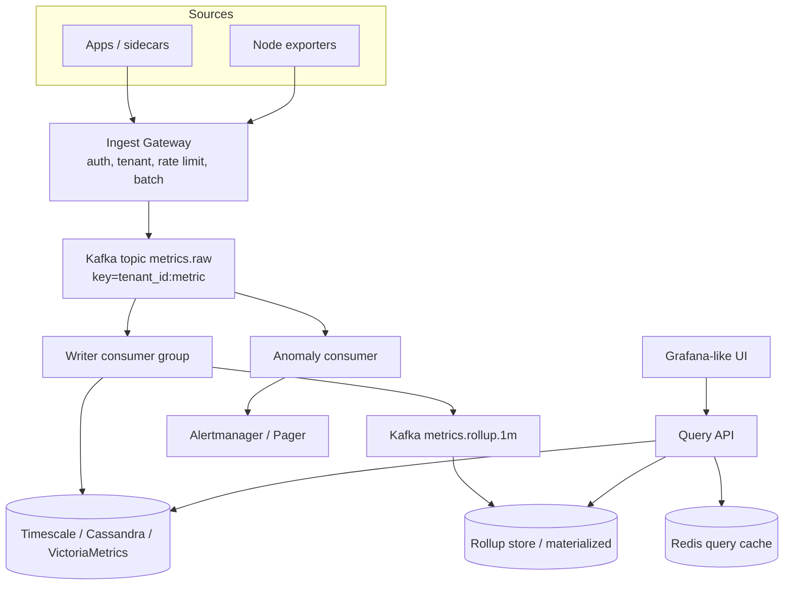
```mermaid
flowchart TB
  subgraph Sources
    App[Apps / sidecars]
    Host[Node exporters]
  end

  App --> GW[Ingest Gateway<br/>auth, tenant, rate limit, batch]
  Host --> GW
  GW --> K1[Kafka topic metrics.raw<br/>key=tenant_id:metric]

  K1 --> W[Writer consumer group]
  K1 --> A[Anomaly consumer]
  W --> TS[(Timescale / Cassandra / VictoriaMetrics)]
  W --> K2[Kafka metrics.rollup.1m]
  K2 --> R[(Rollup store / materialized)]
  A --> Alert[Alertmanager / Pager]

  UI[Grafana-like UI] --> Q[Query API]
  Q --> Cache[(Redis query cache)]
  Q --> R
  Q --> TS
```

**Architecture narration — say this while pointing:**

- Agents batch points at the gateway; the gateway authenticates tenant, enforces quota, and durably publishes.
- Kafka is the shock absorber and replay boundary, not merely a transport.
- Independent consumers write raw data, compute rollups, and evaluate anomalies.
- The query API chooses raw versus rollup and uses Redis only for repeated windows.

### 3.5 Why each piece

| Piece | Why |
|-------|-----|
| Gateway | Auth, tenant quotas, compression, 202 async accept |
| Kafka | Buffer spikes; replay; fan-out to writers + alertors |
| Partition key | Avoid hot partitions; keep tenant ordering if needed |
| TSDB | Wide/time-optimized writes; compression |
| Rollups | Dashboard queries must not scan raw forever |
| Cache | Repeated dashboard panels |

### 3.6 Ingest sequence

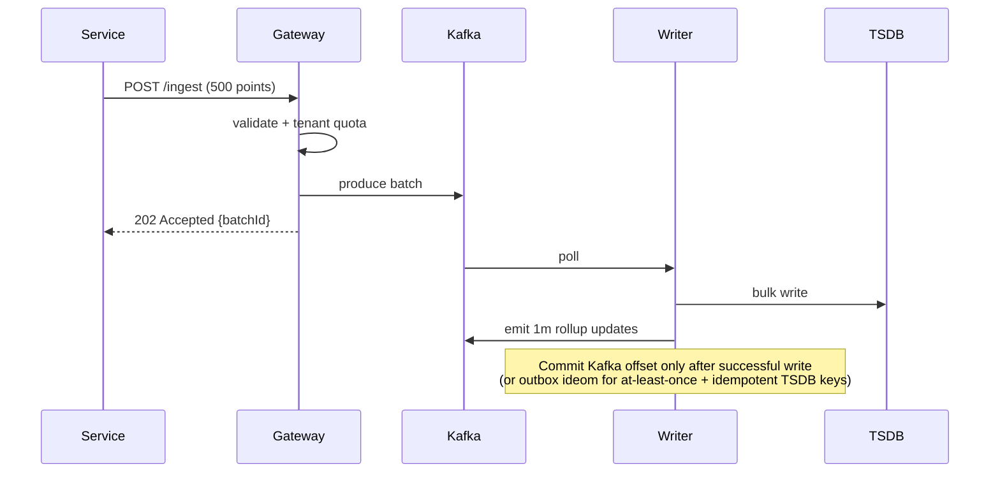
```mermaid
sequenceDiagram
  participant S as Service
  participant G as Gateway
  participant K as Kafka
  participant W as Writer
  participant T as TSDB

  S->>G: POST /ingest (500 points)
  G->>G: validate + tenant quota
  G->>K: produce batch
  G-->>S: 202 Accepted {batchId}
  K->>W: poll
  W->>T: bulk write
  W->>K: emit 1m rollup updates
  Note over W: Commit Kafka offset only after successful write<br/>(or outbox ideom for at-least-once + idempotent TSDB keys)
```

**Ingest-sequence narration — say this while pointing:**

- The service receives 202 only after Kafka acknowledges the batch.
- The writer bulk-writes and commits its offset after the sink succeeds.
- Because a crash can repeat the batch, series/event identity makes the sink idempotent.
- Lag, DLQ count, and end-to-end freshness are the operational signals.

### 3.7 Data model

```text
Raw:    (tenant_id, metric, tags_hash, ts, value, type)
Rollup: (tenant_id, metric, tags_hash, window_ts, count, sum, min, max, haves)
Series catalog: (tenant_id, metric, tags_json, created_at)  -- control cardinality
```

**Cardinality guard:** reject or sample series above tenant budget.

### 3.8 Query API

```http
POST /v1/query
{ "tenantId": "…", "metric": "http_req_latency_ms",
  "tags": {"route":"/checkout"}, "from":"…", "to":"…", "step":"1m",
  "agg":"p95" }
```

Query planner: if `step>=1m` and range>2h → rollup store; else raw.

### 3.9 Failure & consistency

* At-least-once from Kafka → idempotent writes with `(series_id, ts)` unique.
* Prefer **availability** on ingest; dashboards lag seconds.
* Poison batches → DLQ topic + alert.

### 3.10 Close

> “Gateway + Kafka protect storage from bursts. TSDB holds raw hot data; rollups serve dashboards. We explicitly do not use relational inserts per point.”


### 3.A What the interviewer is grading

- Frame Metrics Platform around the user journey and explicitly name the authoritative state.
- Model the core resource—metric event identity—with lifecycle, keys, and access-path indexes.
- State the hard invariant: an accepted metric batch is durably retained and duplicate delivery cannot inflate a series.
- Show retry-safe command APIs with idempotency keys and meaningful conflict responses.
- Choose NFRs that drive the design: 250k samples/sec peak; seconds of dashboard lag are acceptable.
- Explain the trade-off: favor available asynchronous ingest while bounding cardinality and query cost.
- Walk through failure recovery for producer retries, reconnect storms, poison batches, or lagging consumers.
- Add tenant isolation, auditability, metrics, and an operator repair path where enterprise use requires them.

### 3.B How to open (60 seconds)

**Say this:**

> “I’ll design Metrics Platform by first fixing the v1 journey, scale, and consistency boundary. The critical resource is metric event identity, and my non-negotiable invariant is that an accepted metric batch is durably retained and duplicate delivery cannot inflate a series. I’ll model the durable state and APIs first, then draw the synchronous path and asynchronous work. I’ll assume 250k samples/sec peak; seconds of dashboard lag are acceptable. The key trade-off is to favor available asynchronous ingest while bounding cardinality and query cost. After the happy path I’ll test retries, concurrency, and producer retries, reconnect storms, poison batches, or lagging consumers. If you prefer, I can go deeper on schema and races or on distributed scaling.”

### 3.C Deep explanation of the hard invariant

**Invariant:** An accepted metric batch is durably retained and duplicate delivery cannot inflate a series.

Accepted batches must survive a gateway crash, and replay must not double-count a sample. Without that guarantee, a successful `202` can correspond to lost monitoring data, or an at-least-once retry can create false alerts and corrupt aggregates. Cardinality is part of correctness too: an unbounded tag such as request ID can exhaust the platform for every tenant.

Return `202` only after Kafka acknowledges the record. Give each point or batch a stable event identity and make `(tenant_id, series_id, event_id)` or `(series_id, timestamp, source_sequence)` idempotent at the sink. Commit offsets only after durable bulk write, compute rollups from deduplicated input, and enforce per-tenant series budgets at ingest. Defend this with accepted-to-stored lag, duplicate rate, dropped-series count, and replay tests.

### 3.D Common mistakes that fail the round

- Drawing components before saying what is in scope and what must be correct.
- Using a cache lookup as proof that a contested resource is available.
- Checking state and updating it in separate, unprotected operations.
- Ignoring duplicate client requests, queue redelivery, and provider callbacks.
- Naming a database without giving keys, constraints, indexes, or retention.
- Scaling every component before estimating the actual bottleneck.

### 3.E Follow-up Q&A

**Q: Why not make the cache authoritative?**  
**A:** The cache optimizes latency but can be stale, evicted, or partitioned. Kafka retention plus idempotent tsdb keys owns the decision; cache state is derived and repairable.

**Q: What happens when the same request is retried?**  
**A:** The caller sends a stable idempotency key scoped to the actor and operation. A unique constraint stores the first outcome, so retries return that result instead of repeating the mutation.

**Q: Where is the transaction boundary?**  
**A:** It surrounds the minimum state needed to preserve an accepted metric batch is durably retained and duplicate delivery cannot inflate a series. External calls stay outside; their results are reconciled with an outbox, callback, or explicit compensation.

**Q: How do you scale this ten times?**  
**A:** Measure the hot access path first, then partition by the natural ownership key for metric event identity. Add caches or projections for reads while keeping all writes for one invariant on one authoritative owner.

**Q: How do you know it is healthy?**  
**A:** Track latency and error SLOs plus a business-integrity metric for rejected conflicts, duplicate suppression, stale work, and reconciliation age. Correlation IDs connect API, event, worker, and external-provider traces.

**Q: What changes for enterprise multi-tenancy?**  
**A:** Put tenant identity in authorization, keys, partitions, quotas, encryption context, and audit logs. No cache, queue message, search filter, or operator tool may omit tenant scope.

### 3.F Close script (30–45 seconds)

**Say this:**

> “The design keeps Kafka retention plus idempotent TSDB keys authoritative for metric event identity. The hard guarantee is that an accepted metric batch is durably retained and duplicate delivery cannot inflate a series, enforced atomically rather than inferred from cache. The main path meets 250k samples/sec peak; seconds of dashboard lag are acceptable, while asynchronous work absorbs retries and isolates dependencies. I would watch the invariant-conflict rate, end-to-end latency, backlog, and reconciliation age. The first scale lever is partitioning by the resource owner; the first enterprise additions are tenant-scoped authorization, audit, quotas, and operator replay.”


---

## 4. Pastebin / Viral Text (C3 actual) — Full Playbook

### 4.1 Restatement

> “Users publish text snippets and share a short link. Reads can go massively viral on a single key; writes are moderate.”

### 4.2 Clarify

Max size (1MB)? TTL? Password-private? Burn-after-read? Custom aliases? Auth required?

### 4.3 Capacity example

```text
5M new pastes/day × 8 KB avg = 40 GB/day ≈ 1.2 TB/month content → object storage
Reads 30× writes = 150M reads/day ≈ 1.7k QPS avg, 15–50k QPS peak on hot keys
```

### 4.4 Architecture

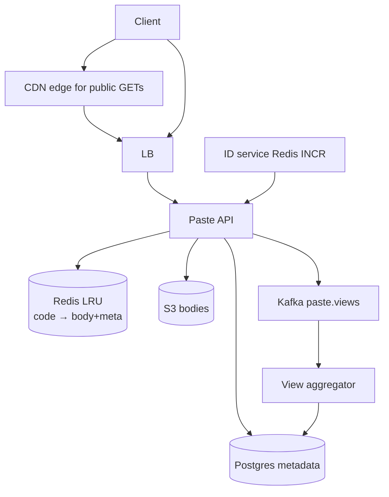
```mermaid
flowchart TB
  U[Client] --> CDN[CDN edge for public GETs]
  CDN --> LB[LB]
  U --> LB
  LB --> API[Paste API]
  API --> Redis[(Redis LRU<br/>code → body+meta)]
  API --> PG[(Postgres metadata)]
  API --> S3[(S3 bodies)]
  API --> K[Kafka paste.views]
  K --> Agg[View aggregator]
  Agg --> PG
  ID[ID service Redis INCR] --> API
```

**Architecture narration — say this while pointing:**

- Public GETs terminate at CDN whenever possible; writes and protected reads reach the API.
- Postgres stores small authoritative metadata while S3 stores large immutable bodies.
- Redis is the hot mapping/body cache and can be rebuilt.
- View events leave the request path through Kafka so virality does not create database writes.

### 4.5 Write vs read paths

```mermaid
flowchart LR
  subgraph Write
    W1[POST content] --> W2[Put S3]
    W2 --> W3[Insert metadata Postgres]
    W3 --> W4[Warm Redis optional]
  end
  subgraph Read
    R1[GET /{code}] --> R2{Redis?}
    R2 -->|hit| R3[Return]
    R2 -->|miss| R4[Postgres + S3]
    R4 --> R5[Fill Redis]
    R5 --> R3
  end
```

**Read/write-path narration — say this while pointing:**

- On write, upload the object then publish metadata; orphan objects are garbage-collected if metadata fails.
- On read, Redis hit returns immediately; miss loads metadata and object, then fills cache.
- Expiration and visibility are checked before serving, and private content bypasses shared CDN caching.

### 4.6 Schema

```sql
CREATE TABLE paste (
  id            BIGSERIAL PRIMARY KEY,
  short_code    TEXT UNIQUE NOT NULL,  -- base62
  user_id       UUID NULL,
  s3_key        TEXT NOT NULL,
  size_bytes    INT NOT NULL,
  visibility    TEXT NOT NULL,         -- public|unlisted|private
  password_hash TEXT NULL,
  expires_at    TIMESTAMPTZ NULL,
  created_at    TIMESTAMPTZ NOT NULL,
  view_count    BIGINT NOT NULL DEFAULT 0
);
```

### 4.7 Viral key protection

1. Redis + CDN for public pastes  
2. Request coalescing (singleflight) on cache miss  
3. Soft rate limit per IP on POST  
4. View counts async (don’t write Postgres on every GET)  
5. Optional: replicate hot object to memory on multiple edges  

### 4.8 Sequence (cache miss under load)

```mermaid
sequenceDiagram
  participant C1 as Client1
  participant C2 as Client2
  participant A as API
  participant L as Singleflight lock
  participant R as Redis
  participant S as S3

  C1->>A: GET /xY9
  C2->>A: GET /xY9
  A->>R: MISS
  A->>L: acquire code=xY9
  Note over L: C1 loads; C2 waits
  A->>S: GET object
  A->>R: SET ttl
  L-->>A: release + share result
  A-->>C1: 200
  A-->>C2: 200
```

**Cache-miss sequence narration — say this while pointing:**

- Two misses for one code collapse behind a per-key singleflight lock.
- Only the winner reads S3 and populates Redis; waiters share the result.
- The lock is short-lived coordination, not ownership; timeout falls back safely.

### 4.9 Close

> “Split metadata and blob storage. The viral path is cache and CDN. The database never stores the body and never sees per-read writes.”


### 4.A What the interviewer is grading

- Frame Pastebin / Viral Text around the user journey and explicitly name the authoritative state.
- Model the core resource—short-code namespace and content visibility—with lifecycle, keys, and access-path indexes.
- State the hard invariant: a short code resolves to one immutable content object and expired/private content is never served from stale cache.
- Show retry-safe command APIs with idempotency keys and meaningful conflict responses.
- Choose NFRs that drive the design: hot reads may reach 50k QPS; create remains moderate.
- Explain the trade-off: serve immutable public content at the edge but authorize private reads at origin.
- Walk through failure recovery for a viral cache miss, alias collision, expiration, or object upload succeeding before metadata.
- Add tenant isolation, auditability, metrics, and an operator repair path where enterprise use requires them.

### 4.B How to open (60 seconds)

**Say this:**

> “I’ll design Pastebin / Viral Text by first fixing the v1 journey, scale, and consistency boundary. The critical resource is short-code namespace and content visibility, and my non-negotiable invariant is that a short code resolves to one immutable content object and expired/private content is never served from stale cache. I’ll model the durable state and APIs first, then draw the synchronous path and asynchronous work. I’ll assume hot reads may reach 50k QPS; create remains moderate. The key trade-off is to serve immutable public content at the edge but authorize private reads at origin. After the happy path I’ll test retries, concurrency, and a viral cache miss, alias collision, expiration, or object upload succeeding before metadata. If you prefer, I can go deeper on schema and races or on distributed scaling.”

### 4.C Deep explanation of the hard invariant

**Invariant:** A short code resolves to one immutable content object and expired/private content is never served from stale cache.

A short code is a public capability: once issued, it must not resolve to somebody else’s object, and an expired or private paste must not leak through a stale shared cache. A code collision silently redirecting to the wrong body is data corruption; serving after ACL or expiry change is a confidentiality failure.

Reserve the code with a database `UNIQUE` constraint, not a probabilistic precheck. Store immutable bodies under versioned object keys and publish metadata only after upload succeeds; garbage-collect orphan objects if publication fails. Cache visibility and expiry with the value, use TTLs bounded by policy changes, and purge CDN entries on delete. Private reads always authorize at origin.

### 4.D Common mistakes that fail the round

- Drawing components before saying what is in scope and what must be correct.
- Using a cache lookup as proof that a contested resource is available.
- Checking state and updating it in separate, unprotected operations.
- Ignoring duplicate client requests, queue redelivery, and provider callbacks.
- Naming a database without giving keys, constraints, indexes, or retention.
- Scaling every component before estimating the actual bottleneck.

### 4.E Follow-up Q&A

**Q: Why not make the cache authoritative?**  
**A:** The cache optimizes latency but can be stale, evicted, or partitioned. Postgres metadata plus versioned object storage owns the decision; cache state is derived and repairable.

**Q: What happens when the same request is retried?**  
**A:** The caller sends a stable idempotency key scoped to the actor and operation. A unique constraint stores the first outcome, so retries return that result instead of repeating the mutation.

**Q: Where is the transaction boundary?**  
**A:** It surrounds the minimum state needed to preserve a short code resolves to one immutable content object and expired/private content is never served from stale cache. External calls stay outside; their results are reconciled with an outbox, callback, or explicit compensation.

**Q: How do you scale this ten times?**  
**A:** Measure the hot access path first, then partition by the natural ownership key for short-code namespace and content visibility. Add caches or projections for reads while keeping all writes for one invariant on one authoritative owner.

**Q: How do you know it is healthy?**  
**A:** Track latency and error SLOs plus a business-integrity metric for rejected conflicts, duplicate suppression, stale work, and reconciliation age. Correlation IDs connect API, event, worker, and external-provider traces.

**Q: What changes for enterprise multi-tenancy?**  
**A:** Put tenant identity in authorization, keys, partitions, quotas, encryption context, and audit logs. No cache, queue message, search filter, or operator tool may omit tenant scope.

### 4.F Close script (30–45 seconds)

**Say this:**

> “The design keeps Postgres metadata plus versioned object storage authoritative for short-code namespace and content visibility. The hard guarantee is that a short code resolves to one immutable content object and expired/private content is never served from stale cache, enforced atomically rather than inferred from cache. The main path meets hot reads may reach 50k QPS; create remains moderate, while asynchronous work absorbs retries and isolates dependencies. I would watch the invariant-conflict rate, end-to-end latency, backlog, and reconciliation age. The first scale lever is partitioning by the resource owner; the first enterprise additions are tenant-scoped authorization, audit, quotas, and operator replay.”


---

## 5. Elevator System (C3 OOD) — Full Playbook

### 5.1 Restatement

> “Simulate elevators serving hall and cabin calls efficiently and safely. This is OOD + scheduling, not cloud architecture.”

### 5.2 Clarify

Floors? Elevator count? Max capacity? Peak-mode (up-peak morning)? Express elevators? Door timing?

### 5.3 Class diagram (detailed)

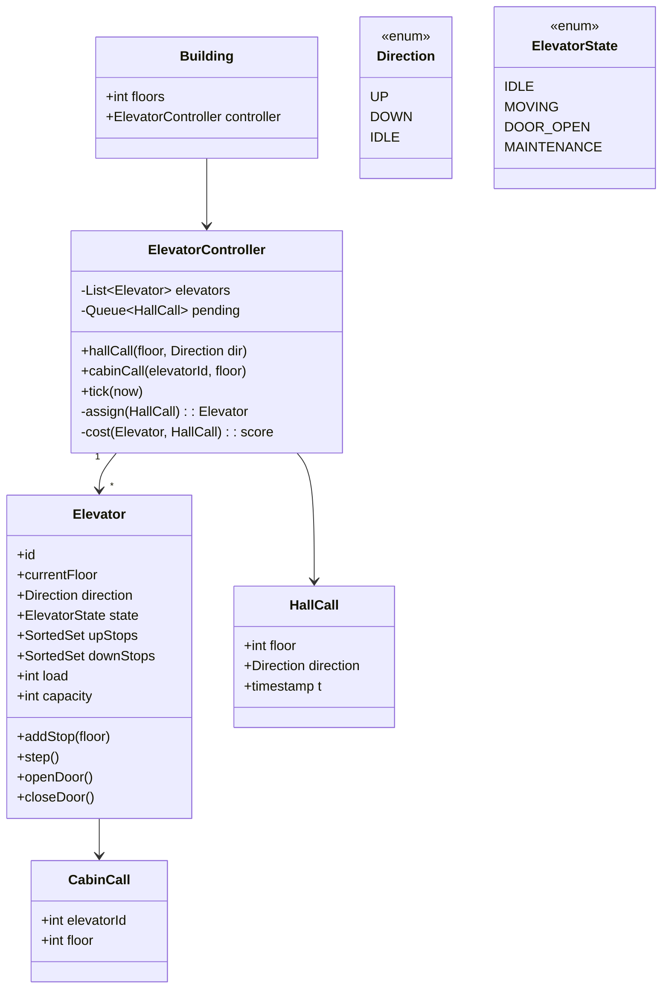
```mermaid
classDiagram
  direction TB
  class Building {
    +int floors
    +ElevatorController controller
  }
  class ElevatorController {
    -List~Elevator~ elevators
    -Queue~HallCall~ pending
    +hallCall(floor, Direction dir)
    +cabinCall(elevatorId, floor)
    +tick(now)
    -assign(HallCall): Elevator
    -cost(Elevator, HallCall): score
  }
  class Elevator {
    +id
    +currentFloor
    +Direction direction
    +ElevatorState state
    +SortedSet upStops
    +SortedSet downStops
    +int load
    +int capacity
    +addStop(floor)
    +step()
    +openDoor()
    +closeDoor()
  }
  class HallCall {
    +int floor
    +Direction direction
    +timestamp t
  }
  class CabinCall {
    +int elevatorId
    +int floor
  }
  class Direction {
    <<enum>>
    UP
    DOWN
    IDLE
  }
  class ElevatorState {
    <<enum>>
    IDLE
    MOVING
    DOOR_OPEN
    MAINTENANCE
  }
  Building --> ElevatorController
  ElevatorController "1" --> "*" Elevator
  ElevatorController --> HallCall
  Elevator --> CabinCall
```

**Class-diagram narration — say this while pointing:**

- Building composes one Controller; the Controller owns assignment policy, not motor mechanics.
- Each Elevator owns its stops, state, load, and safe local transitions.
- HallCall is unassigned demand; CabinCall targets a specific car.
- Enums make illegal direction/state combinations visible and testable.

### 5.4 LOOK scheduling

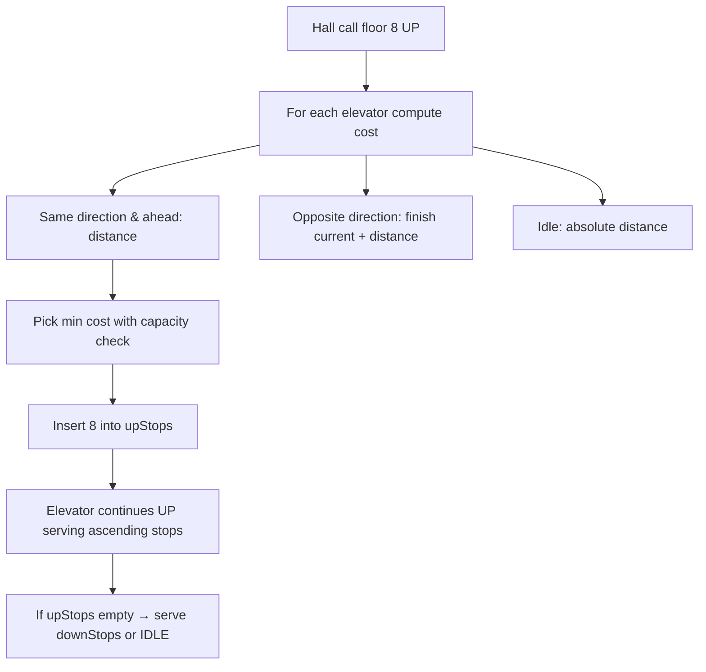
```mermaid
flowchart TD
  Call[Hall call floor 8 UP] --> Eval[For each elevator compute cost]
  Eval --> C1[Same direction & ahead: distance]
  Eval --> C2[Opposite direction: finish current + distance]
  Eval --> C3[Idle: absolute distance]
  C1 --> Min[Pick min cost with capacity check]
  Min --> Assign[Insert 8 into upStops]
  Assign --> Run[Elevator continues UP serving ascending stops]
  Run --> Rev[If upStops empty → serve downStops or IDLE]
```

**Scheduling-diagram narration — say this while pointing:**

- Every hall call is scored against all eligible elevators.
- Same-direction calls ahead are cheap; opposite-direction calls include the remaining route.
- Capacity and maintenance filter candidates before minimum cost wins.
- LOOK serves ordered stops, reverses when the current direction empties, and aging prevents starvation.

### 5.5 Per-tick behavior

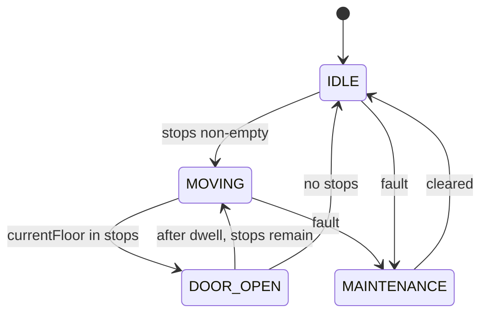
```mermaid
stateDiagram-v2
  [*] --> IDLE
  IDLE --> MOVING: stops non-empty
  MOVING --> DOOR_OPEN: currentFloor in stops
  DOOR_OPEN --> MOVING: after dwell, stops remain
  DOOR_OPEN --> IDLE: no stops
  MOVING --> MAINTENANCE: fault
  IDLE --> MAINTENANCE: fault
  MAINTENANCE --> IDLE: cleared
```

**State-diagram narration — say this while pointing:**

- Only closed doors permit MOVING; arrival moves to DOOR_OPEN.
- A dwell timer closes doors and chooses MOVING or IDLE based on pending stops.
- Faults enter MAINTENANCE from safe states and require an explicit clear.

### 5.6 Threading model

* **Single-threaded simulator:** `controller.tick()` advances all elevators — easiest in interview.  
* **Actor model:** each elevator mailbox — mention as production variant.

### 5.7 APIs / methods

```text
POST hallCall(floor, direction)
POST cabinCall(elevatorId, floor)
GET  status() -> [{id, floor, direction, state, stops}]
tick() // for simulation
```

### 5.8 Follow-ups

| Q | A |
|---|---|
| Starvation? | Aging: increase priority of long-waiting hall calls. |
| Crowded car? | Reject cabin calls when at capacity; skip hall assign if load high. |
| Emergency? | Clear stops; go to designated floor; state=MAINTENANCE. |

### 5.9 Close

> “Classes: Building, Controller, Elevator, Call. LOOK assignment by cost. Tick-based simulation keeps reasoning simple.”


### 5.A What the interviewer is grading

- Frame Elevator System around the user journey and explicitly name the authoritative state.
- Model the core resource—elevator state machine and stop ownership—with lifecycle, keys, and access-path indexes.
- State the hard invariant: an elevator never moves with doors open and every accepted call is either scheduled or explicitly rejected.
- Show retry-safe command APIs with idempotency keys and meaningful conflict responses.
- Choose NFRs that drive the design: deterministic safe transitions matter more than distributed throughput.
- Explain the trade-off: use a single-threaded tick model for clarity, then discuss actor-based production control.
- Walk through failure recovery for simultaneous calls, starvation, overload, door obstruction, or a sensor fault.
- Add tenant isolation, auditability, metrics, and an operator repair path where enterprise use requires them.

### 5.B How to open (60 seconds)

**Say this:**

> “I’ll design Elevator System by first fixing the v1 journey, scale, and consistency boundary. The critical resource is elevator state machine and stop ownership, and my non-negotiable invariant is that an elevator never moves with doors open and every accepted call is either scheduled or explicitly rejected. I’ll model the durable state and APIs first, then draw the synchronous path and asynchronous work. I’ll assume deterministic safe transitions matter more than distributed throughput. The key trade-off is to use a single-threaded tick model for clarity, then discuss actor-based production control. After the happy path I’ll test retries, concurrency, and simultaneous calls, starvation, overload, door obstruction, or a sensor fault. If you prefer, I can go deeper on schema and races or on distributed scaling.”

### 5.C Deep explanation of the hard invariant

**Invariant:** An elevator never moves with doors open and every accepted call is either scheduled or explicitly rejected.

The physical safety invariant dominates scheduling efficiency: motion and open doors are mutually exclusive, and every accepted request remains represented until served or cancelled. If state changes can interleave freely, a controller may command motion during a door obstruction or lose a hall call while reassigning it.

In the interview simulator, one event-loop thread owns all transitions. `step()` checks guards such as `state == MOVING && doorsClosed`; door sensors can extend dwell but never request motion. Assignment either inserts the call into exactly one elevator’s ordered stop set or leaves it in the pending queue. In production, a certified local safety controller enforces hardware interlocks even if the fleet scheduler fails.

### 5.D Common mistakes that fail the round

- Drawing components before saying what is in scope and what must be correct.
- Using a cache lookup as proof that a contested resource is available.
- Checking state and updating it in separate, unprotected operations.
- Ignoring duplicate client requests, queue redelivery, and provider callbacks.
- Naming a database without giving keys, constraints, indexes, or retention.
- Scaling every component before estimating the actual bottleneck.

### 5.E Follow-up Q&A

**Q: Why not make the cache authoritative?**  
**A:** The cache optimizes latency but can be stale, evicted, or partitioned. The controller/elevator in-memory state in the simulation owns the decision; cache state is derived and repairable.

**Q: What happens when the same request is retried?**  
**A:** The caller sends a stable idempotency key scoped to the actor and operation. A unique constraint stores the first outcome, so retries return that result instead of repeating the mutation.

**Q: Where is the transaction boundary?**  
**A:** It surrounds the minimum state needed to preserve an elevator never moves with doors open and every accepted call is either scheduled or explicitly rejected. External calls stay outside; their results are reconciled with an outbox, callback, or explicit compensation.

**Q: How do you scale this ten times?**  
**A:** Measure the hot access path first, then partition by the natural ownership key for elevator state machine and stop ownership. Add caches or projections for reads while keeping all writes for one invariant on one authoritative owner.

**Q: How do you know it is healthy?**  
**A:** Track latency and error SLOs plus a business-integrity metric for rejected conflicts, duplicate suppression, stale work, and reconciliation age. Correlation IDs connect API, event, worker, and external-provider traces.

**Q: What changes for enterprise multi-tenancy?**  
**A:** Put tenant identity in authorization, keys, partitions, quotas, encryption context, and audit logs. No cache, queue message, search filter, or operator tool may omit tenant scope.

### 5.F Close script (30–45 seconds)

**Say this:**

> “The design keeps the controller/elevator in-memory state in the simulation authoritative for elevator state machine and stop ownership. The hard guarantee is that an elevator never moves with doors open and every accepted call is either scheduled or explicitly rejected, enforced atomically rather than inferred from cache. The main path meets deterministic safe transitions matter more than distributed throughput, while asynchronous work absorbs retries and isolates dependencies. I would watch the invariant-conflict rate, end-to-end latency, backlog, and reconciliation age. The first scale lever is partitioning by the resource owner; the first enterprise additions are tenant-scoped authorization, audit, quotas, and operator replay.”


---

## 6. Ticket / Event Booking (Ticketmaster pattern)

### 6.1 Architecture

```mermaid
flowchart TB
  User --> API[Booking API]
  API --> Seats[(Seat inventory Postgres)]
  API --> Redis[(Hold TTL keys)]
  API --> Pay[Payments]
  Pay -->|webhook| API
  Exp[Expiry worker] --> Seats
  Exp --> Redis
  API --> Wait[Optional waitlist service]
```

**Architecture narration — say this while pointing:**

- Booking API is the only writer of seat state.
- Postgres arbitrates seat ownership; Redis stores convenient TTL signals but cannot sell a seat.
- Payment callback confirms or compensates the held order.
- Expiry worker conditionally returns still-held seats; waiting room limits admitted contenders.

### 6.2 Seat state machine

```mermaid
stateDiagram-v2
  [*] --> Available
  Available --> Held: hold
  Held --> Available: TTL expire / release
  Held --> Sold: payment success
  Sold --> [*]
```

**State-diagram narration — say this while pointing:**

- Available can become Held only through an atomic claim.
- Held has an owner and deadline; confirmation checks both before Sold.
- Expiry and payment race through conditional transitions, so only one wins.

### 6.3 Deep dive

Hold seats with `SELECT … FOR UPDATE` (or CAS status) for 10 minutes → pay → mark sold. Same scarce-resource pattern as parking/rental; cite this when interviewer asks about races.

### 6.4 Hot-event scale

* Shard inventory by section  
* Queue waiting room (virtual queue) before hold API  
* Idempotent holds per user+event  


### 6.A What the interviewer is grading

- Frame Ticket Booking around the user journey and explicitly name the authoritative state.
- Model the core resource—event seat—with lifecycle, keys, and access-path indexes.
- State the hard invariant: a seat is never sold twice and a hold can become sold only for its owner before expiry.
- Show retry-safe command APIs with idempotency keys and meaningful conflict responses.
- Choose NFRs that drive the design: hot onsales create extreme bursts; hold must complete in hundreds of milliseconds.
- Explain the trade-off: protect correctness in SQL and shed load with a waiting room.
- Walk through failure recovery when two buyers click the same seat, payment is retried, or expiry races with confirmation.
- Add tenant isolation, auditability, metrics, and an operator repair path where enterprise use requires them.

### 6.B How to open (60 seconds)

**Say this:**

> “I’ll design Ticket Booking by first fixing the v1 journey, scale, and consistency boundary. The critical resource is event seat, and my non-negotiable invariant is that a seat is never sold twice and a hold can become sold only for its owner before expiry. I’ll model the durable state and APIs first, then draw the synchronous path and asynchronous work. I’ll assume hot onsales create extreme bursts; hold must complete in hundreds of milliseconds. The key trade-off is to protect correctness in SQL and shed load with a waiting room. After the happy path I’ll test retries and concurrency when two buyers click the same seat, payment is retried, or expiry races with confirmation. If you prefer, I can go deeper on schema and races or on distributed scaling.”

### 6.C Clarifying questions, APIs, and schema

**Ask before drawing:**

- Who are the actors and which one journey must v1 complete?
- What peak load, object/event size, retention, and read:write ratio should I assume?
- Which response must be immediate, and which work may complete asynchronously?
- Which state must be strongly consistent, and how stale may discovery or analytics be?
- Are multi-tenancy, regional residency, audit, deletion, or disconnected operation in scope?

**API surface to put on the board:**

- list seats, create hold, confirm purchase, release hold, and fetch order.
- Every mutating endpoint carries an idempotency key or expected version.
- List endpoints use cursor pagination; asynchronous commands return an operation/status resource.
- Conflicts return `409`, validation returns `422`, quota returns `429`, and transient dependency failure returns `503`.

**Schema spine:**

- Event, Section, Seat(event_id, seat_no, status, version), Hold(user_id, expires_at, idempotency_key), Order, Payment.
- Put tenant/owner scope into every primary lookup involving event seat.
- Add a unique idempotency constraint, explicit status enum, `created_at/updated_at`, and `version` where optimistic concurrency is useful.
- Index the list/read path, the contested-resource lookup, and worker scans such as `(status, next_attempt_at)` or expiry.

### 6.D Deep explanation of the hard invariant

**Invariant:** A seat is never sold twice and a hold can become sold only for its owner before expiry.

This exists because two buyers click the same seat, payment retries, or expiry races with confirmation can make two valid-looking requests overlap in time. A read-then-write check in application code is insufficient: both requests can observe the old state before either commits. If the invariant fails, downstream compensation is often impossible or expensive—two people own one scarce thing, unauthorized context leaks, a side effect runs twice, or historical data becomes untrustworthy.

Defend it at the narrowest authoritative boundary: transactional seat inventory in Postgres. Use one atomic conditional update, row lock, uniqueness/exclusion constraint, sequence allocator, or lease according to the model. Treat a constraint conflict as an expected `409`, make retry identity durable, and keep cache/index state outside the proof. Then add an invariant monitor and repair workflow; the database guard prevents known races, while telemetry catches bugs and operational drift.

### 6.E Common mistakes that fail the round

- Drawing components before saying what is in scope and what must be correct.
- Using a cache lookup as proof that a contested resource is available.
- Checking state and updating it in separate, unprotected operations.
- Ignoring duplicate client requests, queue redelivery, and provider callbacks.
- Naming a database without giving keys, constraints, indexes, or retention.
- Scaling every component before estimating the actual bottleneck.

### 6.F Follow-up Q&A

**Q: Why not make the cache authoritative?**  
**A:** The cache optimizes latency but can be stale, evicted, or partitioned. Transactional seat inventory in postgres owns the decision; cache state is derived and repairable.

**Q: What happens when the same request is retried?**  
**A:** The caller sends a stable idempotency key scoped to the actor and operation. A unique constraint stores the first outcome, so retries return that result instead of repeating the mutation.

**Q: Where is the transaction boundary?**  
**A:** It surrounds the minimum state needed to preserve a seat is never sold twice and a hold can become sold only for its owner before expiry. External calls stay outside; their results are reconciled with an outbox, callback, or explicit compensation.

**Q: How do you scale this ten times?**  
**A:** Measure the hot access path first, then partition by the natural ownership key for event seat. Add caches or projections for reads while keeping all writes for one invariant on one authoritative owner.

**Q: How do you know it is healthy?**  
**A:** Track latency and error SLOs plus a business-integrity metric for rejected conflicts, duplicate suppression, stale work, and reconciliation age. Correlation IDs connect API, event, worker, and external-provider traces.

**Q: What changes for enterprise multi-tenancy?**  
**A:** Put tenant identity in authorization, keys, partitions, quotas, encryption context, and audit logs. No cache, queue message, search filter, or operator tool may omit tenant scope.

### 6.G Close script (30–45 seconds)

**Say this:**

> “The design keeps transactional seat inventory in Postgres authoritative for event seat. The hard guarantee is that a seat is never sold twice and a hold can become sold only for its owner before expiry, enforced atomically rather than inferred from cache. The main path meets hot onsales create extreme bursts; hold must complete in hundreds of milliseconds, while asynchronous work absorbs retries and isolates dependencies. I would watch the invariant-conflict rate, end-to-end latency, backlog, and reconciliation age. The first scale lever is partitioning by the resource owner; the first enterprise additions are tenant-scoped authorization, audit, quotas, and operator replay.”


---

## 7. Ride-Sharing

### 7.1 Architecture

```mermaid
flowchart TB
  Rider --> Trip[Trip Service]
  Driver --> Loc[Location Service]
  Driver --> Trip
  Loc --> GEO[(Redis GEO + status)]
  Trip --> PG[(Postgres trips)]
  Trip --> GEO
  Trip --> Offer[Offer Pub/Sub]
  Offer --> Driver
  Trip --> Fare[Fare]
  Trip --> Pay[Payments]
  Trip --> Map[Maps ETA provider]
```

**Architecture narration — say this while pointing:**

- Drivers stream locations to Location Service, which maintains a short-lived GEO projection.
- Trip Service owns durable trip lifecycle and asks GEO only for candidates.
- Offers fan out over pub/sub; Fare, Maps, and Payments are supporting services.
- The database claim, not push ordering, decides the winner.

### 7.2 Matching sequence (detailed)

```mermaid
sequenceDiagram
  autonumber
  participant R as Rider
  participant T as Trip
  participant G as Redis GEO
  participant D as Driver apps
  participant DB as Postgres

  R->>T: POST /trips {pickup, dropoff}
  T->>DB: INSERT trip status=requested
  T->>G: GEOSEARCH radius=3km available drivers
  T->>D: push offers to top K
  D->>T: POST /trips/{id}/accept
  T->>DB: UPDATE trips SET driver_id=$d, status='assigned'<br/>WHERE id=$t AND status='requested'
  alt rowcount=1
    T->>G: set driver status=busy
    T-->>D: success
    T-->>R: driver assigned + ETA
  else rowcount=0
    T-->>D: 409 taken
  end
```

**Matching-sequence narration — say this while pointing:**

- Trip is persisted before discovery so retries have a stable identity.
- GEO returns nearby, fresh, available candidates and the service offers to a bounded top K.
- Every acceptance executes the same conditional update; exactly one row count is one.
- Losers receive 409 and driver availability is repaired from trip truth if cache updates fail.

### 7.3 Schema highlights

```text
Trip(id, rider_id, driver_id, status, pickup_geopoint, dropoff_geopoint,
     requested_at, assigned_at, fare_cents, version)
DriverStatus in Redis: {available|offered|busy|offline}, last_location, geohash
```

### 7.4 Hard problems to mention

* Offer stampede → limit concurrent offers; short offer TTL  
* Ghost drivers → location freshness heartbeat  
* Surge pricing → separate pricing service reading demand metrics  
* Exact fare → finalize on trip end; authorize hold earlier  


### 7.A What the interviewer is grading

- Frame Ride-Sharing around the user journey and explicitly name the authoritative state.
- Model the core resource—trip-driver assignment—with lifecycle, keys, and access-path indexes.
- State the hard invariant: a trip has at most one assigned driver and a driver has at most one active trip.
- Show retry-safe command APIs with idempotency keys and meaningful conflict responses.
- Choose NFRs that drive the design: matching should feel sub-second while GPS can be a few seconds stale.
- Explain the trade-off: use an approximate GEO index for candidates but an atomic database claim for assignment.
- Walk through failure recovery for multiple drivers accept, a ghost driver appears nearby, or location updates arrive out of order.
- Add tenant isolation, auditability, metrics, and an operator repair path where enterprise use requires them.

### 7.B How to open (60 seconds)

**Say this:**

> “I’ll design Ride-Sharing by first fixing the v1 journey, scale, and consistency boundary. The critical resource is trip-driver assignment, and my non-negotiable invariant is that a trip has at most one assigned driver and a driver has at most one active trip. I’ll model the durable state and APIs first, then draw the synchronous path and asynchronous work. I’ll assume matching should feel sub-second while GPS can be a few seconds stale. The key trade-off is to use an approximate GEO index for candidates but an atomic database claim for assignment. After the happy path I’ll test retries, concurrency, and multiple drivers accept, a ghost driver appears nearby, or location updates arrive out of order. If you prefer, I can go deeper on schema and races or on distributed scaling.”

### 7.C Clarifying questions, APIs, and schema

**Ask before drawing:**

- Who are the actors and which one journey must v1 complete?
- What peak load, object/event size, retention, and read:write ratio should I assume?
- Which response must be immediate, and which work may complete asynchronously?
- Which state must be strongly consistent, and how stale may discovery or analytics be?
- Are multi-tenancy, regional residency, audit, deletion, or disconnected operation in scope?

**API surface to put on the board:**

- request trip, accept offer, driver location heartbeat, start, complete, and cancel.
- Every mutating endpoint carries an idempotency key or expected version.
- List endpoints use cursor pagination; asynchronous commands return an operation/status resource.
- Conflicts return `409`, validation returns `422`, quota returns `429`, and transient dependency failure returns `503`.

**Schema spine:**

- Trip(rider_id, driver_id, status, pickup, dropoff, version), Driver, DriverAvailability, Offer(expires_at), Payment.
- Put tenant/owner scope into every primary lookup involving trip-driver assignment.
- Add a unique idempotency constraint, explicit status enum, `created_at/updated_at`, and `version` where optimistic concurrency is useful.
- Index the list/read path, the contested-resource lookup, and worker scans such as `(status, next_attempt_at)` or expiry.

### 7.D Deep explanation of the hard invariant

**Invariant:** A trip has at most one assigned driver and a driver has at most one active trip.

This exists because multiple drivers accept, a ghost driver appears nearby, or location updates arrive out of order can make two valid-looking requests overlap in time. A read-then-write check in application code is insufficient: both requests can observe the old state before either commits. If the invariant fails, downstream compensation is often impossible or expensive—two people own one scarce thing, unauthorized context leaks, a side effect runs twice, or historical data becomes untrustworthy.

Defend it at the narrowest authoritative boundary: conditional trip and driver state in the transactional store. Use one atomic conditional update, row lock, uniqueness/exclusion constraint, sequence allocator, or lease according to the model. Treat a constraint conflict as an expected `409`, make retry identity durable, and keep cache/index state outside the proof. Then add an invariant monitor and repair workflow; the database guard prevents known races, while telemetry catches bugs and operational drift.

### 7.E Common mistakes that fail the round

- Drawing components before saying what is in scope and what must be correct.
- Using a cache lookup as proof that a contested resource is available.
- Checking state and updating it in separate, unprotected operations.
- Ignoring duplicate client requests, queue redelivery, and provider callbacks.
- Naming a database without giving keys, constraints, indexes, or retention.
- Scaling every component before estimating the actual bottleneck.

### 7.F Follow-up Q&A

**Q: Why not make the cache authoritative?**  
**A:** The cache optimizes latency but can be stale, evicted, or partitioned. Conditional trip and driver state in the transactional store owns the decision; cache state is derived and repairable.

**Q: What happens when the same request is retried?**  
**A:** The caller sends a stable idempotency key scoped to the actor and operation. A unique constraint stores the first outcome, so retries return that result instead of repeating the mutation.

**Q: Where is the transaction boundary?**  
**A:** It surrounds the minimum state needed to preserve a trip has at most one assigned driver and a driver has at most one active trip. External calls stay outside; their results are reconciled with an outbox, callback, or explicit compensation.

**Q: How do you scale this ten times?**  
**A:** Measure the hot access path first, then partition by the natural ownership key for trip-driver assignment. Add caches or projections for reads while keeping all writes for one invariant on one authoritative owner.

**Q: How do you know it is healthy?**  
**A:** Track latency and error SLOs plus a business-integrity metric for rejected conflicts, duplicate suppression, stale work, and reconciliation age. Correlation IDs connect API, event, worker, and external-provider traces.

**Q: What changes for enterprise multi-tenancy?**  
**A:** Put tenant identity in authorization, keys, partitions, quotas, encryption context, and audit logs. No cache, queue message, search filter, or operator tool may omit tenant scope.

### 7.G Close script (30–45 seconds)

**Say this:**

> “The design keeps conditional trip and driver state in the transactional store authoritative for trip-driver assignment. The hard guarantee is that a trip has at most one assigned driver and a driver has at most one active trip, enforced atomically rather than inferred from cache. The main path meets matching should feel sub-second while GPS can be a few seconds stale, while asynchronous work absorbs retries and isolates dependencies. I would watch the invariant-conflict rate, end-to-end latency, backlog, and reconciliation age. The first scale lever is partitioning by the resource owner; the first enterprise additions are tenant-scoped authorization, audit, quotas, and operator replay.”


---

## 8. Dropbox-like File Storage

### 8.1 Architecture

```mermaid
flowchart TB
  Client --> Meta[Metadata Service]
  Client --> S3[S3 presigned PUT/GET]
  Meta --> PG[(Postgres tree + versions)]
  Meta --> Redis[(Locks / sessions)]
  Meta --> S3
  Search[Indexer] --> PG
  Search --> OS[(OpenSearch filenames)]
  Share[Share Service] --> PG
  CDN --> S3
```

**Architecture narration — say this while pointing:**

- Metadata Service handles namespace and versions; clients transfer bytes directly with presigned URLs.
- Postgres owns the tree and permissions; S3 owns immutable content.
- Redis coordinates short sessions, OpenSearch is a rebuildable filename projection, and CDN accelerates downloads.
- Sharing checks permissions before issuing a download capability.

### 8.2 Upload sequence

```mermaid
sequenceDiagram
  participant C as Client
  participant M as Metadata
  participant S as S3

  C->>M: POST /upload-sessions {name, parentId, size, checksum}
  M-->>C: {sessionId, presignedUrl, parts[]}
  C->>S: PUT bytes (multipart if large)
  C->>M: POST /upload-sessions/{id}/complete
  M->>M: txn: FileNode + FileVersion + dedup by checksum
  M-->>C: {fileId, version}
```

**Upload-sequence narration — say this while pointing:**

- The initial command reserves metadata intent and returns scoped multipart URLs.
- The client sends bytes directly to S3 and verifies checksums.
- Complete is idempotent and transactionally creates the node/version only after object verification.
- Abandoned upload sessions expire and orphan multipart data is cleaned later.

### 8.3 Metadata schema

```text
FileNode(id, parent_id, owner_id, name, type file|folder, is_deleted, unique(parent_id,name))
FileVersion(id, file_id, s3_key, size, checksum, version_num)
Share(id, node_id, grantee_id, permission read|write)
```

### 8.4 Hard topics

* Move/rename races → row lock on parent  
* Sync conflicts → version vectors or LWW + conflict copy  
* Dedup → content hash  
* Large files → multipart + checksum per part  


### 8.A What the interviewer is grading

- Frame Dropbox-like Storage around the user journey and explicitly name the authoritative state.
- Model the core resource—file metadata version—with lifecycle, keys, and access-path indexes.
- State the hard invariant: a committed file version points to a durable verified blob and sibling names obey the chosen uniqueness policy.
- Show retry-safe command APIs with idempotency keys and meaningful conflict responses.
- Choose NFRs that drive the design: metadata reads are low latency; large bytes bypass application servers.
- Explain the trade-off: separate strongly consistent metadata from scalable blob transfer.
- Walk through failure recovery for upload completion retries, concurrent rename, partial multipart upload, or sync conflict.
- Add tenant isolation, auditability, metrics, and an operator repair path where enterprise use requires them.

### 8.B How to open (60 seconds)

**Say this:**

> “I’ll design Dropbox-like Storage by first fixing the v1 journey, scale, and consistency boundary. The critical resource is file metadata version, and my non-negotiable invariant is that a committed file version points to a durable verified blob and sibling names obey the chosen uniqueness policy. I’ll model the durable state and APIs first, then draw the synchronous path and asynchronous work. I’ll assume metadata reads are low latency; large bytes bypass application servers. The key trade-off is to separate strongly consistent metadata from scalable blob transfer. After the happy path I’ll test retries, concurrency, and upload completion retries, concurrent rename, partial multipart upload, or sync conflict. If you prefer, I can go deeper on schema and races or on distributed scaling.”

### 8.C Clarifying questions, APIs, and schema

**Ask before drawing:**

- Who are the actors and which one journey must v1 complete?
- What peak load, object/event size, retention, and read:write ratio should I assume?
- Which response must be immediate, and which work may complete asynchronously?
- Which state must be strongly consistent, and how stale may discovery or analytics be?
- Are multi-tenancy, regional residency, audit, deletion, or disconnected operation in scope?

**API surface to put on the board:**

- start upload, complete upload, list folder, download, move, delete, and share.
- Every mutating endpoint carries an idempotency key or expected version.
- List endpoints use cursor pagination; asynchronous commands return an operation/status resource.
- Conflicts return `409`, validation returns `422`, quota returns `429`, and transient dependency failure returns `503`.

**Schema spine:**

- FileNode(parent_id, owner_id, name, type, version), FileVersion(file_id, object_key, checksum, size), UploadSession, Share.
- Put tenant/owner scope into every primary lookup involving file metadata version.
- Add a unique idempotency constraint, explicit status enum, `created_at/updated_at`, and `version` where optimistic concurrency is useful.
- Index the list/read path, the contested-resource lookup, and worker scans such as `(status, next_attempt_at)` or expiry.

### 8.D Deep explanation of the hard invariant

**Invariant:** A committed file version points to a durable verified blob and sibling names obey the chosen uniqueness policy.

Completion must never expose metadata that points to missing or corrupt bytes. Conversely, uploading bytes must not make an uncommitted file visible. Concurrent moves and renames must also preserve one coherent namespace; otherwise sync clients oscillate or download a version that cannot be verified.

Treat blob upload and metadata commit as a small saga. The upload session names an expected checksum and object key; completion verifies object existence, size, and checksum, then transactionally inserts `FileVersion` and advances `FileNode.version`. A unique `(parent_id, normalized_name)` constraint protects the namespace. Completion is idempotent, abandoned multipart uploads expire, and orphan objects are swept after a safety window.

### 8.E Common mistakes that fail the round

- Drawing components before saying what is in scope and what must be correct.
- Using a cache lookup as proof that a contested resource is available.
- Checking state and updating it in separate, unprotected operations.
- Ignoring duplicate client requests, queue redelivery, and provider callbacks.
- Naming a database without giving keys, constraints, indexes, or retention.
- Scaling every component before estimating the actual bottleneck.

### 8.F Follow-up Q&A

**Q: Why not make the cache authoritative?**  
**A:** The cache optimizes latency but can be stale, evicted, or partitioned. Postgres metadata and immutable object versions owns the decision; cache state is derived and repairable.

**Q: What happens when the same request is retried?**  
**A:** The caller sends a stable idempotency key scoped to the actor and operation. A unique constraint stores the first outcome, so retries return that result instead of repeating the mutation.

**Q: Where is the transaction boundary?**  
**A:** It surrounds the minimum state needed to preserve a committed file version points to a durable verified blob and sibling names obey the chosen uniqueness policy. External calls stay outside; their results are reconciled with an outbox, callback, or explicit compensation.

**Q: How do you scale this ten times?**  
**A:** Measure the hot access path first, then partition by the natural ownership key for file metadata version. Add caches or projections for reads while keeping all writes for one invariant on one authoritative owner.

**Q: How do you know it is healthy?**  
**A:** Track latency and error SLOs plus a business-integrity metric for rejected conflicts, duplicate suppression, stale work, and reconciliation age. Correlation IDs connect API, event, worker, and external-provider traces.

**Q: What changes for enterprise multi-tenancy?**  
**A:** Put tenant identity in authorization, keys, partitions, quotas, encryption context, and audit logs. No cache, queue message, search filter, or operator tool may omit tenant scope.

### 8.G Close script (30–45 seconds)

**Say this:**

> “The design keeps Postgres metadata and immutable object versions authoritative for file metadata version. The hard guarantee is that a committed file version points to a durable verified blob and sibling names obey the chosen uniqueness policy, enforced atomically rather than inferred from cache. The main path meets metadata reads are low latency; large bytes bypass application servers, while asynchronous work absorbs retries and isolates dependencies. I would watch the invariant-conflict rate, end-to-end latency, backlog, and reconciliation age. The first scale lever is partitioning by the resource owner; the first enterprise additions are tenant-scoped authorization, audit, quotas, and operator replay.”


---

## 9. URL Shortener

### 9.1 Architecture

```mermaid
flowchart LR
  User --> LB --> App
  App --> Redis[(code→url)]
  App --> PG[(urls)]
  App --> ID[Snowflake / Redis INCR → base62]
  App --> K[Kafka clicks]
  K --> Analytics
```

**Architecture narration — say this while pointing:**

- Redirect enters through load balancing and checks Redis first.
- The application falls back to the durable mapping store and fills cache.
- ID generation reserves collision-free codes; analytics events are asynchronous.
- No analytics dependency is allowed on the redirect response path.

### 9.2 Design choices table

| Decision | Option A | Option B | Pick when |
|----------|----------|----------|-----------|
| ID | Counter base62 | Hash long URL | Counter: predictable size; Hash: dedup |
| Redirect | 301 | 302 | 302 if counting clicks |
| Storage | SQL | KV | SQL fine to millions/day with cache |

### 9.3 Redirect path

Cache-first; on miss load SQL; fill cache; async click event.


### 9.A What the interviewer is grading

- Frame URL Shortener around the user journey and explicitly name the authoritative state.
- Model the core resource—short-code namespace—with lifecycle, keys, and access-path indexes.
- State the hard invariant: each active short code maps to exactly one destination and redirect never waits for analytics.
- Show retry-safe command APIs with idempotency keys and meaningful conflict responses.
- Choose NFRs that drive the design: redirect p95 under 50 ms with read-heavy viral traffic.
- Explain the trade-off: cache mappings aggressively and process clicks asynchronously.
- Walk through failure recovery for ID collision, hot-key cache miss, malicious destination, or expired mapping in cache.
- Add tenant isolation, auditability, metrics, and an operator repair path where enterprise use requires them.

### 9.B How to open (60 seconds)

**Say this:**

> “I’ll design URL Shortener by first fixing the v1 journey, scale, and consistency boundary. The critical resource is short-code namespace, and my non-negotiable invariant is that each active short code maps to exactly one destination and redirect never waits for analytics. I’ll model the durable state and APIs first, then draw the synchronous path and asynchronous work. I’ll assume redirect p95 under 50 ms with read-heavy viral traffic. The key trade-off is to cache mappings aggressively and process clicks asynchronously. After the happy path I’ll test retries, concurrency, and ID collision, hot-key cache miss, malicious destination, or expired mapping in cache. If you prefer, I can go deeper on schema and races or on distributed scaling.”

### 9.C Clarifying questions, APIs, and schema

**Ask before drawing:**

- Who are the actors and which one journey must v1 complete?
- What peak load, object/event size, retention, and read:write ratio should I assume?
- Which response must be immediate, and which work may complete asynchronously?
- Which state must be strongly consistent, and how stale may discovery or analytics be?
- Are multi-tenancy, regional residency, audit, deletion, or disconnected operation in scope?

**API surface to put on the board:**

- create short URL, redirect, delete/disable, and retrieve analytics.
- Every mutating endpoint carries an idempotency key or expected version.
- List endpoints use cursor pagination; asynchronous commands return an operation/status resource.
- Conflicts return `409`, validation returns `422`, quota returns `429`, and transient dependency failure returns `503`.

**Schema spine:**

- Url(code UNIQUE, long_url, owner_id, created_at, expires_at, status), ClickEvent(code, ts, referrer).
- Put tenant/owner scope into every primary lookup involving short-code namespace.
- Add a unique idempotency constraint, explicit status enum, `created_at/updated_at`, and `version` where optimistic concurrency is useful.
- Index the list/read path, the contested-resource lookup, and worker scans such as `(status, next_attempt_at)` or expiry.

### 9.D Deep explanation of the hard invariant

**Invariant:** Each active short code maps to exactly one destination and redirect never waits for analytics.

The namespace invariant exists because generators run concurrently across many hosts. A check-then-insert allocator can issue the same code twice, and overwriting a mapping sends existing links to unrelated content. Redirect correctness also requires status and expiry to survive stale caches.

Use a globally unique numeric allocator encoded in Base62, or generate random codes and rely on `UNIQUE(code)` with retry. Inserts are immutable for normal links; custom aliases use the same constraint. Cache entries include destination, status, and expiry, and deletion writes a tombstone or purges the key. Click analytics is never in the correctness transaction.

### 9.E Common mistakes that fail the round

- Drawing components before saying what is in scope and what must be correct.
- Using a cache lookup as proof that a contested resource is available.
- Checking state and updating it in separate, unprotected operations.
- Ignoring duplicate client requests, queue redelivery, and provider callbacks.
- Naming a database without giving keys, constraints, indexes, or retention.
- Scaling every component before estimating the actual bottleneck.

### 9.F Follow-up Q&A

**Q: Why not make the cache authoritative?**  
**A:** The cache optimizes latency but can be stale, evicted, or partitioned. Durable url mapping store owns the decision; cache state is derived and repairable.

**Q: What happens when the same request is retried?**  
**A:** The caller sends a stable idempotency key scoped to the actor and operation. A unique constraint stores the first outcome, so retries return that result instead of repeating the mutation.

**Q: Where is the transaction boundary?**  
**A:** It surrounds the minimum state needed to preserve each active short code maps to exactly one destination and redirect never waits for analytics. External calls stay outside; their results are reconciled with an outbox, callback, or explicit compensation.

**Q: How do you scale this ten times?**  
**A:** Measure the hot access path first, then partition by the natural ownership key for short-code namespace. Add caches or projections for reads while keeping all writes for one invariant on one authoritative owner.

**Q: How do you know it is healthy?**  
**A:** Track latency and error SLOs plus a business-integrity metric for rejected conflicts, duplicate suppression, stale work, and reconciliation age. Correlation IDs connect API, event, worker, and external-provider traces.

**Q: What changes for enterprise multi-tenancy?**  
**A:** Put tenant identity in authorization, keys, partitions, quotas, encryption context, and audit logs. No cache, queue message, search filter, or operator tool may omit tenant scope.

### 9.G Close script (30–45 seconds)

**Say this:**

> “The design keeps durable URL mapping store authoritative for short-code namespace. The hard guarantee is that each active short code maps to exactly one destination and redirect never waits for analytics, enforced atomically rather than inferred from cache. The main path meets redirect p95 under 50 ms with read-heavy viral traffic, while asynchronous work absorbs retries and isolates dependencies. I would watch the invariant-conflict rate, end-to-end latency, backlog, and reconciliation age. The first scale lever is partitioning by the resource owner; the first enterprise additions are tenant-scoped authorization, audit, quotas, and operator replay.”


---

## 10. Rate Limiter / Hit Counter

### 10.1 Placement

```mermaid
flowchart LR
  Client --> Edge[CDN/WAF]
  Edge --> GW[API Gateway]
  GW --> RL{Redis rate limit}
  RL -->|allow| Svc
  RL -->|deny 429| Client
```

**Placement-diagram narration — say this while pointing:**

- Coarse abuse protection starts at CDN/WAF; product-aware quotas run at the gateway.
- Gateway derives the policy key such as tenant, user, token, or IP.
- Redis executes refill and consume atomically and returns allow plus remaining quota.
- Denied requests stop before service work and include 429 and Retry-After.

### 10.2 Algorithms (detail)

**Token bucket**
* Capacity `C`, refill `r` tokens/sec  
* Atomic Redis Lua: refill based on clock, then take 1  

**Sliding window counter**
* Current minute + previous minute weighted by overlap  

**Hit counter (coding → design)**
* Single node: arrays size 300  
* Multi node: Kafka → aggregator OR Redis INCR with TTL buckets  

### 10.3 Redis Lua sketch (say verbally)

```text
tokens = min(C, tokens + (now-last)*r)
if tokens < 1: deny else tokens--, allow
```


### 10.A What the interviewer is grading

- Frame Rate Limiter / Hit Counter around the user journey and explicitly name the authoritative state.
- Model the core resource—quota bucket—with lifecycle, keys, and access-path indexes.
- State the hard invariant: one atomic decision both observes and consumes quota for the correct policy scope.
- Show retry-safe command APIs with idempotency keys and meaningful conflict responses.
- Choose NFRs that drive the design: single-digit-millisecond overhead and fail behavior chosen per endpoint.
- Explain the trade-off: central accuracy versus local availability and lower latency.
- Walk through failure recovery for concurrent requests, clock skew, Redis loss, or a single tenant hot key.
- Add tenant isolation, auditability, metrics, and an operator repair path where enterprise use requires them.

### 10.B How to open (60 seconds)

**Say this:**

> “I’ll design Rate Limiter / Hit Counter by first fixing the v1 journey, scale, and consistency boundary. The critical resource is quota bucket, and my non-negotiable invariant is that one atomic decision both observes and consumes quota for the correct policy scope. I’ll model the durable state and APIs first, then draw the synchronous path and asynchronous work. I’ll assume single-digit-millisecond overhead and fail behavior chosen per endpoint. The key trade-off is to central accuracy versus local availability and lower latency. After the happy path I’ll test retries, concurrency, and concurrent requests, clock skew, Redis loss, or a single tenant hot key. If you prefer, I can go deeper on schema and races or on distributed scaling.”

### 10.C Clarifying questions, APIs, and schema

**Ask before drawing:**

- Who are the actors and which one journey must v1 complete?
- What peak load, object/event size, retention, and read:write ratio should I assume?
- Which response must be immediate, and which work may complete asynchronously?
- Which state must be strongly consistent, and how stale may discovery or analytics be?
- Are multi-tenancy, regional residency, audit, deletion, or disconnected operation in scope?

**API surface to put on the board:**

- check-and-consume, inspect policy, update policy, and query usage.
- Every mutating endpoint carries an idempotency key or expected version.
- List endpoints use cursor pagination; asynchronous commands return an operation/status resource.
- Conflicts return `409`, validation returns `422`, quota returns `429`, and transient dependency failure returns `503`.

**Schema spine:**

- Policy(scope, capacity, refill_rate, version), Bucket(key, tokens, last_refill), DecisionLog(sampled).
- Put tenant/owner scope into every primary lookup involving quota bucket.
- Add a unique idempotency constraint, explicit status enum, `created_at/updated_at`, and `version` where optimistic concurrency is useful.
- Index the list/read path, the contested-resource lookup, and worker scans such as `(status, next_attempt_at)` or expiry.

### 10.D Deep explanation of the hard invariant

**Invariant:** One atomic decision both observes and consumes quota for the correct policy scope.

A rate limit is a concurrency decision, not a periodic counter report. If two gateways read the same token count and decrement separately, both can admit the final token and overload the protected service. Applying different policy versions across nodes also makes customer-visible quotas inconsistent.

A Redis Lua script reads elapsed time, refills, decides, decrements, and returns remaining quota atomically against Redis server time. Keys include policy scope and version; policy rollout has an explicit cutover. For extreme scale, gateways lease small token batches locally, accepting bounded overshoot. State whether dependency failure is fail-open for low-risk reads or fail-closed for costly/security-sensitive operations.

### 10.E Common mistakes that fail the round

- Drawing components before saying what is in scope and what must be correct.
- Using a cache lookup as proof that a contested resource is available.
- Checking state and updating it in separate, unprotected operations.
- Ignoring duplicate client requests, queue redelivery, and provider callbacks.
- Naming a database without giving keys, constraints, indexes, or retention.
- Scaling every component before estimating the actual bottleneck.

### 10.F Follow-up Q&A

**Q: Why not make the cache authoritative?**  
**A:** The cache optimizes latency but can be stale, evicted, or partitioned. Atomic redis state or a local leased quota owns the decision; cache state is derived and repairable.

**Q: What happens when the same request is retried?**  
**A:** The caller sends a stable idempotency key scoped to the actor and operation. A unique constraint stores the first outcome, so retries return that result instead of repeating the mutation.

**Q: Where is the transaction boundary?**  
**A:** It surrounds the minimum state needed to preserve one atomic decision both observes and consumes quota for the correct policy scope. External calls stay outside; their results are reconciled with an outbox, callback, or explicit compensation.

**Q: How do you scale this ten times?**  
**A:** Measure the hot access path first, then partition by the natural ownership key for quota bucket. Add caches or projections for reads while keeping all writes for one invariant on one authoritative owner.

**Q: How do you know it is healthy?**  
**A:** Track latency and error SLOs plus a business-integrity metric for rejected conflicts, duplicate suppression, stale work, and reconciliation age. Correlation IDs connect API, event, worker, and external-provider traces.

**Q: What changes for enterprise multi-tenancy?**  
**A:** Put tenant identity in authorization, keys, partitions, quotas, encryption context, and audit logs. No cache, queue message, search filter, or operator tool may omit tenant scope.

### 10.G Close script (30–45 seconds)

**Say this:**

> “The design keeps atomic Redis state or a local leased quota authoritative for quota bucket. The hard guarantee is that one atomic decision both observes and consumes quota for the correct policy scope, enforced atomically rather than inferred from cache. The main path meets single-digit-millisecond overhead and fail behavior chosen per endpoint, while asynchronous work absorbs retries and isolates dependencies. I would watch the invariant-conflict rate, end-to-end latency, backlog, and reconciliation age. The first scale lever is partitioning by the resource owner; the first enterprise additions are tenant-scoped authorization, audit, quotas, and operator replay.”


---

## 11. Enterprise RAG / Agent Platform

### 11.1 Architecture (detailed)

```mermaid
flowchart TB
  subgraph Ingest
    Src[SharePoint/S3/Confluence] --> Conn[Connectors]
    Conn --> Parse[Parse/OCR/PII redact]
    Parse --> Chunk[Chunker]
    Chunk --> Emb[Embed workers]
    Emb --> VDB[(Vector DB collections per tenant)]
    Chunk --> Meta[(Postgres docs/chunks/ACL)]
  end

  subgraph Serving
    U[User] --> API[Answer / Agent API]
    API --> Auth[AuthN/Z tenant + ACL]
    Auth --> Ret[Hybrid retrieve: BM25 + ANN]
    Ret --> Meta
    Ret --> VDB
    Ret --> Rerank[Cross-encoder rerank]
    Rerank --> LLM[LLM gateway]
    LLM --> Guard[Citation check + schema validate]
    Guard --> Audit[(Audit + traces)]
  end

  subgraph Agent
    API --> Graph[Orchestrator]
    Graph --> Tools[Allowlisted tools]
    Tools --> HITL[Human approval]
  end
```

**Architecture narration — say this while pointing:**

- Ingestion connectors parse, redact, chunk, embed, and write both vectors and ACL metadata.
- Serving authenticates before retrieval, combines lexical and vector candidates, reranks, and calls the model.
- Guarding verifies structured output and citations; audit captures prompt, versions, sources, latency, and cost.
- Agent orchestration may call only typed allowlisted tools, with human approval for risky writes.

### 11.2 Grounded answer sequence

```mermaid
sequenceDiagram
  participant U as User
  participant A as API
  participant V as Vector+Meta
  participant L as LLM

  U->>A: question + tenant JWT
  A->>A: expand ACL document allow-list
  A->>V: retrieve top 50 → rerank top 5
  V-->>A: chunks with doc ids
  A->>L: prompt: answer ONLY from chunks; cite [#]
  L-->>A: answer + citations
  A->>A: verify each citation maps to retrieved chunk
  alt citation missing
    A-->>U: refuse / ask clarify
  else ok
    A-->>U: answer + sources
    A->>A: write audit log
  end
```

**Grounded-answer sequence narration — say this while pointing:**

- JWT establishes tenant and principal before any search.
- ACL filtering occurs during retrieval, not after confidential text reaches the model.
- Top candidates are reranked into a small evidence set and the model must cite it.
- Citation verification can refuse unsupported output; the audit trace makes the decision reproducible.

### 11.3 Tables

```text
Tenant, Document(acl_roles[]), Chunk(doc_id, ordinal, text, hash),
EmbeddingRef(chunk_id, model, vector_id),
Conversation, Message, Citation(message_id, chunk_id, span),
ToolCall(status, args, result), AuditEvent
```

### 11.4 NFRs to emphasize (FDE / C3)

* ACL **before** retrieval (security > recall)  
* Citations mandatory  
* Private model endpoint / VPC  
* Eval set + prompt versioning before prod promote  
* Cost controls: max tokens, cache embeddings  

### 11.5 Close

> “Ingest and query are separate pipelines. Retrieval is ACL-aware. The model is not the source of truth—chunks are. Agents get typed tools, budgets, and audit logs.”


### 11.A What the interviewer is grading

- Frame Enterprise RAG / Agent Platform around the user journey and explicitly name the authoritative state.
- Model the core resource—authorized context and tool capability—with lifecycle, keys, and access-path indexes.
- State the hard invariant: retrieval and tool execution never exceed the caller’s tenant and document permissions.
- Show retry-safe command APIs with idempotency keys and meaningful conflict responses.
- Choose NFRs that drive the design: grounded latency of seconds, strict tenant isolation, traceability, and cost budgets.
- Explain the trade-off: sacrifice some recall and autonomy to preserve ACL safety and controllability.
- Walk through failure recovery for stale ACLs, prompt injection, hallucinated citation, connector drift, or repeated side effect.
- Add tenant isolation, auditability, metrics, and an operator repair path where enterprise use requires them.

### 11.B How to open (60 seconds)

**Say this:**

> “I’ll design Enterprise RAG / Agent Platform by first fixing the v1 journey, scale, and consistency boundary. The critical resource is authorized context and tool capability, and my non-negotiable invariant is that retrieval and tool execution never exceed the caller’s tenant and document permissions. I’ll model the durable state and APIs first, then draw the synchronous path and asynchronous work. I’ll assume grounded latency of seconds, strict tenant isolation, traceability, and cost budgets. The key trade-off is to sacrifice some recall and autonomy to preserve ACL safety and controllability. After the happy path I’ll test retries, concurrency, and stale ACLs, prompt injection, hallucinated citation, connector drift, or repeated side effect. If you prefer, I can go deeper on schema and races or on distributed scaling.”

### 11.C Clarifying questions, APIs, and schema

**Ask before drawing:**

- Who are the actors and which one journey must v1 complete?
- What peak load, object/event size, retention, and read:write ratio should I assume?
- Which response must be immediate, and which work may complete asynchronously?
- Which state must be strongly consistent, and how stale may discovery or analytics be?
- Are multi-tenancy, regional residency, audit, deletion, or disconnected operation in scope?

**API surface to put on the board:**

- ingest source, ask, stream answer, run agent, approve tool call, and inspect trace.
- Every mutating endpoint carries an idempotency key or expected version.
- List endpoints use cursor pagination; asynchronous commands return an operation/status resource.
- Conflicts return `409`, validation returns `422`, quota returns `429`, and transient dependency failure returns `503`.

**Schema spine:**

- Document(tenant, acl, version), Chunk(hash), EmbeddingRef(model), Conversation, Citation, ToolCall(status), AuditEvent.
- Put tenant/owner scope into every primary lookup involving authorized context and tool capability.
- Add a unique idempotency constraint, explicit status enum, `created_at/updated_at`, and `version` where optimistic concurrency is useful.
- Index the list/read path, the contested-resource lookup, and worker scans such as `(status, next_attempt_at)` or expiry.

### 11.D Deep explanation of the hard invariant

**Invariant:** Retrieval and tool execution never exceed the caller’s tenant and document permissions.

Authorization must constrain retrieval before confidential text reaches the model, and every side-effecting tool call must match an allowed capability. Post-filtering model output is too late: the prompt, trace, or provider may already contain another tenant’s data. A retried agent step can also repeat a real-world action such as creating a ticket or changing equipment state.

Bind tenant and principal from verified identity, expand current ACLs, and apply them in both vector and metadata queries. Store document/ACL versions with chunks so stale embeddings can be suppressed. Tool calls use typed schemas, allowlists, budgets, idempotency keys, and human approval for high-impact writes. Audit inputs, retrieved chunk IDs, model/prompt versions, tool decisions, and outputs; continuously test cross-tenant canaries and prompt-injection cases.

### 11.E Common mistakes that fail the round

- Drawing components before saying what is in scope and what must be correct.
- Using a cache lookup as proof that a contested resource is available.
- Checking state and updating it in separate, unprotected operations.
- Ignoring duplicate client requests, queue redelivery, and provider callbacks.
- Naming a database without giving keys, constraints, indexes, or retention.
- Scaling every component before estimating the actual bottleneck.

### 11.F Follow-up Q&A

**Q: Why not make the cache authoritative?**  
**A:** The cache optimizes latency but can be stale, evicted, or partitioned. Source documents, acl metadata, and auditable tool records—not model output owns the decision; cache state is derived and repairable.

**Q: What happens when the same request is retried?**  
**A:** The caller sends a stable idempotency key scoped to the actor and operation. A unique constraint stores the first outcome, so retries return that result instead of repeating the mutation.

**Q: Where is the transaction boundary?**  
**A:** It surrounds the minimum state needed to preserve retrieval and tool execution never exceed the caller’s tenant and document permissions. External calls stay outside; their results are reconciled with an outbox, callback, or explicit compensation.

**Q: How do you scale this ten times?**  
**A:** Measure the hot access path first, then partition by the natural ownership key for authorized context and tool capability. Add caches or projections for reads while keeping all writes for one invariant on one authoritative owner.

**Q: How do you know it is healthy?**  
**A:** Track latency and error SLOs plus a business-integrity metric for rejected conflicts, duplicate suppression, stale work, and reconciliation age. Correlation IDs connect API, event, worker, and external-provider traces.

**Q: What changes for enterprise multi-tenancy?**  
**A:** Put tenant identity in authorization, keys, partitions, quotas, encryption context, and audit logs. No cache, queue message, search filter, or operator tool may omit tenant scope.

### 11.G Close script (30–45 seconds)

**Say this:**

> “The design keeps source documents, ACL metadata, and auditable tool records—not model output authoritative for authorized context and tool capability. The hard guarantee is that retrieval and tool execution never exceed the caller’s tenant and document permissions, enforced atomically rather than inferred from cache. The main path meets grounded latency of seconds, strict tenant isolation, traceability, and cost budgets, while asynchronous work absorbs retries and isolates dependencies. I would watch the invariant-conflict rate, end-to-end latency, backlog, and reconciliation age. The first scale lever is partitioning by the resource owner; the first enterprise additions are tenant-scoped authorization, audit, quotas, and operator replay.”


---

## 12. IoT / Telemetry Ingestion

### 12.1 Architecture

```mermaid
flowchart TB
  Dev[Sensors / PLCs / Edge gateways] --> Proto[MQTT / HTTPS / OPC-UA]
  Proto --> Edge[Edge ingest + buffer]
  Edge --> K[Kafka site→region]
  K --> RT[Realtime rules]
  K --> TS[(TSDB)]
  K --> Lake[S3 Parquet]
  Reg[Device registry] --> PG[(Postgres)]
  Twin[Digital twin] --> Redis
  RT --> CMMS[Tickets / maintenance]
```

**Architecture narration — say this while pointing:**

- Industrial protocols terminate at an edge gateway that authenticates and buffers during disconnection.
- Kafka absorbs reconnect backfill and fans one event stream to rules, TSDB, and the lake.
- Registry stores durable identity and credentials; Redis twin is a fast latest-state projection.
- Realtime rules create maintenance actions without coupling ingestion to the CMMS availability.

### 12.2 Guarantees

| Issue | Approach |
|-------|----------|
| Dupes | Idempotent key `(device_id, event_id)` |
| Clock skew | Store `device_ts` + `received_ts` |
| Backfill storm | Edge buffer + Kafka lag autoscaling |
| Exactly-once | Effectively-once via idempotent sinks |

### 12.3 Device twin

```text
Redis: device:{id} → {state, last_seen, firmware, config_version}
Postgres: durable registry + credentials
```


### 12.A What the interviewer is grading

- Frame IoT / Telemetry around the user journey and explicitly name the authoritative state.
- Model the core resource—device event stream and twin version—with lifecycle, keys, and access-path indexes.
- State the hard invariant: a device event is attributable, deduplicated, and ordered only within the device scope where required.
- Show retry-safe command APIs with idempotency keys and meaningful conflict responses.
- Choose NFRs that drive the design: survive disconnected sites and reconnect storms with bounded data loss.
- Explain the trade-off: accept out-of-order events and reconcile using event identity and timestamps.
- Walk through failure recovery for clock skew, duplicated backfill, revoked credentials, schema drift, or edge outage.
- Add tenant isolation, auditability, metrics, and an operator repair path where enterprise use requires them.

### 12.B How to open (60 seconds)

**Say this:**

> “I’ll design IoT / Telemetry by first fixing the v1 journey, scale, and consistency boundary. The critical resource is device event stream and twin version, and my non-negotiable invariant is that a device event is attributable, deduplicated, and ordered only within the device scope where required. I’ll model the durable state and APIs first, then draw the synchronous path and asynchronous work. I’ll assume survive disconnected sites and reconnect storms with bounded data loss. The key trade-off is to accept out-of-order events and reconcile using event identity and timestamps. After the happy path I’ll test retries, concurrency, and clock skew, duplicated backfill, revoked credentials, schema drift, or edge outage. If you prefer, I can go deeper on schema and races or on distributed scaling.”

### 12.C Clarifying questions, APIs, and schema

**Ask before drawing:**

- Who are the actors and which one journey must v1 complete?
- What peak load, object/event size, retention, and read:write ratio should I assume?
- Which response must be immediate, and which work may complete asynchronously?
- Which state must be strongly consistent, and how stale may discovery or analytics be?
- Are multi-tenancy, regional residency, audit, deletion, or disconnected operation in scope?

**API surface to put on the board:**

- publish batch, register device, read telemetry, read/update twin, and replay range.
- Every mutating endpoint carries an idempotency key or expected version.
- List endpoints use cursor pagination; asynchronous commands return an operation/status resource.
- Conflicts return `409`, validation returns `422`, quota returns `429`, and transient dependency failure returns `503`.

**Schema spine:**

- Device(tenant, credentials, status), Telemetry(device_id, event_id, device_ts, received_ts, payload), Twin(version, desired, reported).
- Put tenant/owner scope into every primary lookup involving device event stream and twin version.
- Add a unique idempotency constraint, explicit status enum, `created_at/updated_at`, and `version` where optimistic concurrency is useful.
- Index the list/read path, the contested-resource lookup, and worker scans such as `(status, next_attempt_at)` or expiry.

### 12.D Deep explanation of the hard invariant

**Invariant:** A device event is attributable, deduplicated, and ordered only within the device scope where required.

Industrial networks disconnect and replay buffered data, device clocks drift, and brokers redeliver. Without stable identity, the same reading can trigger duplicate maintenance work; without both device and receive time, late data can overwrite a newer twin and corrupt event-time analysis.

Authenticate device and tenant at the edge, assign or validate `(device_id, event_id)`, and retain `device_ts`, `received_ts`, and schema version. The durable log accepts out-of-order events; idempotent sinks dedupe by event ID. Twin updates use a monotonic device sequence or version CAS, so an older replay cannot replace newer reported state. Rules emit idempotent action IDs and operators can quarantine and replay a device range.

### 12.E Common mistakes that fail the round

- Drawing components before saying what is in scope and what must be correct.
- Using a cache lookup as proof that a contested resource is available.
- Checking state and updating it in separate, unprotected operations.
- Ignoring duplicate client requests, queue redelivery, and provider callbacks.
- Naming a database without giving keys, constraints, indexes, or retention.
- Scaling every component before estimating the actual bottleneck.

### 12.F Follow-up Q&A

**Q: Why not make the cache authoritative?**  
**A:** The cache optimizes latency but can be stale, evicted, or partitioned. Durable event log plus registry; twin is a materialized view owns the decision; cache state is derived and repairable.

**Q: What happens when the same request is retried?**  
**A:** The caller sends a stable idempotency key scoped to the actor and operation. A unique constraint stores the first outcome, so retries return that result instead of repeating the mutation.

**Q: Where is the transaction boundary?**  
**A:** It surrounds the minimum state needed to preserve a device event is attributable, deduplicated, and ordered only within the device scope where required. External calls stay outside; their results are reconciled with an outbox, callback, or explicit compensation.

**Q: How do you scale this ten times?**  
**A:** Measure the hot access path first, then partition by the natural ownership key for device event stream and twin version. Add caches or projections for reads while keeping all writes for one invariant on one authoritative owner.

**Q: How do you know it is healthy?**  
**A:** Track latency and error SLOs plus a business-integrity metric for rejected conflicts, duplicate suppression, stale work, and reconciliation age. Correlation IDs connect API, event, worker, and external-provider traces.

**Q: What changes for enterprise multi-tenancy?**  
**A:** Put tenant identity in authorization, keys, partitions, quotas, encryption context, and audit logs. No cache, queue message, search filter, or operator tool may omit tenant scope.

### 12.G Close script (30–45 seconds)

**Say this:**

> “The design keeps durable event log plus registry; twin is a materialized view authoritative for device event stream and twin version. The hard guarantee is that a device event is attributable, deduplicated, and ordered only within the device scope where required, enforced atomically rather than inferred from cache. The main path meets survive disconnected sites and reconnect storms with bounded data loss, while asynchronous work absorbs retries and isolates dependencies. I would watch the invariant-conflict rate, end-to-end latency, backlog, and reconciliation age. The first scale lever is partitioning by the resource owner; the first enterprise additions are tenant-scoped authorization, audit, quotas, and operator replay.”


---

## 13. Notification System

### 13.1 Architecture

```mermaid
flowchart TB
  Prod[Product services] --> NAPI[Notification API]
  NAPI --> Pref[(Prefs / quiet hours / consent)]
  NAPI --> K[Kafka by channel]
  K --> Email
  K --> SMS
  K --> Push
  K --> InApp
  Email --> Prov[SES/Twilio/FCM]
  Email --> DLQ
  SMS --> DLQ
  NAPI --> Outbox[(Outbox table optional)]
```

**Architecture narration — say this while pointing:**

- Product services submit a logical intent, not provider-specific calls.
- Notification API resolves consent, quiet hours, template, locale, and dedupe before enqueueing.
- Channel partitions isolate provider failures; workers retry and dead-letter terminal poison work.
- Provider callbacks update delivery attempts, while campaigns are chunked into bounded jobs.

### 13.2 Deduping

Unique `(user_id, template_id, dedupe_key)` for 24h. Retries use same key.

### 13.3 Fan-out

Large audience → chunk into 1k-user jobs; progress in DB; don’t put 10M IDs in one message.


### 13.A What the interviewer is grading

- Frame Notification System around the user journey and explicitly name the authoritative state.
- Model the core resource—notification intent—with lifecycle, keys, and access-path indexes.
- State the hard invariant: a logical notification respects consent and dedupe rules while every provider attempt is traceable.
- Show retry-safe command APIs with idempotency keys and meaningful conflict responses.
- Choose NFRs that drive the design: interactive sends in seconds; campaigns tolerate minutes and require backpressure.
- Explain the trade-off: at-least-once queue delivery with idempotent provider-facing workers.
- Walk through failure recovery for duplicate event, provider timeout, opt-out race, poison template, or 10M-user fan-out.
- Add tenant isolation, auditability, metrics, and an operator repair path where enterprise use requires them.

### 13.B How to open (60 seconds)

**Say this:**

> “I’ll design Notification System by first fixing the v1 journey, scale, and consistency boundary. The critical resource is notification intent, and my non-negotiable invariant is that a logical notification respects consent and dedupe rules while every provider attempt is traceable. I’ll model the durable state and APIs first, then draw the synchronous path and asynchronous work. I’ll assume interactive sends in seconds; campaigns tolerate minutes and require backpressure. The key trade-off is to at-least-once queue delivery with idempotent provider-facing workers. After the happy path I’ll test retries, concurrency, and duplicate event, provider timeout, opt-out race, poison template, or 10M-user fan-out. If you prefer, I can go deeper on schema and races or on distributed scaling.”

### 13.C Clarifying questions, APIs, and schema

**Ask before drawing:**

- Who are the actors and which one journey must v1 complete?
- What peak load, object/event size, retention, and read:write ratio should I assume?
- Which response must be immediate, and which work may complete asynchronously?
- Which state must be strongly consistent, and how stale may discovery or analytics be?
- Are multi-tenancy, regional residency, audit, deletion, or disconnected operation in scope?

**API surface to put on the board:**

- send, schedule, cancel, fetch status, update preferences, and provider webhook.
- Every mutating endpoint carries an idempotency key or expected version.
- List endpoints use cursor pagination; asynchronous commands return an operation/status resource.
- Conflicts return `409`, validation returns `422`, quota returns `429`, and transient dependency failure returns `503`.

**Schema spine:**

- Notification(user_id, template_id, dedupe_key, status), Preference(channel, consent, quiet_hours), DeliveryAttempt(provider_ref, attempt, status).
- Put tenant/owner scope into every primary lookup involving notification intent.
- Add a unique idempotency constraint, explicit status enum, `created_at/updated_at`, and `version` where optimistic concurrency is useful.
- Index the list/read path, the contested-resource lookup, and worker scans such as `(status, next_attempt_at)` or expiry.

### 13.D Deep explanation of the hard invariant

**Invariant:** A logical notification respects consent and dedupe rules while every provider attempt is traceable.

A logical notification must not bypass consent, quiet hours, or dedupe policy, even when the producer or queue retries. The system may deliver at least once technically, but repeatedly charging for SMS or messaging an opted-out user is a product and compliance failure.

Create one durable `Notification` intent under a unique `(tenant, user, template, dedupe_key)` constraint after evaluating a versioned preference snapshot. Each channel attempt has its own provider idempotency key and status history. Preference changes cancel queued-but-unsent work; provider callbacks update attempts idempotently. Quiet-hour scheduling uses the user’s timezone, and campaigns are chunked so opt-outs and backpressure can be applied between batches.

### 13.E Common mistakes that fail the round

- Drawing components before saying what is in scope and what must be correct.
- Using a cache lookup as proof that a contested resource is available.
- Checking state and updating it in separate, unprotected operations.
- Ignoring duplicate client requests, queue redelivery, and provider callbacks.
- Naming a database without giving keys, constraints, indexes, or retention.
- Scaling every component before estimating the actual bottleneck.

### 13.F Follow-up Q&A

**Q: Why not make the cache authoritative?**  
**A:** The cache optimizes latency but can be stale, evicted, or partitioned. Notification and delivery-attempt records owns the decision; cache state is derived and repairable.

**Q: What happens when the same request is retried?**  
**A:** The caller sends a stable idempotency key scoped to the actor and operation. A unique constraint stores the first outcome, so retries return that result instead of repeating the mutation.

**Q: Where is the transaction boundary?**  
**A:** It surrounds the minimum state needed to preserve a logical notification respects consent and dedupe rules while every provider attempt is traceable. External calls stay outside; their results are reconciled with an outbox, callback, or explicit compensation.

**Q: How do you scale this ten times?**  
**A:** Measure the hot access path first, then partition by the natural ownership key for notification intent. Add caches or projections for reads while keeping all writes for one invariant on one authoritative owner.

**Q: How do you know it is healthy?**  
**A:** Track latency and error SLOs plus a business-integrity metric for rejected conflicts, duplicate suppression, stale work, and reconciliation age. Correlation IDs connect API, event, worker, and external-provider traces.

**Q: What changes for enterprise multi-tenancy?**  
**A:** Put tenant identity in authorization, keys, partitions, quotas, encryption context, and audit logs. No cache, queue message, search filter, or operator tool may omit tenant scope.

### 13.G Close script (30–45 seconds)

**Say this:**

> “The design keeps notification and delivery-attempt records authoritative for notification intent. The hard guarantee is that a logical notification respects consent and dedupe rules while every provider attempt is traceable, enforced atomically rather than inferred from cache. The main path meets interactive sends in seconds; campaigns tolerate minutes and require backpressure, while asynchronous work absorbs retries and isolates dependencies. I would watch the invariant-conflict rate, end-to-end latency, backlog, and reconciliation age. The first scale lever is partitioning by the resource owner; the first enterprise additions are tenant-scoped authorization, audit, quotas, and operator replay.”


---

## 14. Chat / Messaging

### 14.1 Architecture

```mermaid
flowchart TB
  CA[Client A] --> WS[WS Gateway / presence]
  CB[Client B] --> WS
  WS --> Msg[Message Service]
  Msg --> Store[(Cassandra / Dynamo by conv_id + ts)]
  Msg --> Fan[Fanout service]
  Fan --> WS
  Msg --> Push[Offline push]
  Msg --> MQ[Kafka for async integrations]
  WS --> Pres[(Redis presence / conn map)]
```

**Architecture narration — say this while pointing:**

- WebSocket gateways own ephemeral connections and presence, not message truth.
- Message Service assigns a conversation sequence and durably stores before acknowledging.
- Fanout routes to currently connected recipients; offline push is only a wake-up hint.
- Kafka carries noncritical integrations, and Redis presence can be rebuilt after failure.

### 14.2 Delivery guarantees

* Client `client_msg_id` for idempotent send  
* Per-connection ACK; store-and-forward if offline  
* Read receipts async  

### 14.3 Ordering

Order within a conversation partition; don’t claim global total order.


### 14.A What the interviewer is grading

- Frame Chat / Messaging around the user journey and explicitly name the authoritative state.
- Model the core resource—conversation sequence—with lifecycle, keys, and access-path indexes.
- State the hard invariant: within a conversation, accepted messages have stable identities and a deterministic order; retries do not duplicate them.
- Show retry-safe command APIs with idempotency keys and meaningful conflict responses.
- Choose NFRs that drive the design: low-latency online delivery with durable offline sync.
- Explain the trade-off: guarantee per-conversation order rather than impossible global order.
- Walk through failure recovery for reconnect, duplicate send, fan-out failure, membership change, or regional split.
- Add tenant isolation, auditability, metrics, and an operator repair path where enterprise use requires them.

### 14.B How to open (60 seconds)

**Say this:**

> “I’ll design Chat / Messaging by first fixing the v1 journey, scale, and consistency boundary. The critical resource is conversation sequence, and my non-negotiable invariant is that within a conversation, accepted messages have stable identities and a deterministic order; retries do not duplicate them. I’ll model the durable state and APIs first, then draw the synchronous path and asynchronous work. I’ll assume low-latency online delivery with durable offline sync. The key trade-off is to guarantee per-conversation order rather than impossible global order. After the happy path I’ll test retries, concurrency, and reconnect, duplicate send, fan-out failure, membership change, or regional split. If you prefer, I can go deeper on schema and races or on distributed scaling.”

### 14.C Clarifying questions, APIs, and schema

**Ask before drawing:**

- Who are the actors and which one journey must v1 complete?
- What peak load, object/event size, retention, and read:write ratio should I assume?
- Which response must be immediate, and which work may complete asynchronously?
- Which state must be strongly consistent, and how stale may discovery or analytics be?
- Are multi-tenancy, regional residency, audit, deletion, or disconnected operation in scope?

**API surface to put on the board:**

- connect, send message, sync since cursor, acknowledge/read, and manage membership.
- Every mutating endpoint carries an idempotency key or expected version.
- List endpoints use cursor pagination; asynchronous commands return an operation/status resource.
- Conflicts return `409`, validation returns `422`, quota returns `429`, and transient dependency failure returns `503`.

**Schema spine:**

- Conversation, Member(role, joined_seq), Message(conv_id, seq, client_msg_id UNIQUE per sender, body, created_at), Receipt.
- Put tenant/owner scope into every primary lookup involving conversation sequence.
- Add a unique idempotency constraint, explicit status enum, `created_at/updated_at`, and `version` where optimistic concurrency is useful.
- Index the list/read path, the contested-resource lookup, and worker scans such as `(status, next_attempt_at)` or expiry.

### 14.D Deep explanation of the hard invariant

**Invariant:** Within a conversation, accepted messages have stable identities and a deterministic order; retries do not duplicate them.

Retries must not create duplicate messages, and members must observe a deterministic order within a conversation. Network arrival order is insufficient: two gateways can receive simultaneous sends, and reconnecting clients can replay old commands. Global order is unnecessary and would create a bottleneck.

Deduplicate on `(conversation_id, sender_id, client_msg_id)`. A conversation owner or partition allocates a monotonically increasing `seq` in the same durable write as the message. Clients sync from their last sequence and reorder transient websocket delivery by `seq`; missing ranges trigger fetch. Membership checks use the sequence at which a user joined or left so history authorization is explicit.

### 14.E Common mistakes that fail the round

- Drawing components before saying what is in scope and what must be correct.
- Using a cache lookup as proof that a contested resource is available.
- Checking state and updating it in separate, unprotected operations.
- Ignoring duplicate client requests, queue redelivery, and provider callbacks.
- Naming a database without giving keys, constraints, indexes, or retention.
- Scaling every component before estimating the actual bottleneck.

### 14.F Follow-up Q&A

**Q: Why not make the cache authoritative?**  
**A:** The cache optimizes latency but can be stale, evicted, or partitioned. Durable message store keyed by conversation and sequence owns the decision; cache state is derived and repairable.

**Q: What happens when the same request is retried?**  
**A:** The caller sends a stable idempotency key scoped to the actor and operation. A unique constraint stores the first outcome, so retries return that result instead of repeating the mutation.

**Q: Where is the transaction boundary?**  
**A:** It surrounds the minimum state needed to preserve within a conversation, accepted messages have stable identities and a deterministic order; retries do not duplicate them. External calls stay outside; their results are reconciled with an outbox, callback, or explicit compensation.

**Q: How do you scale this ten times?**  
**A:** Measure the hot access path first, then partition by the natural ownership key for conversation sequence. Add caches or projections for reads while keeping all writes for one invariant on one authoritative owner.

**Q: How do you know it is healthy?**  
**A:** Track latency and error SLOs plus a business-integrity metric for rejected conflicts, duplicate suppression, stale work, and reconciliation age. Correlation IDs connect API, event, worker, and external-provider traces.

**Q: What changes for enterprise multi-tenancy?**  
**A:** Put tenant identity in authorization, keys, partitions, quotas, encryption context, and audit logs. No cache, queue message, search filter, or operator tool may omit tenant scope.

### 14.G Close script (30–45 seconds)

**Say this:**

> “The design keeps durable message store keyed by conversation and sequence authoritative for conversation sequence. The hard guarantee is that within a conversation, accepted messages have stable identities and a deterministic order; retries do not duplicate them, enforced atomically rather than inferred from cache. The main path meets low-latency online delivery with durable offline sync, while asynchronous work absorbs retries and isolates dependencies. I would watch the invariant-conflict rate, end-to-end latency, backlog, and reconciliation age. The first scale lever is partitioning by the resource owner; the first enterprise additions are tenant-scoped authorization, audit, quotas, and operator replay.”


---

## 15. Distributed Job / Workflow System

### 15.1 Architecture

```mermaid
flowchart LR
  API[Job API] --> DB[(Jobs Postgres)]
  API --> Q[Kafka/SQS]
  Q --> W[Workers]
  W --> DB
  W --> DLQ
  Sched[Cron] --> API
  W --> Hooks[Webhooks on terminal state]
```

**Architecture narration — say this while pointing:**

- API durably creates a job, ideally with an outbox event, before telling the caller it is accepted.
- Queue distributes attempts; workers claim a lease and update durable state.
- DLQ isolates poison work, scheduler submits recurring jobs, and webhooks follow terminal transitions.
- Every arrow may repeat, so job and webhook identities are stable.

### 15.2 State machine

```mermaid
stateDiagram-v2
  [*] --> queued
  queued --> running
  running --> succeeded
  running --> failed
  failed --> queued: retry if attempts < max
  failed --> dead: else
  running --> cancelled
```

**State-diagram narration — say this while pointing:**

- Queued work becomes Running only through a lease/CAS claim.
- Success is terminal; failure either creates a delayed retry attempt or becomes Dead.
- Cancellation is conditional and cooperative for already-running work.
- Attempt history is separate from logical job state so operators can explain every retry.

### 15.3 Worker contract

1. Receive message  
2. CAS `queued → running` (prevent double run)  
3. Execute idempotently  
4. Mark terminal + commit offset  
5. On crash: visibility timeout returns to queue  


### 15.A What the interviewer is grading

- Frame Distributed Job / Workflow around the user journey and explicitly name the authoritative state.
- Model the core resource—job attempt lease—with lifecycle, keys, and access-path indexes.
- State the hard invariant: a queued attempt is claimed by at most one active lease, while retries make effects idempotent.
- Show retry-safe command APIs with idempotency keys and meaningful conflict responses.
- Choose NFRs that drive the design: durable acceptance, bounded queue delay, fair tenant quotas, and replayability.
- Explain the trade-off: at-least-once execution because exactly-once external side effects are not generally possible.
- Walk through failure recovery for worker crash, lost ACK, poison task, lease expiry during work, or webhook duplication.
- Add tenant isolation, auditability, metrics, and an operator repair path where enterprise use requires them.

### 15.B How to open (60 seconds)

**Say this:**

> “I’ll design Distributed Job / Workflow by first fixing the v1 journey, scale, and consistency boundary. The critical resource is job attempt lease, and my non-negotiable invariant is that a queued attempt is claimed by at most one active lease, while retries make effects idempotent. I’ll model the durable state and APIs first, then draw the synchronous path and asynchronous work. I’ll assume durable acceptance, bounded queue delay, fair tenant quotas, and replayability. The key trade-off is to at-least-once execution because exactly-once external side effects are not generally possible. After the happy path I’ll test retries, concurrency, and worker crash, lost ACK, poison task, lease expiry during work, or webhook duplication. If you prefer, I can go deeper on schema and races or on distributed scaling.”

### 15.C Clarifying questions, APIs, and schema

**Ask before drawing:**

- Who are the actors and which one journey must v1 complete?
- What peak load, object/event size, retention, and read:write ratio should I assume?
- Which response must be immediate, and which work may complete asynchronously?
- Which state must be strongly consistent, and how stale may discovery or analytics be?
- Are multi-tenancy, regional residency, audit, deletion, or disconnected operation in scope?

**API surface to put on the board:**

- submit, get status, cancel, retry, list, and heartbeat/complete worker lease.
- Every mutating endpoint carries an idempotency key or expected version.
- List endpoints use cursor pagination; asynchronous commands return an operation/status resource.
- Conflicts return `409`, validation returns `422`, quota returns `429`, and transient dependency failure returns `503`.

**Schema spine:**

- Job(type, payload_ref, status, idempotency_key), Attempt(job_id, lease_owner, lease_until, status), WorkflowEdge, Outbox.
- Put tenant/owner scope into every primary lookup involving job attempt lease.
- Add a unique idempotency constraint, explicit status enum, `created_at/updated_at`, and `version` where optimistic concurrency is useful.
- Index the list/read path, the contested-resource lookup, and worker scans such as `(status, next_attempt_at)` or expiry.

### 15.D Deep explanation of the hard invariant

**Invariant:** A queued attempt is claimed by at most one active lease, while retries make effects idempotent.

A queue can deliver an attempt more than once, especially when a worker finishes but crashes before acknowledging. The design must prevent two live workers from believing they own one attempt, yet it cannot promise exactly-once effects against arbitrary external systems.

Claim with a conditional `queued -> running` update that writes `lease_owner` and `lease_until`. The worker heartbeats by CAS; only the current lease owner may commit completion. On expiry, a new attempt can run, so handlers use job idempotency keys or downstream operation IDs. Record every attempt, use exponential backoff and a DLQ, and publish terminal webhooks through an outbox with independent delivery dedupe.

### 15.E Common mistakes that fail the round

- Drawing components before saying what is in scope and what must be correct.
- Using a cache lookup as proof that a contested resource is available.
- Checking state and updating it in separate, unprotected operations.
- Ignoring duplicate client requests, queue redelivery, and provider callbacks.
- Naming a database without giving keys, constraints, indexes, or retention.
- Scaling every component before estimating the actual bottleneck.

### 15.F Follow-up Q&A

**Q: Why not make the cache authoritative?**  
**A:** The cache optimizes latency but can be stale, evicted, or partitioned. Durable job state and attempt history owns the decision; cache state is derived and repairable.

**Q: What happens when the same request is retried?**  
**A:** The caller sends a stable idempotency key scoped to the actor and operation. A unique constraint stores the first outcome, so retries return that result instead of repeating the mutation.

**Q: Where is the transaction boundary?**  
**A:** It surrounds the minimum state needed to preserve a queued attempt is claimed by at most one active lease, while retries make effects idempotent. External calls stay outside; their results are reconciled with an outbox, callback, or explicit compensation.

**Q: How do you scale this ten times?**  
**A:** Measure the hot access path first, then partition by the natural ownership key for job attempt lease. Add caches or projections for reads while keeping all writes for one invariant on one authoritative owner.

**Q: How do you know it is healthy?**  
**A:** Track latency and error SLOs plus a business-integrity metric for rejected conflicts, duplicate suppression, stale work, and reconciliation age. Correlation IDs connect API, event, worker, and external-provider traces.

**Q: What changes for enterprise multi-tenancy?**  
**A:** Put tenant identity in authorization, keys, partitions, quotas, encryption context, and audit logs. No cache, queue message, search filter, or operator tool may omit tenant scope.

### 15.G Close script (30–45 seconds)

**Say this:**

> “The design keeps durable job state and attempt history authoritative for job attempt lease. The hard guarantee is that a queued attempt is claimed by at most one active lease, while retries make effects idempotent, enforced atomically rather than inferred from cache. The main path meets durable acceptance, bounded queue delay, fair tenant quotas, and replayability, while asynchronous work absorbs retries and isolates dependencies. I would watch the invariant-conflict rate, end-to-end latency, backlog, and reconciliation age. The first scale lever is partitioning by the resource owner; the first enterprise additions are tenant-scoped authorization, audit, quotas, and operator replay.”


---

## 16. Feature Store / Model Serving

### 16.1 Architecture

```mermaid
flowchart TB
  Batch[Batch pipelines] --> Off[(Offline warehouse features)]
  Stream[Stream] --> On[(Online Redis/Dynamo)]
  Off --> Mat[Materialization jobs]
  Mat --> On
  Pred[Prediction API] --> On
  Pred --> Model[Model server]
  Model --> Reg[Model registry]
  Pred --> Log[Feature + prediction log]
  Log --> Lake[Training lake]
```

**Architecture narration — say this while pointing:**

- Batch and stream pipelines produce the same versioned feature definitions into offline and online stores.
- Materialization copies freshness-bounded values to the low-latency online path.
- Prediction API fetches an explicit feature version and calls a versioned model.
- Feature and prediction logs return to the lake for monitoring, debugging, and future training.

### 16.2 Talk track

Point-in-time joins for training; online path only uses features available at request time; registry supports rollback; shadow mode before promote.


### 16.A What the interviewer is grading

- Frame Feature Store / Model Serving around the user journey and explicitly name the authoritative state.
- Model the core resource—versioned feature value and model deployment—with lifecycle, keys, and access-path indexes.
- State the hard invariant: online inference uses the same feature definitions and event-time semantics as training, without future leakage.
- Show retry-safe command APIs with idempotency keys and meaningful conflict responses.
- Choose NFRs that drive the design: online feature fetch in tens of milliseconds with freshness and availability SLOs.
- Explain the trade-off: denormalize online values for speed while retaining offline lineage and reproducibility.
- Walk through failure recovery for training-serving skew, stale online data, leaked future value, model regression, or missing feature.
- Add tenant isolation, auditability, metrics, and an operator repair path where enterprise use requires them.

### 16.B How to open (60 seconds)

**Say this:**

> “I’ll design Feature Store / Model Serving by first fixing the v1 journey, scale, and consistency boundary. The critical resource is versioned feature value and model deployment, and my non-negotiable invariant is that online inference uses the same feature definitions and event-time semantics as training, without future leakage. I’ll model the durable state and APIs first, then draw the synchronous path and asynchronous work. I’ll assume online feature fetch in tens of milliseconds with freshness and availability SLOs. The key trade-off is to denormalize online values for speed while retaining offline lineage and reproducibility. After the happy path I’ll test retries, concurrency, and training-serving skew, stale online data, leaked future value, model regression, or missing feature. If you prefer, I can go deeper on schema and races or on distributed scaling.”

### 16.C Clarifying questions, APIs, and schema

**Ask before drawing:**

- Who are the actors and which one journey must v1 complete?
- What peak load, object/event size, retention, and read:write ratio should I assume?
- Which response must be immediate, and which work may complete asynchronously?
- Which state must be strongly consistent, and how stale may discovery or analytics be?
- Are multi-tenancy, regional residency, audit, deletion, or disconnected operation in scope?

**API surface to put on the board:**

- get online features, batch point-in-time join, register feature, predict, and promote/rollback model.
- Every mutating endpoint carries an idempotency key or expected version.
- List endpoints use cursor pagination; asynchronous commands return an operation/status resource.
- Conflicts return `409`, validation returns `422`, quota returns `429`, and transient dependency failure returns `503`.

**Schema spine:**

- FeatureDefinition(name, version, owner), FeatureValue(entity, event_ts, value), MaterializationRun, ModelVersion, PredictionLog.
- Put tenant/owner scope into every primary lookup involving versioned feature value and model deployment.
- Add a unique idempotency constraint, explicit status enum, `created_at/updated_at`, and `version` where optimistic concurrency is useful.
- Index the list/read path, the contested-resource lookup, and worker scans such as `(status, next_attempt_at)` or expiry.

### 16.D Deep explanation of the hard invariant

**Invariant:** Online inference uses the same feature definitions and event-time semantics as training, without future leakage.

The invariant is semantic rather than a single-row race: training must see only feature values available at each historical prediction time, and serving must use the same definition/version. Leakage can make offline accuracy look excellent while production fails; stale or mismatched transformations create silent training-serving skew.

Version feature definitions, transformation code, source schema, and entity keys. Offline joins select the latest event-time value whose availability timestamp is not after the label cutoff. Materialization records definition version and watermark; the prediction request fetches an explicit compatible feature set and enforces freshness/default policy. Log actual feature values with model version, compare online/offline samples, and block promotion when skew or freshness SLOs fail.

### 16.E Common mistakes that fail the round

- Drawing components before saying what is in scope and what must be correct.
- Using a cache lookup as proof that a contested resource is available.
- Checking state and updating it in separate, unprotected operations.
- Ignoring duplicate client requests, queue redelivery, and provider callbacks.
- Naming a database without giving keys, constraints, indexes, or retention.
- Scaling every component before estimating the actual bottleneck.

### 16.F Follow-up Q&A

**Q: Why not make the cache authoritative?**  
**A:** The cache optimizes latency but can be stale, evicted, or partitioned. Offline history for training plus freshness-bounded online materialization owns the decision; cache state is derived and repairable.

**Q: What happens when the same request is retried?**  
**A:** The caller sends a stable idempotency key scoped to the actor and operation. A unique constraint stores the first outcome, so retries return that result instead of repeating the mutation.

**Q: Where is the transaction boundary?**  
**A:** It surrounds the minimum state needed to preserve online inference uses the same feature definitions and event-time semantics as training, without future leakage. External calls stay outside; their results are reconciled with an outbox, callback, or explicit compensation.

**Q: How do you scale this ten times?**  
**A:** Measure the hot access path first, then partition by the natural ownership key for versioned feature value and model deployment. Add caches or projections for reads while keeping all writes for one invariant on one authoritative owner.

**Q: How do you know it is healthy?**  
**A:** Track latency and error SLOs plus a business-integrity metric for rejected conflicts, duplicate suppression, stale work, and reconciliation age. Correlation IDs connect API, event, worker, and external-provider traces.

**Q: What changes for enterprise multi-tenancy?**  
**A:** Put tenant identity in authorization, keys, partitions, quotas, encryption context, and audit logs. No cache, queue message, search filter, or operator tool may omit tenant scope.

### 16.G Close script (30–45 seconds)

**Say this:**

> “The design keeps offline history for training plus freshness-bounded online materialization authoritative for versioned feature value and model deployment. The hard guarantee is that online inference uses the same feature definitions and event-time semantics as training, without future leakage, enforced atomically rather than inferred from cache. The main path meets online feature fetch in tens of milliseconds with freshness and availability SLOs, while asynchronous work absorbs retries and isolates dependencies. I would watch the invariant-conflict rate, end-to-end latency, backlog, and reconciliation age. The first scale lever is partitioning by the resource owner; the first enterprise additions are tenant-scoped authorization, audit, quotas, and operator replay.”


---

## 17. Cross-Cutting Patterns

### 17.1 Universal booking pattern

```mermaid
flowchart LR
  S[Search eventual] --> H[Hold + TTL]
  H --> P[Pay authorize]
  P --> C[Confirm strong]
  H --> X[Expire worker]
  C --> F[Fulfill]
```

### 17.2 Outbox pattern

```mermaid
sequenceDiagram
  participant S as Service
  participant DB as Postgres
  participant B as Outbox poller
  participant K as Kafka

  S->>DB: txn: business row + outbox row
  B->>DB: read outbox
  B->>K: publish
  B->>DB: mark sent
```

### 17.3 Cache patterns

| Pattern | Use |
|---------|-----|
| Cache-aside | Pastebin reads, availability |
| Write-through | Rare; simpler consistency |
| TTL + jitter | Avoid stampedes |
| Singleflight | Hot key miss |

### 17.4 When to pick stores

| Data | Store |
|------|-------|
| Bookings, users, money | Postgres |
| Hot keys / locks / GEO / rate limits | Redis |
| Spiky ingest | Kafka |
| Blobs | S3 |
| Time series | TSDB |
| Vectors | Vector DB |
| Huge append messages | Cassandra/Dynamo |

---

## 18. Capacity Estimation Workbook

### Template

```text
DAU = _
Actions/user/day = _
Daily requests = DAU × actions
Avg QPS = daily / 86400
Peak QPS ≈ avg × 3..10
Storage/day = writes/day × bytes
```

### Pastebin

```text
5e6 writes/day × 8KB = 40GB/day
Reads 30× → ~1.7k avg QPS, design cache for 50k peak hot key
```

### Metrics

```text
50k samples/sec avg → Kafka + TSDB; rollups mandatory
```

### Rides (city)

```text
5k drivers × 1 Hz location = 5k QPS → Redis GEO
100 trips/sec peak → Postgres OK
```

### RAG

```text
10M docs × 20 chunks = 200M vectors
64-byte dim compressed ~ … size vector DB; embed async
Query QPS 50 p95 < 2s with ANN + cache
```

---

## 19. Failure Modes Catalog

| Failure | Detection | Mitigation |
|---------|-----------|------------|
| Payment OK, DB fail | webhook missing order | reconciler / outbox |
| Kafka lag spike | consumer lag metric | autoscale; shed non-critical |
| Cache stampede | origin QPS spike | singleflight + lock |
| Primary DB down | health check | failover; degrade reads |
| Duplicate POST | client retry | Idempotency-Key UNIQUE |
| Poison message | retry count | DLQ + alert |
| Hot partition | broker CPU | rehash key |
| ACL bug in RAG | audit samples | deny-by-default tests |

```mermaid
flowchart TD
  F[Failure] --> R{Retry safe?}
  R -->|yes| B[Backoff + jitter]
  R -->|no| C[Compensate / reconcile]
  B --> D{Exhausted?}
  D -->|yes| DLQ[DLQ + page]
  D -->|no| B
```

---

## 20. Practice Rubric & Mocks

### Rubric / 10

| Pts | Bar |
|----:|-----|
| 2 | Clarifying Qs + numeric NFRs |
| 2 | Diagram + ≥5 entities/classes |
| 2 | APIs with example JSON |
| 3 | Concurrency/failure sequence |
| 1 | Scale phase + trade-off close |

### Mock order (recommended)

1. Parking (LLD)  
2. Car Rental (LLD)  
3. Metrics (HLD)  
4. Pastebin (HLD)  
5. Elevator (OOD)  
6. RAG (FDE story)  
7. Rides  
8. Dropbox  

### Closing sentence bank

* “Reads can be eventual; assignments cannot.”  
* “Kafka protects storage from bursts.”  
* “Cache is never the source of truth for inventory.”  
* “Idempotency keys make mobile retries safe.”  
* “I’d ship v1 correct, then shard by lot/location.”  

---

### Whiteboard redraw kit

```mermaid
flowchart LR
  B[API] --> DB[(Postgres locks)]
  B --> R[(Redis TTL)]
```

```mermaid
flowchart LR
  G[Gateway] --> K[Kafka] --> T[(TSDB)]
```

```mermaid
flowchart LR
  L[LB] --> A[App] --> C[(Redis)]
  A --> S3[(S3)]
```

```mermaid
flowchart LR
  T[Trip] --> G[(GEO)]
  T --> P[(CAS trip row)]
```

```mermaid
flowchart LR
  Q[Query] --> ACL --> V[(Vector)] --> L[LLM+cites]
```

---

*Use this as a speaking script, not a memorized essay. Draw → narrate → deep-dive one invariant → stop.*
