# C3 AI System Design Interview Master Doc (Detailed)

C3 AI design rounds skew **LLD-heavy** (schemas, APIs, race conditions) with occasional **HLD** (Kafka, caching, scale). Confirmed asks: Parking Lot, Car Rental (Enterprise), Metrics Logging, Pastebin-style spikes, Elevator OOD.

**Companion files:** `interview_stuff.md` · `text.md`

**How to use this doc**
1. Learn the **§0 framework** cold (first 8 minutes of every interview).
2. For each prompt: redraw the **architecture + ERD + one sequence** on the board while talking.
3. Always close with **concurrency + one failure mode + one scale lever**.

---

## Table of Contents

0. [Interview framework (deep)](#0-interview-framework-deep)
1. [Parking Lot](#1-parking-lot-c3-actual--full-playbook)
2. [Car Rental](#2-car-rental-enterprise-c3-actual--full-playbook)
3. [Metrics Platform](#3-metrics-logging--aggregation-c3-actual--full-playbook)
4. [Pastebin / Viral Text](#4-pastebin--viral-text-c3-actual--full-playbook)
5. [Elevator OOD](#5-elevator-system-c3-ood--full-playbook)
6. [Ticket Booking](#6-ticket--event-booking-ticketmaster-pattern)
7. [Ride-Sharing](#7-ride-sharing)
8. [Dropbox-like Storage](#8-dropbox-like-file-storage)
9. [URL Shortener](#9-url-shortener)
10. [Rate Limiter](#10-rate-limiter--hit-counter)
11. [Enterprise RAG / Agents](#11-enterprise-rag--agent-platform)
12. [IoT Telemetry](#12-iot--telemetry-ingestion)
13. [Notifications](#13-notification-system)
14. [Chat / Messaging](#14-chat--messaging)
15. [Job / Workflow Queue](#15-distributed-job--workflow-system)
16. [Feature Store / Model Serving](#16-feature-store--model-serving)
17. [Cross-cutting patterns](#17-cross-cutting-patterns)
18. [Capacity estimation](#18-capacity-estimation-workbook)
19. [Failure modes](#19-failure-modes-catalog)
20. [Practice rubric](#20-practice-rubric--mocks)

---

## 0. Interview Framework (Deep)

### 0.1 Minute-by-minute script (45 min)

| Clock | Goal | Concrete output on board |
|------:|------|--------------------------|
| 0:00–1:00 | Opening | “Clarify → NFRs → model → APIs → hardest consistency → scale.” |
| 1:00–5:00 | Clarify | Actors, scale numbers, consistency needs, v1 scope |
| 5:00–8:00 | NFRs | 4 bullets with rough SLOs (latency/availability/consistency) |
| 8:00–12:00 | Scope | In-scope list + explicit out-of-scope |
| 12:00–22:00 | Data model | 5–7 entities, PKs/FKs, 2–3 indexes, status enums |
| 22:00–28:00 | APIs | 5 endpoints with JSON request/response |
| 28:00–38:00 | Deep dive | Transaction/lock OR queue/cache path + sequence diagram |
| 38:00–43:00 | Scale & failures | One bottleneck + one failure + mitigation |
| 43:00–45:00 | Wrap | Trade-offs in 3 sentences |

### 0.2 Clarifying question bank (pick 6–8)

**Product**
- Who are the actors? (end user, operator, device, admin, partner system)
- Core user journeys for v1? What can wait for v2?
- Single tenant or multi-tenant / multi-region?

**Traffic & data**
- DAU / peak QPS? Read:write ratio?
- Object sizes? Retention? Growth per day?
- Spiky (viral, batch reconnect) or smooth?

**Consistency & UX**
- Which actions must be exactly-once / strongly consistent?
- Is stale search OK for 5–30s?
- Idempotent retries expected from mobile clients?

**Ops**
- Compliance (PII, SOC2, HIPAA)? Audit logs needed?
- SLO/SLA? RPO/RTO if they care about DR?

### 0.3 NFR template (fill on board)

```text
Latency:   p95 < ___ ms for ___ API
Throughput: ___ peak QPS
Consistency: strong on ___; eventual on ___
Availability: ___ % (e.g. 99.9)
Durability:  no loss for ___; best-effort for ___
Security:    authn ___; authz ___; encryption ___
```

### 0.4 Decision tree: LLD vs HLD

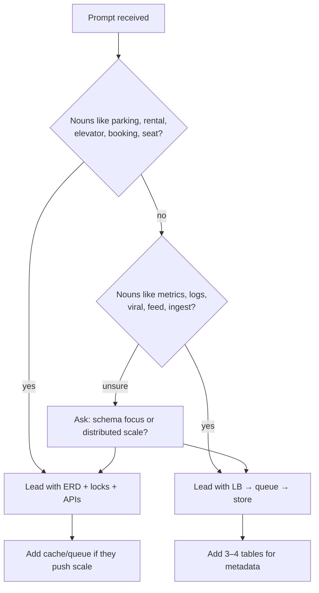
```mermaid
flowchart TD
  Q[Prompt received] --> A{Nouns like parking, rental,<br/>elevator, booking, seat?}
  A -->|yes| LLD[Lead with ERD + locks + APIs]
  A -->|no| B{Nouns like metrics, logs,<br/>viral, feed, ingest?}
  B -->|yes| HLD[Lead with LB → queue → store]
  B -->|unsure| Ask["Ask: schema focus or distributed scale?"]
  Ask --> LLD
  Ask --> HLD
  LLD --> Scale[Add cache/queue if they push scale]
  HLD --> Data[Add 3–4 tables for metadata]
```

### 0.5 Consistency cheat sheet

| Need | Tool | Say this |
|------|------|----------|
| One scarce row | `SELECT … FOR UPDATE` | “Serialize writers on the spot/vehicle/seat.” |
| High contention, fail-fast | Optimistic `version` CAS | “Loser gets 409 and retries.” |
| Time-range uniqueness | Exclusion / overlap check | “No two active bookings with overlapping ranges.” |
| Abandoned carts | Hold + TTL worker | “Soft reservation expires in 10 minutes.” |
| Client double-submit | Idempotency-Key | “Unique constraint on key; return first result.” |
| Cross-service | Outbox + webhook reconcile | “Payment and DB can diverge briefly; reconciler fixes.” |

### 0.6 Generic layered architecture (HLD backbone)

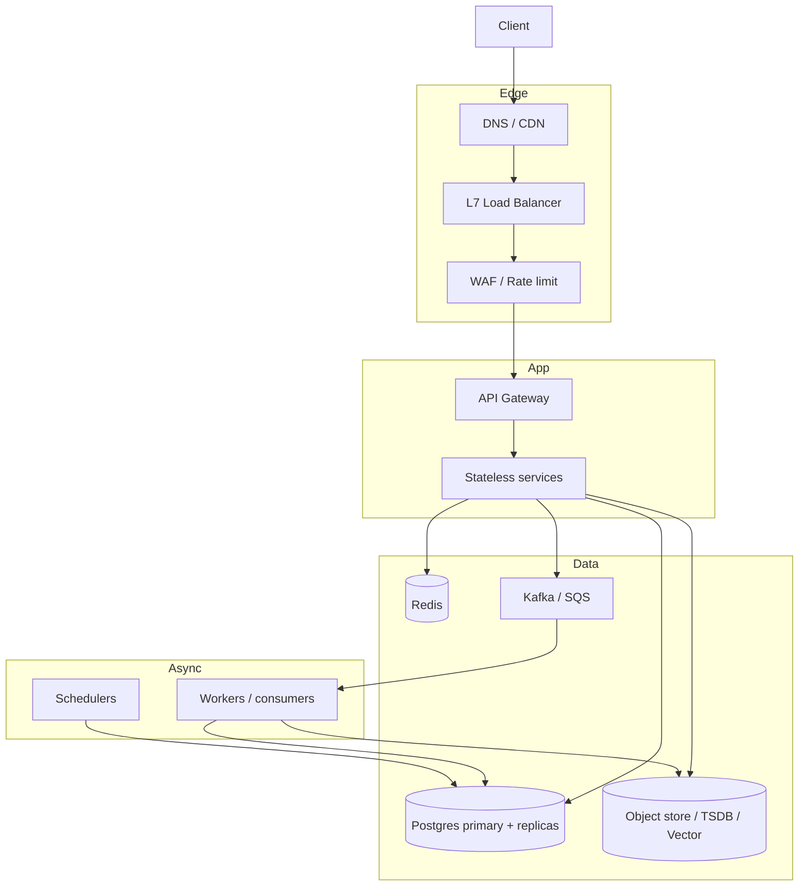
```mermaid
flowchart TB
  subgraph Edge
    DNS[DNS / CDN]
    LB[L7 Load Balancer]
    WAF[WAF / Rate limit]
  end
  subgraph App
    GW[API Gateway]
    Svc[Stateless services]
  end
  subgraph Data
    Cache[(Redis)]
    Q[Kafka / SQS]
    OLTP[(Postgres primary + replicas)]
    Obj[(Object store / TSDB / Vector)]
  end
  subgraph Async
    Workers[Workers / consumers]
    Cron[Schedulers]
  end
  Client --> DNS --> LB --> WAF --> GW --> Svc
  Svc --> Cache
  Svc --> OLTP
  Svc --> Q
  Svc --> Obj
  Q --> Workers
  Workers --> OLTP
  Workers --> Obj
  Cron --> OLTP
```

---

## 1. Parking Lot (C3 actual) — Full Playbook

### 1.1 Problem restatement (say this)

> “Drivers find and reserve a spot (optionally by type), enter/exit a lot, and pay. The hard invariant is that one spot is never assigned to two active sessions.”

### 1.2 Clarify (ask out loud)

1. One lot or many lots / floors / gates?
2. Spot types: compact, large, EV, handicap?
3. Walk-in only, or advance reservation?
4. Pricing: flat, hourly, progressive? Payments in-app or at gate?
5. Scale: spots per lot (~500–5000)? Concurrent entries/min?
6. Need admin dashboards / occupancy analytics?

### 1.3 Assumptions for v1 (write them)

* Multi-floor lot, typed spots, advance hold + walk-in
* Strong consistency on assign; availability counts may lag ≤30s
* Card payment via Stripe-like provider
* Out of scope v2: dynamic pricing ML, ANPR cameras, valet

### 1.4 NFRs (with numbers)

| NFR | Target |
|-----|--------|
| Assign / check-in p95 | < 200 ms |
| Availability read p95 | < 100 ms (cached) |
| Consistency | Spot status strongly consistent |
| Availability | 99.9% for booking API |
| Hold TTL | 10 minutes |
| Peak | 50 assigns/sec per large lot (burst) |

### 1.5 High-level architecture

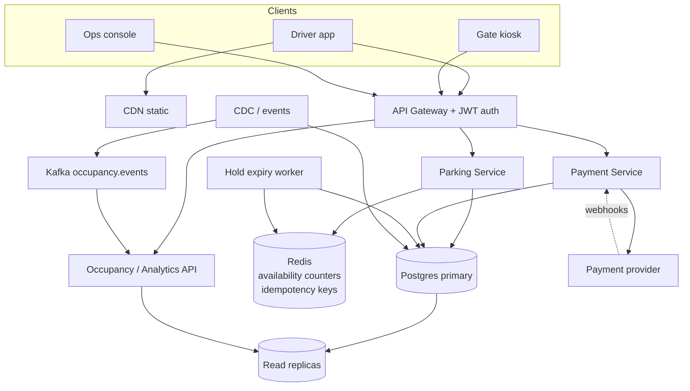
```mermaid
flowchart TB
  subgraph Clients
    Mobile[Driver app]
    Kiosk[Gate kiosk]
    Admin[Ops console]
  end

  Mobile --> CDN[CDN static]
  Mobile --> LB[API Gateway + JWT auth]
  Kiosk --> LB
  Admin --> LB

  LB --> PS[Parking Service]
  LB --> PayS[Payment Service]
  LB --> Occ[Occupancy / Analytics API]

  PS --> Redis[(Redis<br/>availability counters<br/>idempotency keys)]
  PS --> PG[(Postgres primary)]
  PG --> PGR[(Read replicas)]
  PayS --> Stripe[Payment provider]
  Stripe -.->|webhooks| PayS
  PayS --> PG

  Exp[Hold expiry worker] --> PG
  Exp --> Redis
  CDC[CDC / events] --> PG
  CDC --> Kafka[Kafka occupancy.events]
  Kafka --> Occ
  Occ --> PGR
```

### 1.6 Component responsibilities

| Component | Responsibility |
|-----------|----------------|
| Parking Service | Availability, holds, check-in/out, spot CAS |
| Payment Service | Intent/capture, webhook handling, refunds |
| Redis | Hot free-count by `(lot_id, type)`; idempotency |
| Postgres | Source of truth for spots & reservations |
| Expiry worker | `held → expired` when `hold_expires_at < now()` |
| Analytics | Near-real-time occupancy from events (eventual) |

### 1.7 ERD (detailed)

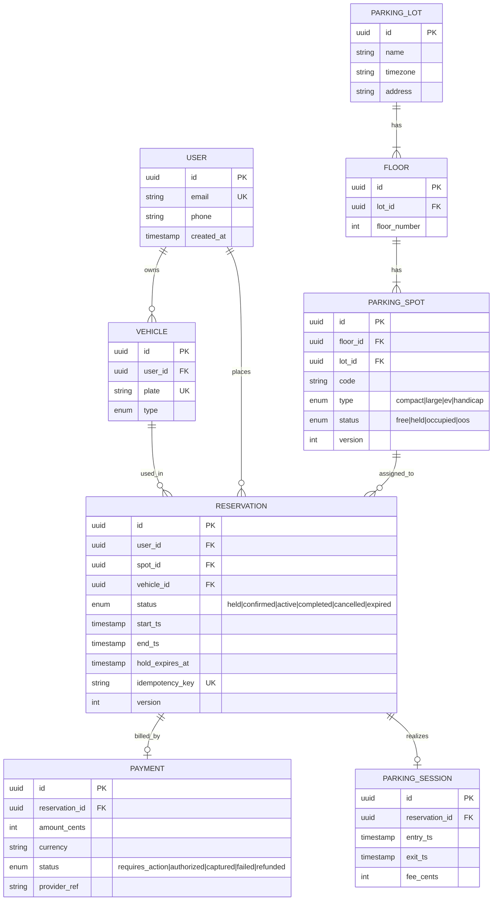
```mermaid
erDiagram
  USER ||--o{ VEHICLE : owns
  USER ||--o{ RESERVATION : places
  PARKING_LOT ||--|{ FLOOR : has
  FLOOR ||--|{ PARKING_SPOT : has
  PARKING_SPOT ||--o{ RESERVATION : assigned_to
  VEHICLE ||--o{ RESERVATION : used_in
  RESERVATION ||--o| PAYMENT : billed_by
  RESERVATION ||--o| PARKING_SESSION : realizes

  USER {
    uuid id PK
    string email UK
    string phone
    timestamp created_at
  }
  PARKING_LOT {
    uuid id PK
    string name
    string timezone
    string address
  }
  FLOOR {
    uuid id PK
    uuid lot_id FK
    int floor_number
  }
  PARKING_SPOT {
    uuid id PK
    uuid floor_id FK
    uuid lot_id FK
    string code
    enum type "compact|large|ev|handicap"
    enum status "free|held|occupied|oos"
    int version
  }
  VEHICLE {
    uuid id PK
    uuid user_id FK
    string plate UK
    enum type
  }
  RESERVATION {
    uuid id PK
    uuid user_id FK
    uuid spot_id FK
    uuid vehicle_id FK
    enum status "held|confirmed|active|completed|cancelled|expired"
    timestamp start_ts
    timestamp end_ts
    timestamp hold_expires_at
    string idempotency_key UK
    int version
  }
  PAYMENT {
    uuid id PK
    uuid reservation_id FK
    int amount_cents
    string currency
    enum status "requires_action|authorized|captured|failed|refunded"
    string provider_ref
  }
  PARKING_SESSION {
    uuid id PK
    uuid reservation_id FK
    timestamp entry_ts
    timestamp exit_ts
    int fee_cents
  }
```

### 1.8 Indexes

```sql
CREATE INDEX ON parking_spot (lot_id, type, status);
CREATE UNIQUE INDEX ON parking_spot (lot_id, code);
CREATE INDEX ON reservation (spot_id, status, start_ts);
CREATE UNIQUE INDEX ON reservation (idempotency_key);
CREATE INDEX ON reservation (status, hold_expires_at);  -- expiry worker
```

### 1.9 State machine

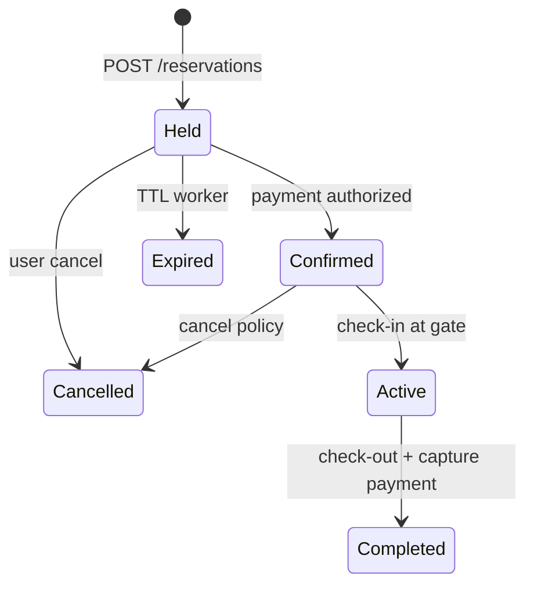
```mermaid
stateDiagram-v2
  [*] --> Held: POST /reservations
  Held --> Confirmed: payment authorized
  Held --> Expired: TTL worker
  Held --> Cancelled: user cancel
  Confirmed --> Active: check-in at gate
  Active --> Completed: check-out + capture payment
  Confirmed --> Cancelled: cancel policy
```

### 1.10 APIs (full JSON)

**Create hold**
```http
POST /v1/reservations
Idempotency-Key: 7f3c…
{ "lotId": "…", "vehicleId": "…", "spotType": "ev", "startTs": "…", "endTs": "…" }

201
{ "reservationId": "…", "spotId": "…", "spotCode": "B-214",
  "status": "held", "holdExpiresAt": "…", "pricingEstimateCents": 1200 }
```

**Check-in / out**
```http
POST /v1/reservations/{id}/check-in   → { "sessionId", "entryTs" }
POST /v1/reservations/{id}/check-out  → { "feeCents", "paymentStatus" }
```

**Availability**
```http
GET /v1/lots/{lotId}/availability?type=ev
→ { "free": 12, "held": 3, "occupied": 40, "asOf": "…", "cached": true }
```

### 1.11 Concurrency deep dive (draw this sequence)

```mermaid
sequenceDiagram
  autonumber
  participant A as Client A
  participant B as Client B
  participant API as Parking Service
  participant DB as Postgres

  A->>API: POST /reservations (EV)
  B->>API: POST /reservations (EV)
  API->>DB: BEGIN
  API->>DB: SELECT id,version FROM parking_spot<br/>WHERE lot=? AND type='ev' AND status='free'<br/>ORDER BY id FOR UPDATE SKIP LOCKED LIMIT 1
  Note over DB: A gets spot B-214
  API->>DB: UPDATE spot SET status='held', version=version+1
  API->>DB: INSERT reservation status=held
  API->>DB: COMMIT
  API-->>A: 201 B-214

  API->>DB: BEGIN
  API->>DB: SELECT … FOR UPDATE SKIP LOCKED
  alt another free EV exists
    API->>DB: hold that spot; COMMIT
    API-->>B: 201 other spot
  else none left
    API->>DB: ROLLBACK
    API-->>B: 409 NO_SPOTS
  end
```

**Why `SKIP LOCKED`:** under burst, waiters don’t pile up on the same row; they take the next free spot.

**Optimistic alternative (mention):**
```sql
UPDATE parking_spot SET status='held', version=version+1
WHERE id=$1 AND status='free' AND version=$2;
-- rowcount 0 → conflict → retry pick
```

### 1.12 Redis availability counters

```text
INCR lot:{id}:free:ev   on free←held/occupied reverse
GET  lot:{id}:free:ev   for availability API
```
Rebuild from SQL on mismatch; cache is an optimization, not source of truth.

### 1.13 Pricing & payment failure

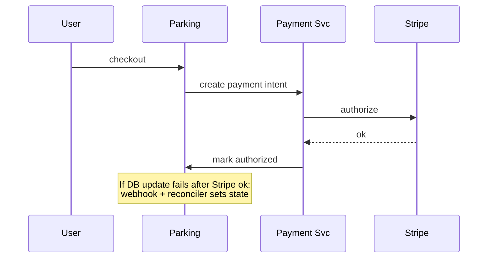
```mermaid
sequenceDiagram
  participant U as User
  participant P as Parking
  participant Pay as Payment Svc
  participant S as Stripe

  U->>P: checkout
  P->>Pay: create payment intent
  Pay->>S: authorize
  S-->>Pay: ok
  Pay->>P: mark authorized
  Note over P: If DB update fails after Stripe ok:<br/>webhook + reconciler sets state
```

### 1.14 Scale roadmap

| Phase | Change |
|-------|--------|
| v1 | Single Postgres, Redis counters, one lot |
| v2 | Read replicas for analytics; partition reservations by month |
| v3 | Shard by `lot_id` (each mega-lot its own DB); gate kiosks offline queue |

### 1.15 Follow-up questions & answers

| Interviewer | You |
|-------------|-----|
| How do you prevent double assign? | Row lock / CAS on spot status in one transaction with insert. |
| Availability wrong? | Redis can drift; SQL is truth; periodic reconcile. |
| EV charger also scarce? | Model charger as second resource or spot subtype with own lock. |
| Overstay? | Session exit fee job; status stays occupied until paid. |

### 1.16 Closing script (30 sec)

> “Source of truth is Postgres with `FOR UPDATE SKIP LOCKED` on free spots. Holds expire via worker. Redis only accelerates availability reads. Payments are authorized on confirm and reconciled by webhook if we crash mid-flight.”

---

## 2. Car Rental (Enterprise) (C3 actual) — Full Playbook

### 2.1 Restatement

> “Customers search vehicles by location/class/dates, hold one, pay, pick up and return. Invariant: no overlapping confirmed rentals for the same vehicle.”

### 2.2 Clarify

* One-way returns? Cross-branch?
* Insurance / add-ons / young-driver fees?
* Instant book vs request-to-book?
* Fleet size (10k cars)? Booking lead time?
* Corporate accounts / multi-driver?

### 2.3 NFRs

| NFR | Target |
|-----|--------|
| Search p95 | < 300 ms |
| Create booking p95 | < 400 ms |
| Double-book risk | Zero for confirmed |
| Hold TTL | 15 min |
| Peak search | 2k QPS |
| Peak book | 100 QPS |

### 2.4 Architecture

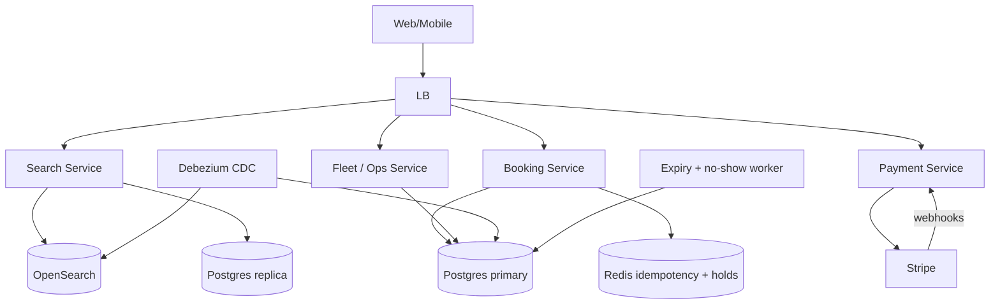
```mermaid
flowchart TB
  Web[Web/Mobile] --> LB
  LB --> Search[Search Service]
  LB --> Booking[Booking Service]
  LB --> Fleet[Fleet / Ops Service]
  LB --> Pay[Payment Service]

  Search --> OS[(OpenSearch)]
  Search --> Rep[(Postgres replica)]
  Booking --> Pri[(Postgres primary)]
  Booking --> Redis[(Redis idempotency + holds)]
  Fleet --> Pri
  Pay --> Stripe
  Stripe -->|webhooks| Pay

  CDC[Debezium CDC] --> Pri
  CDC --> OS
  Worker[Expiry + no-show worker] --> Pri
```

**Why split Search vs Booking?** Different scaling and consistency: search may be slightly stale; booking must be correct.

### 2.5 ERD

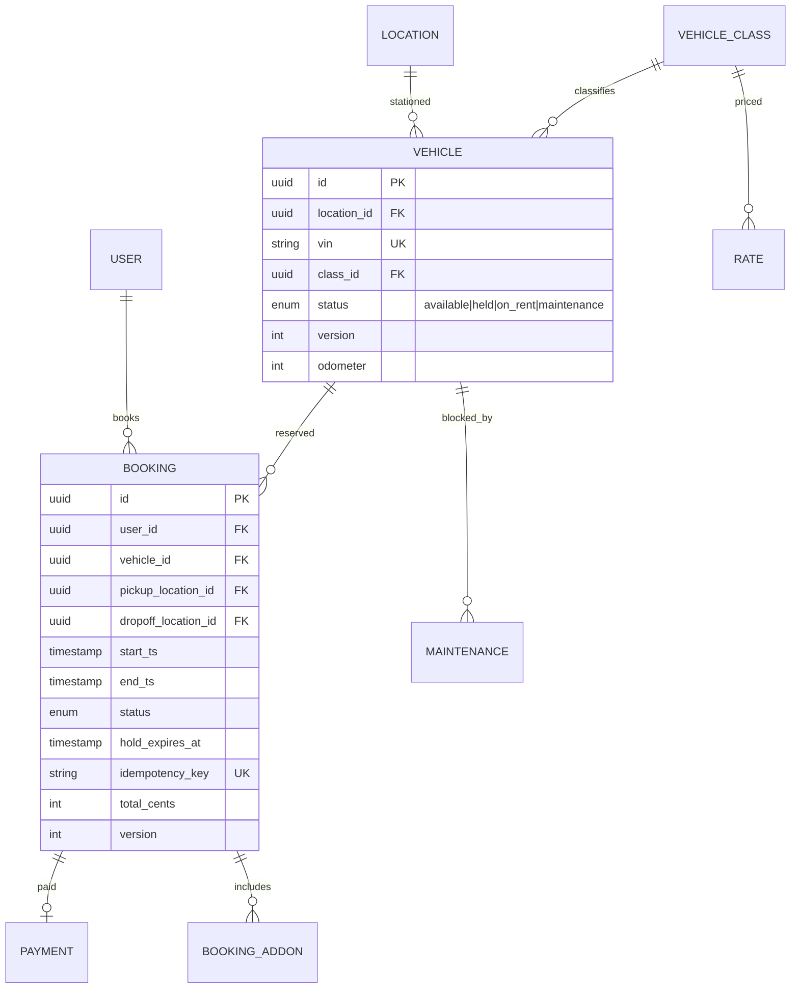
```mermaid
erDiagram
  USER ||--o{ BOOKING : books
  LOCATION ||--o{ VEHICLE : stationed
  VEHICLE_CLASS ||--o{ VEHICLE : classifies
  VEHICLE_CLASS ||--o{ RATE : priced
  VEHICLE ||--o{ BOOKING : reserved
  VEHICLE ||--o{ MAINTENANCE : blocked_by
  BOOKING ||--o| PAYMENT : paid
  BOOKING ||--o{ BOOKING_ADDON : includes

  VEHICLE {
    uuid id PK
    uuid location_id FK
    string vin UK
    uuid class_id FK
    enum status "available|held|on_rent|maintenance"
    int version
    int odometer
  }
  BOOKING {
    uuid id PK
    uuid user_id FK
    uuid vehicle_id FK
    uuid pickup_location_id FK
    uuid dropoff_location_id FK
    timestamp start_ts
    timestamp end_ts
    enum status
    timestamp hold_expires_at
    string idempotency_key UK
    int total_cents
    int version
  }
```

### 2.6 Overlap invariant (critical diagram)

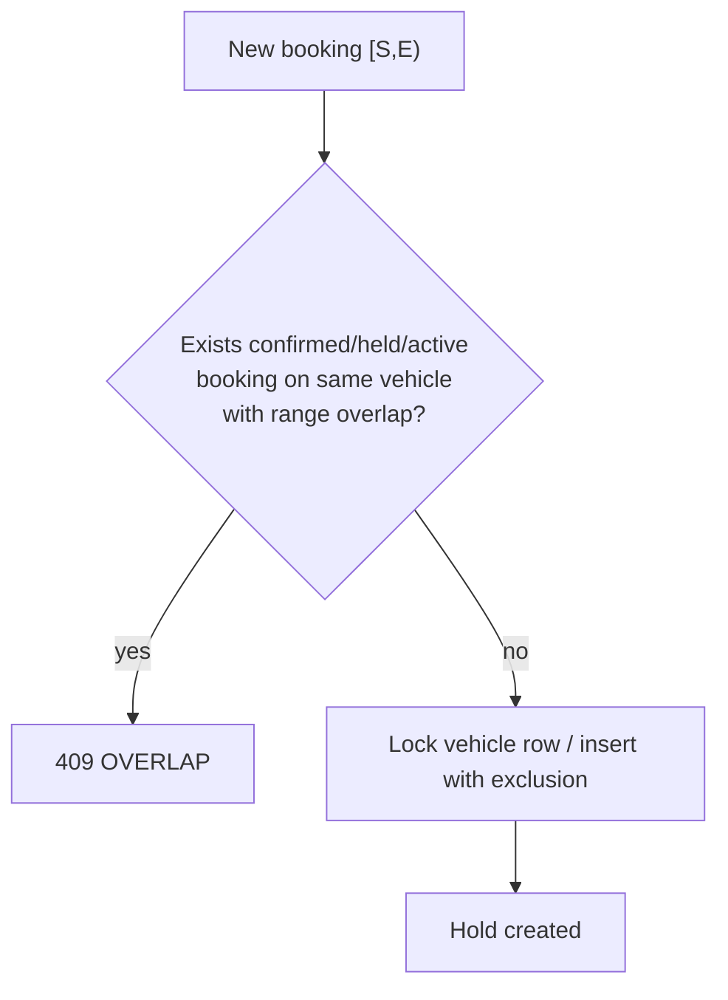
```mermaid
flowchart TD
  New["New booking [S,E)"] --> Q{Exists confirmed/held/active<br/>booking on same vehicle<br/>with range overlap?}
  Q -->|yes| Reject[409 OVERLAP]
  Q -->|no| Lock[Lock vehicle row / insert with exclusion]
  Lock --> OK[Hold created]
```

**Postgres exclusion (strong answer):**
```sql
ALTER TABLE booking ADD CONSTRAINT booking_no_overlap
EXCLUDE USING gist (
  vehicle_id WITH =,
  tstzrange(start_ts, end_ts, '[)') WITH &&
) WHERE (status IN ('held','confirmed','active'));
```

### 2.7 Booking sequence

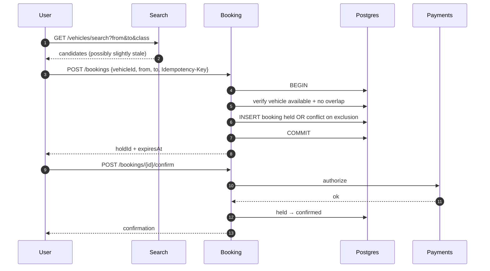
```mermaid
sequenceDiagram
  autonumber
  participant U as User
  participant S as Search
  participant B as Booking
  participant DB as Postgres
  participant P as Payments

  U->>S: GET /vehicles/search?from&to&class
  S-->>U: candidates (possibly slightly stale)
  U->>B: POST /bookings {vehicleId, from, to, Idempotency-Key}
  B->>DB: BEGIN
  B->>DB: verify vehicle available + no overlap
  B->>DB: INSERT booking held OR conflict on exclusion
  B->>DB: COMMIT
  B-->>U: holdId + expiresAt
  U->>B: POST /bookings/{id}/confirm
  B->>P: authorize
  P-->>B: ok
  B->>DB: held → confirmed
  B-->>U: confirmation
```

### 2.8 APIs

```http
GET  /v1/vehicles/search?locationId&class&from&to&page
POST /v1/bookings
     { vehicleId, pickupLocationId, dropoffLocationId, from, to, addOns[], idempotencyKey }
POST /v1/bookings/{id}/confirm
POST /v1/bookings/{id}/cancel
POST /v1/bookings/{id}/extend { newEndTs }
POST /v1/bookings/{id}/pickup  | /return
GET  /v1/bookings/{id}
```

### 2.9 State machine

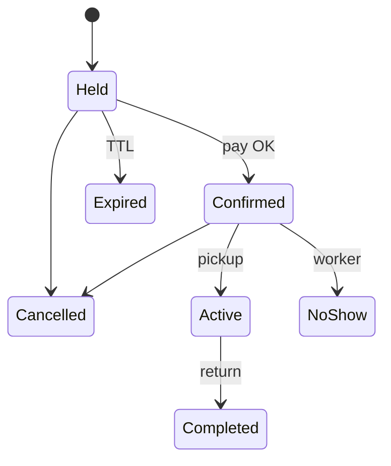
```mermaid
stateDiagram-v2
  [*] --> Held
  Held --> Confirmed: pay OK
  Held --> Expired: TTL
  Held --> Cancelled
  Confirmed --> Active: pickup
  Active --> Completed: return
  Confirmed --> NoShow: worker
  Confirmed --> Cancelled
```

### 2.10 Scale & search freshness

* Indexer lag 1–5s acceptable if booking always re-validates in SQL.
* On book success: publish `vehicle_blocked` event to remove from search quickly.
* Shard bookings by `pickup_location_id` at very large scale.

### 2.11 Follow-ups

| Q | A |
|---|---|
| Same car, different branches? | Track `location_id`; one-way creates relocation job. |
| Maintenance window? | `MAINTENANCE` table participates in overlap checks. |
| Price change after hold? | Freeze rate snapshot on hold row. |

### 2.12 Close

> “Search is optimized for read scale and can be briefly stale. Booking re-checks and enforces a GiST exclusion on vehicle + time range so double rental is impossible. Holds TTL out; payments reconcile via webhooks.”

---

## 3. Metrics Logging & Aggregation (C3 actual) — Full Playbook

### 3.1 Restatement

> “Services emit high-cardinality time series; we ingest reliably under spikes, store efficiently, and serve dashboard queries with rollups.”

### 3.2 Clarify

* Push agents vs pull Prometheus-style?
* Cardinality (unique series)? Histograms?
* Retention: raw 7d, 1m for 90d, 1h for 2y?
* Multi-tenant isolation? Alerting in scope?

### 3.3 Capacity sketch (say numbers)

```text
20k hosts × 150 metrics × 1 sample/min
= 3e6 samples/min ≈ 50k samples/sec average
× 5 peak = 250k samples/sec
≈ never write each sample as an OLTP row
```

### 3.4 Architecture (detailed)

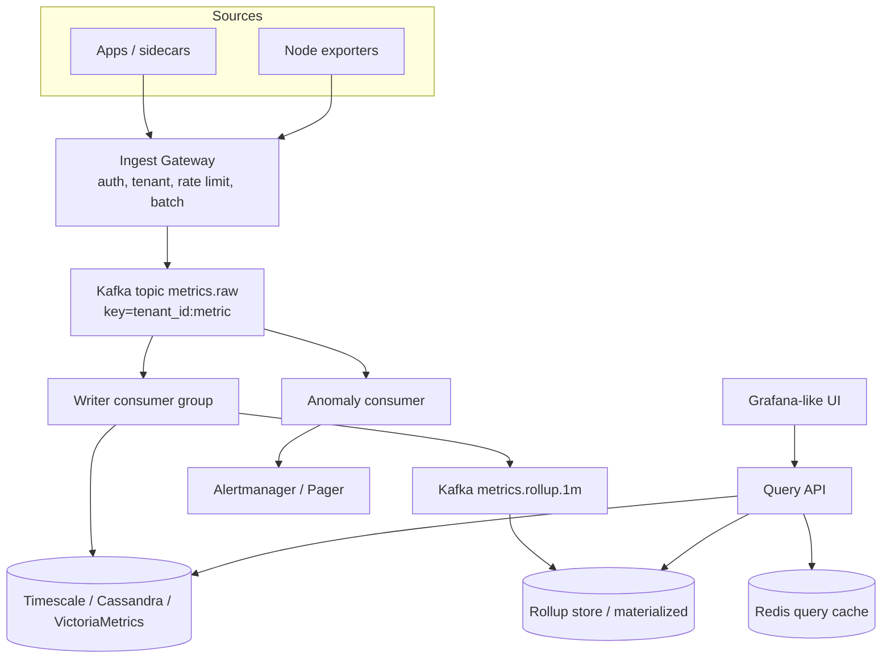
```mermaid
flowchart TB
  subgraph Sources
    App[Apps / sidecars]
    Host[Node exporters]
  end

  App --> GW[Ingest Gateway<br/>auth, tenant, rate limit, batch]
  Host --> GW
  GW --> K1[Kafka topic metrics.raw<br/>key=tenant_id:metric]

  K1 --> W[Writer consumer group]
  K1 --> A[Anomaly consumer]
  W --> TS[(Timescale / Cassandra / VictoriaMetrics)]
  W --> K2[Kafka metrics.rollup.1m]
  K2 --> R[(Rollup store / materialized)]
  A --> Alert[Alertmanager / Pager]

  UI[Grafana-like UI] --> Q[Query API]
  Q --> Cache[(Redis query cache)]
  Q --> R
  Q --> TS
```

### 3.5 Why each piece

| Piece | Why |
|-------|-----|
| Gateway | Auth, tenant quotas, compression, 202 async accept |
| Kafka | Buffer spikes; replay; fan-out to writers + alertors |
| Partition key | Avoid hot partitions; keep tenant ordering if needed |
| TSDB | Wide/time-optimized writes; compression |
| Rollups | Dashboard queries must not scan raw forever |
| Cache | Repeated dashboard panels |

### 3.6 Ingest sequence

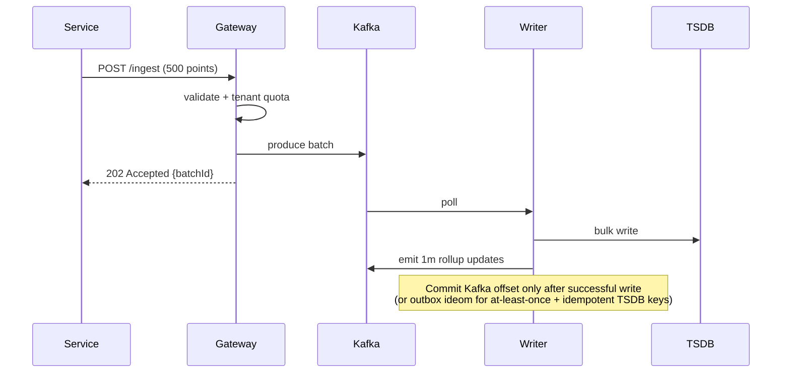
```mermaid
sequenceDiagram
  participant S as Service
  participant G as Gateway
  participant K as Kafka
  participant W as Writer
  participant T as TSDB

  S->>G: POST /ingest (500 points)
  G->>G: validate + tenant quota
  G->>K: produce batch
  G-->>S: 202 Accepted {batchId}
  K->>W: poll
  W->>T: bulk write
  W->>K: emit 1m rollup updates
  Note over W: Commit Kafka offset only after successful write<br/>(or outbox ideom for at-least-once + idempotent TSDB keys)
```

### 3.7 Data model

```text
Raw:    (tenant_id, metric, tags_hash, ts, value, type)
Rollup: (tenant_id, metric, tags_hash, window_ts, count, sum, min, max, haves)
Series catalog: (tenant_id, metric, tags_json, created_at)  -- control cardinality
```

**Cardinality guard:** reject or sample series above tenant budget.

### 3.8 Query API

```http
POST /v1/query
{ "tenantId": "…", "metric": "http_req_latency_ms",
  "tags": {"route":"/checkout"}, "from":"…", "to":"…", "step":"1m",
  "agg":"p95" }
```

Query planner: if `step>=1m` and range>2h → rollup store; else raw.

### 3.9 Failure & consistency

* At-least-once from Kafka → idempotent writes with `(series_id, ts)` unique.
* Prefer **availability** on ingest; dashboards lag seconds.
* Poison batches → DLQ topic + alert.

### 3.10 Close

> “Gateway + Kafka protect storage from bursts. TSDB holds raw hot data; rollups serve dashboards. We explicitly do not use relational inserts per point.”

---

## 4. Pastebin / Viral Text (C3 actual) — Full Playbook

### 4.1 Restatement

> “Users publish text snippets and share a short link. Reads can go massively viral on a single key; writes are moderate.”

### 4.2 Clarify

Max size (1MB)? TTL? Password-private? Burn-after-read? Custom aliases? Auth required?

### 4.3 Capacity example

```text
5M new pastes/day × 8 KB avg = 40 GB/day ≈ 1.2 TB/month content → object storage
Reads 30× writes = 150M reads/day ≈ 1.7k QPS avg, 15–50k QPS peak on hot keys
```

### 4.4 Architecture

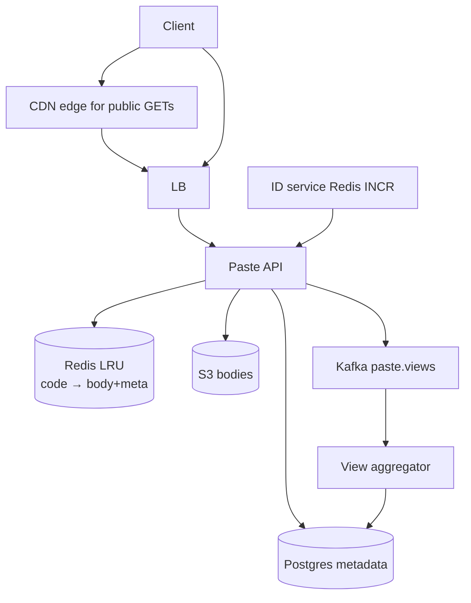
```mermaid
flowchart TB
  U[Client] --> CDN[CDN edge for public GETs]
  CDN --> LB[LB]
  U --> LB
  LB --> API[Paste API]
  API --> Redis[(Redis LRU<br/>code → body+meta)]
  API --> PG[(Postgres metadata)]
  API --> S3[(S3 bodies)]
  API --> K[Kafka paste.views]
  K --> Agg[View aggregator]
  Agg --> PG
  ID[ID service Redis INCR] --> API
```

### 4.5 Write vs read paths

```mermaid
flowchart LR
  subgraph Write
    W1[POST content] --> W2[Put S3]
    W2 --> W3[Insert metadata Postgres]
    W3 --> W4[Warm Redis optional]
  end
  subgraph Read
    R1[GET /{code}] --> R2{Redis?}
    R2 -->|hit| R3[Return]
    R2 -->|miss| R4[Postgres + S3]
    R4 --> R5[Fill Redis]
    R5 --> R3
  end
```

### 4.6 Schema

```sql
CREATE TABLE paste (
  id            BIGSERIAL PRIMARY KEY,
  short_code    TEXT UNIQUE NOT NULL,  -- base62
  user_id       UUID NULL,
  s3_key        TEXT NOT NULL,
  size_bytes    INT NOT NULL,
  visibility    TEXT NOT NULL,         -- public|unlisted|private
  password_hash TEXT NULL,
  expires_at    TIMESTAMPTZ NULL,
  created_at    TIMESTAMPTZ NOT NULL,
  view_count    BIGINT NOT NULL DEFAULT 0
);
```

### 4.7 Viral key protection

1. Redis + CDN for public pastes  
2. Request coalescing (singleflight) on cache miss  
3. Soft rate limit per IP on POST  
4. View counts async (don’t write Postgres on every GET)  
5. Optional: replicate hot object to memory on multiple edges  

### 4.8 Sequence (cache miss under load)

```mermaid
sequenceDiagram
  participant C1 as Client1
  participant C2 as Client2
  participant A as API
  participant L as Singleflight lock
  participant R as Redis
  participant S as S3

  C1->>A: GET /xY9
  C2->>A: GET /xY9
  A->>R: MISS
  A->>L: acquire code=xY9
  Note over L: C1 loads; C2 waits
  A->>S: GET object
  A->>R: SET ttl
  L-->>A: release + share result
  A-->>C1: 200
  A-->>C2: 200
```

### 4.9 Close

> “Split metadata and blob storage. The viral path is cache and CDN. The database never stores the body and never sees per-read writes.”

---

## 5. Elevator System (C3 OOD) — Full Playbook

### 5.1 Restatement

> “Simulate elevators serving hall and cabin calls efficiently and safely. This is OOD + scheduling, not cloud architecture.”

### 5.2 Clarify

Floors? Elevator count? Max capacity? Peak-mode (up-peak morning)? Express elevators? Door timing?

### 5.3 Class diagram (detailed)

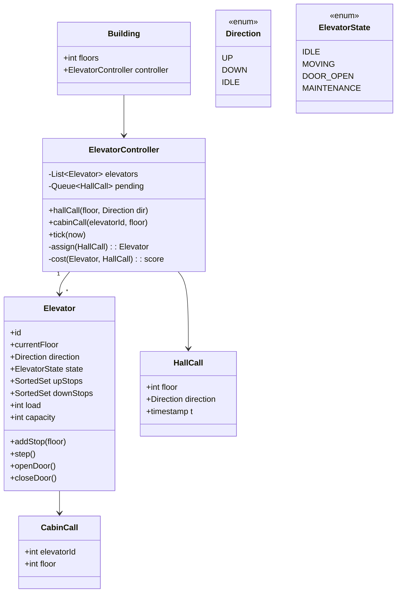
```mermaid
classDiagram
  direction TB
  class Building {
    +int floors
    +ElevatorController controller
  }
  class ElevatorController {
    -List~Elevator~ elevators
    -Queue~HallCall~ pending
    +hallCall(floor, Direction dir)
    +cabinCall(elevatorId, floor)
    +tick(now)
    -assign(HallCall): Elevator
    -cost(Elevator, HallCall): score
  }
  class Elevator {
    +id
    +currentFloor
    +Direction direction
    +ElevatorState state
    +SortedSet upStops
    +SortedSet downStops
    +int load
    +int capacity
    +addStop(floor)
    +step()
    +openDoor()
    +closeDoor()
  }
  class HallCall {
    +int floor
    +Direction direction
    +timestamp t
  }
  class CabinCall {
    +int elevatorId
    +int floor
  }
  class Direction {
    <<enum>>
    UP
    DOWN
    IDLE
  }
  class ElevatorState {
    <<enum>>
    IDLE
    MOVING
    DOOR_OPEN
    MAINTENANCE
  }
  Building --> ElevatorController
  ElevatorController "1" --> "*" Elevator
  ElevatorController --> HallCall
  Elevator --> CabinCall
```

### 5.4 LOOK scheduling

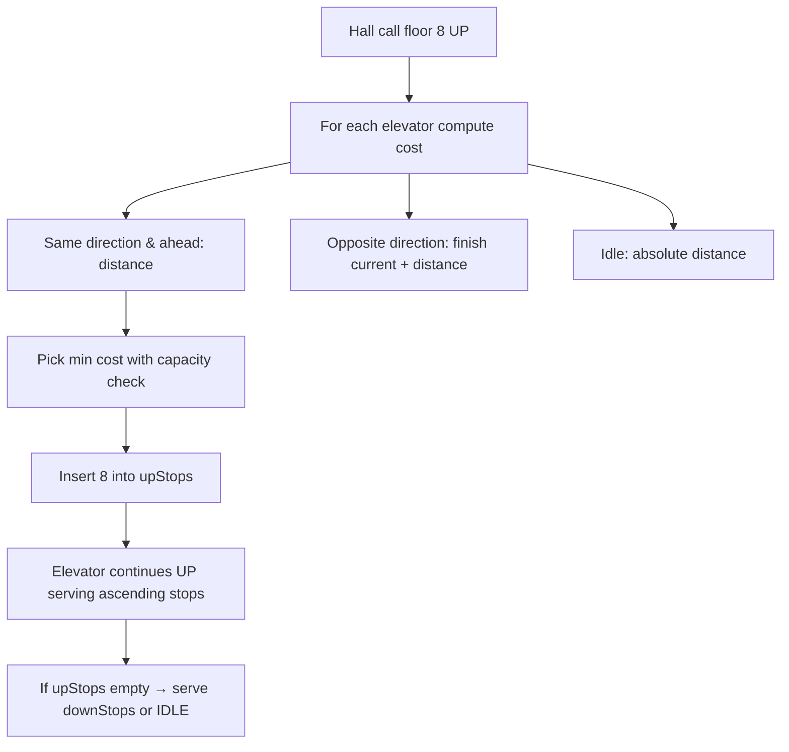
```mermaid
flowchart TD
  Call[Hall call floor 8 UP] --> Eval[For each elevator compute cost]
  Eval --> C1[Same direction & ahead: distance]
  Eval --> C2[Opposite direction: finish current + distance]
  Eval --> C3[Idle: absolute distance]
  C1 --> Min[Pick min cost with capacity check]
  Min --> Assign[Insert 8 into upStops]
  Assign --> Run[Elevator continues UP serving ascending stops]
  Run --> Rev[If upStops empty → serve downStops or IDLE]
```

### 5.5 Per-tick behavior

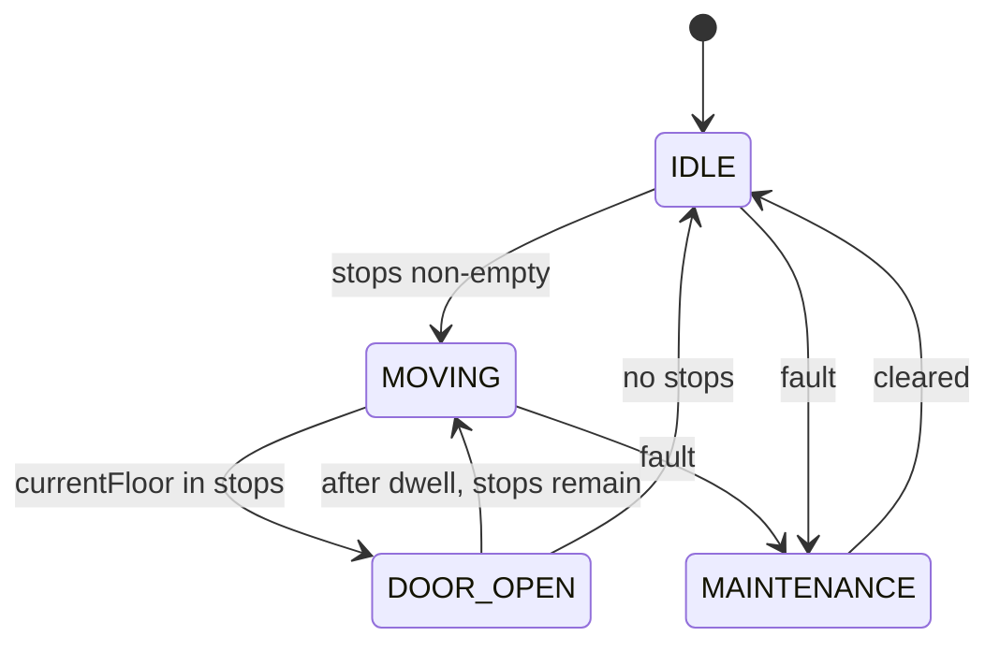
```mermaid
stateDiagram-v2
  [*] --> IDLE
  IDLE --> MOVING: stops non-empty
  MOVING --> DOOR_OPEN: currentFloor in stops
  DOOR_OPEN --> MOVING: after dwell, stops remain
  DOOR_OPEN --> IDLE: no stops
  MOVING --> MAINTENANCE: fault
  IDLE --> MAINTENANCE: fault
  MAINTENANCE --> IDLE: cleared
```

### 5.6 Threading model

* **Single-threaded simulator:** `controller.tick()` advances all elevators — easiest in interview.  
* **Actor model:** each elevator mailbox — mention as production variant.

### 5.7 APIs / methods

```text
POST hallCall(floor, direction)
POST cabinCall(elevatorId, floor)
GET  status() -> [{id, floor, direction, state, stops}]
tick() // for simulation
```

### 5.8 Follow-ups

| Q | A |
|---|---|
| Starvation? | Aging: increase priority of long-waiting hall calls. |
| Crowded car? | Reject cabin calls when at capacity; skip hall assign if load high. |
| Emergency? | Clear stops; go to designated floor; state=MAINTENANCE. |

### 5.9 Close

> “Classes: Building, Controller, Elevator, Call. LOOK assignment by cost. Tick-based simulation keeps reasoning simple.”

---

## 6. Ticket / Event Booking (Ticketmaster pattern)

### 6.1 Architecture

```mermaid
flowchart TB
  User --> API[Booking API]
  API --> Seats[(Seat inventory Postgres)]
  API --> Redis[(Hold TTL keys)]
  API --> Pay[Payments]
  Pay -->|webhook| API
  Exp[Expiry worker] --> Seats
  Exp --> Redis
  API --> Wait[Optional waitlist service]
```

### 6.2 Seat state machine

```mermaid
stateDiagram-v2
  [*] --> Available
  Available --> Held: hold
  Held --> Available: TTL expire / release
  Held --> Sold: payment success
  Sold --> [*]
```

### 6.3 Deep dive

Hold seats with `SELECT … FOR UPDATE` (or CAS status) for 10 minutes → pay → mark sold. Same scarce-resource pattern as parking/rental; cite this when interviewer asks about races.

### 6.4 Hot-event scale

* Shard inventory by section  
* Queue waiting room (virtual queue) before hold API  
* Idempotent holds per user+event  

---

## 7. Ride-Sharing

### 7.1 Architecture

```mermaid
flowchart TB
  Rider --> Trip[Trip Service]
  Driver --> Loc[Location Service]
  Driver --> Trip
  Loc --> GEO[(Redis GEO + status)]
  Trip --> PG[(Postgres trips)]
  Trip --> GEO
  Trip --> Offer[Offer Pub/Sub]
  Offer --> Driver
  Trip --> Fare[Fare]
  Trip --> Pay[Payments]
  Trip --> Map[Maps ETA provider]
```

### 7.2 Matching sequence (detailed)

```mermaid
sequenceDiagram
  autonumber
  participant R as Rider
  participant T as Trip
  participant G as Redis GEO
  participant D as Driver apps
  participant DB as Postgres

  R->>T: POST /trips {pickup, dropoff}
  T->>DB: INSERT trip status=requested
  T->>G: GEOSEARCH radius=3km available drivers
  T->>D: push offers to top K
  D->>T: POST /trips/{id}/accept
  T->>DB: UPDATE trips SET driver_id=$d, status='assigned'<br/>WHERE id=$t AND status='requested'
  alt rowcount=1
    T->>G: set driver status=busy
    T-->>D: success
    T-->>R: driver assigned + ETA
  else rowcount=0
    T-->>D: 409 taken
  end
```

### 7.3 Schema highlights

```text
Trip(id, rider_id, driver_id, status, pickup_geopoint, dropoff_geopoint,
     requested_at, assigned_at, fare_cents, version)
DriverStatus in Redis: {available|offered|busy|offline}, last_location, geohash
```

### 7.4 Hard problems to mention

* Offer stampede → limit concurrent offers; short offer TTL  
* Ghost drivers → location freshness heartbeat  
* Surge pricing → separate pricing service reading demand metrics  
* Exact fare → finalize on trip end; authorize hold earlier  

---

## 8. Dropbox-like File Storage

### 8.1 Architecture

```mermaid
flowchart TB
  Client --> Meta[Metadata Service]
  Client --> S3[S3 presigned PUT/GET]
  Meta --> PG[(Postgres tree + versions)]
  Meta --> Redis[(Locks / sessions)]
  Meta --> S3
  Search[Indexer] --> PG
  Search --> OS[(OpenSearch filenames)]
  Share[Share Service] --> PG
  CDN --> S3
```

### 8.2 Upload sequence

```mermaid
sequenceDiagram
  participant C as Client
  participant M as Metadata
  participant S as S3

  C->>M: POST /upload-sessions {name, parentId, size, checksum}
  M-->>C: {sessionId, presignedUrl, parts[]}
  C->>S: PUT bytes (multipart if large)
  C->>M: POST /upload-sessions/{id}/complete
  M->>M: txn: FileNode + FileVersion + dedup by checksum
  M-->>C: {fileId, version}
```

### 8.3 Metadata schema

```text
FileNode(id, parent_id, owner_id, name, type file|folder, is_deleted, unique(parent_id,name))
FileVersion(id, file_id, s3_key, size, checksum, version_num)
Share(id, node_id, grantee_id, permission read|write)
```

### 8.4 Hard topics

* Move/rename races → row lock on parent  
* Sync conflicts → version vectors or LWW + conflict copy  
* Dedup → content hash  
* Large files → multipart + checksum per part  

---

## 9. URL Shortener

### 9.1 Architecture

```mermaid
flowchart LR
  User --> LB --> App
  App --> Redis[(code→url)]
  App --> PG[(urls)]
  App --> ID[Snowflake / Redis INCR → base62]
  App --> K[Kafka clicks]
  K --> Analytics
```

### 9.2 Design choices table

| Decision | Option A | Option B | Pick when |
|----------|----------|----------|-----------|
| ID | Counter base62 | Hash long URL | Counter: predictable size; Hash: dedup |
| Redirect | 301 | 302 | 302 if counting clicks |
| Storage | SQL | KV | SQL fine to millions/day with cache |

### 9.3 Redirect path

Cache-first; on miss load SQL; fill cache; async click event.

---

## 10. Rate Limiter / Hit Counter

### 10.1 Placement

```mermaid
flowchart LR
  Client --> Edge[CDN/WAF]
  Edge --> GW[API Gateway]
  GW --> RL{Redis rate limit}
  RL -->|allow| Svc
  RL -->|deny 429| Client
```

### 10.2 Algorithms (detail)

**Token bucket**
* Capacity `C`, refill `r` tokens/sec  
* Atomic Redis Lua: refill based on clock, then take 1  

**Sliding window counter**
* Current minute + previous minute weighted by overlap  

**Hit counter (coding → design)**
* Single node: arrays size 300  
* Multi node: Kafka → aggregator OR Redis INCR with TTL buckets  

### 10.3 Redis Lua sketch (say verbally)

```text
tokens = min(C, tokens + (now-last)*r)
if tokens < 1: deny else tokens--, allow
```

---

## 11. Enterprise RAG / Agent Platform

### 11.1 Architecture (detailed)

```mermaid
flowchart TB
  subgraph Ingest
    Src[SharePoint/S3/Confluence] --> Conn[Connectors]
    Conn --> Parse[Parse/OCR/PII redact]
    Parse --> Chunk[Chunker]
    Chunk --> Emb[Embed workers]
    Emb --> VDB[(Vector DB collections per tenant)]
    Chunk --> Meta[(Postgres docs/chunks/ACL)]
  end

  subgraph Serving
    U[User] --> API[Answer / Agent API]
    API --> Auth[AuthN/Z tenant + ACL]
    Auth --> Ret[Hybrid retrieve: BM25 + ANN]
    Ret --> Meta
    Ret --> VDB
    Ret --> Rerank[Cross-encoder rerank]
    Rerank --> LLM[LLM gateway]
    LLM --> Guard[Citation check + schema validate]
    Guard --> Audit[(Audit + traces)]
  end

  subgraph Agent
    API --> Graph[Orchestrator]
    Graph --> Tools[Allowlisted tools]
    Tools --> HITL[Human approval]
  end
```

### 11.2 Grounded answer sequence

```mermaid
sequenceDiagram
  participant U as User
  participant A as API
  participant V as Vector+Meta
  participant L as LLM

  U->>A: question + tenant JWT
  A->>A: expand ACL document allow-list
  A->>V: retrieve top 50 → rerank top 5
  V-->>A: chunks with doc ids
  A->>L: prompt: answer ONLY from chunks; cite [#]
  L-->>A: answer + citations
  A->>A: verify each citation maps to retrieved chunk
  alt citation missing
    A-->>U: refuse / ask clarify
  else ok
    A-->>U: answer + sources
    A->>A: write audit log
  end
```

### 11.3 Tables

```text
Tenant, Document(acl_roles[]), Chunk(doc_id, ordinal, text, hash),
EmbeddingRef(chunk_id, model, vector_id),
Conversation, Message, Citation(message_id, chunk_id, span),
ToolCall(status, args, result), AuditEvent
```

### 11.4 NFRs to emphasize (FDE / C3)

* ACL **before** retrieval (security > recall)  
* Citations mandatory  
* Private model endpoint / VPC  
* Eval set + prompt versioning before prod promote  
* Cost controls: max tokens, cache embeddings  

### 11.5 Close

> “Ingest and query are separate pipelines. Retrieval is ACL-aware. The model is not the source of truth—chunks are. Agents get typed tools, budgets, and audit logs.”

---

## 12. IoT / Telemetry Ingestion

### 12.1 Architecture

```mermaid
flowchart TB
  Dev[Sensors / PLCs / Edge gateways] --> Proto[MQTT / HTTPS / OPC-UA]
  Proto --> Edge[Edge ingest + buffer]
  Edge --> K[Kafka site→region]
  K --> RT[Realtime rules]
  K --> TS[(TSDB)]
  K --> Lake[S3 Parquet]
  Reg[Device registry] --> PG[(Postgres)]
  Twin[Digital twin] --> Redis
  RT --> CMMS[Tickets / maintenance]
```

### 12.2 Guarantees

| Issue | Approach |
|-------|----------|
| Dupes | Idempotent key `(device_id, event_id)` |
| Clock skew | Store `device_ts` + `received_ts` |
| Backfill storm | Edge buffer + Kafka lag autoscaling |
| Exactly-once | Effectively-once via idempotent sinks |

### 12.3 Device twin

```text
Redis: device:{id} → {state, last_seen, firmware, config_version}
Postgres: durable registry + credentials
```

---

## 13. Notification System

### 13.1 Architecture

```mermaid
flowchart TB
  Prod[Product services] --> NAPI[Notification API]
  NAPI --> Pref[(Prefs / quiet hours / consent)]
  NAPI --> K[Kafka by channel]
  K --> Email
  K --> SMS
  K --> Push
  K --> InApp
  Email --> Prov[SES/Twilio/FCM]
  Email --> DLQ
  SMS --> DLQ
  NAPI --> Outbox[(Outbox table optional)]
```

### 13.2 Deduping

Unique `(user_id, template_id, dedupe_key)` for 24h. Retries use same key.

### 13.3 Fan-out

Large audience → chunk into 1k-user jobs; progress in DB; don’t put 10M IDs in one message.

---

## 14. Chat / Messaging

### 14.1 Architecture

```mermaid
flowchart TB
  CA[Client A] --> WS[WS Gateway / presence]
  CB[Client B] --> WS
  WS --> Msg[Message Service]
  Msg --> Store[(Cassandra / Dynamo by conv_id + ts)]
  Msg --> Fan[Fanout service]
  Fan --> WS
  Msg --> Push[Offline push]
  Msg --> MQ[Kafka for async integrations]
  WS --> Pres[(Redis presence / conn map)]
```

### 14.2 Delivery guarantees

* Client `client_msg_id` for idempotent send  
* Per-connection ACK; store-and-forward if offline  
* Read receipts async  

### 14.3 Ordering

Order within a conversation partition; don’t claim global total order.

---

## 15. Distributed Job / Workflow System

### 15.1 Architecture

```mermaid
flowchart LR
  API[Job API] --> DB[(Jobs Postgres)]
  API --> Q[Kafka/SQS]
  Q --> W[Workers]
  W --> DB
  W --> DLQ
  Sched[Cron] --> API
  W --> Hooks[Webhooks on terminal state]
```

### 15.2 State machine

```mermaid
stateDiagram-v2
  [*] --> queued
  queued --> running
  running --> succeeded
  running --> failed
  failed --> queued: retry if attempts < max
  failed --> dead: else
  running --> cancelled
```

### 15.3 Worker contract

1. Receive message  
2. CAS `queued → running` (prevent double run)  
3. Execute idempotently  
4. Mark terminal + commit offset  
5. On crash: visibility timeout returns to queue  

---

## 16. Feature Store / Model Serving

### 16.1 Architecture

```mermaid
flowchart TB
  Batch[Batch pipelines] --> Off[(Offline warehouse features)]
  Stream[Stream] --> On[(Online Redis/Dynamo)]
  Off --> Mat[Materialization jobs]
  Mat --> On
  Pred[Prediction API] --> On
  Pred --> Model[Model server]
  Model --> Reg[Model registry]
  Pred --> Log[Feature + prediction log]
  Log --> Lake[Training lake]
```

### 16.2 Talk track

Point-in-time joins for training; online path only uses features available at request time; registry supports rollback; shadow mode before promote.

---

## 17. Cross-Cutting Patterns

### 17.1 Universal booking pattern

```mermaid
flowchart LR
  S[Search eventual] --> H[Hold + TTL]
  H --> P[Pay authorize]
  P --> C[Confirm strong]
  H --> X[Expire worker]
  C --> F[Fulfill]
```

### 17.2 Outbox pattern

```mermaid
sequenceDiagram
  participant S as Service
  participant DB as Postgres
  participant B as Outbox poller
  participant K as Kafka

  S->>DB: txn: business row + outbox row
  B->>DB: read outbox
  B->>K: publish
  B->>DB: mark sent
```

### 17.3 Cache patterns

| Pattern | Use |
|---------|-----|
| Cache-aside | Pastebin reads, availability |
| Write-through | Rare; simpler consistency |
| TTL + jitter | Avoid stampedes |
| Singleflight | Hot key miss |

### 17.4 When to pick stores

| Data | Store |
|------|-------|
| Bookings, users, money | Postgres |
| Hot keys / locks / GEO / rate limits | Redis |
| Spiky ingest | Kafka |
| Blobs | S3 |
| Time series | TSDB |
| Vectors | Vector DB |
| Huge append messages | Cassandra/Dynamo |

---

## 18. Capacity Estimation Workbook

### Template

```text
DAU = _
Actions/user/day = _
Daily requests = DAU × actions
Avg QPS = daily / 86400
Peak QPS ≈ avg × 3..10
Storage/day = writes/day × bytes
```

### Pastebin

```text
5e6 writes/day × 8KB = 40GB/day
Reads 30× → ~1.7k avg QPS, design cache for 50k peak hot key
```

### Metrics

```text
50k samples/sec avg → Kafka + TSDB; rollups mandatory
```

### Rides (city)

```text
5k drivers × 1 Hz location = 5k QPS → Redis GEO
100 trips/sec peak → Postgres OK
```

### RAG

```text
10M docs × 20 chunks = 200M vectors
64-byte dim compressed ~ … size vector DB; embed async
Query QPS 50 p95 < 2s with ANN + cache
```

---

## 19. Failure Modes Catalog

| Failure | Detection | Mitigation |
|---------|-----------|------------|
| Payment OK, DB fail | webhook missing order | reconciler / outbox |
| Kafka lag spike | consumer lag metric | autoscale; shed non-critical |
| Cache stampede | origin QPS spike | singleflight + lock |
| Primary DB down | health check | failover; degrade reads |
| Duplicate POST | client retry | Idempotency-Key UNIQUE |
| Poison message | retry count | DLQ + alert |
| Hot partition | broker CPU | rehash key |
| ACL bug in RAG | audit samples | deny-by-default tests |

```mermaid
flowchart TD
  F[Failure] --> R{Retry safe?}
  R -->|yes| B[Backoff + jitter]
  R -->|no| C[Compensate / reconcile]
  B --> D{Exhausted?}
  D -->|yes| DLQ[DLQ + page]
  D -->|no| B
```

---

## 20. Practice Rubric & Mocks

### Rubric / 10

| Pts | Bar |
|----:|-----|
| 2 | Clarifying Qs + numeric NFRs |
| 2 | Diagram + ≥5 entities/classes |
| 2 | APIs with example JSON |
| 3 | Concurrency/failure sequence |
| 1 | Scale phase + trade-off close |

### Mock order (recommended)

1. Parking (LLD)  
2. Car Rental (LLD)  
3. Metrics (HLD)  
4. Pastebin (HLD)  
5. Elevator (OOD)  
6. RAG (FDE story)  
7. Rides  
8. Dropbox  

### Closing sentence bank

* “Reads can be eventual; assignments cannot.”  
* “Kafka protects storage from bursts.”  
* “Cache is never the source of truth for inventory.”  
* “Idempotency keys make mobile retries safe.”  
* “I’d ship v1 correct, then shard by lot/location.”  

---

### Whiteboard redraw kit

```mermaid
flowchart LR
  B[API] --> DB[(Postgres locks)]
  B --> R[(Redis TTL)]
```

```mermaid
flowchart LR
  G[Gateway] --> K[Kafka] --> T[(TSDB)]
```

```mermaid
flowchart LR
  L[LB] --> A[App] --> C[(Redis)]
  A --> S3[(S3)]
```

```mermaid
flowchart LR
  T[Trip] --> G[(GEO)]
  T --> P[(CAS trip row)]
```

```mermaid
flowchart LR
  Q[Query] --> ACL --> V[(Vector)] --> L[LLM+cites]
```

---

*Use this as a speaking script, not a memorized essay. Draw → narrate → deep-dive one invariant → stop.*
