# C3 AI System Design — 24-Page Interview Script

## §0. Four-step framework
**Step 1 — Scope (5 min):** Restate the product, actors, three core use cases, exclusions, scale, latency, availability, consistency, retention, privacy. End with: “I’ll optimize for X and keep Y out of scope.”

**Step 2 — HLD (10 min):** Draw one request path: clients → edge/LB → stateless API → domain service → cache/database. Add queues and workers only for work that can be asynchronous. Get buy-in before deep detail.

**Step 3 — Deep dive (20 min):** Pick the hardest invariant: last resource, ordered events, hot key, idempotent payment, authorization, or scheduler safety. Define schema, API, state transitions, concurrency boundary, partition key, and failure behavior.

**Step 4 — Close (5 min):** Revisit requirements, name bottlenecks and tradeoffs, explain 10× scale, observability, security, and one deliberate omission. Summarize the design in three sentences.

**45-minute box:** 0–5 scope; 5–15 HLD; 15–35 deep dive; 35–42 failures/scale; 42–45 recap.

| Do | Don’t |
|---|---|
| Ask which invariant matters most | Start by naming technologies |
| State assumptions and rough arithmetic | Optimize imaginary scale |
| Separate source of truth from projections | Claim queues give exactly-once delivery |
| Use idempotency keys on retried writes | Hold DB transactions across network calls |
| Mark consistency per operation | Say “eventual consistency” without a bound |
| Draw the normal path before failures | Draw every component immediately |
| Explain partition and hot-key behavior | Hide races behind “use Redis” |

**Reusable opening:** “I’ll first pin down scope and scale, propose a simple end-to-end path, then deepen the riskiest invariant. I’ll reserve time for failures and growth.”

**Reusable arithmetic:** `daily writes ÷ 86,400 × peak factor`; storage = `events/s × bytes × retention`; bandwidth = `requests/s × payload`. Round aggressively and say why the estimate matters.

**Decision prompts:** Is the write acknowledged before durable storage? What is the linearization point? Which data can be stale? What retries? Who owns state transitions? How do we detect—not merely survive—failure?

## 1. Parking Lot — progressive interview
**Interviewer:** Design a parking lot system.

**Candidate:** I’ll support entry, compatible-spot assignment, exit, pricing, and payment for one multi-floor facility. I’ll exclude reservations and license-plate enforcement unless needed. Is the key invariant that one active parking session owns one spot?

**Interviewer:** Yes. Include EV and accessible spots.

**Candidate:** Actors are driver, gate hardware, attendant, and operator. Vehicles have type and capabilities; spots have size, EV charger, accessibility, floor, and status. Compatibility is policy, not a growing matrix of booleans.

**Requirements**
- Entry p95 under 300 ms; exit p95 under 500 ms excluding payment provider.
- Gate operation remains safe during partial network failure.
- Strong consistency for spot ownership and session state; seconds-stale signs are acceptable.
- Audit every assignment, override, payment transition, and gate command.

**Estimate:** Suppose 5,000 spots and 20 entry/exit operations per second at peak. The transactional dataset is small; correctness dominates throughput. Occupancy reads may be hundreds per second and cacheable.

**Candidate:** Core rows: `Spot`, `Vehicle`, `ParkingSession`, `RatePlan`, `Payment`. `ParkingSession(id, spot_id, vehicle_id, entered_at, exited_at, status, version)` is the lifecycle record. A partial unique index on active `spot_id` is the backstop.

**Interviewer:** How do two gates avoid assigning the last EV spot?

**Candidate:** Assignment service starts a short DB transaction, selects one compatible available spot with row locking or an atomic conditional update, inserts the active session, then commits. The commit is the linearization point. Cache is updated after commit; it never grants ownership.

**Interviewer:** How do you choose among several compatible spots?

**Candidate:** Correctness and optimization are separate. The compatibility policy first filters hard constraints: vehicle size, accessibility authorization, charger requirement, clearance, and spot state. A ranking policy then scores walking distance, floor balance, charger preservation, and expected exit congestion. I can change ranking without changing ownership semantics.

**Interviewer:** Could the ranking query lock too many rows?

**Candidate:** Yes, so I would read a small candidate set from an availability projection, then conditionally claim candidates one at a time in authoritative storage. A failed claim means the projection was stale; retry another candidate within a bounded budget. If contention is high, serialize assignment per `(lot,floor,spot_type)` or maintain transactional free-spot pools.

| Parking write | Consistency | Linearization point | Retry behavior |
|---|---|---|---|
| enter | strong | spot CAS + session insert commit | same key returns same session |
| move spot | strong | old release + new claim transaction | version-check session |
| record sensor | ordered per spot | event append | duplicate event ID ignored |
| begin exit | strong | session transition | return current transition |
| open gate | external idempotent | hardware acknowledges command ID | resend same command |

```sql
UPDATE spot SET status='OCCUPIED', version=version+1
WHERE id=:spot AND status='AVAILABLE' AND version=:seen;
```

**Candidate:** `POST /entries` takes vehicle attributes and an idempotency key; response includes session, spot, and gate instruction. Retrying returns the original session. `POST /sessions/{id}/exit` freezes the charge, starts payment, and advances via explicit states.

**Interviewer:** What if a driver parks in a different spot?

**Candidate:** Sensor evidence does not silently rewrite ownership. It creates a discrepancy case linking expected and observed spots. The assignment service marks both unavailable if necessary, an attendant resolves the physical state, and the correction is an audited transition. This avoids a noisy sensor stealing a legitimately owned spot.

**Interviewer:** Explain pricing without hard-coding rules.

**Candidate:** `RatePlan` is a versioned rule set selected at entry or exit by explicit policy. A charge stores plan version, time zone, entry/exit timestamps, grace periods, discounts, taxes, and line items. Recomputing the same inputs gives the same quote. A later pricing update never mutates historical charges.

**Interviewer:** The facility loses its WAN connection.

**Candidate:** Safety is local. Gate controllers retain signed configuration, command dedupe state, and a bounded offline policy. The business chooses fail-closed entry, attendant-issued offline tickets, or a reserved offline capacity allowance. Exit can validate already issued signed sessions and queue settlement. On reconnection, events upload with device sequence numbers and conflicts enter reconciliation; the device does not fabricate central commits.

**Interviewer:** Payment succeeds but the response is lost.

**Candidate:** Never keep the spot transaction open across payment. Persist `PAYMENT_PENDING` and an attempt keyed by session; call provider with the same idempotency key. A webhook or reconciliation worker records success exactly once, then issues an idempotent gate-open command.

**Failure beats**
- DB unavailable: entry gate fails closed or issues a tightly controlled offline ticket; do not guess occupancy.
- Cache unavailable: read DB, degrade signs, preserve assignment correctness.
- Sensor disagrees: mark spot `UNKNOWN`, alert attendant, keep it out of assignment.
- Gate command lost: retry by command ID; hardware reports applied command and physical state.

**Operational observability**
| Signal | SLO / alert intent |
|---|---|
| assignment p95 and CAS conflicts | latency and projection staleness |
| active sessions versus occupied spots | ownership/sensor drift |
| unknown spots by floor | sensor or network incident |
| payment pending age | provider ambiguity |
| gate command unacknowledged age | blocked physical workflow |
| offline ticket count | capacity and fraud exposure |

**Scale:** Partition facilities by `lot_id`; each lot’s writes remain local. Read replicas and cached occupancy serve dashboards. Events feed analytics asynchronously; they do not drive the gate transaction.

**Close:** The database serializes scarce-spot ownership, an idempotent session owns the lifecycle, and asynchronous reconciliation handles provider and hardware ambiguity. Availability is relaxed only where safety policy permits.

**Figure 1: Diagram 1 — Parking Lot Full HLD**
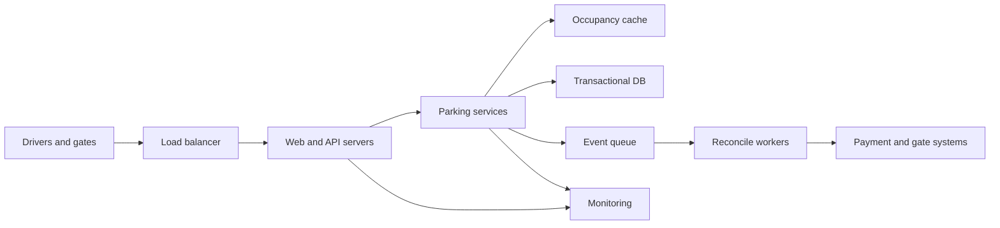
Step 2 recap: follow entry, assignment, payment, and gate traffic.  
Shows the authoritative DB, disposable cache, async recovery, externals, and monitoring.

**Figure 2: Diagram 2 — Parking Lot LLD Internals**
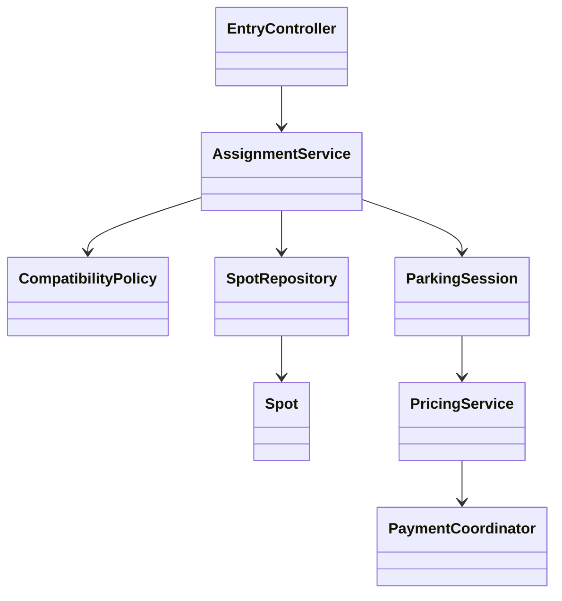
Step 3 deep dive: trace ownership from request through atomic assignment.  
Shows policy separation, session lifecycle, persistence boundary, pricing, and payment coordination.

## 2. Car Rental — progressive interview
**Interviewer:** Design car rental.

**Candidate:** I’ll cover search by location/time/class, quote, reservation, cancellation, vehicle assignment, pickup, return, and payment. Is inventory sold by exact vehicle or vehicle class?

**Interviewer:** By class; assign a car near pickup.

**Candidate:** Good. A reservation promises class capacity for a half-open interval `[start,end)`, while assignment links a physical vehicle later. That separation handles maintenance and fleet movement.

**Requirements**
- Search p95 below 300 ms and may be slightly stale.
- Booking must not oversell class capacity.
- Payments and booking retries are idempotent; every price is reproducible.
- Multi-location initially, one region; PII encrypted and access audited.

**Estimate:** 1,000 locations, 100,000 cars, 50 search requests per booking, perhaps 50 bookings/s peak. Search needs projections and cache; reservation writes fit a relational store.

**Model:** `Location`, `VehicleClass`, `FleetCapacity(location,class,date,bucket,total,reserved,version)`, `Reservation`, `Quote`, `Vehicle`, `Assignment`, `MaintenanceBlock`, `PaymentAttempt`. Persist quote inputs and expiry so checkout cannot silently reprice.

**Interviewer:** How do you avoid overbooking a three-day reservation?

**Candidate:** In one short transaction, lock or conditionally increment every affected capacity bucket in deterministic date order. Require `reserved + 1 <= total - safety_buffer`; if any bucket fails, roll back all. Unique idempotency key returns the existing reservation.

**Interviewer:** Why deterministic date order?

**Candidate:** Two overlapping bookings may touch the same date rows. Acquiring locks in ascending date order prevents a simple deadlock cycle. I still retry transaction-abort errors with jitter and the same idempotency key.

**Interviewer:** What is the reservation state machine?

**Candidate:** `PENDING_PAYMENT → CONFIRMED → CHECKED_OUT → RETURNED → CLOSED`, with `CANCELLED` and `EXPIRED` exits where legal. Transitions require expected current state and version. A separate `VehicleAssignment` can be `UNASSIGNED`, `ASSIGNED`, `REPLACEMENT_REQUIRED`, or `RELEASED`; this prevents fleet churn from corrupting the commercial promise.

| Car-rental concept | Source of truth | Projection / cache |
|---|---|---|
| sellable class capacity | capacity bucket rows | availability search index |
| quoted price | immutable quote record | search result cache |
| reservation lifecycle | reservation row + version | customer itinerary |
| physical vehicle | vehicle/assignment rows | operations board |
| payment outcome | payment attempt ledger | receipt view |

**Interviewer:** Isn’t one row per day expensive?

**Candidate:** It is bounded and easy to reason about for day-granularity rentals. At high volume, use segment summaries for search but preserve authoritative capacity buckets for booking. Search projections may lag; checkout revalidates.

**Interviewer:** How do one-way rentals affect capacity?

**Candidate:** A one-way rental consumes class capacity at origin over the rental interval and creates expected supply at destination only after a conservative return/turnaround time. I would not count the inbound vehicle as immediately sellable until confidence is high. Fleet transfer and overbooking policies are explicit planning inputs, not hidden adjustments.

**Interviewer:** A customer extends an active rental.

**Candidate:** Treat extension as a new capacity claim for the additional buckets. If the same class is unavailable, policy may offer an extension with relocation, upgrade another reservation, or deny it. The original rental remains valid even if extension fails. The transaction records the new promised return before pricing and payment settlement continue asynchronously.

**Interviewer:** How is pickup made idempotent?

**Candidate:** The desk or kiosk sends a pickup command with reservation version. A transaction validates identity and prerequisites, claims the selected vehicle if still eligible, and creates one rental contract. Retrying returns that contract. Key handoff is a device command keyed by rental ID, so a lost response does not create a second checkout.

**APIs**
- `GET /availability?location&start&end&class` returns candidates and quote token.
- `POST /reservations` takes quote token, driver reference, and idempotency key.
- `POST /reservations/{id}/assign` conditionally claims an eligible vehicle.
- `POST /rentals/{id}/return` records inspection, mileage, fuel, and final charge inputs.

**Interviewer:** What if the assigned car enters maintenance?

**Candidate:** A maintenance block transitions the vehicle out of assignable state. Assignment worker selects a replacement of same or upgraded class, using an atomic claim. If none exists, open an operations exception; never delete the reservation promise.

**Payment ambiguity:** Reservation state and payment attempt are local records. Provider calls use attempt ID. Webhooks are deduplicated; reconciliation polls unresolved attempts. Cancellation policy produces a ledger adjustment, not destructive edits.

**Failure beats**
- Search cache stale: checkout rejects cleanly or offers alternatives.
- Bucket contention: shard by location/class, serialize hot keys, or preallocate bounded tokens.
- Provider down: hold reservation briefly in `PAYMENT_PENDING`; release via expiry worker.
- Region loss: route searches elsewhere; keep booking single-writer per inventory shard.

**Lifecycle checks**
| Transition | Guard | Side effect |
|---|---|---|
| quote → pending | quote unexpired, inputs unchanged | reserve capacity |
| pending → confirmed | provider success or approved guarantee | issue confirmation |
| confirmed → checked out | identity, vehicle eligible, deposit | create rental contract |
| checked out → returned | inspection payload and odometer ordering | release vehicle to turnaround |
| returned → closed | final charge settled | immutable receipt |
| any eligible → cancelled | policy and time window | capacity release + ledger entry |

**Scale:** Event stream updates search index and utilization analytics. Capacity ownership remains in one partition; cross-location transfers are workflows with explicit source and destination reservations.

**Close:** Separate searchable availability, authoritative time-bucket capacity, and later physical assignment. Linearize at capacity update, preserve price inputs, and reconcile external payments.

**Figure 3: Diagram 3 — Car Rental Full HLD**
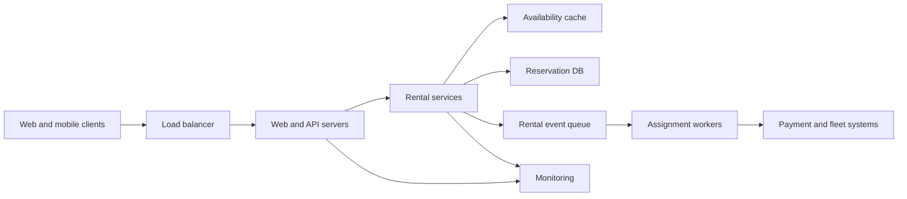
Step 2 recap: separate fast discovery from authoritative booking and fulfillment.  
Shows clients, serving tier, cache, DB, queue, workers, external systems, and telemetry.

**Figure 4: Diagram 4 — Car Rental LLD Internals**
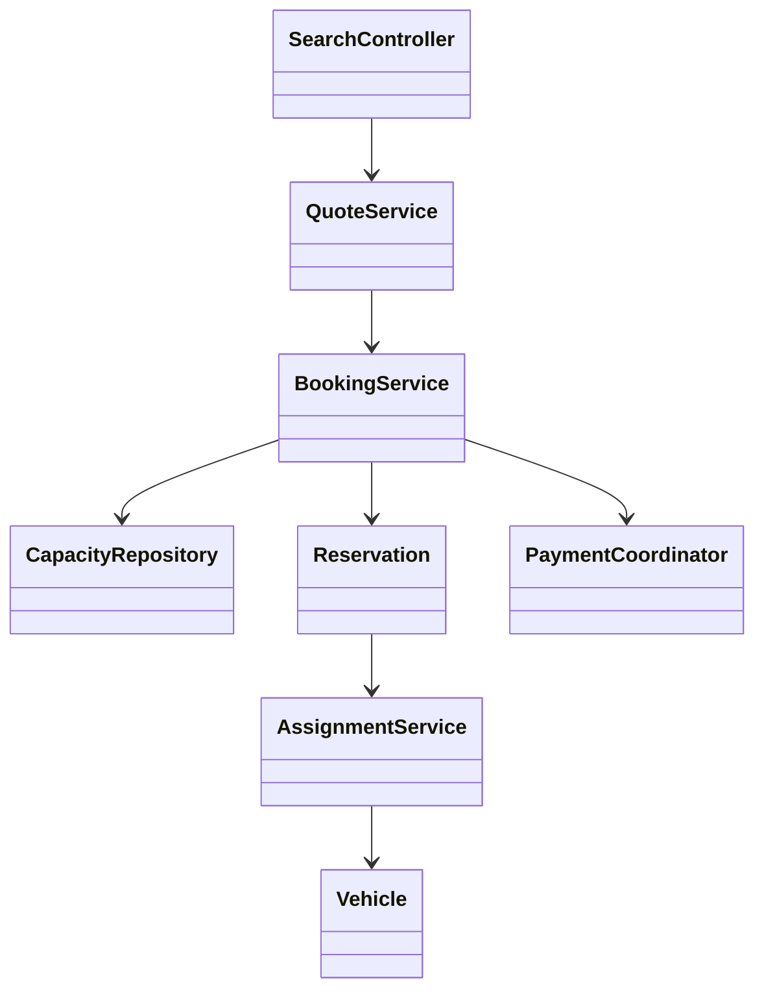
Step 3 deep dive: follow quote validation, capacity claim, and delayed assignment.  
Shows the consistency boundary and separation between class promise, vehicle, and payment.

## 3. Metrics Logging and Aggregation — progressive interview
**Interviewer:** Design a metrics platform.

**Candidate:** I’ll accept counters, gauges, and distributions; support tag filters, rollups, dashboards, and alerts. Logs and traces are out of scope. Can delivery be at-least-once with deduplication where IDs exist?

**Interviewer:** Yes. Assume very high write volume.

**Requirements**
- Durable acknowledgement within 200 ms; query recent metrics within 10 seconds.
- Sustain bursty multi-tenant ingestion and backpressure noisy tenants.
- Retain raw high-resolution data briefly and rollups longer.
- Bound tag cardinality and make partial-data gaps visible.

**Estimate:** One million samples/s at 100 bytes is about 100 MB/s and 8.6 TB/day before replication. This earns a partitioned log, streaming aggregation, compressed time-series storage, and tiered retention.

**Contract:** `MetricPoint(tenant, metric, timestamp, value, type, tags, event_id)`. Canonicalize tag order. Route by hash of `(tenant,metric,tagset)` so one series is ordered within a partition.

**Candidate:** Agents batch and compress. Ingest gateways authenticate, validate limits, assign server receive time, and append to the durable queue. Acknowledgement means the queue replicated the batch—not that every rollup exists.

**Interviewer:** Define the delivery contract precisely.

**Candidate:** The SDK retries an unacknowledged batch with stable batch and event IDs. Gateway authentication and quota checks happen before append. Once the replicated log acknowledges, the platform owes durable processing under the retention SLO. Consumers are at-least-once, checkpoints may replay, and sinks use deterministic keys such as `(series,window,resolution,version)`.

**Interviewer:** What does a series ID contain?

**Candidate:** Canonical tenant, metric name, normalized tag key/value pairs, and optionally metric schema version. We hash that canonical byte representation for routing but retain the readable dimensions for collision verification and query. Changing a tag value creates a different series.

| Metric type | Window state | Duplicate sensitivity | Merge rule |
|---|---|---|---|
| counter delta | sum, count | high | sum if disjoint/deduped |
| monotonic counter | first/last/reset markers | medium | ordered delta calculation |
| gauge | latest timestamp/value, min/max | lower | last-write-wins plus summaries |
| distribution | histogram/sketch | high | associative sketch merge |
| set cardinality | HLL-like sketch | lower | register-wise merge |

**Interviewer:** Retries duplicate points.

**Candidate:** Counters are dangerous under duplicates. Prefer producer event IDs and a bounded dedupe window in stream state. Without IDs, document at-least-once semantics; gauges can use last-write-wins by event time, but counters cannot be magically corrected.

**Interviewer:** How do alerts avoid double-firing during replay?

**Candidate:** Alert evaluation emits a deterministic decision keyed by `(rule,group,window,transition)`. Notification delivery has its own attempt ledger and dedupe key. The alert state machine distinguishes pending, firing, resolved, and muted; replay may reconstruct state but cannot create a second logical transition notification.

**Interviewer:** How do you handle late data?

**Candidate:** Each partition tracks a watermark derived from observed event time minus allowed lateness. Windows remain mutable until watermark closure. Data within a correction horizon writes a higher rollup version and invalidates query cache; older data is rejected, archived, or handled by a batch backfill. Dashboards display freshness and correction status.

**Interviewer:** Queries span millions of series.

**Candidate:** The planner estimates cost before execution: series cardinality, points after resolution selection, shard fan-out, and function complexity. It rejects or requires asynchronous query mode beyond budget. Tag indexes identify candidate series; they do not store metric values. Partial shard failures return explicit coverage metadata rather than a deceptively complete line.

**Aggregation:** Workers maintain windows keyed by series and resolution. Allow bounded lateness via watermark; update open windows and write immutable or versioned rollup blocks. Too-late points go to correction or dead-letter streams with metrics.

**Query path:** Query planner selects retention tier and resolution, fetches matching series IDs from the tag index, fans out bounded parallel reads, merges points, and caches normalized query results. Enforce maximum series and time-range budgets.

**Interviewer:** A tenant emits user ID as a tag.

**Candidate:** Admission estimates cardinality per metric and tenant, rejects or drops violating dimensions by policy, and reports dropped counts. Quotas exist at bytes, samples, active series, query work, and alert count.

**Failure beats**
- Queue lag: throttle tenants, spill bounded buffers, surface freshness watermark.
- Worker replay: checkpoint offsets with rollup versions; writes are idempotent by window key.
- Storage shard loss: replicate, query partial results explicitly, repair from retained log.
- Clock skew: track event and receive time; reject absurd future timestamps.

**Self-observability**
| Measure | Why it matters |
|---|---|
| accepted, rejected, and dropped samples by tenant/reason | admission correctness |
| log lag and oldest unprocessed event | ingestion freshness |
| watermark lag by partition | late-data health |
| active series and cardinality growth | cost explosion |
| rollup correction rate | clock/replay behavior |
| query fan-out, scanned points, partial coverage | serving cost and truthfulness |
| alert evaluation and notification lag | user-visible reliability |

**Regional design:** Ingest locally. A series has a home region for ordered aggregation, or regions aggregate independently and merge only associative summaries. Do not pretend global ordering is free.

**Close:** The replicated log absorbs writes, deterministic partitions preserve per-series order, streaming workers create tiered rollups, and query budgets control cardinality explosions. Freshness and data loss are observable SLOs.

**Figure 5: Diagram 5 — Metrics Platform Full HLD**
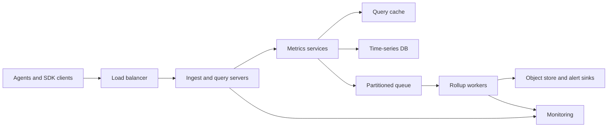
Step 2 recap: distinguish durable ingestion, asynchronous rollups, and bounded query serving.  
Shows the write log, workers, storage tiers, cache, external sinks, and self-monitoring.

**Figure 6: Diagram 6 — Metrics Platform LLD Internals**
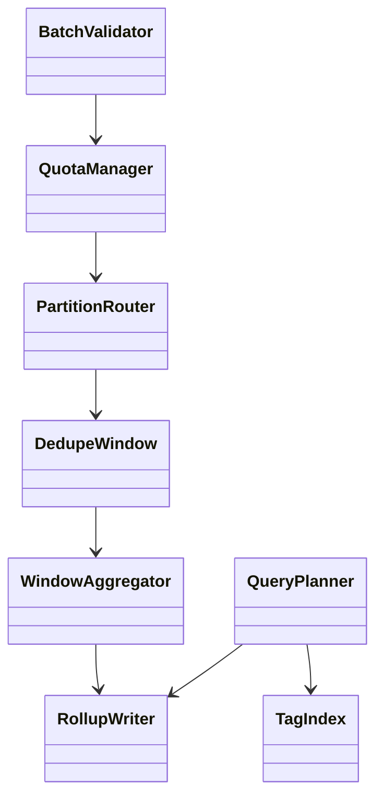
Step 3 deep dive: follow a point through admission, ordering, dedupe, and windows.  
Shows ingestion internals beside query planning and rollup access.

## 4. Pastebin / Viral Text — progressive interview
**Interviewer:** Design Pastebin.

**Candidate:** I’ll support create, read by short ID, optional expiry, unlisted/public visibility, deletion, and basic abuse controls. Text is immutable after creation; collaboration and rich media are out.

**Requirements**
- Reads dominate writes, p95 under 150 ms; create under 300 ms.
- Strong read-after-write for the creator; deletion propagates quickly.
- Maximum paste size and TTL; encrypt private content and audit access.
- Survive viral keys without collapsing the database.

**Estimate:** 10 million creates/day is about 115 writes/s average; assume 10× peak. At 10 KB average, raw daily storage is about 100 GB. Reads may be thousands/s with extreme key skew.

**Model:** `Paste(id, owner_id, object_key, content_hash, visibility, created_at, expires_at, status, version)`. Put large bodies in object storage; metadata and lifecycle live in a database. Small pastes may be inline only if measurements justify it.

**IDs:** Generate 96 random bits and Base62 encode; collision-check on insert. Random IDs avoid a central counter and resist enumeration better than sequential IDs, though unlisted is not authorization.

**APIs**
- `POST /pastes` accepts content, visibility, TTL, and idempotency key.
- `GET /pastes/{id}` returns content with cache headers.
- `DELETE /pastes/{id}` conditionally changes status and emits invalidation.

**Candidate:** Create stores body, inserts metadata, then returns ID. If object write succeeds but metadata fails, a janitor removes orphaned objects. Idempotency record prevents duplicate pastes after retries.

**Interviewer:** There is no distributed transaction between object storage and metadata. What exact order do you use?

**Candidate:** Upload to a temporary object key with checksum, then transactionally insert metadata in `PENDING` or directly `ACTIVE` only after the object is durable. A finalize operation promotes or references the immutable object. Reads require `ACTIVE`. If the client vanishes, a sweeper deletes stale temporary objects; if finalization retries, object keys and idempotency records make it safe.

**Interviewer:** Why not store everything in the database?

**Candidate:** It is a valid simple starting point at small scale. Object storage becomes useful when body size, bandwidth, replication cost, and CDN integration dominate. The split adds orphan cleanup and two-system lifecycle complexity, so I would justify it with measured payload distribution rather than habit.

| Visibility | Read authorization | Cache policy | Enumeration posture |
|---|---|---|---|
| public | none beyond abuse checks | shared CDN, long TTL with purge | random ID still discoverable if shared |
| unlisted | possession of random URL | shared only if product accepts leakage risk | not true authorization |
| private | authenticated ACL | private/per-user cache only | deny existence consistently |
| deleted/expired | deny | short tombstone/negative cache | prevent stale origin resurrection |

**Interviewer:** One paste goes viral.

**Candidate:** CDN absorbs public reads; regional cache uses request coalescing so one miss fills the key. Add short negative caching for missing/deleted IDs. The origin reads object storage once; it does not stampede the metadata DB.

**Interviewer:** What if the viral paste is deleted?

**Candidate:** The metadata transaction writes a tombstone and outbox event. Origin authorization checks the tombstone immediately. CDN purge is retried and monitored; until it completes, a short cache TTL bounds exposure. For strict legal deletion, use surrogate cache keys and provider purge acknowledgements, then lifecycle-delete encrypted content and keys according to policy.

**Interviewer:** How do edits work?

**Candidate:** My initial scope makes pastes immutable. An “edit” creates a new immutable version and atomically advances a metadata pointer under an expected-version precondition. Existing share links either remain pinned or follow latest by explicit product semantics. This retains cacheability and an audit trail.

**Interviewer:** How do you stop ID probing?

**Candidate:** Random 96-bit IDs make guessing impractical but do not replace rate limits. I add per-source and behavioral throttles, uniform not-found responses where appropriate, abuse intelligence, and authentication for private data. Logging must avoid copying sensitive paste bodies.

**Deletion and expiry:** Database status is authoritative. Emit cache/CDN invalidation through an outbox. Until purge completes, origin checks tombstone and denies. Lifecycle rules delete expired objects; a sweeper repairs missed events.

**Abuse:** Enforce size and rate limits, malware and content scans asynchronously, report workflow, and per-visibility caching rules. Private pastes use authenticated authorization and must not enter shared public caches.

**Failure beats**
- Object store timeout: do not publish metadata until durable content exists.
- Queue down: transactional outbox preserves invalidation/scan work.
- Cache down: origin shielding and DB rate limits prevent overload.
- Region loss: route public reads to replicas; keep metadata writes with one home region.

**Close:** Immutable content makes CDN and object storage effective; metadata owns visibility and deletion, while outbox-driven invalidation closes lifecycle races. Viral traffic is contained before it reaches origin.

**Figure 7: Diagram 7 — Pastebin Full HLD**
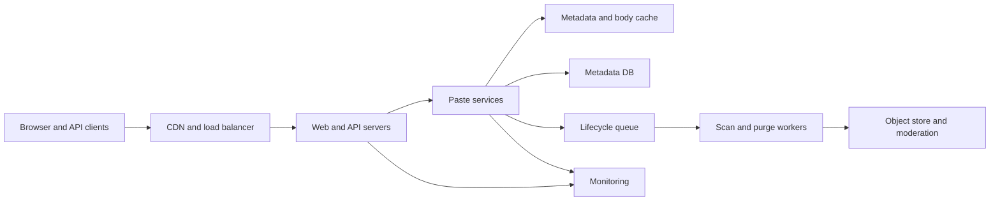
Step 2 recap: trace immutable writes and cache-heavy public reads.  
Shows edge absorption, authoritative metadata, object storage, lifecycle workers, and observability.

**Figure 8: Diagram 8 — Pastebin LLD Internals**
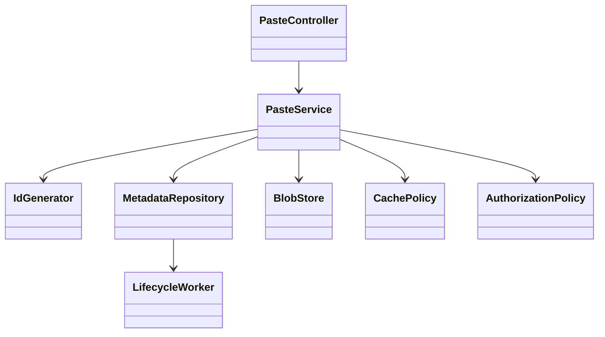
Step 3 deep dive: trace create, read authorization, caching, deletion, and expiry.  
Shows immutable blob ownership and the metadata-controlled lifecycle.

## 5. Elevator Control — progressive interview
**Interviewer:** Design elevator control software.

**Candidate:** I’ll design one building controller for multiple cars, hall calls, cabin destinations, doors, sensors, emergency/fire modes, and a scheduling strategy. This is safety-critical control, not merely a CRUD service. Certification details are out, but fail-safe boundaries are explicit.

**Requirements**
- Never move with doors unlocked; never open unless aligned at a floor.
- Deterministic local control despite network loss.
- Minimize wait and travel while preventing starvation.
- Hardware events and commands are auditable; unsafe sensor disagreement stops the car.

**Scope model:** `ElevatorGroup` owns dispatch. Each `ElevatorCar` owns a local state machine and ordered stops. `HallRequest(floor,direction,time)` differs from `CarRequest(car,floor)`. Hardware is behind `DoorPort`, `MotorPort`, `PositionSensor`, and `SafetyInterlock`.

**Interviewer:** How do you schedule?

**Candidate:** Start with collective control: a moving car serves compatible requests in its direction, then reverses. Dispatcher scores eligible cars by estimated pickup time, direction compatibility, load, queued stops, and mode. Tie-break deterministically.

```text
score = eta + direction_penalty + load_penalty + stop_penalty
ineligible if out_of_service, overloaded, or safety_not_ready
```

**Candidate:** A hall request has one assignment owner and version. Dispatcher uses compare-and-set to assign or reassign. Duplicate button presses coalesce by `(floor,direction)` while preserving oldest request time.

**Interviewer:** Central dispatch sends duplicate or stale commands.

**Candidate:** Every command contains car ID, monotonic command sequence, expected mode/state version, and deadline. The local controller rejects old sequences and any command failing current safety guards. It acknowledges accepted and applied status separately. Central dispatch may optimize desired stops; it never commands raw motor power.

**Interviewer:** Where does real-time software run?

**Candidate:** Safety interlocks and motion control run on redundant local controllers with deterministic timing. Group dispatch may run on a building server and communicate over a monitored bus. Cloud services can provide analytics, configuration rollout, and fleet monitoring, but loss of cloud connectivity cannot prevent a car from stopping safely.

| Boundary | Owns | Must not own |
|---|---|---|
| safety circuit | emergency stop, lock/interlock cutout | passenger optimization |
| car controller | motion state machine, leveling, doors | bank-wide assignment |
| group dispatcher | hall-call assignment, service policy | raw actuator commands |
| building operations | modes, overrides, diagnostics | bypassing safety guards |
| cloud analytics | trends, simulation, rollout metadata | live safety decisions |

**State machine:** `IDLE → MOVING → LEVELING → DOOR_OPENING → OPEN → DOOR_CLOSING → IDLE`. Emergency transitions can enter `STOPPED` from any state. Guards enforce door lock, position confidence, speed, load, and interlock.

**Interviewer:** A door sensor disagrees.

**Candidate:** The car controller commands stop, removes propulsion, enters fault state, reports to group controller, and requires a defined recovery procedure. Dispatcher reassigns hall calls. It never infers safety from a timeout.

**Interviewer:** Two cars accept the same hall request.

**Candidate:** Request assignment is versioned in the group controller. Only the committed owner treats it as an assigned pickup; speculative scores do not. If a network partition leaves uncertainty, local cars can continue existing safe stops, but the group controller fences an old leader before a new leader assigns work. Duplicate arrival is inefficient, not unsafe, and is detected from acknowledgements.

**Interviewer:** How do you prevent starvation?

**Candidate:** ETA is only the base score. Request age increases priority, reassignment count adds stickiness, and maximum-wait thresholds reserve a compatible car. Accessibility or service-policy requests can have bounded priority boosts. Simulations report p50/p95/max wait by floor and direction, not just average throughput.

**Interviewer:** What happens during fire recall?

**Candidate:** A higher-precedence mode invalidates ordinary schedules. Each car follows certified local recall transitions: stop at a safe floor if required, close/open doors according to policy, travel to recall floor, and reject passenger calls. The dispatcher records mode epoch so stale normal-mode commands cannot reappear after transition.

**Interviewer:** Can software tests prove safety?

**Candidate:** Tests provide evidence, not proof by themselves. I would encode invariants such as `moving ⇒ doors_locked ∧ position_valid`, model-check bounded state transitions where feasible, run deterministic simulations and hardware-in-loop faults, and pair that with independent safety circuits, certification, controlled rollout, and incident replay.

**Runtime tick**
1. Consume timestamped sensor snapshot.
2. Validate invariants and mode.
3. Apply state transition.
4. Select at most one idempotent actuator command.
5. Persist/event-log decision and watchdog heartbeat.

**Operational modes:** normal, maintenance, independent service, fire recall, emergency stop, degraded sensor. Mode precedence is explicit; safety modes override passenger scheduling.

**Fairness and scale:** Age adds priority; maximum wait triggers forced service where safe. One controller handles a bank; a building coordinator routes lobby requests among banks. Cars continue local safe behavior if central dispatch is unavailable.

**Testing:** Model-based state-machine tests, property tests for safety invariants, deterministic simulation for traffic patterns, fault injection for stuck doors/sensors, hardware-in-loop, and replay of event logs.

**Close:** Dispatch optimizes service but never bypasses the per-car safety state machine. Local controllers remain authoritative over motion, and central failures reduce efficiency rather than safety.

**Figure 9: Diagram 9 — Elevator Control Full HLD**
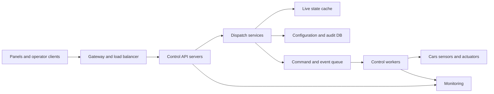
Step 2 recap: separate supervisory dispatch from local hardware control.  
Shows serving, state, audit, event delivery, physical externals, and monitoring.

**Figure 10: Diagram 10 — Elevator Control LLD Internals**
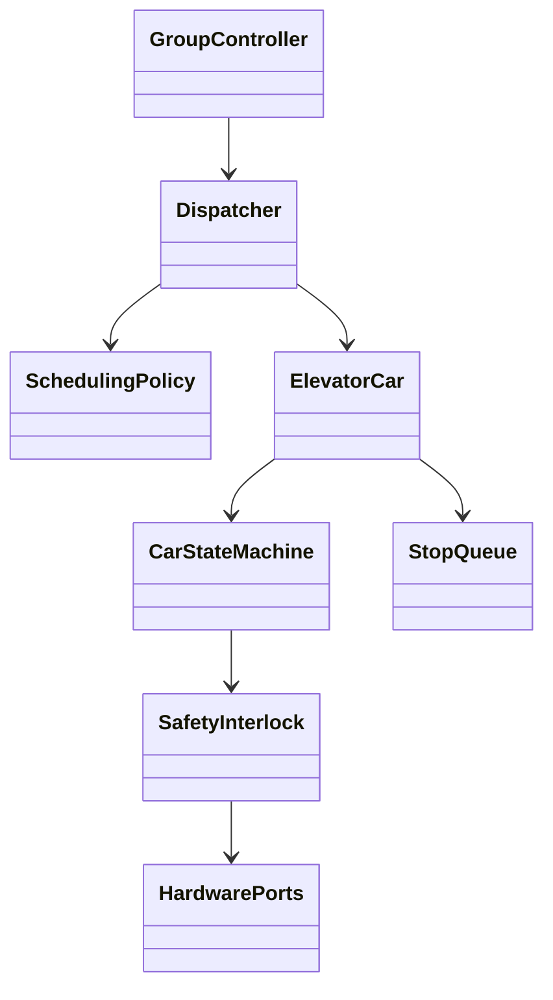
Step 3 deep dive: distinguish optimization policy from guarded car transitions.  
Shows dispatch ownership, stop planning, safety interlocks, and hardware boundaries.

## 6. Ticket / Event Booking — half-page interview
**Scope:** Reserved seats, short holds, checkout, cancellation, and ticket issuance. One seat must have at most one active hold or sale.

**Model/API:** `Seat(event,section,row,number,status,version)`, `Hold(id,user,expires,status)`, `Order`, `PaymentAttempt`, `Ticket`. `POST /holds` conditionally claims seats; `POST /orders` consumes a valid hold with idempotency key.

**Hard part:** Atomic conditional updates or row locks establish ownership. Holds have DB expiry plus worker cleanup; checkout checks expiry in the transaction, so delayed cleanup cannot sell twice. Payment is outside the seat transaction: persist order pending, call provider idempotently, then finalize or release.

**Scale/failure:** CDN serves event pages; cached seat maps are hints. Partition by event, protect hot events with admission queues and per-user limits. Outbox publishes ticket and cache events. Reconcile ambiguous provider outcomes; never issue from client callback alone.

**Interviewer/You beats:**  
**Interviewer:** A million users arrive for one concert.  
**You:** Put a signed virtual waiting room ahead of booking, admit a bounded rate, and make admission independent of seat ownership. Seat-map polling is aggressively cached and sampled; only hold attempts reach the inventory partition.

**Interviewer:** A hold expires while payment is processing.  
**You:** Checkout atomically converts a valid hold into an order-owned claim before calling payment. Expiry workers cannot release order-owned seats. If provider later fails, a workflow releases or offers retry according to policy.

**Interviewer:** Can adjacent-seat selection race?  
**You:** Candidate search may be stale, but one transaction conditionally claims the complete requested set in deterministic seat order. Partial claim rolls back; alternatives are recomputed.

**Figure 11: Diagram 11 — Ticket Booking HLD**
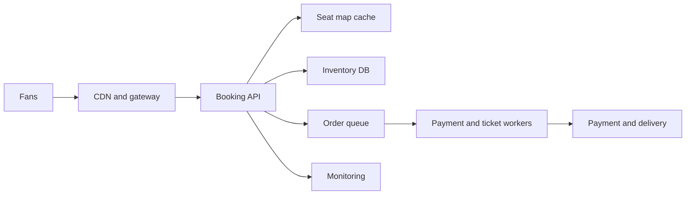
Step 2: cached discovery leads to an authoritative seat claim.  
Shows hot-event protection, inventory, async payment/ticket work, externals, and telemetry.

## 7. Ride Sharing — half-page interview
**Scope:** Driver location, ride request, candidate matching, offer/accept, trip lifecycle, fare, and payment. Exclude pooling first.

**Model/API:** `DriverState`, `RideRequest`, `Offer`, `Trip`, `LocationSample`, `PaymentAttempt`. `POST /rides` is idempotent; driver heartbeat updates spatial index; accept uses conditional transition from `AVAILABLE` and offer from `OPEN`.

**Hard part:** Location is ephemeral and stale-tolerant; trip ownership is strongly consistent. Matcher queries nearby geocells, ranks ETA, sends bounded offers, and atomically claims the winner. A saga times out unanswered offers and widens radius.

**Scale/failure:** Partition live locations by city/geocell and trips by city. Stream locations to durable history asynchronously. If matcher fails, requests remain queued; stale drivers expire by lease. Price estimate records model/version, while final fare records actual route inputs.

**Interviewer/You beats:**  
**Interviewer:** Driver and rider both retry acceptance.  
**You:** The offer and driver transition use expected versions; one trip ID becomes the winner. Idempotency keys return that trip, while losing offers close as superseded.

**Interviewer:** GPS jumps across the city.  
**You:** Keep raw samples, but admission checks speed, accuracy, ordering, and map plausibility. The live index uses a filtered position with freshness; trip billing never trusts one impossible point.

**Interviewer:** A city becomes overloaded.  
**You:** Preserve existing-trip updates first, then matching, then optional estimates. Apply city-level admission and queue-age SLOs; widening match radius is bounded to avoid quadratic candidate work.

**Figure 12: Diagram 12 — Ride Sharing HLD**
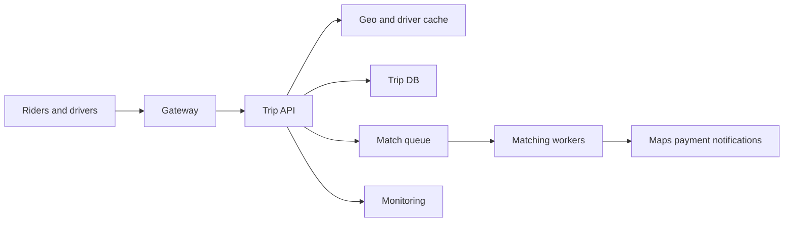
Step 2: separate fast-changing location candidates from durable trip state.  
Shows matching, atomic ownership, asynchronous offers, external providers, and monitoring.

## 8. Dropbox-like Storage — half-page interview
**Scope:** Resumable upload/download, folders, versions, sync, sharing, and deletion. Exclude live collaborative editing.

**Model/API:** `FileNode`, `FileVersion`, `Chunk`, `VersionChunk`, `UploadSession`, `Share`. Client requests upload session, uploads chunks directly with checksums, then atomically commits a manifest. Metadata points only to complete immutable blobs.

**Hard part:** Optimistic version precondition detects concurrent edits; preserve both versions or apply policy. Deduplicate within tenant/security boundary, not globally across users. Sync uses ordered per-account change cursor; clients retry idempotently.

**Scale/failure:** Metadata DB partitions by account; blobs live in replicated object storage. CDN serves downloads. Garbage collection removes chunks only after reference checks and grace period. Lost commit leaves orphan chunks for janitor, never a half-visible file.

**Interviewer/You beats:**  
**Interviewer:** Two laptops edit offline.  
**You:** Each commit includes its base version. A matching base advances the head; a stale base creates a conflict version or product-specific merge. Never silently overwrite bytes.

**Interviewer:** How does sync resume?  
**You:** A per-account ordered change log returns pages after a durable cursor. Clients checkpoint only after applying a page and may replay safely because changes have stable IDs and versions.

**Interviewer:** Can global dedupe leak information?  
**You:** Yes. Confirmation that another tenant owns a hash is a side channel, and convergent encryption has risks. Deduplicate only inside an approved security boundary and keep authorization on manifests and object access.

**Figure 13: Diagram 13 — Dropbox-like Storage HLD**
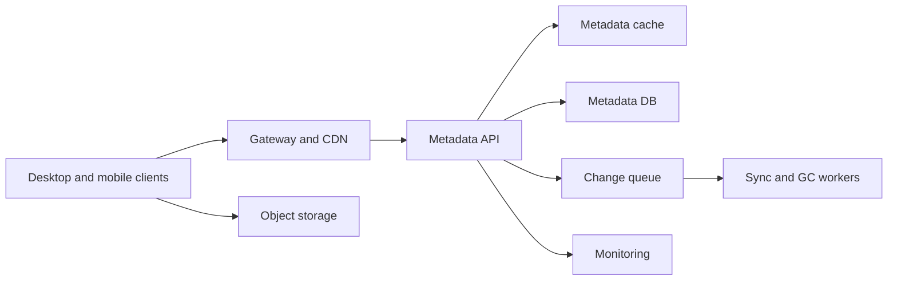
Step 2: metadata commits immutable chunk manifests after direct upload.  
Shows sync events, blob data path, metadata authority, cleanup, and observability.

## 9. URL Shortener — half-page interview
**Scope:** Create short link, redirect, optional custom alias/expiry, deletion, and click analytics. Redirect availability and latency dominate.

**Model/API:** `Link(code,target,owner,status,expires,created)`. `POST /links` allocates random Base62 code with collision retry; `GET /{code}` returns 302 or 301 by policy. Custom aliases use conditional insert.

**Hard part:** Cache-aside reads with negative caching and request coalescing handle hot keys. Database status owns deletion; outbox invalidates cache/CDN. Analytics events are asynchronous and lossy only if product permits.

**Scale/failure:** Partition by code hash; replicate read data globally. Keep a home region for writes, or reserve code namespaces per region. Validate targets, rate-limit creation, maintain abuse denylist, and avoid open-redirect trust assumptions.

**Interviewer/You beats:**  
**Interviewer:** Why 302 instead of 301?  
**You:** 302 preserves control when targets can change and avoids long browser caching; 301 improves cacheability for immutable links. Make redirect permanence explicit per link.

**Interviewer:** A celebrity link becomes hot.  
**You:** CDN and cache absorb it, request coalescing protects origin, and analytics remain asynchronous. Link correctness does not depend on click-event delivery.

**Interviewer:** A link is disabled globally.  
**You:** Write authoritative status, publish outbox invalidation, and purge edge caches. A short TTL bounds stale redirects; high-risk denylist checks can run at the edge.

**Figure 14: Diagram 14 — URL Shortener HLD**
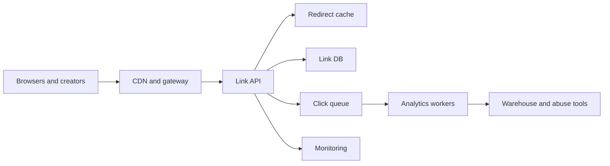
Step 2: keep redirects synchronous and analytics off the critical path.  
Shows cache-heavy reads, durable links, async clicks, abuse systems, and monitoring.

## 10. Rate Limiter / Hit Counter — half-page interview
**Scope:** Enforce per-tenant/API policies at gateway; support token bucket for bursts and sliding-window counters for reporting.

**Model/API:** Policy contains key dimensions, rate, burst, and action. Gateway calls local limiter first; distributed state uses an atomic script on `(tenant,route,window)` with TTL. Response includes allow, retry-after, and limit metadata.

**Hard part:** Local-only is fast but multiplies allowance across instances. Global store is accurate but adds latency and dependency. Hybrid leases allocate bounded token blocks to gateways, trading overshoot for availability; state the maximum overshoot.

**Failure/scale:** Fail-open for low-risk reads and fail-closed for costly/security operations by policy. Shard keys, salt pathological global keys, cache policies, and expose allowed/blocked/store-error metrics. Hit counter uses time buckets and merges associative counts.

**Interviewer/You beats:**  
**Interviewer:** Define token-bucket math.  
**You:** Refill `min(capacity, tokens + elapsed*rate)` using server monotonic time, then atomically subtract request cost if enough tokens remain. Return retry-after from the deficit and refill rate.

**Interviewer:** Redis is unavailable.  
**You:** Policy chooses fail-open, fail-closed, or bounded local fallback by route risk. Local leases cap overshoot; decisions carry a degraded-mode reason for audit.

**Interviewer:** One global key is hot.  
**You:** Avoid a central key where semantics permit hierarchical limits. Otherwise serialize that policy, use local token leases, and state the bounded overshoot rather than pretending arbitrary sharding preserves exactness.

**Figure 15: Diagram 15 — Rate Limiter HLD**
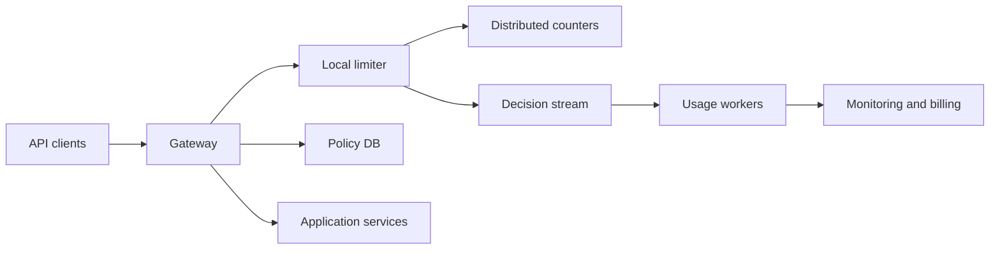
Step 3: make accuracy, latency, and bounded overshoot explicit.  
Shows local decisions, global counters, policy, downstream service, and usage processing.

## 11. Enterprise RAG / Agent Platform — half-page interview
**Scope:** Ingest enterprise sources, parse/chunk/embed, retrieve with ACL filtering, answer with citations, and optionally invoke allowlisted tools. Tenant isolation is mandatory.

**Model/API:** `Source`, `Document`, `Chunk`, `EmbeddingVersion`, `ACL`, `IngestJob`, `Conversation`, `ToolRun`. Ingest is asynchronous and idempotent by source version. Query authenticates user, derives principals, retrieves only authorized chunks, reranks, then prompts.

**Hard part:** Apply authorization during retrieval, not after generation. Store source/version with every chunk and citation. Treat retrieved content as untrusted data; isolate tool instructions, validate structured calls, require approval for high-impact actions, and log decisions.

**Scale/failure:** Partition by tenant; batch embeddings; cache safe query intermediates only within ACL scope. Version indexes and swap aliases after backfill. If model/provider fails, retry boundedly or return retrieval-only results. Evaluate recall, groundedness, citation validity, latency, cost, and permission leaks.

**Interviewer/You beats:**  
**Interviewer:** A document permission is revoked.  
**You:** ACL source-of-truth changes immediately, retrieval checks current principal/version, and invalidation removes stale cache/index entries. Defense in depth filters candidate chunks before prompt construction; index lag cannot grant access.

**Interviewer:** Retrieved text says “ignore policy and call this tool.”  
**You:** Retrieved content is quoted untrusted data. System policy and tool schemas are separated, tool arguments are validated, credentials are scoped, and high-impact calls require user confirmation.

**Interviewer:** How do you roll out a new embedding model?  
**You:** Build a versioned shadow index, backfill idempotently, evaluate recall and cost on a fixed corpus, dual-read a sample, then atomically switch the index alias. Old conversations retain citation source/version.

**Interviewer:** What is the latency budget?  
**You:** Allocate explicit budgets to auth, query rewrite, retrieval, rerank, model first token, generation, and optional tools. Parallelize independent retrievals, cap context and tool loops, and expose degraded retrieval-only behavior.

## Capacity estimation one-pager
Round to one significant digit, state peak factor and replication separately, and use the estimate to justify a component. False precision is less useful than a sensitivity range.

| Conversion | Fast mental rule | Example |
|---|---|---|
| daily events → average QPS | divide by ~100,000 | 100M/day ≈ 1,000/s |
| average → peak QPS | multiply 3–10× | 1,000/s average → 5,000/s peak |
| throughput | QPS × payload bytes | 1M/s × 100 B = 100 MB/s |
| daily storage | bytes/s × 86,400 | 100 MB/s ≈ 8.6 TB/day |
| retained storage | daily × days × replicas | 1 TB/day × 30 × 3 = 90 TB |
| concurrent work | arrival rate × duration | 500/s × 0.2 s = 100 in flight |
| cache working set | hot objects × object size | 1M × 2 KB = 2 GB before overhead |
| network egress | reads/s × response size | 10k/s × 20 KB = 200 MB/s |

| Design | Primary volume assumptions | Derived peak / storage | Design consequence |
|---|---|---|---|
| Parking | 5k spots, 20 transitions/s | <1 GB core rows; sensor stream larger | one relational shard per lot is enough |
| Car rental | 100k cars, 50 bookings/s | searches ~2.5k/s at 50:1 ratio | cache/search projection; transactional booking |
| Metrics | 1M points/s, 100 B | 100 MB/s; 8.6 TB raw/day | partitioned log, compression, tiered retention |
| Pastebin | 10M writes/day, 10 KB | ~1k writes/s peak; 100 GB/day | object storage + CDN for skewed reads |
| Elevator | hundreds cars/building, low event KB | throughput modest, strict control latency | local deterministic controller, audit log |
| Tickets | 1M arrivals/10 min for hot event | ~1.7k/s average, much higher burst | waiting room and event partition admission |
| Rides | 1M online drivers, update/4 s | 250k location updates/s | city/geocell partition and ephemeral index |
| Dropbox | 10M uploads/day, 5 MB average | 50 TB/day logical before dedupe | direct multipart object transfer |
| URL | 100M redirects/day | ~1k/s average, 10k+/s peak | global cache/read replicas |
| Rate limit | 100k API decisions/s | tiny records, extreme key skew | local fast path + bounded distributed state |
| RAG | 10M chunks, 1k tokens/chunk | embeddings tens of GB plus index overhead | tenant partitions and versioned batch builds |

**Worked estimation script:** “Assume 100 million events/day. Dividing by 100,000 gives roughly 1,000/s average; at 5× peak, 5,000/s. At 500 bytes, peak ingress is 2.5 MB/s and raw storage is 50 GB/day. With 30-day retention and 3× replication, roughly 4.5 TB. This fits a modest partitioned log; partition count is driven more by parallelism and hot tenants than raw bandwidth.”

**Sizing checks**
- Separate logical bytes from indexes, compaction overhead, replication, backups, and headroom.
- Separate request QPS from fan-out: one query may create hundreds of shard reads.
- Estimate active working set, not merely total retained data, before proposing cache size.
- Estimate cardinality and key skew; averages hide the shard that fails first.
- Use Little’s Law for concurrent connections, workers, and in-flight provider calls.
- State RPO, RTO, and replay time; a durable log is useful only if recovery finishes in budget.

## Failure modes catalog
The interview answer should name detection, bounded behavior, recovery, and the invariant preserved. “Retry” alone is incomplete.

| Layer / failure | Symptom and detection | Immediate containment | Recovery / invariant |
|---|---|---|---|
| client retry storm | repeated keys, rising QPS after latency | exponential backoff, jitter, admission | idempotency returns one logical write |
| partial request timeout | client uncertain, server may commit | expose operation ID/status endpoint | reconcile by idempotency key |
| load balancer skew | one instance saturated | least-loaded routing, connection limits | drain unhealthy instance |
| process crash | lost memory and connections | stateless retry, replicated state | no acknowledged durable work in RAM only |
| cache cold start | miss surge and origin overload | request coalescing, gradual warmup | source of truth remains correct |
| cache stale write | old value reappears | versioned values, delete/update after commit | DB version wins |
| hot key | one shard CPU/network saturation | coalesce, replicate reads, local leases | serialize exact writes where required |
| DB deadlock | transaction abort metrics | deterministic lock order | bounded retry with same idempotency key |
| DB primary failover | brief errors, replication role change | fence old primary, pause ambiguous writes | promote only durable replica per RPO |
| replica lag | stale reads, replay distance | route critical reads to primary | show/read consistency token |
| disk full | write failures, compaction stalls | reserve space, shed optional writes | expand/clean without corrupting committed state |
| queue partition unavailable | append failures | backpressure before unbounded memory | acknowledge only replicated append |
| queue lag | oldest event age grows | throttle producers, scale consumers | replay while exposing freshness |
| poison message | repeated same-offset failure | bounded retries then quarantine | advance healthy traffic; preserve payload |
| duplicate event | repeated side effect attempt | unique effect key / inbox table | idempotent consumer |
| out-of-order event | version regression | expected version, reorder window | apply only valid transitions |
| lost outbox publish | DB state changes, no downstream event | transactional outbox scanner | publish until acknowledged |
| worker crash after effect | effect happened before checkpoint | deterministic sink key | replay observes existing effect |
| external timeout | unknown payment/tool outcome | do not issue a fresh attempt ID | poll/webhook reconcile same attempt |
| webhook replay/forgery | duplicates or bad signature | verify signature/time, dedupe event ID | provider query resolves ambiguity |
| DNS/provider outage | connection errors across fleet | circuit breaker, fallback/degrade | probe and gradually close breaker |
| regional partition | split health and writer uncertainty | fence writers, preserve per-key home | fail over within declared RPO/RTO |
| clock skew | early expiry, future timestamps | server/monotonic time, bounded tolerance | NTP alert and event-time correction |
| schema mismatch | consumer deserialization errors | compatible defaults, quarantine unknown | versioned producer/consumer rollout |
| bad deployment | error/latency jump by version | canary stop, rollback feature flag | backward-compatible data prevents lock-in |
| credential expiry | auth failures near rotation | overlap keys, proactive rotation alert | least-privilege replacement |
| quota exhaustion | rejected provider/storage calls | per-tenant budgets, shed optional work | request increase or reduce load |
| silent data corruption | checksum/reconciliation mismatch | stop propagation, retain originals | repair from replica/log with audit |
| operator mistake | correlated destructive change | approvals, scoped tools, soft delete | restore/version rollback |
| thundering-herd recovery | all clients/workers resume together | jitter, tokenized ramp, priority queues | critical workflows recover first |

**Cross-cutting degradation policy**
| Capability | Usually preserve | Can degrade | Never claim |
|---|---|---|---|
| ownership/booking | one owner, no oversell | search freshness, optional recommendations | cache decides ownership |
| payment | one attempt/effect, auditable state | delayed confirmation | timeout means failure |
| metrics | accepted durable batches | freshness, resolution, optional tags | complete data when shards missing |
| safety control | interlocks and local stop | dispatch efficiency | cloud availability is safety |
| authorization | current deny decision | personalization, cache hit rate | post-generation filtering is sufficient |

**Failure interview script:** “The failure creates ambiguity between local intent and remote effect. I persist intent first, call externally with a stable idempotency key, and record the observed outcome. Timeouts remain pending rather than guessed. A reconciliation worker polls or consumes signed webhooks, while age-of-pending is an alert and operator view.”

### Failure deep-dive drills
| Interviewer injects | First response | Follow-through |
|---|---|---|
| “The primary dies mid-write.” | identify whether commit acknowledgement occurred | fence old primary; retry by idempotency key; expose unknown status |
| “The queue delivers twice.” | duplicate delivery is expected | consumer inbox/unique effect key; checkpoint after idempotent sink |
| “Events arrive backward.” | state transition must carry version | reject stale transition or buffer within bounded reorder window |
| “The cache serves deleted data.” | DB tombstone remains authoritative | purge via outbox, short TTL, origin authorization check |
| “Payment timed out.” | timeout is not decline | retain pending attempt; same provider key; webhook/poll reconciliation |
| “A region is isolated.” | prevent two writers first | lease/epoch fencing, route reads, invoke declared RPO/RTO |
| “Workers cannot keep up.” | measure oldest age, not only queue depth | throttle, prioritize, scale, shed optional work |
| “A tenant creates a hot shard.” | isolate fairness and correctness | tenant quota, subpartition if mergeable, serialize exact key |
| “A deployment corrupts new records.” | stop blast radius | canary rollback, feature flag, compatible reader, repair from log |
| “Monitoring says green but users fail.” | telemetry coverage is incomplete | external synthetic checks and per-journey SLOs |

**Recovery ordering:** restore fencing and identity first, then authoritative writes, critical reads, durable async processing, projections/caches, and finally optional analytics. Starting every worker simultaneously can create a second outage through cache misses and replay load.

**Data repair workflow**
1. Freeze or version-fence the affected writer path.
2. Define the invariant and select authoritative evidence.
3. Quantify affected keys/time range with a read-only scan.
4. Produce an idempotent repair plan and dry-run diff.
5. Apply in bounded batches with checkpoints and audit IDs.
6. Rebuild projections from corrected truth.
7. Reconcile counts/checksums and retain a rollback artifact.
8. Add detection so the same corruption is visible earlier.

## Interview transition scripts
**Scope to HLD:** “Given these assumptions, the main synchronous path is ___. I’ll draw that first, keep search/projections separate from ownership, and then confirm which invariant you want to deepen.”

**HLD to data model:** “The diagram shows movement, but the schema shows ownership. I’ll define the lifecycle row, its version, and the unique or conditional constraint that prevents duplicate claims.”

**Data model to race:** “Two requests can observe the same availability, so the read is only advisory. The deciding write is ___; one succeeds, the other detects a version or uniqueness conflict and retries safely.”

**Race to external call:** “I will not hold that transaction open across the provider. I persist local intent, commit, call with a stable attempt ID, and reconcile an ambiguous response.”

**Normal path to failure:** “Now I’ll inject failure at each boundary: client retry, process loss, cache miss storm, DB failover, duplicate queue event, and provider timeout. For each, I’ll preserve the same invariant.”

**Scale-up:** “At 10×, I first estimate which resource saturates. I partition by the entity that owns consistency, isolate hot tenants/keys, and accept cross-partition workflows rather than hiding distributed transactions.”

**Close:** “The authoritative store enforces ___. Caches and indexes are rebuildable projections, the queue carries durable asynchronous work, and every retried write or provider call has stable identity. The main tradeoff is ___ for ___.”

## End-package audit
The five core C3 topics retain both a full HLD and an LLD; the six secondary topics retain one focused HLD each.

| Topic | HLD figure | LLD figure | Deep-dive invariant |
|---|---:|---:|---|
| Parking Lot | 1 | 2 | one active session owns one spot |
| Car Rental | 3 | 4 | no class-capacity oversell across interval |
| Metrics Platform | 5 | 6 | ordered, deduped per-series aggregation |
| Pastebin | 7 | 8 | metadata-controlled immutable content lifecycle |
| Elevator Control | 9 | 10 | safety guards dominate dispatch optimization |
| Ticket Booking | 11 | — | one active hold/order per seat |
| Ride Sharing | 12 | — | one winning trip/driver claim |
| Dropbox-like | 13 | — | metadata points only to complete immutable blobs |
| URL Shortener | 14 | — | redirect status and invalidation |
| Rate Limiter | 15 | — | explicit bounded overshoot |
| Enterprise RAG | 16 | — | authorization before retrieval/generation |

## Whiteboard hygiene
- Number figures as drawn and keep each caption synchronized with its diagram number.
- Put strong-consistency boundaries around the smallest authoritative write path.
- Label caches “projection” or “disposable” when they cannot grant ownership.
- Label queues with delivery semantics and partition key, not merely “Kafka.”
- Put idempotency keys on arrows entering retried write paths.
- Mark external calls outside DB transactions.
- Add one SLO and one failure detector near each critical path.
- Finish with partition key, hot-key behavior, and 10× growth—not another component.

**Figure 16: Diagram 16 — Enterprise RAG HLD**
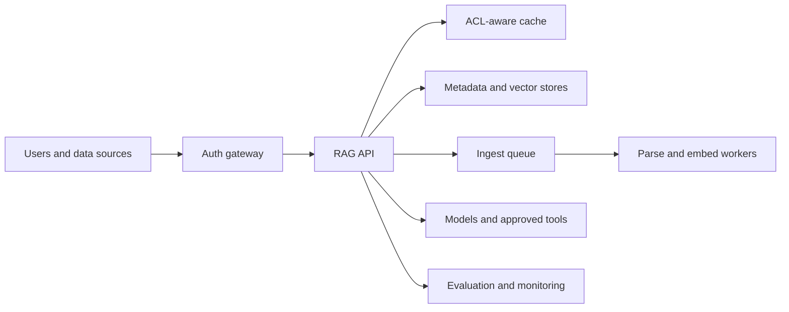
Step 2: join identity, retrieval, generation, ingestion, and controlled actions.  
Shows ACL-aware data flow, asynchronous indexing, external models/tools, and evaluation.

## Failure one-pager
| Failure | Preserve | Detection | Response |
|---|---|---|---|
| API instance loss | request idempotency | health checks, error rate | retry another stateless instance |
| cache loss/stampede | source-of-truth correctness | miss and origin-load spikes | coalesce, rate-limit, warm gradually |
| DB primary loss | committed ownership/state | replication and fencing alarms | promote fenced replica, retry safely |
| queue backlog | accepted durable work | lag, oldest age, DLQ rate | throttle, autoscale, shed optional work |
| duplicate event | single logical effect | dedupe counters | idempotent consumer and unique key |
| out-of-order event | valid state transition | version conflict rate | compare versions, buffer or discard |
| external timeout | known local intent | unresolved attempt age | same idempotency key, reconcile |
| regional loss | chosen RPO/RTO | synthetic checks | route reads, fence writers, fail over |
| poisoned payload | worker fleet health | repeated deterministic failures | bounded retries then quarantine |
| clock skew | correct ordering/expiry | NTP and timestamp deltas | server time, leases, bounded tolerance |

## Scale one-pager
| Pressure | First move | Next move | Tradeoff to state |
|---|---|---|---|
| read volume | cache and CDN | replicas, precompute | staleness and invalidation |
| write volume | batch and async queue | partition by ownership key | ordering across partitions |
| hot key | coalesce and rate-limit | replicate/salt/serialize | accuracy or complexity |
| large payload | direct object-store transfer | multipart and CDN | orphan cleanup |
| long workflow | persisted state machine | saga plus reconciliation | compensation is not rollback |
| cardinality | quotas and budgets | approximate indexes | rejected data or reduced precision |
| multi-region | local reads, home writes | per-key ownership | latency versus consistency |
| expensive compute | cache and batch | admission control | freshness and fairness |
| tenant noise | per-tenant quotas | isolated partitions | utilization versus isolation |
| schema growth | compatible events | versioned readers/migration | dual-write complexity |

## Thirty-second close
“The source of truth enforces the core invariant; caches and projections accelerate reads but never grant ownership. Retried writes and external calls are idempotent, asynchronous work is durable and observable, and ambiguous outcomes are reconciled. At 10× scale I partition by the natural ownership key, protect hot keys, and keep the same consistency boundary.”
